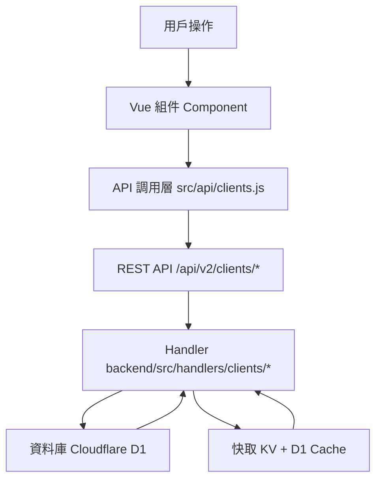
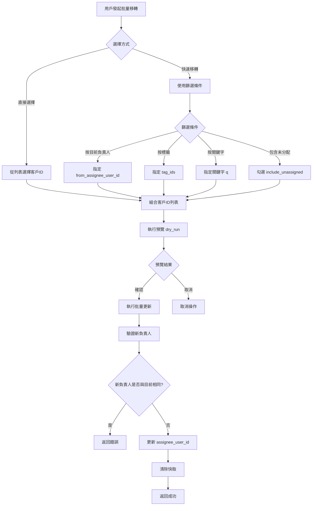

# Design Document: BR1.1: 客戶列表管理

## Overview

客戶列表展示、搜尋、篩選、批量移轉負責人功能

本功能是客戶管理系統的核心模組之一，提供客戶資訊的完整管理流程。

## Steering Document Alignment

### Technical Standards (tech.md)

遵循以下技術標準：
- 使用 Vue 3 Composition API 開發前端組件
- 使用 Ant Design Vue 作為 UI 組件庫
- 使用 RESTful API 進行前後端通信
- 使用 Cloudflare Workers 作為後端運行環境
- 使用 Cloudflare D1 (SQLite) 作為資料庫
- 遵循統一的錯誤處理和回應格式
- 使用參數化查詢防止 SQL 注入
- 實現軟刪除機制保留歷史記錄

### Project Structure (structure.md)

遵循以下項目結構：
- 前端組件位於 `src/components/clients/` 或 `src/views/clients/`
- API 調用層位於 `src/api/clients.js`
- 後端 Handler 位於 `backend/src/handlers/clients/`
- 資料庫 Migration 位於 `backend/migrations/`
- 遵循命名規範：組件使用 PascalCase，Handler 使用 kebab-case

## Code Reuse Analysis

### Existing Components to Leverage
- **PageHeader.vue**: 用於頁面標題和操作按鈕區域
- **SearchInput.vue**: 用於搜尋輸入框
- **DataTable.vue**: 用於數據表格展示（如適用）

### Integration Points
- **handleClientList**: 處理相關的 API 請求，位於 `backend/src/handlers/clients/`
- **handleBatchTransferAssignee**: 處理相關的 API 請求，位於 `backend/src/handlers/clients/`
- **handleDeleteClient**: 處理相關的 API 請求，位於 `backend/src/handlers/clients/`
- **Clients 表**: 存儲客戶基本資訊，主鍵為 `client_id` (TEXT)
- **ClientServices 表**: 存儲客戶服務關聯
- **ClientTagAssignments 表**: 存儲客戶標籤關聯
- **Cache 系統**: 使用 KV 和 D1 Cache 提升查詢性能

## Architecture

### Component Architecture

前端採用 Vue 3 Composition API，組件結構清晰，職責單一：



### Modular Design Principles

- **Single File Responsibility**: 每個組件文件只處理一個功能模組
- **Component Isolation**: 組件之間通過 props 和 events 通信，保持獨立
- **Service Layer Separation**: API 調用與業務邏輯分離，使用統一的 API 工具函數
- **Utility Modularity**: 工具函數按功能分組，可在多處重用

## Components and Interfaces

### ClientList

- **Purpose**: 客戶列表展示、搜尋、篩選、批量移轉負責人功能的主要組件
- **Location**: `src/views/clients/ClientList.vue`
- **Props**: 無（頁面級組件）
- **Events**: 無
- **Dependencies**: 
  - Ant Design Vue 組件庫（Table, Input, Select, Button, Modal）
  - Vue Router (用於導航到客戶詳情頁)
  - Pinia Store (`useClientStore`)
- **Reuses**: 
  - API 調用工具函數 (`@/utils/apiHelpers`)
  - 日期格式化工具 (`@/utils/formatters`)
  - TagsModal 組件（標籤管理）
  - BatchTransferModal 組件（批量移轉）

### BatchTransferModal

- **Purpose**: 批量移轉客戶負責人的對話框組件
- **Location**: `src/components/clients/BatchTransferModal.vue`
- **Props**: 
  - `visible` (Boolean): 控制對話框顯示/隱藏
  - `selectedClientIds` (Array<String>): 已選中的客戶 ID 列表
- **Events**:
  - `@update:visible`: 更新對話框顯示狀態
  - `@success`: 批量移轉成功事件
- **Dependencies**: 
  - Ant Design Vue 組件庫（Modal, Form, Select, Input, Checkbox, Button）
  - API 調用 (`@/api/clients`)
- **Reuses**: 
  - API 調用工具函數 (`@/utils/apiHelpers`)
  - 表單驗證工具

### TagsModal

- **Purpose**: 標籤選擇和管理模組（重用組件）
- **Location**: `src/components/shared/TagsModal.vue`
- **Props**: 
  - `visible` (Boolean): 控制對話框顯示/隱藏
  - `clientId` (String): 客戶 ID
  - `selectedTagIds` (Array<Number>): 已選中的標籤 ID 列表
- **Events**:
  - `@update:visible`: 更新對話框顯示狀態
  - `@success`: 標籤更新成功事件
- **Dependencies**: 
  - Ant Design Vue 組件庫
  - API 調用 (`@/api/tags`, `@/api/clients`)

## Data Models

### Client

**資料庫模型**（Clients 表）：

```javascript
{
  client_id: String (PK), // 統一編號，直接使用 tax_registration_number 的值
                          // 企業客戶：00 + 8碼統一編號（例如：0012345678）
                          // 個人客戶：10碼身分證（例如：A123456789）
  company_name: String (required),
  tax_registration_number: String (10碼，統一存儲格式)
                          // 企業客戶：系統自動加 00 前綴，存儲為 10 碼（例如：0012345678）
                          // 個人客戶：直接存儲 10 碼身分證（例如：A123456789）
  assignee_user_id: Integer (FK -> Users, nullable), // 負責人，未分配時為 NULL
  phone: String,
  email: String,
  contact_person_1: String, // 主要聯絡人
  contact_person_2: String,
  company_owner: String,
  company_address: String,
  capital_amount: Integer,
  primary_contact_method: String,
  line_id: String,
  client_notes: Text,
  payment_notes: Text,
  created_at: DateTime,
  updated_at: DateTime,
  is_deleted: Boolean (default: 0), // 軟刪除標記
  deleted_at: DateTime (nullable), // 刪除時間
  deleted_by: Integer (FK -> Users, nullable) // 刪除人
}
```

**API 響應模型**（列表查詢返回）：

```javascript
{
  clientId: String, // client_id
  companyName: String, // company_name
  taxId: String, // tax_registration_number（統一顯示10碼格式）
  contact_person_1: String, // 主要聯絡人
  phone: String,
  email: String,
  assigneeName: String, // 負責人姓名，未分配時顯示「未分配」
  tags: Array<{ // 標籤列表
    tag_id: Number,
    tag_name: String,
    tag_color: String | null
  }>,
  services_count: Number, // 計算欄位：該客戶的服務項目總數（從 ClientServices 表統計）
  year_total: Number, // 計算欄位：該客戶所有服務的年度收費總額（從 ServiceBillingSchedule 表匯總）
  createdAt: String // ISO 日期時間字符串
}
```

**計算欄位說明**：

- **services_count**: 
  - 來源：`ClientServices` 表
  - 計算邏輯：`COUNT(*) WHERE client_id = ? AND is_deleted = 0`
  - 在 `handleClientList` 中批量查詢並映射到每個客戶

- **year_total**: 
  - 來源：`ServiceBillingSchedule` 表（通過 `ClientServices` 關聯）
  - 計算邏輯：`SUM(COALESCE(billing_amount, 0))` 
  - SQL: `SELECT cs.client_id, SUM(COALESCE(sbs.billing_amount, 0)) AS total_amount FROM ClientServices cs LEFT JOIN ServiceBillingSchedule sbs ON sbs.client_service_id = cs.client_service_id WHERE cs.client_id IN (...) AND cs.is_deleted = 0 GROUP BY cs.client_id`
  - 在 `handleClientList` 中批量查詢並映射到每個客戶

### Shareholder (關聯表)

```javascript
{
  id: Integer (PK, AUTOINCREMENT),
  client_id: String (FK -> Clients.client_id),
  name: String (required),
  share_percentage: Decimal,
  share_count: Integer,
  share_amount: Integer,
  share_type: String,
  created_at: DateTime,
  updated_at: DateTime
}
```

### DirectorsSupervisor (關聯表)

```javascript
{
  id: Integer (PK, AUTOINCREMENT),
  client_id: String (FK -> Clients.client_id),
  name: String (required),
  position: String,
  term_start: Date,
  term_end: Date,
  is_current: Boolean,
  created_at: DateTime,
  updated_at: DateTime
}
```

## Error Handling

### Error Scenarios

1. **API 請求失敗**
   - **Handling**: 使用 `extractApiError` 提取錯誤訊息，使用 `message.error` 顯示錯誤提示
   - **User Impact**: 顯示友好的錯誤訊息（例如：「載入客戶列表失敗，請稍後再試」）

2. **表單驗證失敗**
   - **Handling**: 使用 Ant Design Vue Form 的驗證規則，在欄位下方顯示錯誤訊息
   - **User Impact**: 紅色錯誤提示出現在對應欄位下方，阻止表單提交

3. **權限不足**
   - **Handling**: API 返回 403 錯誤，前端檢查並顯示權限提示
   - **User Impact**: 顯示「您沒有權限執行此操作」並隱藏相關功能按鈕

4. **數據不存在**
   - **Handling**: API 返回 404 錯誤，前端跳轉到 404 頁面或顯示空狀態
   - **User Impact**: 顯示「客戶不存在」或空狀態提示

5. **網路錯誤**
   - **Handling**: 捕獲網路異常，顯示網路錯誤提示，提供重試選項
   - **User Impact**: 顯示「網路連線失敗，請檢查網路後重試」

## Business Logic Details

### 批量移轉流程

批量移轉客戶負責人支援多種選擇方式，流程如下：



**批量移轉邏輯說明**：

1. **客戶選擇方式**：
   - **直接選擇**：用戶在列表中勾選客戶，傳遞 `client_ids` 數組
   - **快速移轉**：使用篩選條件動態選擇客戶
     - `from_assignee_user_id`：按目前負責人篩選
     - `tag_ids`：按標籤篩選（支援多標籤，需同時滿足所有標籤）
     - `q`：按關鍵字搜尋（公司名稱或統一編號）
     - `include_unassigned`：包含未分配負責人的客戶

2. **預覽功能**：
   - 設置 `dry_run = true` 執行預覽
   - 返回符合條件的客戶數量（`match_count`）和樣本列表（最多20筆）
   - 不執行實際更新操作

3. **驗證邏輯**：
   - 新負責人（`assignee_user_id`）必須存在且有效
   - 新負責人不得與目前負責人相同（如果指定了 `from_assignee_user_id`）
   - 至少需要提供一種選擇方式（`client_ids`、`from_assignee_user_id` 或 `include_unassigned`）

4. **執行更新**：
   - 批量更新所有符合條件的客戶的 `assignee_user_id`
   - 更新 `updated_at` 時間戳
   - 清除相關快取（`clients_list` 和 `client_detail`）

### 協作客戶查詢邏輯

員工查看客戶列表時，系統會根據以下邏輯過濾客戶：

**查詢條件**（OR 關係，滿足任一條件即可）：

1. **負責的客戶**：`c.assignee_user_id = ?`（當前用戶ID）
2. **協作的客戶**：存在 `ClientCollaborators` 記錄
   ```sql
   EXISTS (
     SELECT 1 FROM ClientCollaborators cc
     WHERE cc.client_id = c.client_id
       AND cc.user_id = ?
   )
   ```
3. **填過工時的客戶**：存在 `Timesheets` 記錄
   ```sql
   EXISTS (
     SELECT 1 FROM Timesheets t 
     WHERE t.client_id = c.client_id 
       AND t.user_id = ? 
       AND t.is_deleted = 0
     LIMIT 1
   )
   ```

**完整 SQL 查詢**（非管理員）：

```sql
SELECT c.* FROM Clients c
WHERE c.is_deleted = 0
  AND (
    c.assignee_user_id = ? 
    OR EXISTS (
      SELECT 1 FROM Timesheets t 
      WHERE t.client_id = c.client_id 
        AND t.user_id = ? 
        AND t.is_deleted = 0
      LIMIT 1
    )
    OR EXISTS (
      SELECT 1 FROM ClientCollaborators cc
      WHERE cc.client_id = c.client_id
        AND cc.user_id = ?
    )
  )
```

**管理員查詢**：

```sql
SELECT c.* FROM Clients c
WHERE c.is_deleted = 0
```

### 統一編號唯一性檢查

**新增客戶時的處理邏輯**：

1. 檢查統一編號是否已存在（包括已刪除的客戶）
2. 如果存在且已刪除：
   - 恢復該客戶（設置 `is_deleted = 0`，清除 `deleted_at` 和 `deleted_by`）
   - 更新客戶資訊
   - 所有關聯數據（標籤、協作者、服務等）自動恢復（因為軟刪除不會觸發 CASCADE）
3. 如果存在且未刪除：
   - 返回錯誤：統一編號已存在
4. 如果不存在：
   - 新增客戶

**軟刪除後的數據恢復**：

- 客戶基本資訊：直接恢復（更新 `is_deleted`、`deleted_at`、`deleted_by`）
- 關聯數據自動保留：
  - `ClientTagAssignments`：標籤關聯保留
  - `ClientCollaborators`：協作者關聯保留
  - `ClientServices`：服務項目保留（如果未單獨刪除）
  - `Tasks`、`Timesheets`、`Receipts`：歷史記錄保留

## Testing Strategy

### Unit Testing

- **組件測試**: 測試組件的 props、events、computed 屬性
- **工具函數測試**: 測試格式化、驗證等工具函數
- **測試框架**: 建議使用 Vitest

### Integration Testing

- **API 整合測試**: 測試 API 調用和回應處理
- **組件整合測試**: 測試組件之間的交互
- **測試框架**: 建議使用 Vitest + MSW (Mock Service Worker)

### End-to-End Testing

- **E2E 測試**: 使用 Playwright 測試完整用戶流程
- **測試場景**: 
  - **列表展示**：
    - 驗證列表顯示所有必要欄位（統一編號、公司名稱、聯絡人、電話、負責人、標籤、服務數量、全年收費）
    - 驗證統一編號格式顯示（企業客戶顯示10碼，個人客戶顯示10碼）
    - 驗證標籤顯示（最多2個，超過顯示+N）
    - 驗證服務數量和全年收費正確顯示
    - 驗證分頁功能（預設每頁50筆）
  - **搜尋功能**：
    - 按公司名稱搜尋
    - 按統一編號搜尋
    - 搜尋結果正確顯示
  - **篩選功能**：
    - 按標籤篩選客戶
    - 篩選結果正確顯示
  - **標籤管理**：
    - 打開標籤管理對話框
    - 選擇/取消選擇標籤
    - 保存標籤更新
    - 驗證列表中的標籤更新
  - **批量移轉**：
    - 選擇多個客戶進行批量移轉
    - 使用快速移轉功能（按目前負責人篩選）
    - 使用快速移轉功能（按標籤篩選）
    - 使用快速移轉功能（按關鍵字篩選）
    - 使用快速移轉功能（包含未分配客戶）
    - 預覽功能（dry_run 模式）
    - 驗證新負責人不得與目前負責人相同
    - 執行批量移轉
    - 驗證移轉後列表更新
  - **刪除功能**（管理員權限）：
    - 驗證刪除按鈕僅管理員可見
    - 點擊刪除按鈕
    - 確認刪除對話框
    - 執行刪除
    - 驗證客戶從列表中消失（軟刪除）
  - **權限控制**：
    - 管理員可查看所有客戶
    - 員工只能查看自己負責的客戶
    - 員工可查看協作的客戶
    - 員工可查看填過工時的客戶
- **測試數據準備**：
  - 使用 `setupBR1_1TestData` 工具函數設置測試數據
  - 準備測試客戶（企業客戶和個人客戶各若干）
  - 準備測試標籤
  - 準備測試服務項目和收費設定
  - 準備測試用戶（管理員和員工）
  - 設置客戶負責人關係
  - 設置客戶協作關係
  - 設置工時記錄（用於測試員工查看權限）
- **測試帳號**: 
  - 管理員：`admin`/`111111`
  - 員工：`liu`/`111111`

