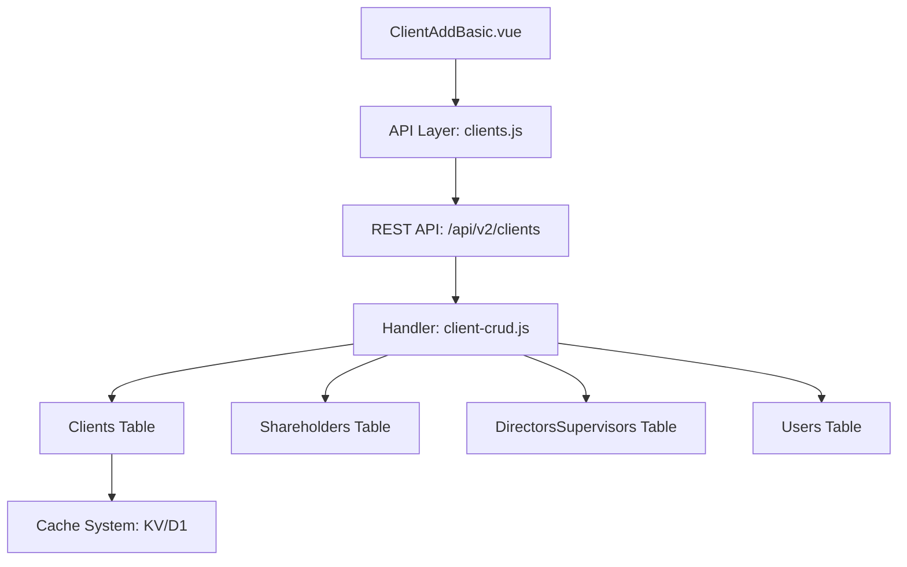

# Design Document: BR1.2.1: 客戶新增 - 基本資訊分頁

## Overview

填寫客戶基本資料，包括公司資訊、聯絡方式、股東董監事等

本功能是客戶管理系統的核心模組之一，提供客戶資訊的完整管理流程。

## Steering Document Alignment

### Technical Standards (tech.md)

遵循以下技術標準：
- 使用 Vue 3 Composition API 開發前端組件
- 使用 Ant Design Vue 作為 UI 組件庫
- 使用 RESTful API 進行前後端通信
- 使用 Cloudflare Workers 作為後端運行環境
- 使用 Cloudflare D1 (SQLite) 作為資料庫
- 遵循統一的錯誤處理和回應格式
- 使用參數化查詢防止 SQL 注入
- 實現軟刪除機制保留歷史記錄

### Project Structure (structure.md)

遵循以下項目結構：
- 前端組件位於 `src/components/clients/` 或 `src/views/clients/`
- API 調用層位於 `src/api/clients.js`
- 後端 Handler 位於 `backend/src/handlers/clients/`
- 資料庫 Migration 位於 `backend/migrations/`
- 遵循命名規範：組件使用 PascalCase，Handler 使用 kebab-case

## Code Reuse Analysis

### Existing Components to Leverage
- **PageHeader.vue**: 用於頁面標題和操作按鈕區域
- **SearchInput.vue**: 用於搜尋輸入框
- **DataTable.vue**: 用於數據表格展示（如適用）
- **ShareholdersEditor.vue**: 用於編輯股東持股資訊的動態列表組件
- **DirectorsSupervisorsEditor.vue**: 用於編輯董監事資訊的動態列表組件

### Integration Points
- **handleCreateClient**: 處理客戶新增的 API 請求，位於 `backend/src/handlers/clients/client-crud.js`
- **handleUpdateClient**: 處理客戶更新的 API 請求，位於 `backend/src/handlers/clients/client-crud.js`
- **Clients 表**: 存儲客戶基本資訊，主鍵為 `client_id` (TEXT，統一編號)
- **Shareholders 表**: 存儲股東持股資訊，關聯 `client_id`，支援多筆記錄
- **DirectorsSupervisors 表**: 存儲董監事資訊，關聯 `client_id`，支援多筆記錄
- **ClientServices 表**: 存儲客戶服務關聯（用於其他分頁）
- **ClientTagAssignments 表**: 存儲客戶標籤關聯（用於其他分頁）
- **Users 表**: 存儲用戶資訊，用於 `assignee_user_id` 外鍵關聯
- **Cache 系統**: 使用 KV 和 D1 Cache 提升查詢性能

## Architecture

### Component Architecture

前端採用 Vue 3 Composition API，組件結構清晰，職責單一：

```
用戶操作
  ↓
Vue 組件 (Component)
  ↓
API 調用層 (src/api/clients.js)
  ↓
REST API (/api/v2/clients/*)
  ↓
Handler (backend/src/handlers/clients/*)
  ↓
資料庫 (Cloudflare D1)
```

### Modular Design Principles

- **Single File Responsibility**: 每個組件文件只處理一個功能模組
- **Component Isolation**: 組件之間通過 props 和 events 通信，保持獨立
- **Service Layer Separation**: API 調用與業務邏輯分離，使用統一的 API 工具函數
- **Utility Modularity**: 工具函數按功能分組，可在多處重用



## Components and Interfaces

### ClientAddBasic

- **Purpose**: 填寫客戶基本資料，包括公司資訊、聯絡方式、股東董監事等的主要組件
- **Location**: `src/components/clients/ClientAddBasic.vue` 或 `src/views/clients/ClientAddBasic.vue`
- **Props**: 
  - `clientId` (String, optional): 客戶 ID（用於詳情頁和編輯）
  - `mode` (String, optional): 模式（'add' | 'edit' | 'view'）
- **Events**:
  - `@submit`: 表單提交事件
  - `@cancel`: 取消操作事件
- **Dependencies**: 
  - Ant Design Vue 組件庫
  - Vue Router (用於導航)
  - Pinia Store (如需要)
  - ShareholdersEditor 組件
  - DirectorsSupervisorsEditor 組件
- **Reuses**: 
  - API 調用工具函數 (`@/utils/apiHelpers`)
  - 表單驗證工具 (`@/utils/validation`)
  - 日期格式化工具 (`@/utils/formatters`)

### ShareholdersEditor

- **Purpose**: 管理股東持股資訊的動態列表編輯組件
- **Location**: `src/components/clients/ShareholdersEditor.vue`
- **Props**: 
  - `modelValue` (Array, required): 股東資料陣列，使用 v-model 雙向綁定
- **Events**:
  - `@update:modelValue`: 當股東資料變更時觸發
- **Dependencies**: 
  - Ant Design Vue 組件庫（Table, Button, Input, InputNumber, Select 等）
- **Reuses**: 
  - 表單驗證工具 (`@/utils/validation`)
- **Features**:
  - 支援新增、編輯、刪除股東記錄
  - 驗證股東姓名必填
  - 支援持股比例、持股數、持股金額、持股類型的輸入

### DirectorsSupervisorsEditor

- **Purpose**: 管理董監事資訊的動態列表編輯組件
- **Location**: `src/components/clients/DirectorsSupervisorsEditor.vue`
- **Props**: 
  - `modelValue` (Array, required): 董監事資料陣列，使用 v-model 雙向綁定
- **Events**:
  - `@update:modelValue`: 當董監事資料變更時觸發
- **Dependencies**: 
  - Ant Design Vue 組件庫（Table, Button, Input, DatePicker, Select 等）
- **Reuses**: 
  - 表單驗證工具 (`@/utils/validation`)
  - 日期格式化工具 (`@/utils/formatters`)
- **Features**:
  - 支援新增、編輯、刪除董監事記錄
  - 驗證姓名必填
  - 支援職務、任期開始日期、任期結束日期、是否為現任的輸入

## Data Models

### Client

```javascript
{
  client_id: String (PK), // 統一編號（10碼），直接作為主鍵
  // 注意：client_id 和 tax_registration_number 實際上是同一個值
  // 企業客戶：輸入8碼統一編號，系統自動加前綴 00 存入（變成10碼）
  // 個人客戶：輸入10碼身分證，直接存入
  company_name: String (required),
  tax_registration_number: String (10碼，企業=00+8碼，個人=10碼身分證),
  // 注意：tax_registration_number 與 client_id 值相同，但保留此欄位以保持資料庫結構一致性
  assignee_user_id: Integer (FK -> Users, required),
  phone: String,
  email: String,
  contact_person_1: String,
  contact_person_2: String,
  company_owner: String,
  company_address: String,
  capital_amount: Integer,
  primary_contact_method: String, // 選項：LINE、電話、Email、其他
  line_id: String,
  client_notes: Text,
  payment_notes: Text,
  created_at: DateTime,
  updated_at: DateTime,
  is_deleted: Boolean,
  deleted_at: DateTime,
  deleted_by: Integer (FK -> Users)
}
```

### Shareholder (關聯表)

```javascript
{
  id: Integer (PK, AUTOINCREMENT),
  client_id: String (FK -> Clients.client_id),
  name: String (required),
  share_percentage: Decimal,
  share_count: Integer,
  share_amount: Integer,
  share_type: String,
  created_at: DateTime,
  updated_at: DateTime
}
```

### DirectorsSupervisor (關聯表)

```javascript
{
  id: Integer (PK, AUTOINCREMENT),
  client_id: String (FK -> Clients.client_id),
  name: String (required),
  position: String,
  term_start: Date,
  term_end: Date,
  is_current: Boolean,
  created_at: DateTime,
  updated_at: DateTime
}
```

## Error Handling

### Error Scenarios

1. **API 請求失敗**
   - **Handling**: 使用 `extractApiError` 提取錯誤訊息，使用 `message.error` 顯示錯誤提示
   - **User Impact**: 顯示友好的錯誤訊息（例如：「載入客戶列表失敗，請稍後再試」）

2. **表單驗證失敗**
   - **Handling**: 使用 Ant Design Vue Form 的驗證規則，在欄位下方顯示錯誤訊息
   - **User Impact**: 紅色錯誤提示出現在對應欄位下方，阻止表單提交

3. **權限不足**
   - **Handling**: API 返回 403 錯誤，前端檢查並顯示權限提示
   - **User Impact**: 顯示「您沒有權限執行此操作」並隱藏相關功能按鈕

4. **數據不存在**
   - **Handling**: API 返回 404 錯誤，前端跳轉到 404 頁面或顯示空狀態
   - **User Impact**: 顯示「客戶不存在」或空狀態提示

5. **統一編號重複**
   - **Handling**: API 返回 409 衝突錯誤，前端顯示具體錯誤訊息
   - **User Impact**: 顯示「統一編號已存在，請使用其他編號」並高亮統一編號欄位

6. **表單驗證錯誤（必填欄位）**
   - **Handling**: 前端表單驗證阻止提交，在對應欄位顯示錯誤提示
   - **User Impact**: 必填欄位（公司名稱、負責人員）顯示紅色錯誤提示，阻止表單提交

7. **網路錯誤**
   - **Handling**: 捕獲網路異常，顯示網路錯誤提示，提供重試選項
   - **User Impact**: 顯示「網路連線失敗，請檢查網路後重試」

## Testing Strategy

### Unit Testing

- **組件測試**: 測試組件的 props、events、computed 屬性
- **工具函數測試**: 測試格式化、驗證等工具函數
- **測試框架**: 建議使用 Vitest

### Integration Testing

- **API 整合測試**: 測試 API 調用和回應處理
- **組件整合測試**: 測試組件之間的交互
- **測試框架**: 建議使用 Vitest + MSW (Mock Service Worker)

### End-to-End Testing

- **E2E 測試**: 使用 Playwright 測試完整用戶流程
- **測試場景**: 
  - 新增客戶基本資訊的完整流程（企業客戶和個人客戶）
  - 統一編號處理（8碼自動加前綴、10碼直接存儲）
  - 統一編號唯一性驗證
  - 個人客戶編號生成功能
  - 股東和董監事資訊管理（新增、編輯、刪除）
  - 表單驗證（必填欄位驗證）
  - 保存成功後的導航和狀態更新
- **測試數據**: 使用測試工具函數設置測試數據
- **測試帳號**: 使用 `admin`/`111111` 管理員帳號和 `liu`/`111111` 員工帳號

