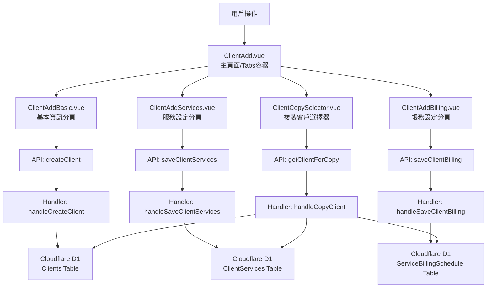

# Design Document: BR1.2: 客戶新增

## Overview

多步驟表單流程，包含基本資訊、服務設定、帳務設定三個分頁

本功能是客戶管理系統的核心模組之一，提供客戶資訊的完整管理流程。

## Steering Document Alignment

### Technical Standards (tech.md)

遵循以下技術標準：
- 使用 Vue 3 Composition API 開發前端組件
- 使用 Ant Design Vue 作為 UI 組件庫
- 使用 RESTful API 進行前後端通信
- 使用 Cloudflare Workers 作為後端運行環境
- 使用 Cloudflare D1 (SQLite) 作為資料庫
- 遵循統一的錯誤處理和回應格式
- 使用參數化查詢防止 SQL 注入
- 實現軟刪除機制保留歷史記錄

### Project Structure (structure.md)

遵循以下項目結構：
- 前端組件位於 `src/components/clients/` 或 `src/views/clients/`
- API 調用層位於 `src/api/clients.js`
- 後端 Handler 位於 `backend/src/handlers/clients/`
- 資料庫 Migration 位於 `backend/migrations/`
- 遵循命名規範：組件使用 PascalCase，Handler 使用 kebab-case

## Code Reuse Analysis

### Existing Components to Leverage
- **PageHeader.vue**: 用於頁面標題和操作按鈕區域
- **SearchInput.vue**: 用於搜尋輸入框
- **DataTable.vue**: 用於數據表格展示（如適用）

### Integration Points
- **handleCreateClient**: 處理相關的 API 請求，位於 `backend/src/handlers/clients/`
- **Clients 表**: 存儲客戶基本資訊，主鍵為 `client_id` (TEXT)
- **ClientServices 表**: 存儲客戶服務關聯
- **ClientTagAssignments 表**: 存儲客戶標籤關聯
- **Cache 系統**: 使用 KV 和 D1 Cache 提升查詢性能

## Architecture

### Component Architecture

前端採用 Vue 3 Composition API，組件結構清晰，職責單一：



### Modular Design Principles

- **Single File Responsibility**: 每個組件文件只處理一個功能模組
- **Component Isolation**: 組件之間通過 props 和 events 通信，保持獨立
- **Service Layer Separation**: API 調用與業務邏輯分離，使用統一的 API 工具函數
- **Utility Modularity**: 工具函數按功能分組，可在多處重用

## Components and Interfaces

### ClientAdd

- **Purpose**: 多步驟表單流程，包含基本資訊、服務設定、帳務設定三個分頁的主要組件
- **Location**: `src/views/clients/ClientAdd.vue`
- **Props**: 無（路由參數通過 Vue Router 獲取）
- **Events**: 無（內部組件，通過路由導航）
- **Dependencies**: 
  - Ant Design Vue 組件庫（Tabs）
  - Vue Router (用於導航)
  - Pinia Store (如需要狀態管理)
- **Reuses**: 
  - API 調用工具函數 (`@/api/clients.js`)
  - 子組件：ClientAddBasic、ClientAddServices、ClientAddBilling、ClientCopySelector

### ClientAddBasic

- **Purpose**: 客戶新增 - 基本資訊分頁組件
- **Location**: `src/components/clients/ClientAddBasic.vue`
- **Props**: 
  - `clientId` (String, optional): 客戶 ID（編輯模式時使用）
  - `initialData` (Object, optional): 初始資料（複製客戶時使用）
- **Events**:
  - `@saved`: 保存成功事件，傳遞 `{ clientId: string }`
  - `@error`: 保存失敗事件，傳遞錯誤訊息
- **Dependencies**: 
  - Ant Design Vue Form 組件
  - API 調用 (`@/api/clients.js`)
- **Reuses**: 
  - 表單驗證工具 (`@/utils/validation`)
  - API 調用工具函數 (`@/utils/apiHelpers`)

### ClientAddServices

- **Purpose**: 客戶新增 - 服務設定分頁組件
- **Location**: `src/components/clients/ClientAddServices.vue`
- **Props**: 
  - `clientId` (String, required): 客戶 ID（必須已存在）
  - `initialData` (Array, optional): 初始服務列表（複製客戶時使用）
- **Events**:
  - `@saved`: 保存成功事件
  - `@error`: 保存失敗事件，傳遞錯誤訊息
- **Dependencies**: 
  - Ant Design Vue Form、Table 組件
  - ClientServiceConfig 組件（如已存在）
  - API 調用 (`@/api/clients.js`)
- **Reuses**: 
  - 服務配置組件 (`@/components/clients/ClientServiceConfig.vue`)

### ClientAddBilling

- **Purpose**: 客戶新增 - 帳務設定分頁組件
- **Location**: `src/components/clients/ClientAddBilling.vue`
- **Props**: 
  - `clientId` (String, required): 客戶 ID（必須已存在）
  - `initialData` (Array, optional): 初始收費計劃列表（複製客戶時使用）
- **Events**:
  - `@saved`: 保存成功事件
  - `@error`: 保存失敗事件，傳遞錯誤訊息
- **Dependencies**: 
  - Ant Design Vue Form、Table 組件
  - API 調用 (`@/api/clients.js`)
- **Reuses**: 
  - 日期格式化工具 (`@/utils/formatters`)

### ClientCopySelector

- **Purpose**: 複製客戶選擇器組件
- **Location**: `src/components/clients/ClientCopySelector.vue`
- **Props**: 
  - `visible` (Boolean): 控制顯示/隱藏
- **Events**:
  - `@select`: 選擇客戶事件，傳遞 `{ clientId: string }`
  - `@cancel`: 取消選擇事件
- **Dependencies**: 
  - Ant Design Vue Modal、Select 組件
  - API 調用 (`@/api/clients.js`)
- **Reuses**: 
  - 客戶列表 API (`@/api/clients.js`)

## Data Models

### Client

```javascript
{
  client_id: String (PK), // 統一編號，企業客戶自動加 00 前綴
  company_name: String (required),
  tax_registration_number: String (10碼，企業=00+8碼，個人=10碼身分證),
  assignee_user_id: Integer (FK -> Users),
  phone: String,
  email: String,
  contact_person_1: String,
  contact_person_2: String,
  company_owner: String,
  company_address: String,
  capital_amount: Integer,
  primary_contact_method: String,
  line_id: String,
  client_notes: Text,
  payment_notes: Text,
  created_at: DateTime,
  updated_at: DateTime,
  is_deleted: Boolean,
  deleted_at: DateTime,
  deleted_by: Integer (FK -> Users)
}
```

### Shareholder (關聯表)

```javascript
{
  id: Integer (PK, AUTOINCREMENT),
  client_id: String (FK -> Clients.client_id),
  name: String (required),
  share_percentage: Decimal,
  share_count: Integer,
  share_amount: Integer,
  share_type: String,
  created_at: DateTime,
  updated_at: DateTime
}
```

### DirectorsSupervisor (關聯表)

```javascript
{
  id: Integer (PK, AUTOINCREMENT),
  client_id: String (FK -> Clients.client_id),
  name: String (required),
  position: String,
  term_start: Date,
  term_end: Date,
  is_current: Boolean,
  created_at: DateTime,
  updated_at: DateTime
}
```

## Error Handling

### Error Scenarios

1. **API 請求失敗**
   - **Handling**: 使用 `extractApiError` 提取錯誤訊息，使用 `message.error` 顯示錯誤提示
   - **User Impact**: 顯示友好的錯誤訊息（例如：「載入客戶列表失敗，請稍後再試」）

2. **表單驗證失敗**
   - **Handling**: 使用 Ant Design Vue Form 的驗證規則，在欄位下方顯示錯誤訊息
   - **User Impact**: 紅色錯誤提示出現在對應欄位下方，阻止表單提交

3. **權限不足**
   - **Handling**: API 返回 403 錯誤，前端檢查並顯示權限提示
   - **User Impact**: 顯示「您沒有權限執行此操作」並隱藏相關功能按鈕

4. **數據不存在**
   - **Handling**: API 返回 404 錯誤，前端跳轉到 404 頁面或顯示空狀態
   - **User Impact**: 顯示「客戶不存在」或空狀態提示

5. **網路錯誤**
   - **Handling**: 捕獲網路異常，顯示網路錯誤提示，提供重試選項
   - **User Impact**: 顯示「網路連線失敗，請檢查網路後重試」

## Testing Strategy

### Unit Testing

- **組件測試**: 測試組件的 props、events、computed 屬性
- **工具函數測試**: 測試格式化、驗證等工具函數
- **測試框架**: 建議使用 Vitest

### Integration Testing

- **API 整合測試**: 測試 API 調用和回應處理
- **組件整合測試**: 測試組件之間的交互
- **測試框架**: 建議使用 Vitest + MSW (Mock Service Worker)

### End-to-End Testing

- **E2E 測試**: 使用 Playwright 測試完整用戶流程
- **測試場景**: 
  - 列表頁面的搜尋和篩選功能
  - 新增客戶的完整流程（基本資訊 → 服務設定 → 帳務設定）
  - 編輯客戶資訊
  - 刪除客戶（管理員權限）
- **測試數據**: 使用 `setupBR1_1TestData` 等工具函數設置測試數據
- **測試帳號**: 使用 `admin`/`111111` 管理員帳號和 `liu`/`111111` 員工帳號

