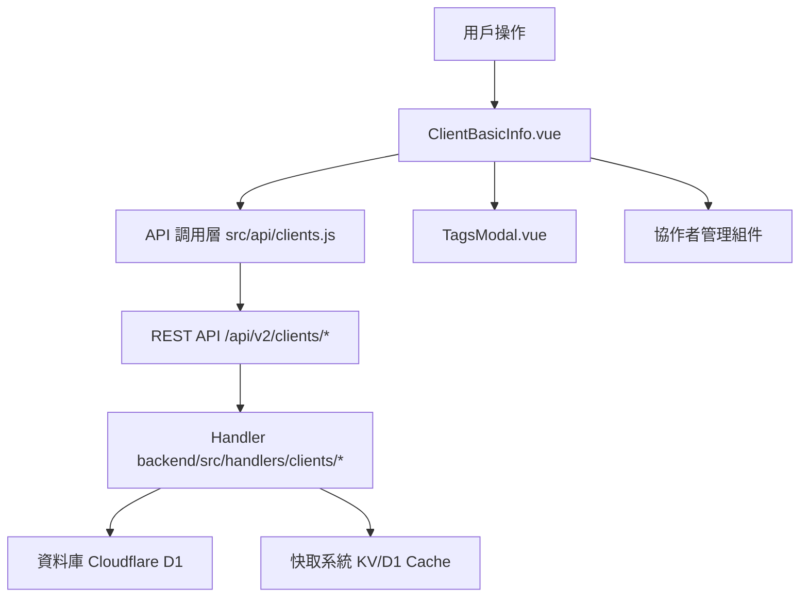

# Design Document: BR1.3.1: 客戶詳情頁 - 基本資訊分頁

## Overview

客戶詳情頁的基本資訊分頁提供客戶基本資訊的完整管理功能，包括查看、編輯、刪除客戶資料，以及管理客戶標籤、協作者、股東持股和董監事資訊。本功能是客戶管理系統的核心模組之一，為事務所員工提供統一的客戶資訊管理介面，確保資料完整性和準確性。

**核心功能**:
- 客戶基本資訊的查看和編輯
- 客戶標籤管理
- 客戶協作者管理（權限控制）
- 股東持股資訊管理（CRUD）
- 董監事資訊管理（CRUD）
- 客戶軟刪除功能

## Steering Document Alignment

### Technical Standards (tech.md)

遵循以下技術標準：
- 使用 Vue 3 Composition API 開發前端組件
- 使用 Ant Design Vue 作為 UI 組件庫
- 使用 RESTful API 進行前後端通信
- 使用 Cloudflare Workers 作為後端運行環境
- 使用 Cloudflare D1 (SQLite) 作為資料庫
- 遵循統一的錯誤處理和回應格式
- 使用參數化查詢防止 SQL 注入
- 實現軟刪除機制保留歷史記錄

### Project Structure (structure.md)

遵循以下項目結構：
- 前端組件位於 `src/components/clients/` 或 `src/views/clients/`
- API 調用層位於 `src/api/clients.js`
- 後端 Handler 位於 `backend/src/handlers/clients/`
- 資料庫 Migration 位於 `backend/migrations/`
- 遵循命名規範：組件使用 PascalCase，Handler 使用 kebab-case

## Code Reuse Analysis

### Existing Components to Leverage
- **PageHeader.vue**: 用於頁面標題和操作按鈕區域
- **TagsModal.vue**: 用於標籤選擇和管理（位於 `src/components/shared/TagsModal.vue`）
- **DataTable.vue**: 用於數據表格展示（如適用於股東、董監事列表）
- **Form 組件**: Ant Design Vue 的 Form、Input、Select 等表單組件
- **Modal 組件**: Ant Design Vue 的 Modal 組件（用於確認對話框）

### Integration Points
- **handleUpdateClient**: 處理客戶資訊更新的 API 請求，位於 `backend/src/handlers/clients/client-crud.js`
- **handleClientDetail**: 處理客戶詳情查詢的 API 請求，位於 `backend/src/handlers/clients/client-crud.js`
- **handleDeleteClient**: 處理客戶軟刪除的 API 請求，位於 `backend/src/handlers/clients/client-crud.js`
- **Clients 表**: 存儲客戶基本資訊，主鍵為 `client_id` (TEXT)
- **Shareholders 表**: 存儲股東持股資訊，外鍵關聯到 `Clients.client_id`
- **DirectorsSupervisors 表**: 存儲董監事資訊，外鍵關聯到 `Clients.client_id`
- **ClientTagAssignments 表**: 存儲客戶標籤關聯
- **ClientCollaborators 表**: 存儲客戶協作者關聯
- **Cache 系統**: 使用 KV 和 D1 Cache 提升查詢性能

## Architecture

### Component Architecture

前端採用 Vue 3 Composition API，組件結構清晰，職責單一：



### Modular Design Principles

- **Single File Responsibility**: 每個組件文件只處理一個功能模組
- **Component Isolation**: 組件之間通過 props 和 events 通信，保持獨立
- **Service Layer Separation**: API 調用與業務邏輯分離，使用統一的 API 工具函數
- **Utility Modularity**: 工具函數按功能分組，可在多處重用

## Components and Interfaces

### ClientBasicInfo

- **Purpose**: 編輯和查看客戶基本資訊的主要組件
- **Location**: `src/components/clients/ClientBasicInfo.vue`
- **Props**: 
  - `clientId` (String, optional): 客戶 ID（可通過 props 傳入，或從路由參數 `:id` 獲取）
- **Events**:
  - `@updated`: 客戶資訊更新成功事件
- **Dependencies**: 
  - Ant Design Vue 組件庫（Form, Input, Select, Button, Modal 等）
  - Vue Router (用於導航和獲取路由參數)
  - Pinia Store (如需要客戶狀態管理)
- **Reuses**: 
  - API 調用工具函數 (`@/utils/apiHelpers`)
  - 表單驗證工具 (`@/utils/validation`)
  - 日期格式化工具 (`@/utils/formatters`)
  - TagsModal 組件（標籤管理）
- **Interfaces**:
  - `loadClientData()`: 載入客戶資料
  - `handleSave()`: 保存客戶資訊
  - `handleDelete()`: 刪除客戶（軟刪除）
  - `handleTagChange()`: 處理標籤變更
  - `handleCollaboratorChange()`: 處理協作者變更

### ShareholderManager (子組件，可選)

- **Purpose**: 管理股東持股資訊的組件
- **Location**: `src/components/clients/ShareholderManager.vue` (可選，或內嵌在 ClientBasicInfo 中)
- **Props**:
  - `shareholders` (Array, required): 股東列表數據
  - `readonly` (Boolean, optional): 是否為只讀模式
- **Events**:
  - `@update`: 股東列表更新事件
  - `@add`: 新增股東事件
  - `@edit`: 編輯股東事件
  - `@delete`: 刪除股東事件
- **Dependencies**:
  - Ant Design Vue 組件庫（Table, Button, Modal, Form 等）
- **Reuses**:
  - 表單驗證工具 (`@/utils/validation`)
- **Interfaces**:
  - `addShareholder()`: 新增股東記錄
  - `editShareholder(index)`: 編輯指定索引的股東記錄
  - `deleteShareholder(index)`: 刪除指定索引的股東記錄
  - `validateShareholders()`: 驗證股東數據

### DirectorsSupervisorManager (子組件，可選)

- **Purpose**: 管理董監事資訊的組件
- **Location**: `src/components/clients/DirectorsSupervisorManager.vue` (可選，或內嵌在 ClientBasicInfo 中)
- **Props**:
  - `directors` (Array, required): 董監事列表數據
  - `readonly` (Boolean, optional): 是否為只讀模式
- **Events**:
  - `@update`: 董監事列表更新事件
  - `@add`: 新增董監事事件
  - `@edit`: 編輯董監事事件
  - `@delete`: 刪除董監事事件
- **Dependencies**:
  - Ant Design Vue 組件庫（Table, Button, Modal, Form, DatePicker 等）
- **Reuses**:
  - 表單驗證工具 (`@/utils/validation`)
  - 日期格式化工具 (`@/utils/formatters`)
- **Interfaces**:
  - `addDirector()`: 新增董監事記錄
  - `editDirector(index)`: 編輯指定索引的董監事記錄
  - `deleteDirector(index)`: 刪除指定索引的董監事記錄
  - `validateDirectors()`: 驗證董監事數據

### CollaboratorManager (子組件，可選)

- **Purpose**: 管理客戶協作者的組件
- **Location**: `src/components/clients/CollaboratorManager.vue` (可選，或內嵌在 ClientBasicInfo 中)
- **Props**:
  - `collaborators` (Array, required): 協作者列表數據
  - `clientId` (String, required): 客戶 ID
  - `readonly` (Boolean, optional): 是否為只讀模式
  - `canManage` (Boolean, required): 是否有權限管理協作者（管理員或客戶負責人）
- **Events**:
  - `@update`: 協作者列表更新事件
  - `@add`: 新增協作者事件
  - `@remove`: 移除協作者事件
- **Dependencies**:
  - Ant Design Vue 組件庫（Table, Button, Modal, Select 等）
- **Reuses**:
  - API 調用工具函數 (`@/utils/apiHelpers`)
  - 表單驗證工具 (`@/utils/validation`)
- **Interfaces**:
  - `addCollaborator(userId)`: 新增協作者
  - `removeCollaborator(userId)`: 移除協作者
  - `validateCollaborator(userId)`: 驗證協作者用戶是否存在
  - `checkPermission()`: 檢查當前用戶是否有權限管理協作者

## Data Models

### Client

```javascript
{
  client_id: String (PK), // 統一編號，企業客戶自動加 00 前綴
  company_name: String (required),
  tax_registration_number: String (10碼，企業=00+8碼，個人=10碼身分證),
  assignee_user_id: Integer (FK -> Users),
  phone: String,
  email: String,
  contact_person_1: String,
  contact_person_2: String,
  company_owner: String,
  company_address: String,
  capital_amount: Integer,
  primary_contact_method: String,
  line_id: String,
  client_notes: Text,
  payment_notes: Text,
  created_at: DateTime,
  updated_at: DateTime,
  is_deleted: Boolean,
  deleted_at: DateTime,
  deleted_by: Integer (FK -> Users)
}
```

### Shareholder (關聯表)

```javascript
{
  id: Integer (PK, AUTOINCREMENT),
  client_id: String (FK -> Clients.client_id),
  name: String (required),
  share_percentage: Decimal,
  share_count: Integer,
  share_amount: Integer,
  share_type: String,
  created_at: DateTime,
  updated_at: DateTime
}
```

### DirectorsSupervisor (關聯表)

```javascript
{
  id: Integer (PK, AUTOINCREMENT),
  client_id: String (FK -> Clients.client_id),
  name: String (required),
  position: String,
  term_start: Date,
  term_end: Date,
  is_current: Boolean,
  created_at: DateTime,
  updated_at: DateTime
}
```

## Error Handling

### Error Scenarios

1. **API 請求失敗**
   - **Handling**: 使用 `extractApiError` 提取錯誤訊息，使用 `message.error` 顯示錯誤提示
   - **User Impact**: 顯示友好的錯誤訊息（例如：「載入客戶列表失敗，請稍後再試」）

2. **表單驗證失敗**
   - **Handling**: 使用 Ant Design Vue Form 的驗證規則，在欄位下方顯示錯誤訊息
   - **User Impact**: 紅色錯誤提示出現在對應欄位下方，阻止表單提交

3. **權限不足**
   - **Handling**: API 返回 403 錯誤，前端檢查並顯示權限提示
   - **User Impact**: 顯示「您沒有權限執行此操作」並隱藏相關功能按鈕

4. **數據不存在**
   - **Handling**: API 返回 404 錯誤，前端跳轉到 404 頁面或顯示空狀態
   - **User Impact**: 顯示「客戶不存在」或空狀態提示

5. **網路錯誤**
   - **Handling**: 捕獲網路異常，顯示網路錯誤提示，提供重試選項
   - **User Impact**: 顯示「網路連線失敗，請檢查網路後重試」

## Testing Strategy

### Unit Testing

- **組件測試**: 測試組件的 props、events、computed 屬性
- **工具函數測試**: 測試格式化、驗證等工具函數
- **測試框架**: 建議使用 Vitest

### Integration Testing

- **API 整合測試**: 測試 API 調用和回應處理
- **組件整合測試**: 測試組件之間的交互
- **測試框架**: 建議使用 Vitest + MSW (Mock Service Worker)

### End-to-End Testing

- **E2E 測試**: 使用 Playwright 測試完整用戶流程
- **測試場景**: 
  - 查看客戶詳情（驗證所有欄位正確顯示）
  - 編輯客戶基本資訊（所有欄位）
  - 編輯股東持股資訊（新增、編輯、刪除）
  - 編輯董監事資訊（新增、編輯、刪除）
  - 管理客戶標籤（新增、移除）
  - 管理客戶協作者（權限檢查、新增、移除）
  - 刪除客戶（管理員權限，驗證軟刪除）
  - 表單驗證（必填欄位、格式驗證）
  - 統一編號欄位只讀驗證
  - 權限控制（協作者管理功能可見性）
- **測試數據**: 使用 `setupBR1_1TestData` 等工具函數設置測試數據
- **測試帳號**: 使用 `admin`/`111111` 管理員帳號和 `liu`/`111111` 員工帳號

