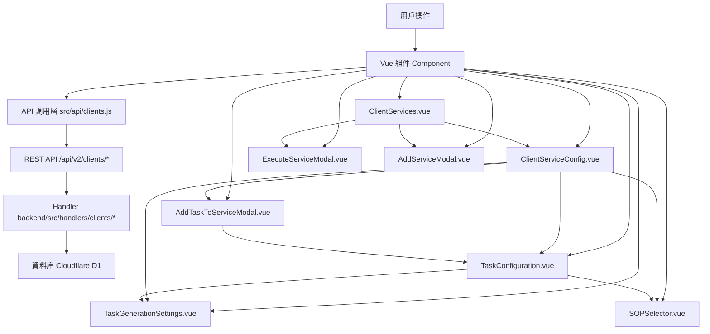

# Design Document: BR1.3.2: 客戶詳情頁 - 服務項目分頁

## Overview

管理客戶服務項目和任務配置

本功能是客戶管理系統的核心模組之一，提供客戶資訊的完整管理流程。

## Steering Document Alignment

### Technical Standards (tech.md)

遵循以下技術標準：
- 使用 Vue 3 Composition API 開發前端組件
- 使用 Ant Design Vue 作為 UI 組件庫
- 使用 RESTful API 進行前後端通信
- 使用 Cloudflare Workers 作為後端運行環境
- 使用 Cloudflare D1 (SQLite) 作為資料庫
- 遵循統一的錯誤處理和回應格式
- 使用參數化查詢防止 SQL 注入
- 實現軟刪除機制保留歷史記錄

### Project Structure (structure.md)

遵循以下項目結構：
- 前端組件位於 `src/components/clients/` 或 `src/views/clients/`
- API 調用層位於 `src/api/clients.js`
- 後端 Handler 位於 `backend/src/handlers/clients/`
- 資料庫 Migration 位於 `backend/migrations/`
- 遵循命名規範：組件使用 PascalCase，Handler 使用 kebab-case

## Code Reuse Analysis

### Existing Components to Leverage
- **TaskConfiguration.vue**: 用於任務配置，支援模板套用和批量設置
- **PageHeader.vue**: 用於頁面標題和操作按鈕區域
- **SearchInput.vue**: 用於搜尋輸入框
- **DataTable.vue**: 用於數據表格展示（如適用）

### Integration Points
- **handleClientServices**: 處理客戶服務列表查詢的 API 請求，位於 `backend/src/handlers/clients/client-services.js`
- **handleCreateClientService**: 處理新增客戶服務的 API 請求，位於 `backend/src/handlers/clients/client-services.js`
- **handleUpdateClientService**: 處理更新客戶服務的 API 請求，位於 `backend/src/handlers/clients/client-services.js`
- **handleDeleteClientService**: 處理刪除客戶服務的 API 請求（軟刪除），位於 `backend/src/handlers/clients/client-services.js`
- **handleExecuteOneTimeService**: 處理一次性服務執行的 API 請求（自動建立收費計劃和立即生成任務），位於 `backend/src/handlers/clients/client-services.js`
- **Clients 表**: 存儲客戶基本資訊，主鍵為 `client_id` (TEXT)
- **ClientServices 表**: 存儲客戶服務關聯，包含服務類型、執行頻率、是否用於自動生成任務等配置
- **TaskConfigurations 表**: 存儲任務配置，包含生成時間規則、到期日規則、SOP 綁定等
- **Services 表**: 存儲服務類型基本資訊，包含預設服務類型、預設執行頻率、預設是否用於自動生成任務
- **Cache 系統**: 使用 KV 和 D1 Cache 提升查詢性能

## Architecture

### Component Architecture

前端採用 Vue 3 Composition API，組件結構清晰，職責單一：



### Modular Design Principles

- **Single File Responsibility**: 每個組件文件只處理一個功能模組
- **Component Isolation**: 組件之間通過 props 和 events 通信，保持獨立
- **Service Layer Separation**: API 調用與業務邏輯分離，使用統一的 API 工具函數
- **Utility Modularity**: 工具函數按功能分組，可在多處重用

## Components and Interfaces

### ClientServices

- **Purpose**: 客戶詳情頁的服務項目分頁組件，提供服務列表展示、新增、編輯、刪除和任務配置入口
- **Location**: `src/components/clients/ClientServices.vue` 或 `src/views/clients/ClientServices.vue`
- **Props**: 
  - `clientId` (String, required): 客戶 ID
- **Events**:
  - `@service-added`: 服務新增完成事件
  - `@service-updated`: 服務更新完成事件
  - `@service-deleted`: 服務刪除完成事件
- **Dependencies**: 
  - Ant Design Vue 組件庫
  - Vue Router (用於導航)
  - ExecuteServiceModal 組件（一次性服務執行）
  - AddServiceModal 組件（新增/編輯服務）
- **Reuses**: 
  - API 調用工具函數 (`@/utils/apiHelpers`)
  - 表單驗證工具 (`@/utils/validation`)
  - 日期格式化工具 (`@/utils/formatters`)
- **Key Features**:
  - 服務列表展示（顯示服務名稱、狀態、年度總額、任務配置數量、服務類型、執行次數等）
  - 服務新增和編輯（支援服務類型選擇、執行頻率設定、是否用於自動生成任務等）
  - 整合服務配置頁面（點擊「配置任務」跳轉至任務配置詳情頁）
  - 顯示收費計劃建立狀態標記
  - 一次性服務執行功能

### AddServiceModal

- **Purpose**: 新增/編輯服務模態框組件，用於選擇服務並設定服務類型、執行頻率、是否用於自動生成任務等基本配置
- **Location**: `src/components/clients/AddServiceModal.vue`
- **Props**: 
  - `visible` (Boolean, required): 對話框顯示狀態
  - `clientId` (String, required): 客戶 ID
  - `service` (Object, optional): 服務對象（用於編輯模式）
- **Events**:
  - `@update:visible`: 更新顯示狀態
  - `@submit`: 服務保存完成事件
  - `@cancel`: 取消操作事件
- **Dependencies**: 
  - Ant Design Vue 組件庫（Modal, Form, Select, Checkbox, DatePicker）
  - API 調用層 (`@/api/clients`)
- **Reuses**: 
  - API 調用工具函數 (`@/utils/apiHelpers`)
  - 表單驗證工具 (`@/utils/validation`)
  - 日期格式化工具 (`@/utils/formatters`)
- **Key Features**:
  - 從系統設置的服務類型列表下拉選擇服務類型
  - 選擇服務類型（定期服務 / 一次性服務）
  - 自動從服務類型帶入預設執行頻率、服務類型、是否用於自動生成任務
  - 設定服務執行頻率（勾選執行月份，1-12 月）
  - 設定是否用於自動生成任務
  - 設定服務狀態（使用中、暫停、已到期、已取消）和開始日期
  - 驗證服務必須存在且為啟用狀態
  - 驗證定期服務必須至少勾選一個月份
  - 自動檢查並套用任務模板（優先使用客戶專屬模板，其次使用通用模板）

### ClientServiceConfig

- **Purpose**: 服務任務配置詳情頁組件，提供完整的任務配置功能，包括任務名稱選擇、階段編號、負責人、預估工時、生成時間、到期日、SOP 綁定等
- **Location**: `src/components/clients/ClientServiceConfig.vue` 或 `src/views/clients/ClientServiceConfig.vue`
- **Props**: 
  - `clientId` (String, required): 客戶 ID
  - `clientServiceId` (String, required): 客戶服務 ID
- **Events**:
  - `@submit`: 任務配置保存完成事件
  - `@cancel`: 取消操作事件
- **Dependencies**: 
  - Ant Design Vue 組件庫
  - Vue Router (用於導航)
  - TaskGenerationSettings 組件
  - SOPSelector 組件
  - AddTaskToServiceModal 組件
- **Reuses**: 
  - API 調用工具函數 (`@/utils/apiHelpers`)
  - 表單驗證工具 (`@/utils/validation`)
  - 日期格式化工具 (`@/utils/formatters`)
- **Key Features**:
  - 從服務類型下的任務類型列表下拉選擇任務名稱
  - 批量保存任務配置
  - 顯示保留設定的任務，允許手動加入服務設定

### TaskConfiguration

- **Purpose**: 任務配置表單組件，用於單個任務的詳細配置，包括階段編號、負責人、預估工時等基本設定
- **Location**: `src/components/clients/TaskConfiguration.vue`
- **Props**: 
  - `task` (Object, optional): 任務配置對象（用於編輯模式）
  - `serviceTypeId` (String, required): 服務類型 ID（用於篩選任務類型）
  - `clientId` (String, required): 客戶 ID（用於 SOP 篩選）
- **Events**:
  - `@change`: 任務配置變更事件
  - `@validate`: 表單驗證事件
- **Dependencies**: 
  - Ant Design Vue 組件庫
  - TaskGenerationSettings 組件
  - SOPSelector 組件
- **Reuses**: 
  - API 調用工具函數 (`@/utils/apiHelpers`)
  - 表單驗證工具 (`@/utils/validation`)
  - 日期格式化工具 (`@/utils/formatters`)
- **Key Features**:
  - 任務生成時間和到期日設置（帶即時預覽）
  - SOP 自動綁定（從知識庫讀取，支援多選和取消預設）
  - 固定期限任務設置

### ExecuteServiceModal

- **Purpose**: 一次性服務執行對話框組件，允許選擇執行月份、填寫收費金額，並自動完成收費計劃建立/更新和任務生成
- **Location**: `src/components/clients/ExecuteServiceModal.vue`
- **Props**: 
  - `clientId` (String, required): 客戶 ID
  - `clientServiceId` (String, required): 客戶服務 ID
  - `visible` (Boolean, required): 對話框顯示狀態
- **Events**:
  - `@submit`: 執行完成事件
  - `@cancel`: 取消操作事件
- **Dependencies**: 
  - Ant Design Vue 組件庫（Modal, Form）
  - API 調用層 (`@/api/clients`)
- **Reuses**: 
  - API 調用工具函數 (`@/utils/apiHelpers`)
  - 日期處理工具 (`@/utils/dateHelpers`)
  - 表單驗證工具 (`@/utils/validation`)
- **Key Features**:
  - 選擇執行月份（必填）
  - 填寫收費金額（必填）
  - 選擇服務月份（用於任務，預設為執行月份）
  - 付款期限（可選）
  - 自動建立/更新一次性服務收費計劃
  - 立即生成任務（不需要等待自動生成）

### AddTaskToServiceModal

- **Purpose**: 為已生成的定期服務新增任務的對話框組件，支援僅當月生成、保存到服務設定、保留設定三種模式
- **Location**: `src/components/clients/AddTaskToServiceModal.vue`
- **Props**: 
  - `clientId` (String, required): 客戶 ID
  - `clientServiceId` (String, required): 客戶服務 ID
  - `visible` (Boolean, required): 對話框顯示狀態
- **Events**:
  - `@submit`: 新增任務完成事件
  - `@cancel`: 取消操作事件
- **Dependencies**: 
  - Ant Design Vue 組件庫（Modal, Form, Radio）
  - TaskConfiguration 組件
  - API 調用層 (`@/api/clients`)
- **Reuses**: 
  - API 調用工具函數 (`@/utils/apiHelpers`)
  - 表單驗證工具 (`@/utils/validation`)
- **Key Features**:
  - 三種模式選擇（僅當月生成、保存到服務設定、保留設定）
  - 任務配置表單（整合 TaskConfiguration 組件）
  - 保留設定的任務管理

### TaskGenerationSettings

- **Purpose**: 任務生成時間和到期日規則設置組件，支援多種規則選擇和即時預覽功能
- **Location**: `src/components/clients/TaskGenerationSettings.vue`
- **Props**: 
  - `value` (Object, required): 生成時間和到期日配置對象
  - `serviceTypeId` (String, required): 服務類型 ID（用於預覽計算）
- **Events**:
  - `@change`: 配置變更事件
  - `@validate`: 驗證事件
- **Dependencies**: 
  - Ant Design Vue 組件庫（Select, InputNumber, Switch）
  - 日期處理工具 (`@/utils/dateHelpers`)
- **Reuses**: 
  - 日期格式化工具 (`@/utils/formatters`)
- **Key Features**:
  - 生成時間規則選擇（服務月份開始時、前一個月最後X天、前一個月第X天、後一個月開始時）
  - 到期日規則選擇（服務月份結束時、後一個月結束時、後N個月結束時、固定日期、固定期限）
  - 即時預覽功能（顯示實際效果）
  - 固定期限任務設置（不受前面任務延後影響）

### SOPSelector

- **Purpose**: SOP 選擇器組件，從知識庫讀取符合條件的 SOP，支援多選和取消預設
- **Location**: `src/components/clients/SOPSelector.vue`
- **Props**: 
  - `serviceTypeId` (String, required): 服務類型 ID（用於篩選）
  - `clientId` (String, required): 客戶 ID（用於篩選）
  - `level` (String, required): SOP 層級（'service' 或 'task'）
  - `value` (Array, optional): 已選中的 SOP IDs
- **Events**:
  - `@change`: SOP 選擇變更事件
- **Dependencies**: 
  - Ant Design Vue 組件庫（Select, Checkbox）
  - 知識庫 API (`@/api/knowledge`)
- **Reuses**: 
  - API 調用工具函數 (`@/utils/apiHelpers`)
- **Key Features**:
  - 自動從知識庫讀取符合條件的 SOP
  - 先篩選服務類型，再篩選層級
  - 支援多選和取消預設帶入的 SOP
  - 處理多個客戶專屬服務層級SOP的情況

## Data Models

### ClientService (客戶服務)

```javascript
{
  id: Integer (PK, AUTOINCREMENT),
  client_id: String (FK -> Clients.client_id),
  service_id: Integer (FK -> Services.id),
  service_type: String, // 'recurring' 或 'one-time'
  execution_months: TEXT (JSON), // 執行月份陣列，例如 [1,2,3,4,5,6,7,8,9,10,11,12]
  use_for_auto_generate: Integer, // 0 或 1，是否用於自動生成任務
  status: String, // 'active', 'paused', 'expired', 'cancelled'
  start_date: Date, // 開始日期
  created_at: DateTime,
  updated_at: DateTime,
  is_deleted: Boolean,
  deleted_at: DateTime
}
```

### TaskConfiguration (任務配置)

```javascript
{
  id: Integer (PK, AUTOINCREMENT),
  client_service_id: Integer (FK -> ClientServices.id),
  task_name: String (required), // 從服務類型下的任務類型列表下拉選擇
  stage_order: Integer (required), // 階段編號，從 1 開始
  assignee_user_id: Integer (FK -> Users), // 負責人
  estimated_hours: Decimal, // 預估工時（小時）
  generation_time_rule: String, // 生成時間規則（例如：'service_month_start', 'prev_month_last_x_days', 'prev_month_x_day', 'next_month_start'）
  generation_time_params: JSON, // 生成時間參數（例如：{ days: 3, day: 25 }）
  due_date_rule: String, // 到期日規則（例如：'service_month_end', 'next_month_end', 'n_months_end', 'fixed_date', 'fixed_deadline'）
  due_date_params: JSON, // 到期日參數（例如：{ months: 2, day: 15 }）
  is_fixed_deadline: Boolean, // 是否為固定期限任務（不受前面任務延後影響）
  service_level_sops: TEXT (JSON), // 服務層級 SOP IDs 陣列（多選）
  task_level_sops: TEXT (JSON), // 任務層級 SOP IDs 陣列（多選）
  is_kept_setting: Boolean, // 是否為保留設定（不自動生成）
  created_at: DateTime,
  updated_at: DateTime
}
```

### Client

```javascript
{
  client_id: String (PK), // 統一編號，企業客戶自動加 00 前綴
  company_name: String (required),
  tax_registration_number: String (10碼，企業=00+8碼，個人=10碼身分證),
  assignee_user_id: Integer (FK -> Users),
  phone: String,
  email: String,
  contact_person_1: String,
  contact_person_2: String,
  company_owner: String,
  company_address: String,
  capital_amount: Integer,
  primary_contact_method: String,
  line_id: String,
  client_notes: Text,
  payment_notes: Text,
  created_at: DateTime,
  updated_at: DateTime,
  is_deleted: Boolean,
  deleted_at: DateTime,
  deleted_by: Integer (FK -> Users)
}
```

### Shareholder (關聯表)

```javascript
{
  id: Integer (PK, AUTOINCREMENT),
  client_id: String (FK -> Clients.client_id),
  name: String (required),
  share_percentage: Decimal,
  share_count: Integer,
  share_amount: Integer,
  share_type: String,
  created_at: DateTime,
  updated_at: DateTime
}
```

### DirectorsSupervisor (關聯表)

```javascript
{
  id: Integer (PK, AUTOINCREMENT),
  client_id: String (FK -> Clients.client_id),
  name: String (required),
  position: String,
  term_start: Date,
  term_end: Date,
  is_current: Boolean,
  created_at: DateTime,
  updated_at: DateTime
}
```

## Error Handling

### Error Scenarios

1. **API 請求失敗**
   - **Handling**: 使用 `extractApiError` 提取錯誤訊息，使用 `message.error` 顯示錯誤提示
   - **User Impact**: 顯示友好的錯誤訊息（例如：「載入客戶列表失敗，請稍後再試」）

2. **表單驗證失敗**
   - **Handling**: 使用 Ant Design Vue Form 的驗證規則，在欄位下方顯示錯誤訊息
   - **User Impact**: 紅色錯誤提示出現在對應欄位下方，阻止表單提交

3. **權限不足**
   - **Handling**: API 返回 403 錯誤，前端檢查並顯示權限提示
   - **User Impact**: 顯示「您沒有權限執行此操作」並隱藏相關功能按鈕

4. **數據不存在**
   - **Handling**: API 返回 404 錯誤，前端跳轉到 404 頁面或顯示空狀態
   - **User Impact**: 顯示「客戶不存在」或空狀態提示

5. **網路錯誤**
   - **Handling**: 捕獲網路異常，顯示網路錯誤提示，提供重試選項
   - **User Impact**: 顯示「網路連線失敗，請檢查網路後重試」

6. **任務生成時間和到期日配置錯誤**
   - **Handling**: 驗證生成時間和到期日規則的參數有效性，顯示錯誤提示
   - **User Impact**: 在對應欄位下方顯示錯誤訊息，阻止表單提交

7. **SOP 讀取失敗**
   - **Handling**: 從知識庫讀取 SOP 失敗時，顯示警告訊息，允許手動選擇
   - **User Impact**: 顯示「無法自動載入 SOP，請手動選擇」警告，SOP 選擇器仍可正常使用

8. **為已生成服務新增任務失敗**
   - **Handling**: 新增任務失敗時，顯示錯誤訊息，保留用戶輸入的數據
   - **User Impact**: 顯示「新增任務失敗，請重試」錯誤提示，允許重新提交

## Testing Strategy

### Unit Testing

- **組件測試**: 測試組件的 props、events、computed 屬性
- **工具函數測試**: 測試格式化、驗證等工具函數
- **測試框架**: 建議使用 Vitest

### Integration Testing

- **API 整合測試**: 測試 API 調用和回應處理
- **組件整合測試**: 測試組件之間的交互
- **測試框架**: 建議使用 Vitest + MSW (Mock Service Worker)

### End-to-End Testing

- **E2E 測試**: 使用 Playwright 測試完整用戶流程
- **測試場景**: 
  - 列表頁面的搜尋和篩選功能
  - 新增客戶的完整流程（基本資訊 → 服務設定 → 帳務設定）
  - 編輯客戶資訊
  - 刪除客戶（管理員權限）
  - 任務生成時間和到期日配置（包括即時預覽）
  - SOP 自動綁定和多選功能
  - 一次性服務立即生成任務
  - 為已生成的定期服務新增任務（僅當月生成、保存到服務設定、保留設定）
- **測試數據**: 使用 `setupBR1_1TestData` 等工具函數設置測試數據
- **測試帳號**: 使用 `admin`/`111111` 管理員帳號和 `liu`/`111111` 員工帳號

