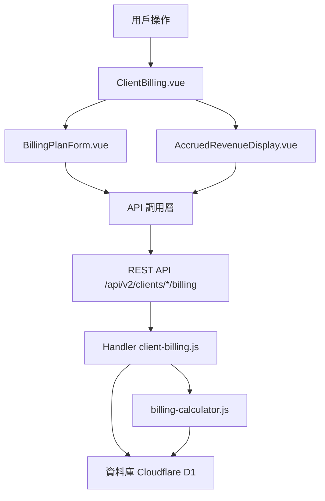

# Design Document: BR1.3.3: 客戶詳情頁 - 收費設定分頁

## Overview

本功能是客戶管理系統的核心模組之一，提供客戶收費計劃管理和應計收入計算功能。通過集中管理客戶的收費計劃、年度帳務資訊和收入分攤，幫助員工高效地管理客戶帳務，確保財務記錄準確性，並支援成本核算和利潤分析。

主要功能包括：
- 收費計劃管理（新增、編輯、刪除、批量刪除）
- 年度管理（年度切換、自動建立和複製）
- 收入分攤計算（定期服務按執行次數比例分攤，一次性服務直接使用實際金額）
- 應計收入展示（顯示每個服務的分攤結果）

## Steering Document Alignment

### Technical Standards (tech.md)

遵循以下技術標準：
- 使用 Vue 3 Composition API 開發前端組件
- 使用 Ant Design Vue 作為 UI 組件庫
- 使用 RESTful API 進行前後端通信
- 使用 Cloudflare Workers 作為後端運行環境
- 使用 Cloudflare D1 (SQLite) 作為資料庫
- 遵循統一的錯誤處理和回應格式
- 使用參數化查詢防止 SQL 注入
- 實現軟刪除機制保留歷史記錄

### Project Structure (structure.md)

遵循以下項目結構：
- 前端組件位於 `src/components/clients/` 或 `src/views/clients/`
- API 調用層位於 `src/api/clients.js`
- 後端 Handler 位於 `backend/src/handlers/clients/`
- 資料庫 Migration 位於 `backend/migrations/`
- 遵循命名規範：組件使用 PascalCase，Handler 使用 kebab-case

## Code Reuse Analysis

### Existing Components to Leverage
- **PageHeader.vue**: 用於頁面標題和操作按鈕區域
- **SearchInput.vue**: 用於搜尋輸入框（如需要服務篩選）
- **DataTable.vue**: 用於數據表格展示（收費計劃列表）
- **Ant Design Vue Form**: 用於收費計劃表單（月份勾選、金額輸入）
- **Ant Design Vue Select**: 用於服務關聯選擇（多選）
- **Ant Design Vue DatePicker**: 用於年度選擇器
- **Ant Design Vue Table**: 用於應計收入展示

### Integration Points
- **API 層**: `src/api/clients.js` - 客戶相關 API 調用函數，需要添加收費計劃相關方法
- **Handler 層**: `backend/src/handlers/clients/client-billing.js` - 處理收費計劃相關的 API 請求
  - `handleBillingPlans`: 獲取收費計劃列表（支援年度篩選）
  - `handleCreateBillingPlan`: 建立收費計劃（支援年度自動建立和複製）
  - `handleUpdateBillingPlan`: 更新收費計劃
  - `handleDeleteBillingPlan`: 刪除收費計劃（支援單筆和批量）
  - `handleAccruedRevenue`: 獲取應計收入分攤結果
- **工具函數**: `backend/src/utils/billing-calculator.js` - 收入分攤計算邏輯
- **資料庫表**:
  - **Clients 表**: 存儲客戶基本資訊，主鍵為 `client_id` (TEXT)
  - **ClientServices 表**: 存儲客戶服務關聯（包含 service_type, execution_months）
  - **BillingPlans 表**: 存儲收費計劃（包含 billing_type, billing_year, billing_month, amount, payment_due_days）
  - **BillingPlanServices 表**: 存儲收費計劃與服務的關聯（多對多關係）
- **Cache 系統**: 使用 KV 和 D1 Cache 提升查詢性能（收費計劃列表、應計收入計算結果）

## Architecture

### Component Architecture

前端採用 Vue 3 Composition API，組件結構清晰，職責單一：



### Modular Design Principles

- **Single File Responsibility**: 每個組件文件只處理一個功能模組
- **Component Isolation**: 組件之間通過 props 和 events 通信，保持獨立
- **Service Layer Separation**: API 調用與業務邏輯分離，使用統一的 API 工具函數
- **Utility Modularity**: 工具函數按功能分組，可在多處重用

## Components and Interfaces

### ClientBilling

- **Purpose**: 管理客戶收費計劃和應計收入的主要組件
- **Location**: `src/components/clients/ClientBilling.vue`
- **Interfaces**: 
  - `loadBillingPlans(clientId: string, billingYear: number)`: 載入收費計劃列表
  - `handleYearChange(year: number)`: 處理年度切換，自動建立新年度收費計劃
  - `handleCreateBillingPlan(data: BillingPlanData)`: 新增收費計劃
  - `handleUpdateBillingPlan(id: number, data: BillingPlanData)`: 更新收費計劃
  - `handleDeleteBillingPlan(ids: number[])`: 刪除收費計劃（支援批量）
  - `loadAccruedRevenue(clientId: string, billingYear: number)`: 載入應計收入數據
- **Props**: 
  - `clientId` (String, required): 客戶 ID
- **Events**: 無（內部組件，通過路由參數獲取 clientId）
- **Dependencies**: 
  - Ant Design Vue 組件庫
  - Vue Router (用於獲取路由參數)
  - API 調用層 (`src/api/clients.js`)
- **Reuses**: 
  - API 調用工具函數 (`@/utils/apiHelpers`)
  - 表單驗證工具 (`@/utils/validation`)
  - 日期格式化工具 (`@/utils/formatters`)
  - BillingPlanForm 組件（收費計劃表單）
  - AccruedRevenueDisplay 組件（應計收入展示）

### BillingPlanForm

- **Purpose**: 可重用的收費計劃表單組件，用於新增和編輯收費計劃
- **Location**: `src/components/clients/BillingPlanForm.vue`
- **Interfaces**: 
  - `loadClientServices(clientId: string, serviceType: string)`: 載入客戶服務列表（用於服務關聯）
  - `validateForm()`: 驗證表單資料（月份、金額、服務關聯）
  - `getFormData()`: 獲取表單數據
  - `resetForm()`: 重置表單
- **Props**: 
  - `clientId` (String, required): 客戶 ID
  - `billingPlan` (Object, optional): 現有收費計劃數據（編輯模式）
  - `billingYear` (Number, required): 年度
  - `billingType` (String, required): 收費計劃類型（'recurring' | 'one-time'）
- **Events**:
  - `@submit`: 表單提交事件，傳遞表單數據
  - `@cancel`: 取消操作事件
- **Dependencies**: 
  - Ant Design Vue Form 組件
  - API 調用層 (`src/api/clients.js` - 獲取客戶服務列表)
- **Reuses**: 
  - 表單驗證工具 (`@/utils/validation`)

### AccruedRevenueDisplay

- **Purpose**: 顯示應計收入分攤結果的組件
- **Location**: `src/components/clients/AccruedRevenueDisplay.vue`
- **Interfaces**: 
  - `loadAccruedRevenue(clientId: string, billingYear: number)`: 載入應計收入數據
  - `formatRevenue(amount: number)`: 格式化收入金額顯示
  - `calculateTotalRevenue(revenueData: AccruedRevenue[])`: 計算總收入
- **Props**: 
  - `clientId` (String, required): 客戶 ID
  - `billingYear` (Number, required): 年度
- **Events**: 無
- **Dependencies**: 
  - Ant Design Vue Table 組件
  - API 調用層 (`src/api/clients.js` - 獲取應計收入數據)
- **Reuses**: 
  - 數字格式化工具 (`@/utils/formatters`)

## Data Models

### Client

```javascript
{
  client_id: String (PK), // 統一編號，企業客戶自動加 00 前綴
  company_name: String (required),
  tax_registration_number: String (10碼，企業=00+8碼，個人=10碼身分證),
  assignee_user_id: Integer (FK -> Users),
  phone: String,
  email: String,
  contact_person_1: String,
  contact_person_2: String,
  company_owner: String,
  company_address: String,
  capital_amount: Integer,
  primary_contact_method: String,
  line_id: String,
  client_notes: Text,
  payment_notes: Text,
  created_at: DateTime,
  updated_at: DateTime,
  is_deleted: Boolean,
  deleted_at: DateTime,
  deleted_by: Integer (FK -> Users)
}
```

### Shareholder (關聯表)

```javascript
{
  id: Integer (PK, AUTOINCREMENT),
  client_id: String (FK -> Clients.client_id),
  name: String (required),
  share_percentage: Decimal,
  share_count: Integer,
  share_amount: Integer,
  share_type: String,
  created_at: DateTime,
  updated_at: DateTime
}
```

### DirectorsSupervisor (關聯表)

```javascript
{
  id: Integer (PK, AUTOINCREMENT),
  client_id: String (FK -> Clients.client_id),
  name: String (required),
  position: String,
  term_start: Date,
  term_end: Date,
  is_current: Boolean,
  created_at: DateTime,
  updated_at: DateTime
}
```

### BillingPlan

```javascript
{
  id: Integer (PK, AUTOINCREMENT),
  client_id: String (FK -> Clients.client_id),
  billing_type: String (required, 'recurring' | 'one-time'),
  billing_year: Integer (required),
  billing_month: Integer (required, 1-12),
  amount: Integer (required),
  payment_due_days: Integer (default: 30),
  year_total: Integer (computed, 年度總收費金額),
  created_at: DateTime,
  updated_at: DateTime
}
```

### BillingPlanService (關聯表，多對多)

```javascript
{
  id: Integer (PK, AUTOINCREMENT),
  billing_plan_id: Integer (FK -> BillingPlans.id),
  client_service_id: Integer (FK -> ClientServices.id),
  created_at: DateTime
}
```

### ClientService (關聯表，用於服務關聯)

```javascript
{
  id: Integer (PK, AUTOINCREMENT),
  client_id: String (FK -> Clients.client_id),
  service_id: Integer (FK -> Services.id),
  service_type: String (required, 'recurring' | 'one-time'),
  execution_months: JSON (Array<Integer>, 1-12, 該年度該服務實際執行的月份),
  created_at: DateTime,
  updated_at: DateTime
}
```

## Error Handling

### Error Scenarios

1. **API 請求失敗**
   - **Handling**: 使用 `extractApiError` 提取錯誤訊息，使用 `message.error` 顯示錯誤提示
   - **User Impact**: 顯示友好的錯誤訊息（例如：「載入收費計劃失敗，請稍後再試」）

2. **表單驗證失敗**
   - **Handling**: 使用 Ant Design Vue Form 的驗證規則，在欄位下方顯示錯誤訊息
   - **User Impact**: 紅色錯誤提示出現在對應欄位下方，阻止表單提交

3. **權限不足**
   - **Handling**: API 返回 403 錯誤，前端檢查並顯示權限提示
   - **User Impact**: 顯示「您沒有權限執行此操作」並隱藏相關功能按鈕

4. **數據不存在**
   - **Handling**: API 返回 404 錯誤，前端顯示空狀態或提示訊息
   - **User Impact**: 顯示「該年度沒有收費計劃」或空狀態提示（年度切換時自動建立定期服務收費計劃）

5. **網路錯誤**
   - **Handling**: 捕獲網路異常，顯示網路錯誤提示，提供重試選項
   - **User Impact**: 顯示「網路連線失敗，請檢查網路後重試」

6. **收入計算錯誤**
   - **Handling**: 捕獲計算過程中的異常（如除零錯誤、數據缺失），記錄錯誤日誌，顯示計算失敗提示
   - **User Impact**: 顯示「應計收入計算失敗，請稍後再試」或「數據不完整，無法計算應計收入」

7. **年度自動建立失敗**
   - **Handling**: 當自動建立新年度收費計劃失敗時，記錄錯誤並提示用戶手動建立
   - **User Impact**: 顯示「自動建立收費計劃失敗，請手動新增收費計劃」

8. **數據驗證錯誤**
   - **Handling**: 驗證金額、日期、服務關聯等數據，在提交前阻止無效數據
   - **User Impact**: 在對應欄位顯示驗證錯誤訊息，阻止表單提交

## Testing Strategy

### Unit Testing

- **組件測試**: 測試組件的 props、events、computed 屬性
  - ClientBilling 組件：測試年度切換、收費計劃載入、CRUD 操作
  - BillingPlanForm 組件：測試表單驗證、月份勾選、服務關聯選擇
  - AccruedRevenueDisplay 組件：測試收入數據展示、格式化
- **工具函數測試**: 測試格式化、驗證等工具函數
  - `billing-calculator.js`：測試收入分攤計算邏輯（定期服務分攤、一次性服務直接使用）
  - 驗證工具：測試金額、日期、服務關聯等數據驗證
- **測試框架**: 建議使用 Vitest

### Integration Testing

- **API 整合測試**: 測試 API 調用和回應處理
  - 收費計劃 CRUD API 端點測試
  - 應計收入計算 API 端點測試
  - 年度自動建立和複製功能測試
- **組件整合測試**: 測試組件之間的交互
  - ClientBilling 與 BillingPlanForm 的交互
  - ClientBilling 與 AccruedRevenueDisplay 的交互
  - 年度切換時組件狀態的同步
- **測試框架**: 建議使用 Vitest + MSW (Mock Service Worker)

### End-to-End Testing

- **E2E 測試**: 使用 Playwright 測試完整用戶流程
- **測試場景**: 
  - 收費計劃列表查看（年度切換、服務篩選）
  - 新增定期服務收費計劃（年度選擇、月份勾選、金額填寫、服務關聯）
  - 編輯收費計劃（修改月份金額、新增/刪除月份、新增/刪除服務）
  - 刪除收費計劃（單筆和批量刪除）
  - 年度自動建立和複製功能（切換到新年度時自動建立定期服務收費計劃）
  - 應計收入計算和展示（定期服務分攤、一次性服務直接使用）
- **測試數據**: 使用 `setupBR1_3_3TestData` 等工具函數設置測試數據（包含客戶、服務、收費計劃）
- **測試帳號**: 使用 `admin`/`111111` 管理員帳號和 `liu`/`111111` 員工帳號

