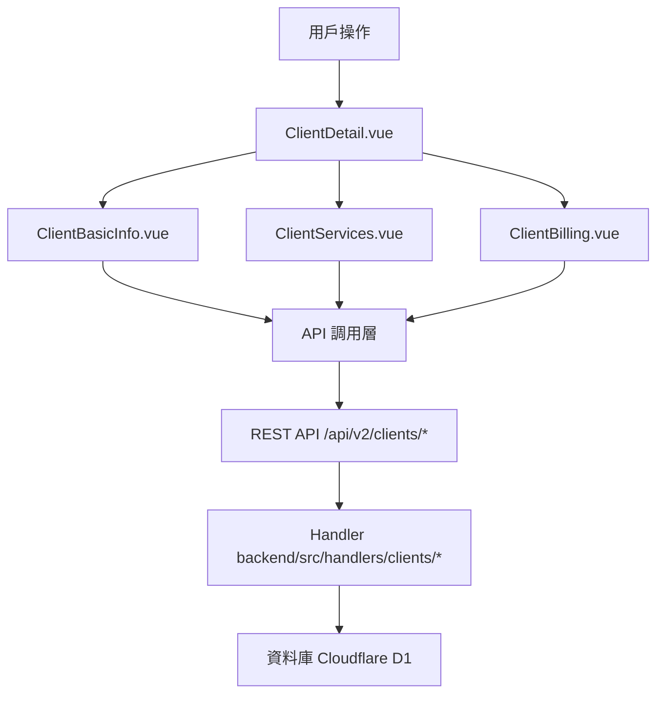

# Design Document: BR1.3: 客戶詳情頁

## Overview

客戶詳情頁是客戶管理系統的核心模組之一，提供客戶資訊的完整管理流程。該頁面採用分頁導航設計，將客戶資訊分為三個獨立的分頁：基本資訊、服務項目和收費設定。每個分頁都可以獨立查看和編輯，提供清晰的資訊組織結構和良好的用戶體驗。

本功能的主要目標是：
- 提供統一的客戶資訊管理介面
- 支援客戶基本資訊、服務項目和帳務資訊的完整管理
- 確保資料的完整性和一致性
- 提供良好的用戶體驗和操作流程

## Steering Document Alignment

### Technical Standards (tech.md)

遵循以下技術標準：
- 使用 Vue 3 Composition API 開發前端組件
- 使用 Ant Design Vue 作為 UI 組件庫
- 使用 RESTful API 進行前後端通信
- 使用 Cloudflare Workers 作為後端運行環境
- 使用 Cloudflare D1 (SQLite) 作為資料庫
- 遵循統一的錯誤處理和回應格式
- 使用參數化查詢防止 SQL 注入
- 實現軟刪除機制保留歷史記錄

### Project Structure (structure.md)

遵循以下項目結構：
- 前端組件位於 `src/components/clients/` 或 `src/views/clients/`
- API 調用層位於 `src/api/clients.js`
- 後端 Handler 位於 `backend/src/handlers/clients/`
- 資料庫 Migration 位於 `backend/migrations/`
- 遵循命名規範：組件使用 PascalCase，Handler 使用 kebab-case

## Code Reuse Analysis

### Existing Components to Leverage
- **PageHeader.vue**: 用於頁面標題和操作按鈕區域
- **SearchInput.vue**: 用於搜尋輸入框
- **DataTable.vue**: 用於數據表格展示（如適用）

### Integration Points
- **handleClientDetail**: 處理相關的 API 請求，位於 `backend/src/handlers/clients/`
- **Clients 表**: 存儲客戶基本資訊，主鍵為 `client_id` (TEXT)
- **ClientServices 表**: 存儲客戶服務關聯
- **ClientTagAssignments 表**: 存儲客戶標籤關聯
- **Cache 系統**: 使用 KV 和 D1 Cache 提升查詢性能

## Architecture

### Component Architecture

前端採用 Vue 3 Composition API，組件結構清晰，職責單一：



### Modular Design Principles

- **Single File Responsibility**: 每個組件文件只處理一個功能模組
- **Component Isolation**: 組件之間通過 props 和 events 通信，保持獨立
- **Service Layer Separation**: API 調用與業務邏輯分離，使用統一的 API 工具函數
- **Utility Modularity**: 工具函數按功能分組，可在多處重用

## Components and Interfaces

### ClientDetail

- **Purpose**: 客戶詳情頁導航和總體結構的主要組件，負責管理三個分頁的切換和客戶資料的載入
- **Location**: `src/views/clients/ClientDetail.vue`
- **Interfaces**: 
  - `loadClientData(clientId: string)`: 載入客戶資料
  - `handleTabChange(key: string)`: 處理分頁切換
- **Props**: 
  - `clientId` (String, required): 客戶 ID（從路由參數獲取）
- **Events**: 無（頁面級組件）
- **Dependencies**: 
  - Ant Design Vue 組件庫（Tabs 組件）
  - Vue Router (用於導航和路由參數)
  - Pinia Store (如需要狀態管理)
- **Reuses**: 
  - API 調用工具函數 (`@/utils/apiHelpers`)
  - 錯誤處理工具 (`@/utils/errorHandler`)

### ClientBasicInfo

- **Purpose**: 客戶基本資訊分頁組件，負責顯示和編輯客戶的基本資訊
- **Location**: `src/components/clients/ClientBasicInfo.vue`
- **Interfaces**: 
  - `loadClientInfo(clientId: string)`: 載入客戶基本資訊
  - `saveClientInfo(data: ClientInfo)`: 保存客戶基本資訊
  - `validateForm()`: 驗證表單資料
- **Props**: 
  - `clientId` (String, required): 客戶 ID
- **Events**:
  - `@updated`: 客戶資訊更新事件
- **Dependencies**: 
  - Ant Design Vue 組件庫（Form, Input, Select 等）
  - Vue Router (用於導航)
- **Reuses**: 
  - API 調用工具函數 (`@/api/clients`)
  - 表單驗證工具 (`@/utils/validation`)
  - 日期格式化工具 (`@/utils/formatters`)

### ClientServices

- **Purpose**: 客戶服務項目分頁組件，負責管理客戶的服務項目列表和任務配置
- **Location**: `src/components/clients/ClientServices.vue`
- **Interfaces**: 
  - `loadServices(clientId: string)`: 載入客戶服務列表
  - `addService(service: ClientService)`: 新增服務
  - `updateService(serviceId: number, service: ClientService)`: 更新服務
  - `deleteService(serviceId: number)`: 刪除服務
  - `navigateToConfig(serviceId: number)`: 導航到服務配置頁
- **Props**: 
  - `clientId` (String, required): 客戶 ID
- **Events**:
  - `@service-added`: 服務新增事件
  - `@service-updated`: 服務更新事件
  - `@service-deleted`: 服務刪除事件
- **Dependencies**: 
  - Ant Design Vue 組件庫（Table, Button, Modal 等）
  - Vue Router (用於導航到服務配置頁)
- **Reuses**: 
  - API 調用工具函數 (`@/api/clients`)
  - 服務配置組件 (`ClientServiceConfig.vue`)

### ClientBilling

- **Purpose**: 客戶收費設定分頁組件，負責管理客戶的收費計劃和帳務資訊
- **Location**: `src/components/clients/ClientBilling.vue`
- **Interfaces**: 
  - `loadBillingInfo(clientId: string)`: 載入客戶收費設定
  - `saveBillingInfo(data: BillingInfo)`: 保存收費設定
  - `loadBillingHistory(clientId: string)`: 載入帳務歷史記錄
  - `validateBillingForm()`: 驗證收費設定表單
- **Props**: 
  - `clientId` (String, required): 客戶 ID
- **Events**:
  - `@billing-updated`: 收費設定更新事件
- **Dependencies**: 
  - Ant Design Vue 組件庫（Form, Input, Table 等）
  - Vue Router (用於導航)
- **Reuses**: 
  - API 調用工具函數 (`@/api/clients`)
  - 表單驗證工具 (`@/utils/validation`)

## Data Models

### Client

```javascript
{
  client_id: String (PK), // 統一編號，企業客戶自動加 00 前綴
  company_name: String (required),
  tax_registration_number: String (10碼，企業=00+8碼，個人=10碼身分證),
  assignee_user_id: Integer (FK -> Users),
  phone: String,
  email: String,
  contact_person_1: String,
  contact_person_2: String,
  company_owner: String,
  company_address: String,
  capital_amount: Integer,
  primary_contact_method: String,
  line_id: String,
  client_notes: Text,
  payment_notes: Text,
  created_at: DateTime,
  updated_at: DateTime,
  is_deleted: Boolean,
  deleted_at: DateTime,
  deleted_by: Integer (FK -> Users)
}
```

### Shareholder (關聯表)

```javascript
{
  id: Integer (PK, AUTOINCREMENT),
  client_id: String (FK -> Clients.client_id),
  name: String (required),
  share_percentage: Decimal,
  share_count: Integer,
  share_amount: Integer,
  share_type: String,
  created_at: DateTime,
  updated_at: DateTime
}
```

### DirectorsSupervisor (關聯表)

```javascript
{
  id: Integer (PK, AUTOINCREMENT),
  client_id: String (FK -> Clients.client_id),
  name: String (required),
  position: String,
  term_start: Date,
  term_end: Date,
  is_current: Boolean,
  created_at: DateTime,
  updated_at: DateTime
}
```

## Error Handling

### Error Scenarios

1. **API 請求失敗**
   - **Handling**: 使用 `extractApiError` 提取錯誤訊息，使用 `message.error` 顯示錯誤提示
   - **User Impact**: 顯示友好的錯誤訊息（例如：「載入客戶列表失敗，請稍後再試」）

2. **表單驗證失敗**
   - **Handling**: 使用 Ant Design Vue Form 的驗證規則，在欄位下方顯示錯誤訊息
   - **User Impact**: 紅色錯誤提示出現在對應欄位下方，阻止表單提交

3. **權限不足**
   - **Handling**: API 返回 403 錯誤，前端檢查並顯示權限提示
   - **User Impact**: 顯示「您沒有權限執行此操作」並隱藏相關功能按鈕

4. **數據不存在**
   - **Handling**: API 返回 404 錯誤，前端跳轉到 404 頁面或顯示空狀態
   - **User Impact**: 顯示「客戶不存在」或空狀態提示

5. **網路錯誤**
   - **Handling**: 捕獲網路異常，顯示網路錯誤提示，提供重試選項
   - **User Impact**: 顯示「網路連線失敗，請檢查網路後重試」

## Testing Strategy

### Unit Testing

- **組件測試**: 測試組件的 props、events、computed 屬性
- **工具函數測試**: 測試格式化、驗證等工具函數
- **測試框架**: 建議使用 Vitest

### Integration Testing

- **API 整合測試**: 測試 API 調用和回應處理
- **組件整合測試**: 測試組件之間的交互
- **測試框架**: 建議使用 Vitest + MSW (Mock Service Worker)

### End-to-End Testing

- **E2E 測試**: 使用 Playwright 測試完整用戶流程
- **測試場景**: 
  - 客戶詳情頁導航功能（三個分頁的切換）
  - 客戶基本資訊的查看和編輯
  - 客戶服務項目的管理（新增/編輯/刪除服務）
  - 客戶收費設定的查看和編輯
  - 分頁間切換時資料的保留和載入
  - 錯誤處理（客戶不存在、權限不足等）
- **測試數據**: 使用 `setupBR1_1TestData` 等工具函數設置測試數據
- **測試帳號**: 使用 `admin`/`111111` 管理員帳號和 `liu`/`111111` 員工帳號

