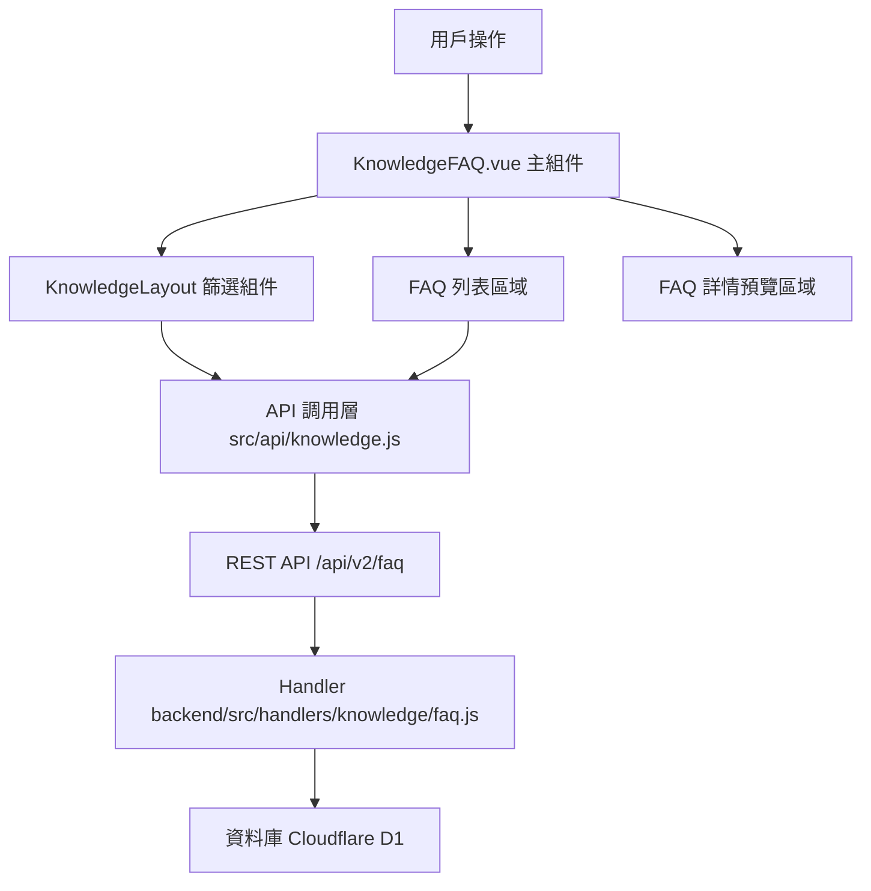

# Design Document: BR10.1: FAQ 列表

## Overview

FAQ 列表展示、查詢、篩選功能

本功能是知識管理系統的核心模組之一，提供統一的 FAQ 查看、查詢、篩選界面，幫助員工快速找到目標 FAQ、了解常見問題的解答。

## Steering Document Alignment

### Technical Standards (tech.md)

遵循以下技術標準：
- 使用 Vue 3 Composition API 開發前端組件
- 使用 Ant Design Vue 作為 UI 組件庫
- 使用 RESTful API 進行前後端通信
- 使用 Cloudflare Workers 作為後端運行環境
- 使用 Cloudflare D1 (SQLite) 作為資料庫
- 遵循統一的錯誤處理和回應格式
- 使用參數化查詢防止 SQL 注入
- 實現 FAQ 篩選和搜尋機制

### Project Structure (structure.md)

遵循以下項目結構：
- 前端組件位於 `src/views/knowledge/` 和 `src/components/knowledge/`
- API 調用層位於 `src/api/knowledge.js`
- 後端 Handler 位於 `backend/src/handlers/knowledge/faq.js`
- 資料庫 Migration 位於 `backend/migrations/`
- 遵循命名規範：組件使用 PascalCase，Handler 使用 kebab-case

## Code Reuse Analysis

### Existing Components to Leverage

- **KnowledgeFAQ.vue**: 現有的 FAQ 列表和詳情展示組件（需增強篩選功能）
- **KnowledgeLayout.vue**: 知識庫布局組件，包含篩選區域（已有，需增強）
- **FAQEditDrawer.vue**: FAQ 編輯抽屜組件（已有）

### Integration Points

- **handleGetFAQList**: 處理 FAQ 列表 API 請求，位於 `backend/src/handlers/knowledge/faq.js`
  - API 路由: `GET /api/v2/faq`（支援查詢參數篩選）
- **InternalFAQ 表**: 存儲 FAQ 基本資訊
- **Services 表**: 存儲服務類型資訊（用於分類篩選）
- **Clients 表**: 存儲客戶資訊（用於客戶篩選）
- **Users 表**: 存儲使用者資訊（用於 JOIN 取得建立者名稱）

## Architecture

### Component Architecture

前端採用 Vue 3 Composition API，組件結構清晰，職責單一：



### Modular Design Principles

- **Single File Responsibility**: 每個組件文件只處理一個功能模組
- **Component Isolation**: 組件之間通過 props 和 events 通信，保持獨立
- **Service Layer Separation**: API 調用與業務邏輯分離，使用統一的 API 工具函數
- **Utility Modularity**: 工具函數按功能分組，可在多處重用

## Components and Interfaces

### KnowledgeFAQ

- **Purpose**: FAQ 列表和詳情頁面的主組件，整合所有子組件
- **Location**: `src/views/knowledge/KnowledgeFAQ.vue`
- **Interfaces**: 無（頁面組件，無對外接口）
- **Props**: 無
- **Events**: 無
- **Dependencies**: 
  - Ant Design Vue 組件庫
  - Pinia Store (知識庫狀態管理)
  - FAQEditDrawer 組件
  - Vue Router（用於路由導航）
- **Reuses**: 
  - KnowledgeLayout 篩選組件（通過父組件）
  - API 調用工具函數 (`@/api/knowledge.js`)
  - 日期格式化工具
  - 錯誤處理工具函數
- **Features**:
  - 處理篩選條件的變更
  - 處理 FAQ 列表的點擊事件，顯示 FAQ 詳情
  - 在組件掛載時載入 FAQ 列表
  - 處理分頁變更
  - 處理錯誤狀態和空狀態顯示

### KnowledgeLayout (篩選區域)

- **Purpose**: 知識庫篩選組件，提供搜尋和篩選功能
- **Location**: `src/views/knowledge/KnowledgeLayout.vue`
- **Interfaces**: 通過 filters 和 events 與子組件通信
- **Props**: 
  - `filters` (Object): 當前篩選條件
- **Events**: 
  - `filter-change`: 篩選條件變更時觸發
- **Dependencies**: Ant Design Vue 組件庫
- **Reuses**: 
  - 服務列表、客戶列表、標籤列表（從 store 獲取）
- **Features**:
  - 關鍵詞搜尋
  - 服務類型分類篩選
  - 適用層級篩選
  - 客戶篩選
  - 標籤篩選

## Data Models

### FAQ (常見問題)

```
- faq_id: INTEGER (主鍵)
- question: TEXT (問題，必填)
- answer: TEXT (答案，必填，富文本)
- category: TEXT (服務類型分類，必填)
- scope: TEXT (適用層級，必填，值為 'service' 或 'task')
- client_id: INTEGER (客戶 ID，可選)
- tags: TEXT (標籤，可選，逗號分隔)
- created_by: INTEGER (建立者 ID，必填)
- created_at: TEXT (建立時間)
- updated_at: TEXT (最後更新時間)
- is_deleted: BOOLEAN (是否刪除，預設 0)
```

### API 回應格式

#### 成功回應

```json
{
  "data": [
    {
      "faq_id": 1,
      "question": "問題內容",
      "answer": "答案內容",
      "category": "服務類型 ID",
      "scope": "service",
      "client_id": null,
      "tags": ["標籤1", "標籤2"],
      "created_by": 1,
      "created_by_name": "建立者名稱",
      "created_at": "2024-01-15T14:30:00Z",
      "updated_at": "2024-01-15T14:30:00Z"
    }
  ],
  "meta": {
    "page": 1,
    "perPage": 20,
    "total": 100
  }
}
```

#### 錯誤回應

```json
{
  "error": {
    "code": "VALIDATION_ERROR",
    "message": "分頁參數無效",
    "details": {
      "per_page": "每頁筆數不能超過 100"
    }
  }
}
```

**注意**: 
- `tags` 欄位在資料庫中為 TEXT 類型（逗號分隔），API 回應時應轉換為陣列格式
- `category` 欄位在資料庫中為 TEXT 類型，存儲服務類型 ID
- 列表查詢時應過濾 `is_deleted = 0` 的記錄
- 當查詢結果為空時，`data` 應為空陣列 `[]`，`meta.total` 應為 `0`

## Error Handling

### Error Scenarios

1. **API 請求失敗**:
   - **Handling**: 顯示錯誤訊息，保持當前列表狀態
   - **User Impact**: 用戶看到錯誤提示，可以重試

2. **篩選條件無結果**:
   - **Handling**: 顯示空狀態提示，提供清除篩選條件的選項
   - **User Impact**: 用戶看到「無結果」提示，可以調整篩選條件或清除篩選

3. **分頁超出範圍**:
   - **Handling**: 自動調整到最後一頁或第一頁
   - **User Impact**: 用戶看到調整後的頁面

4. **資料庫查詢失敗**:
   - **Handling**: 記錄錯誤日誌，返回錯誤訊息給前端
   - **User Impact**: 用戶看到錯誤提示，可以重試操作

5. **參數驗證失敗**:
   - **Handling**: 返回 400 Bad Request 錯誤，包含具體的驗證錯誤訊息
   - **User Impact**: 用戶看到具體的錯誤提示，可以修正輸入

## Testing Strategy

### Unit Testing

- 測試 FAQ 列表載入邏輯
- 測試篩選條件處理邏輯
- 測試分頁邏輯
- 測試 API 函數的參數處理和錯誤處理
- 測試 Store 的狀態管理邏輯

### Integration Testing

- 測試 API 調用和數據處理
- 測試篩選條件與 API 參數的對應關係
- 測試資料庫查詢邏輯（包含 JOIN 查詢）
- 測試分頁參數的正確傳遞和處理

### End-to-End Testing

- 測試完整的 FAQ 列表查看流程
- 測試搜尋和篩選功能（包含各種篩選條件的組合）
- 測試分頁功能（包含頁面切換和每頁筆數調整）
- 測試錯誤處理（API 失敗、無結果等場景）

