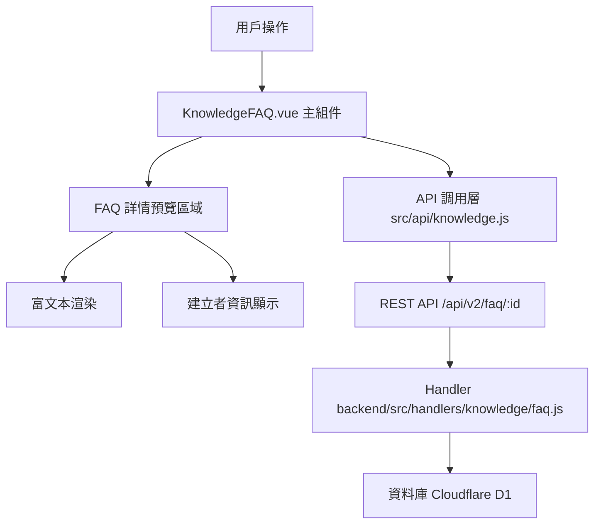

# Design Document: BR10.2: FAQ 詳情

## Overview

FAQ 詳情展示功能

本功能是知識管理系統的核心模組之一，提供 FAQ 的完整資訊展示，幫助員工查看 FAQ 的詳細內容，包括問題、答案、分類、標籤、建立者等資訊。

## Steering Document Alignment

### Technical Standards (tech.md)

遵循以下技術標準：
- 使用 Vue 3 Composition API 開發前端組件
- 使用 Ant Design Vue 作為 UI 組件庫
- 使用 RESTful API 進行前後端通信
- 使用 Cloudflare Workers 作為後端運行環境
- 使用 Cloudflare D1 (SQLite) 作為資料庫
- 遵循統一的錯誤處理和回應格式
- 使用參數化查詢防止 SQL 注入
- 富文本內容需要進行 XSS 防護

### Project Structure (structure.md)

遵循以下項目結構：
- 前端組件位於 `src/views/knowledge/` 和 `src/components/knowledge/`
- API 調用層位於 `src/api/knowledge.js`
- 後端 Handler 位於 `backend/src/handlers/knowledge/faq.js`
- 資料庫 Migration 位於 `backend/migrations/`
- 遵循命名規範：組件使用 PascalCase，Handler 使用 kebab-case

## Code Reuse Analysis

### Existing Components to Leverage

- **KnowledgeFAQ.vue**: 現有的 FAQ 列表和詳情展示組件（需增強詳情顯示）
- **RichTextEditor.vue**: 富文本編輯器組件（用於顯示富文本內容）

### Integration Points

- **handleGetFAQDetail**: 處理 FAQ 詳情 API 請求，位於 `backend/src/handlers/knowledge/faq.js`
  - API 路由: `GET /api/v2/faq/:id`
- **InternalFAQ 表**: 存儲 FAQ 基本資訊
- **Users 表**: 存儲使用者資訊（用於 JOIN 取得建立者名稱）

## Architecture

### Component Architecture

前端採用 Vue 3 Composition API，組件結構清晰，職責單一：



### Modular Design Principles

- **Single File Responsibility**: 每個組件文件只處理一個功能模組
- **Component Isolation**: 組件之間通過 props 和 events 通信，保持獨立
- **Service Layer Separation**: API 調用與業務邏輯分離，使用統一的 API 工具函數
- **Utility Modularity**: 工具函數按功能分組，可在多處重用

## Components and Interfaces

### KnowledgeFAQ (詳情區域)

- **Purpose**: FAQ 詳情展示區域，顯示 FAQ 完整資訊
- **Location**: `src/views/knowledge/KnowledgeFAQ.vue`（詳情預覽區域）
- **Interfaces**: 
  - Props: `faqId` (number, required) - FAQ ID
  - Events: 無（僅展示組件）
  - Methods: `loadFAQDetail(faqId)` - 載入 FAQ 詳情
- **Dependencies**: 
  - Ant Design Vue 組件庫（Tag、Card、Typography 等）
  - Pinia Store (知識庫狀態管理)
  - API 調用層 (`src/api/knowledge.js`)
- **Reuses**: 
  - 日期格式化工具 (`src/utils/formatters.js`)
  - 富文本渲染工具（XSS 防護）
- **Features**:
  - 顯示 FAQ 問題
  - 顯示 FAQ 答案（富文本渲染，支援 HTML）
  - 顯示服務類型分類標籤
  - 顯示適用層級（服務層級/任務層級）
  - 顯示客戶（如果有）
  - 顯示標籤（多個標籤以 Tag 組件顯示）
  - 顯示建立者名稱和建立時間（格式：YYYY-MM-DD HH:mm）

### API Handler: handleGetFAQDetail

- **Purpose**: 處理 FAQ 詳情查詢請求，返回完整 FAQ 資訊
- **Location**: `backend/src/handlers/knowledge/faq.js`
- **Interfaces**:
  - Input: `GET /api/v2/faq/:id` (id: FAQ ID)
  - Output: JSON 回應，包含 FAQ 詳情和建立者名稱
- **Dependencies**:
  - Cloudflare D1 資料庫
  - 統一回應格式工具 (`backend/src/utils/response.js`)
- **Features**:
  - JOIN 查詢 Users 表取得建立者名稱
  - 參數化查詢防止 SQL 注入
  - 處理 FAQ 不存在的情況（返回 404）
  - 處理建立者資訊缺失的情況（返回 null 或「未知」）

## Data Models

### FAQ Detail Response

```json
{
  "data": {
    "faq_id": 1,
    "question": "問題內容",
    "answer": "答案內容（富文本 HTML）",
    "category": "服務類型 ID",
    "scope": "service",
    "client_id": null,
    "tags": ["標籤1", "標籤2"],
    "created_by": 1,
    "created_by_name": "建立者名稱",
    "created_at": "2024-01-15T14:30:00Z",
    "updated_at": "2024-01-15T14:30:00Z"
  }
}
```

## Error Handling

### Error Scenarios

1. **FAQ 不存在**:
   - **Handling**: 後端返回 404 錯誤，前端顯示「FAQ 不存在」訊息
   - **User Impact**: 用戶看到錯誤提示，可以返回列表頁面
   - **Implementation**: Handler 檢查查詢結果，如果為空則返回 404

2. **API 請求失敗**:
   - **Handling**: 前端捕獲錯誤，顯示錯誤訊息（如「載入失敗，請稍後再試」），保持當前狀態
   - **User Impact**: 用戶看到錯誤提示，可以重試或返回列表
   - **Implementation**: 使用 try-catch 捕獲 API 錯誤，顯示 Toast 提示

3. **建立者資訊缺失**:
   - **Handling**: 後端 JOIN 查詢結果為 null 時，返回 null 或空字串，前端顯示「未知」
   - **User Impact**: 用戶看到「未知」或空白，不影響其他資訊顯示
   - **Implementation**: 前端使用 `created_by_name || '未知'` 處理空值

4. **資料庫連接失敗**:
   - **Handling**: 後端返回 500 錯誤，前端顯示「伺服器錯誤，請稍後再試」
   - **User Impact**: 用戶看到錯誤提示，可以重試
   - **Implementation**: Handler 捕獲資料庫異常，返回 500 錯誤

5. **富文本內容包含惡意代碼**:
   - **Handling**: 前端使用 XSS 防護庫（如 DOMPurify）過濾 HTML 內容
   - **User Impact**: 用戶看到安全的富文本內容，不會執行惡意代碼
   - **Implementation**: 在渲染富文本前使用 DOMPurify.sanitize() 過濾

6. **日期格式錯誤**:
   - **Handling**: 日期格式化函數處理異常，返回原始字串或「日期格式錯誤」
   - **User Impact**: 用戶看到原始日期字串或錯誤提示
   - **Implementation**: 使用 try-catch 處理日期解析異常

## Testing Strategy

### Unit Testing

- **FAQ 詳情載入邏輯**:
  - 測試組件正確調用 API 函數
  - 測試組件正確處理 API 回應
  - 測試組件正確處理載入狀態

- **建立者資訊顯示邏輯**:
  - 測試建立者名稱正確顯示
  - 測試建立者資訊缺失時顯示「未知」
  - 測試建立者資訊為 null 時的處理

- **日期格式化邏輯**:
  - 測試日期格式化函數正確轉換 ISO 日期為 YYYY-MM-DD HH:mm 格式
  - 測試日期格式化函數處理無效日期
  - 測試日期格式化函數處理 null/undefined

- **富文本渲染邏輯**:
  - 測試富文本內容正確渲染
  - 測試 XSS 防護正確過濾惡意代碼
  - 測試富文本內容為空時的處理

### Integration Testing

- **API 調用和數據處理**:
  - 測試 API 函數正確調用後端端點
  - 測試 API 函數正確處理回應數據
  - 測試 API 函數正確處理錯誤回應

- **建立者名稱 JOIN 查詢**:
  - 測試後端 Handler 正確執行 JOIN 查詢
  - 測試後端 Handler 正確返回建立者名稱
  - 測試後端 Handler 處理建立者不存在的情況

- **Store 狀態管理**:
  - 測試 Store 正確更新 currentFAQ 狀態
  - 測試 Store 正確處理錯誤狀態
  - 測試 Store 正確處理載入狀態

### End-to-End Testing

- **完整的 FAQ 詳情查看流程**:
  - 測試用戶點擊 FAQ 列表項後正確跳轉到詳情頁面
  - 測試詳情頁面正確載入和顯示 FAQ 資訊
  - 測試所有欄位（問題、答案、分類、標籤、建立者、建立時間）正確顯示

- **富文本渲染功能**:
  - 測試富文本內容正確渲染（標題、段落、列表、表格等）
  - 測試富文本內容中的圖片正確顯示（如果有）
  - 測試富文本內容的樣式正確應用

- **建立者資訊顯示**:
  - 測試建立者名稱正確顯示（非 user_id）
  - 測試建立時間正確格式化為 YYYY-MM-DD HH:mm
  - 測試建立者資訊缺失時顯示「未知」

- **錯誤處理**:
  - 測試 FAQ 不存在時顯示錯誤提示
  - 測試 API 請求失敗時顯示錯誤提示
  - 測試用戶可以重試或返回列表

