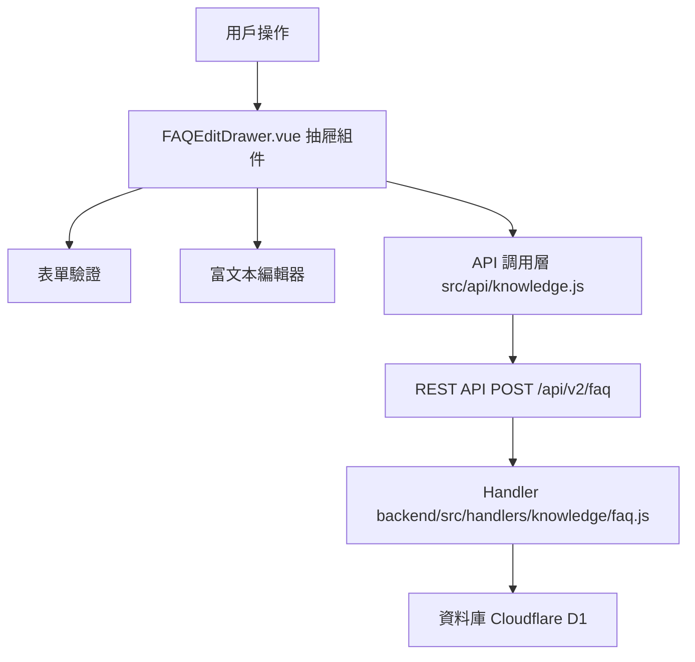

# Design Document: BR10.3: FAQ 建立

## Overview

FAQ 建立功能，支援快速建立新的 FAQ

本功能是知識管理系統的核心模組之一，提供建立新 FAQ 的功能，幫助員工快速建立 FAQ，記錄常見問題和解答，提升知識傳遞效率。

## Steering Document Alignment

### Technical Standards (tech.md)

遵循以下技術標準：
- 使用 Vue 3 Composition API 開發前端組件
- 使用 Ant Design Vue 作為 UI 組件庫
- 使用 RESTful API 進行前後端通信
- 使用 Cloudflare Workers 作為後端運行環境
- 使用 Cloudflare D1 (SQLite) 作為資料庫
- 遵循統一的錯誤處理和回應格式
- 使用參數化查詢防止 SQL 注入
- 前端輸入驗證和後端驗證
- 富文本內容需要進行 XSS 防護

### Project Structure (structure.md)

遵循以下項目結構：
- 前端組件位於 `src/components/knowledge/`
- API 調用層位於 `src/api/knowledge.js`
- 後端 Handler 位於 `backend/src/handlers/knowledge/faq.js`
- 資料庫 Migration 位於 `backend/migrations/`
- 遵循命名規範：組件使用 PascalCase，Handler 使用 kebab-case

## Code Reuse Analysis

### Existing Components to Leverage

- **FAQEditDrawer.vue**: 現有的 FAQ 編輯抽屜組件（可用於建立和編輯）
- **RichTextEditor.vue**: 富文本編輯器組件

### Integration Points

- **handleCreateFAQ**: 處理 FAQ 建立 API 請求，位於 `backend/src/handlers/knowledge/faq.js`
  - API 路由: `POST /api/v2/faq`
- **InternalFAQ 表**: 存儲 FAQ 基本資訊
- **Services 表**: 存儲服務類型資訊（用於分類選擇）
- **Clients 表**: 存儲客戶資訊（用於客戶選擇）
- **標籤系統**: 標籤作為字符串存儲在 FAQ 記錄中（逗號分隔），前端提供標籤輸入或選擇功能
  - 標籤來源：從現有 FAQ 記錄中提取已使用的標籤，或允許用戶自由輸入新標籤
  - 標籤選擇：前端可以顯示已存在的標籤供用戶選擇，同時支持輸入新標籤

## Architecture

### Component Architecture

前端採用 Vue 3 Composition API，組件結構清晰，職責單一：



### Modular Design Principles

- **Single File Responsibility**: 每個組件文件只處理一個功能模組
- **Component Isolation**: 組件之間通過 props 和 events 通信，保持獨立
- **Service Layer Separation**: API 調用與業務邏輯分離，使用統一的 API 工具函數
- **Utility Modularity**: 工具函數按功能分組，可在多處重用

## Components and Interfaces

### FAQEditDrawer

- **Purpose**: FAQ 建立和編輯抽屜組件
- **Location**: `src/components/knowledge/FAQEditDrawer.vue`
- **Props**: 
  - `visible` (Boolean): 抽屜顯示狀態
  - `faq` (Object, optional): FAQ 對象（建立時為 null）
- **Events**:
  - `@close`: 關閉抽屜
  - `@success`: 建立成功
  - `@update:visible`: 更新顯示狀態
- **Dependencies**: 
  - Ant Design Vue 組件庫
  - Pinia Store (知識庫狀態管理)
  - RichTextEditor 組件
- **Reuses**: 
  - 表單驗證工具
  - API 調用工具函數
- **Features**:
  - 表單欄位：問題、服務類型分類、適用層級、客戶、標籤、回答
  - 必填欄位驗證
  - 富文本編輯器
  - 表單提交和錯誤處理

### RichTextEditor

- **Purpose**: 富文本編輯器組件（現有組件，用於編輯 FAQ 答案）
- **Location**: `src/components/knowledge/RichTextEditor.vue`
- **Dependencies**: 
  - Quill 或類似富文本編輯器庫
- **Reuses**: 
  - 現有組件，無需修改

## Data Models

### FAQ Create Request

```json
{
  "question": "問題內容",
  "category": "服務類型 ID",
  "scope": "service",
  "client_id": null,
  "tags": ["標籤1", "標籤2"],
  "answer": "答案內容（富文本 HTML）"
}
```

**注意**: 
- `tags` 在前端以數組格式發送，後端會轉換為逗號分隔字串存儲到資料庫
- `category` 為服務類型 ID（數字或字串）
- `scope` 為 "service"（服務層級）或 "task"（任務層級）
- `client_id` 為可選欄位，不選擇時為 null

### FAQ Create Response

```json
{
  "data": {
    "faq_id": 1
  },
  "message": "已創建"
}
```

## Error Handling

### Error Scenarios

1. **必填欄位驗證失敗**:
   - **Handling**: 前端表單驗證顯示錯誤訊息，阻止提交
   - **User Impact**: 用戶看到錯誤提示，需要修正輸入

2. **後端驗證失敗**:
   - **Handling**: 返回 422 錯誤，顯示驗證錯誤訊息
   - **User Impact**: 用戶看到錯誤提示，需要修正輸入

3. **API 請求失敗**:
   - **Handling**: 顯示錯誤訊息，保持表單狀態
   - **User Impact**: 用戶看到錯誤提示，可以重試

## Testing Strategy

### Unit Testing

- 測試表單驗證邏輯
- 測試表單數據處理邏輯

### Integration Testing

- 測試 API 調用和數據處理
- 測試必填欄位驗證

### End-to-End Testing

- 測試完整的 FAQ 建立流程
- 測試表單驗證功能
- 測試錯誤處理

