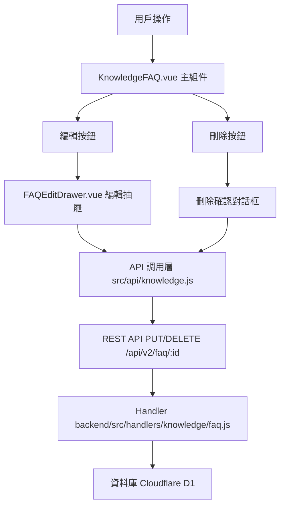

# Design Document: BR10.4: FAQ 編輯與刪除

## Overview

FAQ 編輯與刪除功能，支援更新和刪除現有 FAQ

本功能是知識管理系統的核心模組之一，提供編輯和刪除現有 FAQ 的功能，幫助員工更新 FAQ 內容、修正錯誤，並管理不再需要的 FAQ。

## Steering Document Alignment

### Technical Standards (tech.md)

遵循以下技術標準：
- 使用 Vue 3 Composition API 開發前端組件
- 使用 Ant Design Vue 作為 UI 組件庫
- 使用 RESTful API 進行前後端通信
- 使用 Cloudflare Workers 作為後端運行環境
- 使用 Cloudflare D1 (SQLite) 作為資料庫
- 遵循統一的錯誤處理和回應格式
- 使用參數化查詢防止 SQL 注入
- 前端輸入驗證和後端驗證
- 權限檢查必須在後端執行
- 富文本內容需要進行 XSS 防護

### Project Structure (structure.md)

遵循以下項目結構：
- 前端組件位於 `src/components/knowledge/` 和 `src/views/knowledge/`
- API 調用層位於 `src/api/knowledge.js`
- 後端 Handler 位於 `backend/src/handlers/knowledge/faq.js`
- 資料庫 Migration 位於 `backend/migrations/`
- 遵循命名規範：組件使用 PascalCase，Handler 使用 kebab-case

## Code Reuse Analysis

### Existing Components to Leverage

- **FAQEditDrawer.vue**: 現有的 FAQ 編輯抽屜組件（可用於建立和編輯）
- **KnowledgeFAQ.vue**: FAQ 列表和詳情組件（包含編輯和刪除按鈕）
- **RichTextEditor.vue**: 富文本編輯器組件

### Integration Points

- **handleUpdateFAQ**: 處理 FAQ 更新 API 請求，位於 `backend/src/handlers/knowledge/faq.js`
  - API 路由: `PUT /api/v2/faq/:id`
- **handleDeleteFAQ**: 處理 FAQ 刪除 API 請求，位於 `backend/src/handlers/knowledge/faq.js`
  - API 路由: `DELETE /api/v2/faq/:id`
- **InternalFAQ 表**: 存儲 FAQ 基本資訊

## Architecture

### Component Architecture

前端採用 Vue 3 Composition API，組件結構清晰，職責單一：



### Modular Design Principles

- **Single File Responsibility**: 每個組件文件只處理一個功能模組
- **Component Isolation**: 組件之間通過 props 和 events 通信，保持獨立
- **Service Layer Separation**: API 調用與業務邏輯分離，使用統一的 API 工具函數
- **Utility Modularity**: 工具函數按功能分組，可在多處重用

## Components and Interfaces

### KnowledgeFAQ (編輯和刪除按鈕)

- **Purpose**: FAQ 詳情區域的操作按鈕
- **Location**: `src/views/knowledge/KnowledgeFAQ.vue`
- **Interfaces**: 
  - `handleEdit()`: 打開編輯抽屜
  - `handleDelete()`: 顯示刪除確認對話框並執行刪除
  - `checkPermission()`: 檢查當前用戶是否有編輯/刪除權限
- **Dependencies**: 
  - Ant Design Vue 組件庫（Modal, Button）
  - Pinia Store (知識庫狀態管理)
  - API 調用層 (`src/api/knowledge.js`)
- **Reuses**: 
  - `FAQEditDrawer.vue`: 編輯抽屜組件
  - `useKnowledgeStore`: 知識庫狀態管理
  - `updateFAQ`, `deleteFAQ`: API 調用函數

### FAQEditDrawer

- **Purpose**: FAQ 編輯抽屜組件
- **Location**: `src/components/knowledge/FAQEditDrawer.vue`
- **Interfaces**: 
  - `open(faq)`: 打開編輯抽屜並預填 FAQ 資訊
  - `close()`: 關閉編輯抽屜
  - `submit()`: 提交表單並調用更新 API
  - `validate()`: 驗證表單必填欄位
- **Props**: 
  - `visible` (Boolean): 抽屜顯示狀態
  - `faq` (Object, required): FAQ 對象
- **Events**:
  - `@close`: 關閉抽屜
  - `@success`: 更新成功
  - `@update:visible`: 更新顯示狀態
- **Dependencies**: 
  - Ant Design Vue 組件庫（Drawer, Form, Input, Select）
  - RichTextEditor 組件
  - API 調用層 (`src/api/knowledge.js`)
- **Reuses**: 
  - `RichTextEditor.vue`: 富文本編輯器組件
  - `updateFAQ`: API 調用函數
  - Ant Design Vue Form 驗證機制

## Data Models

### FAQ Update Request

```json
{
  "question": "問題內容",
  "category": 1,
  "scope": "service",
  "client_id": null,
  "tags": ["標籤1", "標籤2"],
  "answer": "答案內容（富文本 HTML）"
}
```

**欄位說明**:
- `question` (string, required): 問題內容，最大長度 200 字符
- `category` (number, required): 服務類型 ID
- `scope` (string, required): 適用層級，值為 "service" 或 "task"
- `client_id` (number|null, optional): 客戶 ID，可選
- `tags` (array<string>, optional): 標籤列表，可選
- `answer` (string, required): 答案內容，富文本 HTML 格式

### FAQ Update Response

```json
{
  "data": {
    "faq_id": 1
  },
  "message": "已更新"
}
```

### FAQ Delete Response

```json
{
  "data": {
    "faq_id": 1
  },
  "message": "已刪除"
}
```

## Error Handling

### Error Scenarios

1. **權限不足**:
   - **Handling**: 返回 403 錯誤，顯示「無權編輯/刪除此 FAQ」訊息
   - **User Impact**: 用戶看到錯誤提示

2. **FAQ 不存在**:
   - **Handling**: 返回 404 錯誤，顯示「FAQ 不存在」訊息
   - **User Impact**: 用戶看到錯誤提示

3. **必填欄位驗證失敗**:
   - **Handling**: 前端表單驗證顯示錯誤訊息，阻止提交
   - **User Impact**: 用戶看到錯誤提示，需要修正輸入

4. **後端驗證失敗**:
   - **Handling**: 返回 422 錯誤，顯示驗證錯誤訊息
   - **User Impact**: 用戶看到錯誤提示，需要修正輸入

5. **API 請求失敗**:
   - **Handling**: 顯示錯誤訊息，保持表單狀態
   - **User Impact**: 用戶看到錯誤提示，可以重試

## Testing Strategy

### Unit Testing

- 測試表單驗證邏輯
- 測試權限檢查邏輯
- 測試表單數據處理邏輯

### Integration Testing

- 測試 API 調用和數據處理
- 測試權限檢查
- 測試必填欄位驗證

### End-to-End Testing

- 測試完整的 FAQ 編輯流程
- 測試完整的 FAQ 刪除流程
- 測試權限控制功能
- 測試表單驗證功能
- 測試錯誤處理

