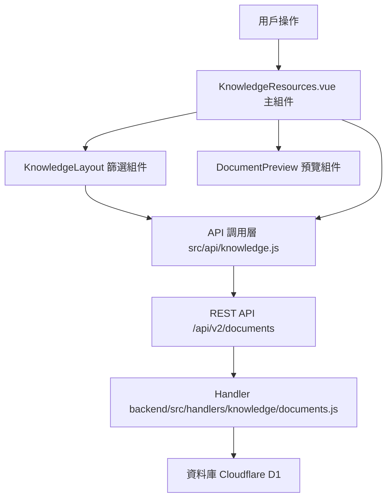

# Design Document: BR11.1: 資源列表

## Overview

資源列表功能是資源管理系統的核心模組之一，提供統一的資源查看、查詢、篩選界面。本功能採用雙欄布局設計（左側列表、右側預覽），支援多種篩選條件（服務類型、層級、客戶、日期、標籤）和關鍵詞搜尋，幫助員工快速找到目標資源、查看資源信息，並通過多種篩選條件精確定位資源。功能整合了現有的資源預覽組件和知識庫布局組件，通過 RESTful API 與後端通信，實現資源列表的展示、篩選、搜尋和分頁功能。

## Steering Document Alignment

### Technical Standards (tech.md)

遵循以下技術標準：
- 使用 Vue 3 Composition API 開發前端組件
- 使用 Ant Design Vue 作為 UI 組件庫
- 使用 RESTful API 進行前後端通信
- 使用 Cloudflare Workers 作為後端運行環境
- 使用 Cloudflare D1 (SQLite) 作為資料庫
- 遵循統一的錯誤處理和回應格式
- 使用參數化查詢防止 SQL 注入

### Project Structure (structure.md)

遵循以下項目結構：
- 前端組件位於 `src/views/knowledge/` 和 `src/components/knowledge/`
- API 調用層位於 `src/api/knowledge.js`
- 後端 Handler 位於 `backend/src/handlers/knowledge/`
- 資料庫 Migration 位於 `backend/migrations/`
- 遵循命名規範：組件使用 PascalCase，Handler 使用 kebab-case

## Code Reuse Analysis

本功能將重用現有的組件和工具，減少重複開發，保持代碼一致性。

### Existing Components to Leverage

- **KnowledgeResources.vue**: 資源列表主頁面（已有，需增強）
  - 重用方式：擴展現有組件，添加列表收起/展開功能，整合篩選和預覽功能
  - 增強點：添加雙欄布局、列表收起/展開、分頁功能
  
- **DocumentUploadDrawer.vue**: 上傳抽屜組件（已有）
  - 重用方式：在資源列表頁面中保留上傳功能入口
  - 用途：允許用戶在查看列表時上傳新資源
  
- **DocumentPreview.vue**: 資源預覽組件（已有）
  - 重用方式：在右側預覽區域直接使用現有預覽組件
  - 用途：顯示選中資源的詳細信息和預覽內容
  
- **KnowledgeLayout.vue**: 知識庫布局組件（已有，包含篩選功能）
  - 重用方式：整合現有篩選功能，擴展支援所有篩選條件
  - 增強點：添加日期篩選、標籤篩選、客戶篩選功能

### Integration Points

- **handleGetDocumentsList**: 處理資源列表 API 請求，位於 `backend/src/handlers/knowledge/documents.js`
  - API 路由: `GET /api/v2/documents`（支援查詢參數篩選）
  - 重用方式：擴展現有 Handler，添加多種篩選條件支援
  - 增強點：添加關鍵詞搜尋、多種篩選條件、分頁功能
  
- **InternalDocuments 表**: 存儲資源基本資訊
  - 重用方式：直接查詢現有表結構，無需修改
  - 用途：提供資源列表數據來源
  
- **Services 表**: 存儲服務類型資訊
  - 重用方式：查詢服務類型列表用於篩選選項
  - 用途：提供服務類型篩選選項
  
- **Clients 表**: 存儲客戶資訊
  - 重用方式：查詢客戶列表用於篩選選項
  - 用途：提供客戶篩選選項

## Architecture

### Component Architecture

前端採用 Vue 3 Composition API，組件結構清晰，職責單一：



### Modular Design Principles

- **Single File Responsibility**: 每個組件文件只處理一個功能模組
- **Component Isolation**: 組件之間通過 props 和 events 通信，保持獨立
- **Service Layer Separation**: API 調用與業務邏輯分離，使用統一的 API 工具函數
- **Utility Modularity**: 工具函數按功能分組，可在多處重用

## Components and Interfaces

### KnowledgeResources

- **Purpose**: 資源列表頁面的主組件，整合列表和預覽功能
- **Location**: `src/views/knowledge/KnowledgeResources.vue`
- **Interfaces**: 無（頁面組件，無對外接口）
- **Props**: 無
- **Events**: 無
- **Dependencies**: 
  - Ant Design Vue 組件庫
  - Pinia Store (資源狀態管理)
  - DocumentPreview 組件
- **Reuses**: 
  - DocumentPreview 預覽組件
  - API 調用工具函數 (`@/utils/apiHelpers`)
  - 日期格式化工具 (`@/utils/formatters`)

### KnowledgeLayout

- **Purpose**: 知識庫布局組件，包含篩選功能
- **Location**: `src/views/knowledge/KnowledgeLayout.vue`
- **Interfaces**: 
  - 提供篩選條件狀態管理
  - 暴露篩選方法給子組件使用
- **Props**: 無
- **Events**: 
  - `filter-change`: 篩選條件變更時觸發，傳遞篩選參數對象
- **Dependencies**: 
  - Ant Design Vue 組件庫
  - Pinia Store (知識庫狀態管理)
- **Reuses**: 
  - API 調用工具函數 (`@/api/knowledge.js`)

## Data Models

### Document Resource

```
- document_id: INTEGER (主鍵)
- title: TEXT (標題)
- description: TEXT (描述)
- file_name: TEXT (檔案名稱)
- file_url: TEXT (檔案 URL)
- file_size: INTEGER (檔案大小)
- file_type: TEXT (檔案類型)
- category: INTEGER (服務類型 ID)
- scope: TEXT (適用層級: service/task)
- client_id: INTEGER (客戶 ID，可選)
- doc_year: INTEGER (年份，可選)
- doc_month: INTEGER (月份，可選)
- tags: TEXT (標籤，逗號分隔)
- uploaded_by: INTEGER (上傳者 ID)
- created_at: TEXT (創建時間)
- updated_at: TEXT (更新時間)
- is_deleted: INTEGER (是否刪除: 0/1)
```

## Error Handling

### Error Scenarios

1. **API 請求失敗**
   - **Handling**: 顯示錯誤提示，記錄錯誤日誌
   - **User Impact**: 用戶看到錯誤提示，可以重試

2. **篩選條件無結果**
   - **Handling**: 顯示空狀態提示
   - **User Impact**: 用戶看到「無結果」提示，可以調整篩選條件

3. **列表載入超時**
   - **Handling**: 顯示超時提示，提供重試按鈕
   - **User Impact**: 用戶可以點擊重試按鈕重新載入

## Testing Strategy

### Unit Testing
- 測試篩選邏輯的正確性
- 測試搜尋功能的準確性
- 測試分頁功能的穩定性

### Integration Testing
- 測試 API 調用的完整性
- 測試組件之間的數據流
- 測試篩選條件與列表的同步

### End-to-End Testing
- 測試完整的用戶流程：打開列表 → 搜尋 → 篩選 → 查看詳情
- 測試列表收起/展開功能
- 測試分頁切換功能

