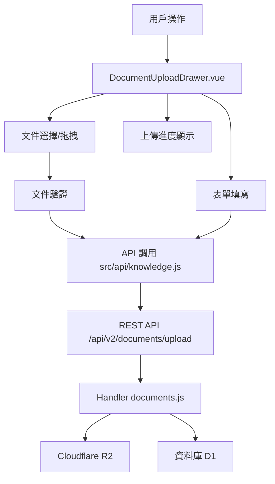

# Design Document: BR11.2: 資源上傳

## Overview

資源上傳功能，支援單個和多個文件同時上傳、拖拽上傳、進度顯示等功能。

## Steering Document Alignment

### Technical Standards (tech.md)

遵循以下技術標準：
- 使用 Vue 3 Composition API 開發前端組件
- 使用 Ant Design Vue 作為 UI 組件庫
- 使用 RESTful API 進行前後端通信
- 文件存儲於 Cloudflare R2

### Project Structure (structure.md)

遵循以下項目結構：
- 前端組件位於 `src/components/knowledge/DocumentUploadDrawer.vue`
- API 調用層位於 `src/api/knowledge.js`
- 後端 Handler 位於 `backend/src/handlers/knowledge/documents.js`

## Code Reuse Analysis

### Existing Components to Leverage

- **DocumentUploadDrawer.vue**: 上傳抽屜組件（已有，需增強多文件上傳功能）
- **Ant Design Vue Upload 組件**: 提供文件選擇、拖拽、進度顯示等基礎功能
- **表單驗證工具**: 使用現有的表單驗證邏輯

### Integration Points

- **API 層**: 
  - `src/api/knowledge.js` 中的 `uploadDocument` 函數
  - 需要擴展支援多文件上傳（循環調用或批量上傳）
  
- **後端 Handler**: 
  - `backend/src/handlers/knowledge/documents.js` 中的 `handleUploadDocument` 函數
  - API 路由: `POST /api/v2/documents/upload`
  - 需要確認支援多文件處理（單個請求多文件或前端循環調用）
  
- **資料庫**: 
  - `InternalDocuments` 表：存儲資源元數據
  - 每個文件對應一條記錄
  
- **文件存儲**: 
  - Cloudflare R2：存儲實際文件
  - 文件路徑格式：`documents/{year}/{month}/{uuid}/{filename}`
  
- **狀態管理**: 
  - `src/stores/knowledge.js`：管理資源列表狀態
  - 上傳成功後更新列表，新資源顯示在頂部

## Architecture

資源上傳功能採用前後端分離架構，前端負責用戶交互和文件驗證，後端負責文件存儲和元數據管理。

### Modular Design Principles

- **Single File Responsibility**: 每個文件應該處理一個特定的關注點或領域
  - `DocumentUploadDrawer.vue` 只負責上傳 UI 和用戶交互
  - `src/api/knowledge.js` 只負責 API 調用封裝
  - `backend/src/handlers/knowledge/documents.js` 只負責上傳業務邏輯
- **Component Isolation**: 創建小而專注的組件，而非大型單體文件
  - 上傳組件與表單組件分離
  - 文件驗證邏輯可提取為獨立工具函數
- **Service Layer Separation**: 分離數據訪問、業務邏輯和表現層
  - API 層負責請求封裝
  - Handler 層負責業務邏輯
  - 組件層負責 UI 展示
- **Utility Modularity**: 將工具函數拆分為專注的、單一用途的模組
  - 文件驗證工具獨立
  - 上傳進度計算工具獨立

### Component Architecture



## Components and Interfaces

### DocumentUploadDrawer

- **Purpose**: 資源上傳抽屜組件，提供文件上傳界面和表單填寫功能
- **Location**: `src/components/knowledge/DocumentUploadDrawer.vue`
- **Interfaces**: 
  - Props: `visible` (Boolean) - 是否顯示抽屜
  - Events: `close` - 關閉抽屜時觸發，`success` - 上傳成功時觸發並傳遞上傳的資源列表
- **Dependencies**: 
  - Ant Design Vue 組件庫（Upload, Form, Input, Select 等）
  - Pinia Store (`useKnowledgeStore`)：用於更新資源列表
  - API 層 (`src/api/knowledge.js`)：調用上傳 API
- **Reuses**: 
  - Ant Design Vue Upload 組件的多文件上傳功能
  - 現有的表單驗證邏輯
  - 現有的 API 調用封裝

### uploadDocument API Function

- **Purpose**: 封裝文件上傳 API 調用
- **Location**: `src/api/knowledge.js`
- **Interfaces**: 
  - `uploadDocument(formData: FormData, onProgress?: (progress: number) => void): Promise<Document>`
- **Parameters**: 
  - `formData`: 包含文件和元數據的 FormData 對象
  - `onProgress`: 可選的上傳進度回調函數
- **Returns**: Promise 解析為上傳成功的資源對象
- **Dependencies**: 
  - Axios：用於 HTTP 請求
  - 後端 API：`POST /api/v2/documents/upload`
- **Reuses**: 
  - 現有的 API 調用封裝模式
  - Axios 的進度回調機制

### handleUploadDocument Handler

- **Purpose**: 處理文件上傳請求，將文件存儲到 R2 並保存元數據到 D1
- **Location**: `backend/src/handlers/knowledge/documents.js`
- **Interfaces**: 
  - `async function handleUploadDocument(request: Request, env: Env): Promise<Response>`
- **Parameters**: 
  - `request`: 包含 FormData 的 HTTP 請求
  - `env`: Cloudflare Workers 環境變數（包含 R2、D1 綁定）
- **Returns**: JSON 響應，包含上傳成功的資源信息
- **Dependencies**: 
  - Cloudflare R2：文件存儲
  - Cloudflare D1：元數據存儲
  - 文件驗證工具：驗證文件類型和大小
- **Reuses**: 
  - 現有的 Handler 處理模式
  - 現有的文件驗證工具
  - 現有的資料庫操作模式

## Data Models

### Upload Form Data

```
- title: string (必填)
- category: number (必填，服務類型 ID)
- scope: string (必填，service/task)
- client_id: number (可選)
- year: number (可選)
- month: number (可選)
- tags: string[] (可選)
- description: string (可選)
- file: File (必填，單個或多個)
```

## Error Handling

### Error Scenarios

1. **文件類型不符合要求**
   - **Handling**: 顯示錯誤提示，阻止上傳
   - **User Impact**: 用戶看到錯誤提示，需要選擇正確的文件

2. **文件大小超過限制**
   - **Handling**: 顯示錯誤提示，阻止上傳
   - **User Impact**: 用戶看到錯誤提示，需要選擇較小的文件

3. **上傳失敗**
   - **Handling**: 顯示錯誤提示，提供重試選項
   - **User Impact**: 用戶可以重試上傳

4. **網絡中斷**
   - **Handling**: 顯示網絡錯誤提示，提供重試選項（當前版本需要重新上傳）
   - **User Impact**: 用戶需要重新上傳文件

5. **表單驗證失敗**
   - **Handling**: 顯示具體的驗證錯誤信息，阻止上傳
   - **User Impact**: 用戶需要修正表單錯誤後才能上傳

6. **部分文件上傳失敗（多文件上傳）**
   - **Handling**: 顯示成功和失敗的文件列表，為失敗的文件提供重試選項
   - **User Impact**: 用戶可以針對失敗的文件進行重試，不影響已成功的文件

## Testing Strategy

### Unit Testing
- **測試文件驗證邏輯**: 測試文件類型驗證、文件大小驗證、錯誤提示
- **測試表單驗證邏輯**: 測試必填欄位驗證、可選欄位格式驗證
- **測試上傳進度計算**: 測試進度條更新邏輯、百分比計算
- **關鍵組件**: `DocumentUploadDrawer.vue` 中的驗證函數、進度計算函數

### Integration Testing
- **測試 API 調用的完整性**: 測試前端 API 調用與後端 Handler 的整合
- **測試多文件上傳的並發處理**: 測試多個文件同時上傳的處理邏輯
- **關鍵流程**: 文件選擇 → API 調用 → 後端處理 → 文件存儲 → 資料庫保存

### End-to-End Testing
- **完整上傳流程**: 測試完整的上傳流程：選擇文件 → 填寫表單 → 上傳 → 查看結果
- **用戶場景**: 
  - 單文件上傳成功場景
  - 多文件上傳成功場景
  - 拖拽上傳場景
  - 文件驗證失敗場景
  - 表單驗證失敗場景
  - 上傳失敗重試場景

