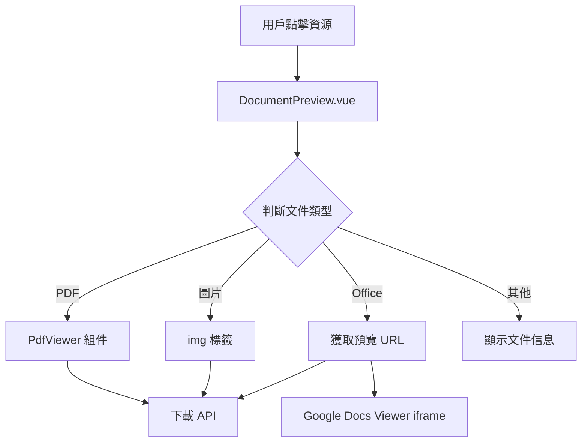

# Design Document: BR11.3: 資源預覽

## Overview

資源預覽功能，支援多種文件格式的線上預覽。

本功能提供統一的資源預覽界面，支援 PDF、圖片、Office 文件等多種格式的線上預覽，幫助員工快速查看資源內容。

## Steering Document Alignment

### Technical Standards (tech.md)

遵循以下技術標準：
- 使用 Vue 3 Composition API 開發前端組件
- 使用 Ant Design Vue 作為 UI 組件庫
- 使用 RESTful API 進行前後端通信
- 使用 Cloudflare R2 作為文件存儲
- 使用 Google Docs Viewer 進行 Office 文件預覽

### Project Structure (structure.md)

遵循以下項目結構：
- 前端組件位於 `src/components/knowledge/` 和 `src/components/shared/`
- API 調用層位於 `src/api/knowledge.js`
- 後端 Handler 位於 `backend/src/handlers/knowledge/`

## Code Reuse Analysis

### Existing Components to Leverage

- **DocumentPreview.vue**: 資源預覽組件（已有，需增強 Office 文件預覽）
- **PdfViewer.vue**: PDF 查看器組件（已有）

### Integration Points

- **handleDownloadDocument**: 下載資源 API，用於獲取文件內容，位於 `backend/src/handlers/knowledge/documents.js`
  - 用於 PDF 和圖片預覽時獲取文件內容
  - 返回文件 blob 數據
- **預覽 URL 生成 API**: `GET /api/v2/documents/:id/preview-url`（返回簽名 URL，需要新增）
  - 用於 Office 文件預覽時生成臨時公開 URL
  - 返回簽名 URL 和過期時間
- **Cloudflare R2**: 文件存儲
  - 存儲所有資源文件
  - 通過 R2 Signed URL API 生成臨時訪問 URL
- **Google Docs Viewer**: 外部預覽服務
  - 通過 iframe 嵌入，接收公開 URL 進行預覽
  - 支援 Word、Excel、PowerPoint 格式

## Architecture

本功能採用組件化架構，通過統一的 DocumentPreview 組件處理不同格式文件的預覽。組件根據文件類型動態選擇預覽方式：PDF 使用專用 PdfViewer 組件，圖片直接顯示，Office 文件通過 Google Docs Viewer 線上預覽，其他格式顯示文件信息。後端提供預覽 URL 生成 API，使用 R2 Signed URL 確保安全性。

### Modular Design Principles
- **Single File Responsibility**: 每個文件應該處理一個特定的關注點或領域
- **Component Isolation**: 創建小型、專注的組件，而不是大型單體文件
- **Service Layer Separation**: 分離數據訪問、業務邏輯和表示層
- **Utility Modularity**: 將工具函數拆分為專注的、單一用途的模組

### Component Architecture



## Components and Interfaces

### DocumentPreview

- **Purpose**: 資源預覽組件，統一處理不同格式文件的預覽
- **Location**: `src/components/knowledge/DocumentPreview.vue`
- **Interfaces**: 
  - Props: `document` (Object) - 資源對象，包含 id、filename、fileType 等屬性
  - Events: `close` - 關閉預覽事件
  - Slots: 無
- **Dependencies**: 
  - PdfViewer 組件（PDF 預覽）
  - Google Docs Viewer（Office 文件預覽）
  - API 調用函數（`getPreviewUrl`、`downloadDocument`）
- **Reuses**: 
  - `PdfViewer.vue` 組件（已有）
  - `src/api/knowledge.js` 中的 API 調用函數
- **Methods**:
  - `loadDocument()`: 載入資源內容，根據文件類型選擇預覽方式
  - `handleDownload()`: 下載資源
  - `handleRetry()`: 重試載入
  - `getFileType()`: 判斷文件類型（PDF、圖片、Office、其他）
  - `loadPreviewUrl()`: 為 Office 文件獲取預覽 URL

### PdfViewer

- **Purpose**: PDF 文件預覽組件
- **Location**: `src/components/shared/PdfViewer.vue`
- **Interfaces**: 
  - Props: `url` (String) - PDF 文件 URL
  - Events: `error` - 載入錯誤事件
  - Slots: 無
- **Dependencies**: 
  - PDF.js 庫（或瀏覽器原生 PDF 查看器）
- **Reuses**: 
  - 現有 PdfViewer 組件
- **Methods**:
  - `loadPdf()`: 載入 PDF 文件
  - `handleError()`: 處理載入錯誤

## Data Models

### Document Object

```
{
  id: number (資源 ID)
  filename: string (文件名)
  fileType: string (文件類型/擴展名)
  fileSize: number (文件大小，單位：字節)
  [其他屬性...]
}
```

### Preview URL Response

```
{
  previewUrl: string (簽名 URL，過期時間 1 小時)
  expiresAt: string (過期時間，ISO 8601 格式)
}
```

## Error Handling

### Error Scenarios

1. **文件載入失敗**
   - **Handling**: 顯示錯誤提示，提供重試按鈕
   - **User Impact**: 用戶看到錯誤提示，可以重試
   - **Error Types**: 網絡錯誤、文件不存在、權限不足

2. **預覽 URL 生成失敗**
   - **Handling**: 顯示錯誤提示，提供下載按鈕
   - **User Impact**: 用戶可以下載文件查看
   - **Error Types**: R2 API 錯誤、權限驗證失敗、文件不存在

3. **文件格式不支持預覽**
   - **Handling**: 顯示文件信息，提供下載按鈕
   - **User Impact**: 用戶看到文件信息，可以下載
   - **Error Types**: 不支持的文件格式

4. **Google Docs Viewer 載入失敗**
   - **Handling**: 顯示錯誤提示，提供下載按鈕作為降級方案
   - **User Impact**: 用戶可以下載文件查看
   - **Error Types**: 網絡錯誤、Google 服務不可用、文件過大

## Testing Strategy

### Unit Testing
- **測試文件類型判斷邏輯**: 測試 `getFileType()` 方法對不同文件擴展名的識別
- **測試預覽 URL 生成邏輯**: 測試後端 handler 生成簽名 URL 的正確性
- **測試組件方法**: 測試 DocumentPreview 組件的各個方法（loadDocument、handleRetry 等）
- **關鍵組件**: DocumentPreview.vue、handleGetPreviewUrl handler

### Integration Testing
- **測試 API 調用的完整性**: 測試前端 API 調用函數與後端 API 的集成
- **測試不同文件格式的預覽**: 測試 PDF、圖片、Office 文件等不同格式的預覽流程
- **測試錯誤處理**: 測試各種錯誤情況下的 API 響應和前端處理
- **關鍵流程**: 預覽 URL 生成 → 前端獲取 → 預覽顯示

### End-to-End Testing
- **測試完整的預覽流程**: 點擊資源 → 載入預覽 → 顯示內容
- **測試用戶場景**: 
  - 用戶點擊 PDF 文件並成功預覽
  - 用戶點擊圖片文件並成功預覽
  - 用戶點擊 Office 文件並成功預覽
  - 用戶點擊不支持預覽的文件並看到文件信息
  - 預覽失敗時的錯誤處理和重試

