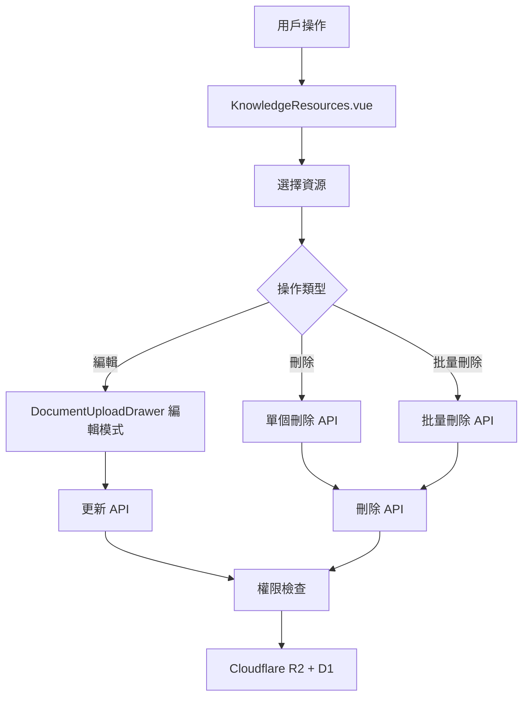

# Design Document: BR11.4: 資源管理

## Overview

資源管理功能，支援編輯、刪除、批量刪除資源。

本功能提供資源的編輯、刪除、批量刪除等管理功能，幫助員工管理資源，確保資源信息的準確性和系統的整潔性。

## Steering Document Alignment

### Technical Standards (tech.md)

遵循以下技術標準：
- 使用 Vue 3 Composition API 開發前端組件
- 使用 Ant Design Vue 作為 UI 組件庫
- 使用 RESTful API 進行前後端通信
- 使用 Cloudflare Workers 作為後端運行環境
- 使用 Cloudflare D1 作為資料庫
- 使用 Cloudflare R2 作為文件存儲

### Project Structure (structure.md)

遵循以下項目結構：
- 前端組件位於 `src/views/knowledge/` 和 `src/components/knowledge/`
- API 調用層位於 `src/api/knowledge.js`
- 後端 Handler 位於 `backend/src/handlers/knowledge/`

## Code Reuse Analysis

### Existing Components to Leverage

- **KnowledgeResources.vue**: 資源列表主組件（已有，需增強批量刪除功能）
- **DocumentUploadDrawer.vue**: 上傳抽屜組件（已有，需增強編輯模式）

### Integration Points

- **handleUpdateDocument**: 更新資源 API，位於 `backend/src/handlers/knowledge/documents.js`
- **handleDeleteDocument**: 刪除資源 API，位於 `backend/src/handlers/knowledge/documents.js`
- **handleBatchDeleteDocuments**: 批量刪除 API，需要新增
- **Cloudflare R2**: 文件存儲（刪除舊文件）
- **InternalDocuments 表**: 存儲資源元數據

## Architecture

### Modular Design Principles
- **Single File Responsibility**: 每個文件應該處理一個特定的關注點或領域
- **Component Isolation**: 創建小而專注的組件，而非大型單體文件
- **Service Layer Separation**: 分離數據訪問、業務邏輯和表示層
- **Utility Modularity**: 將工具函數拆分為專注的、單一用途的模組

### Component Architecture



## Components and Interfaces

### KnowledgeResources

- **Purpose**: 資源列表主組件，包含刪除和批量刪除功能
- **Location**: `src/views/knowledge/KnowledgeResources.vue`
- **Methods**:
  - `handleDeleteDocument()`: 刪除單個資源
  - `handleBatchDelete()`: 批量刪除資源
  - `handleEditDocument()`: 打開編輯模式
- **Dependencies**: `src/api/knowledge.js`（API 調用）
- **Reuses**: Ant Design Vue 的 `Table`、`Button`、`Checkbox` 組件

### DocumentUploadDrawer

- **Purpose**: 上傳抽屜組件，支援編輯模式
- **Location**: `src/components/knowledge/DocumentUploadDrawer.vue`
- **Props**: 
  - `visible`: Boolean（是否顯示）
  - `editMode`: Boolean（是否為編輯模式）
  - `documentId`: Number（編輯模式的資源 ID）
- **Methods**:
  - `loadDocumentData()`: 載入現有資源數據（編輯模式）
  - `handleSave()`: 保存資源（創建或更新）
- **Dependencies**: `src/api/knowledge.js`（API 調用）
- **Reuses**: Ant Design Vue 的 `Drawer`、`Form`、`Upload` 組件

### API Layer

- **Purpose**: 封裝資源相關的 API 調用
- **Location**: `src/api/knowledge.js`
- **Methods**:
  - `updateDocument(id, data)`: 更新資源
  - `deleteDocument(id)`: 刪除單個資源
  - `batchDeleteDocuments(ids)`: 批量刪除資源
- **Dependencies**: Axios 實例

## Data Models

### Update Document Request

```
{
  title?: string
  description?: string
  category?: number
  tags?: string[]
  client_id?: number
  doc_year?: number
  doc_month?: number
  file?: File (可選，更換文件)
}
```

### Batch Delete Request

```
{
  documentIds: number[]
}
```

### Batch Delete Response

```
{
  success: number,        // 成功刪除的數量
  failed: number,         // 失敗的數量
  failedIds: number[],    // 失敗的資源 ID 列表
  errors: string[]        // 錯誤訊息列表
}
```

## Error Handling

### Error Scenarios

1. **權限不足**
   - **Handling**: 顯示錯誤提示，拒絕操作
   - **User Impact**: 用戶看到無權限提示

2. **更新失敗**
   - **Handling**: 顯示錯誤提示，提供重試選項
   - **User Impact**: 用戶可以重試操作

3. **批量刪除部分失敗**
   - **Handling**: 顯示成功和失敗的數量，列出失敗的資源
   - **User Impact**: 用戶了解哪些資源刪除成功，哪些失敗

4. **資源不存在**
   - **Handling**: 返回 404 錯誤，顯示資源不存在提示
   - **User Impact**: 用戶看到資源不存在的錯誤提示

5. **文件上傳失敗**
   - **Handling**: 保留原有文件，顯示上傳失敗錯誤
   - **User Impact**: 用戶可以重試上傳或取消操作

6. **網絡錯誤**
   - **Handling**: 顯示網絡錯誤提示，提供重試選項
   - **User Impact**: 用戶可以重試操作

## Testing Strategy

### Unit Testing
- 測試權限檢查邏輯（後端 Handler）
- 測試批量刪除邏輯（後端 Handler）
- 測試前端組件的狀態管理邏輯

### Integration Testing
- 測試 API 調用的完整性（前端 API 層與後端 Handler）
- 測試文件更換邏輯（R2 文件上傳和刪除）
- 測試權限檢查的端到端流程

### End-to-End Testing
- 測試完整的編輯流程：打開編輯 → 修改信息 → 保存 → 驗證更新
- 測試完整的刪除流程：選擇資源 → 確認刪除 → 查看結果 → 驗證軟刪除
- 測試批量刪除流程：選擇多個資源 → 批量刪除 → 查看結果 → 驗證部分失敗處理
- 測試權限控制：非上傳者嘗試編輯/刪除 → 驗證權限拒絕

