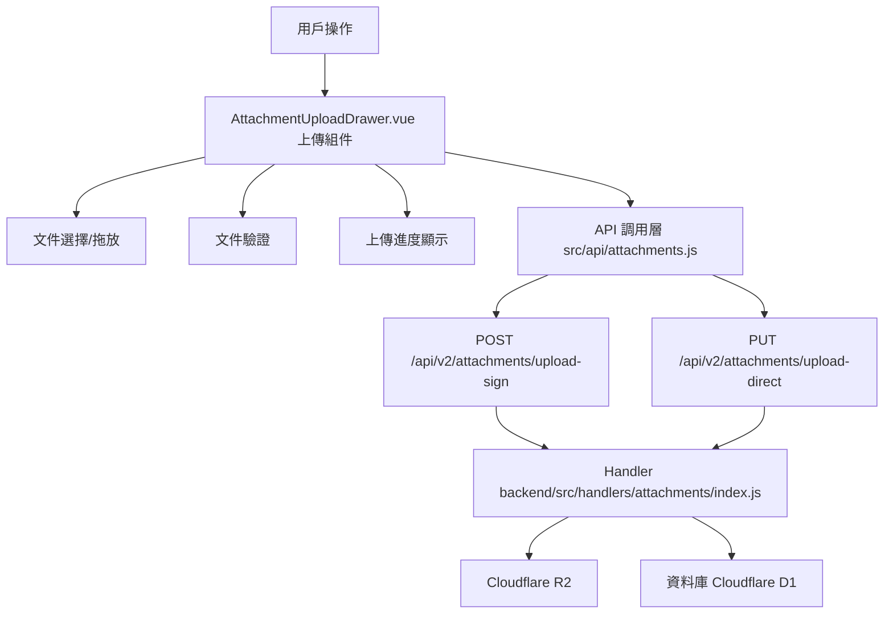

# Design Document: BR12.1: 附件上傳

## Overview

附件上傳功能，支持拖放/選檔上傳、多檔並行上傳、文件驗證和進度顯示

本功能是附件管理系統的核心模組之一，為全系統（任務、SOP、資源、收據等）提供統一的附件上傳能力。

## Steering Document Alignment

### Technical Standards (tech.md)

遵循以下技術標準：
- 使用 Vue 3 Composition API 開發前端組件
- 使用 Ant Design Vue 作為 UI 組件庫
- 使用 RESTful API 進行前後端通信
- 使用 Cloudflare Workers 作為後端運行環境
- 使用 Cloudflare R2 作為文件存儲
- 遵循統一的錯誤處理和回應格式
- 使用兩步上傳流程（先獲取簽名，再上傳文件）

### Project Structure (structure.md)

遵循以下項目結構：
- 前端組件位於 `src/components/knowledge/AttachmentUploadDrawer.vue`（現有）或 `src/components/attachments/`（新建）
- API 調用層位於 `src/api/attachments.js`（需新建）
- 後端 Handler 位於 `backend/src/handlers/attachments/index.js`（已存在，需更新文件大小限制為 25MB）
- 遵循命名規範：組件使用 PascalCase，Handler 使用 kebab-case

## Code Reuse Analysis

### Existing Components to Leverage

- **AttachmentUploadDrawer.vue**: 附件上傳抽屜組件（位於 `src/components/knowledge/AttachmentUploadDrawer.vue`，已有，需增強支持多檔並行上傳、文件大小限制更新為 25MB）
- **PageHeader.vue**: 用於頁面標題和操作按鈕區域

### Existing Utilities to Leverage

- **文件驗證工具函數**: 需要創建或擴展現有的文件驗證工具函數
  - 文件大小驗證（最大 25MB）
  - 文件類型驗證（PDF、Word、Excel、PowerPoint、圖片）
  - MIME 類型映射

### Integration Points

- **handleGetUploadSign**: 處理上傳簽名請求，位於 `backend/src/handlers/attachments/index.js`
  - API 路由: `POST /api/v2/attachments/upload-sign`
- **handleUploadDirect**: 處理直接上傳請求，位於 `backend/src/handlers/attachments/index.js`
  - API 路由: `PUT /api/v2/attachments/upload-direct`
- **Attachments 表**: 存儲附件基本資訊
- **Cloudflare R2**: 存儲實際文件

## Architecture

### Component Architecture

前端採用 Vue 3 Composition API，組件結構清晰，職責單一：



### Modular Design Principles

- **Single File Responsibility**: 每個組件文件只處理一個功能模組
- **Component Isolation**: 組件之間通過 props 和 events 通信，保持獨立
- **Service Layer Separation**: API 調用與業務邏輯分離，使用統一的 API 工具函數
- **Utility Modularity**: 工具函數按功能分組，可在多處重用

## Components and Interfaces

### File Validation Utilities

- **Purpose**: 提供文件大小和類型驗證的工具函數
- **Location**: `src/utils/fileValidation.js` 或 `src/utils/attachments.js`
- **Functions**:
  - `validateFileSize(file, maxSize)`: 驗證文件大小（最大 25MB）
  - `validateFileType(file, allowedTypes)`: 驗證文件類型
  - `getFileMimeType(filename)`: 根據文件名獲取 MIME 類型
  - `isAllowedFileType(filename)`: 檢查文件類型是否允許
- **Supported File Types**:
  - PDF: `.pdf`
  - Word: `.doc`, `.docx`
  - Excel: `.xls`, `.xlsx`
  - PowerPoint: `.ppt`, `.pptx`
  - 圖片: `.jpg`, `.jpeg`, `.png`, `.gif`, `.bmp`, `.webp`
- **Constants**:
  - `MAX_FILE_SIZE`: 25MB（25 * 1024 * 1024 bytes）
  - `ALLOWED_FILE_EXTENSIONS`: 允許的文件擴展名數組
  - `ALLOWED_MIME_TYPES`: 允許的 MIME 類型數組
- **Dependencies**: 無外部依賴
- **Reuses**: 可在前端組件和 API 層重用

### AttachmentUploadDrawer

- **Purpose**: 附件上傳抽屜組件，支持拖放/選檔上傳、多檔並行上傳
- **Location**: `src/components/knowledge/AttachmentUploadDrawer.vue`（現有）或 `src/components/attachments/AttachmentUploadDrawer.vue`（新建）
- **Interfaces**: Props 和 Events
- **Props**: 
  - `visible` (Boolean, required): 抽屜顯示狀態 - 已實現
  - `entityType` (String, required): 附件關聯的實體類型（`'task'` | `'client'` | `'sop'` | `'receipt'`）- 需補充（現有組件通過 knowledgeStore 獲取，需改為通過 props 傳入以支持通用使用）
  - `entityId` (String/Number, required): 附件關聯的實體 ID - 需補充（現有組件通過 knowledgeStore 獲取，需改為通過 props 傳入以支持通用使用）
- **Events**:
  - `@close`: 關閉抽屜 - 已實現
  - `@success`: 上傳成功（回傳上傳成功的附件列表）- 已實現（但需確認是否回傳附件列表）
  - `@update:visible`: 更新顯示狀態 - 已實現
- **Dependencies**: 
  - Ant Design Vue 組件庫（Upload, Progress, Form 等）
  - Vue 3 Composition API
- **Reuses**: 
  - API 調用工具函數 (`@/api/attachments.js`)
  - 文件驗證工具函數
- **Features**:
  - 支持拖放上傳
  - 支持點擊選擇文件
  - 支持多檔並行上傳
  - 顯示每個文件的獨立進度條
  - 文件大小和類型驗證
  - 兩步上傳流程（獲取簽名 → 上傳文件）

## Data Models

### Attachment (附件)

```
- attachment_id: INTEGER (主鍵)
- entity_type: TEXT (任務、客戶、SOP、收據)
- entity_id: TEXT (對應實體的 ID)
- object_key: TEXT (R2 存儲路徑)
- filename: TEXT (原始文件名)
- content_type: TEXT (MIME 類型)
- size_bytes: INTEGER (文件大小)
- uploader_user_id: INTEGER (上傳者 ID)
- uploaded_at: TEXT (上傳時間)
```

## Error Handling

### Error Scenarios

1. **文件大小超過限制**:
   - **Handling**: 前端驗證時提示錯誤，阻止上傳
   - **User Impact**: 顯示錯誤提示「文件大小不能超過 25MB」

2. **文件類型不支持**:
   - **Handling**: 前端驗證時提示錯誤，阻止上傳
   - **User Impact**: 顯示錯誤提示「不支持的文件類型」

3. **上傳簽名獲取失敗**:
   - **Handling**: 顯示錯誤提示，允許重試
   - **User Impact**: 顯示錯誤提示「獲取上傳簽名失敗，請重試」

4. **文件上傳失敗**:
   - **Handling**: 顯示錯誤提示，允許重試
   - **User Impact**: 顯示錯誤提示「上傳失敗，請重試」

5. **部分文件上傳失敗**:
   - **Handling**: 顯示已成功和失敗的文件列表
   - **User Impact**: 顯示成功和失敗的文件列表，允許重試失敗的文件

6. **上傳簽名驗證失敗**:
   - **Handling**: 顯示錯誤提示，允許重新獲取簽名並重試
   - **User Impact**: 顯示錯誤提示「上傳簽名無效或已過期，請重試」

7. **entity_type 或 entity_id 無效**:
   - **Handling**: 前端驗證時提示錯誤，阻止上傳
   - **User Impact**: 顯示錯誤提示「請指定有效的附件關聯實體」

## Testing Strategy

### Unit Testing
- 測試文件驗證邏輯（大小、類型）
- 測試上傳進度計算
- 測試多檔並行上傳邏輯

### Integration Testing
- 測試兩步上傳流程（獲取簽名 → 上傳文件）
- 測試文件存儲到 R2
- 測試數據庫記錄創建

### End-to-End Testing
- 測試完整上傳流程（選擇文件 → 驗證 → 上傳 → 成功）
- 測試多檔並行上傳
- 測試錯誤處理和重試機制


