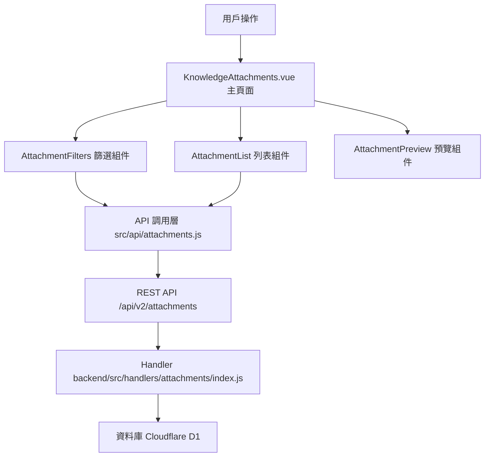

# Design Document: BR12.2: 附件列表與篩選

## Overview

附件列表展示、查詢、篩選功能

本功能是附件管理系統的核心模組之一，提供統一的附件查看、查詢、篩選界面，幫助員工快速找到目標附件。

## Steering Document Alignment

### Technical Standards (tech.md)

遵循以下技術標準：
- 使用 Vue 3 Composition API 開發前端組件
- 使用 Ant Design Vue 作為 UI 組件庫
- 使用 RESTful API 進行前後端通信
- 使用 Cloudflare Workers 作為後端運行環境
- 使用 Cloudflare D1 (SQLite) 作為資料庫
- 遵循統一的錯誤處理和回應格式
- 使用參數化查詢防止 SQL 注入

### Project Structure (structure.md)

遵循以下項目結構：
- 前端組件位於 `src/components/attachments/` 或 `src/views/attachments/`
- API 調用層位於 `src/api/attachments.js`
- 後端 Handler 位於 `backend/src/handlers/attachments/`
- 遵循命名規範：組件使用 PascalCase，Handler 使用 kebab-case

## Code Reuse Analysis

### Existing Components to Leverage

- **AttachmentList.vue**: 附件列表組件（需新增或增強）
- **AttachmentFilters.vue**: 附件篩選組件（需新增）
- **KnowledgeAttachments.vue**: 知識庫附件頁面（已有，需增強）

### Integration Points

- **handleGetAttachments**: 處理附件列表 API 請求，位於 `backend/src/handlers/attachments/index.js`
  - API 路由: `GET /api/v2/attachments`（支援查詢參數篩選）
  - 需 JOIN 查詢獲取關聯實體名稱和上傳者名稱
  - 注意：Attachments.entity_id 為 TEXT 類型，JOIN 時需進行類型轉換（task 和 sop 的 ID 為 INTEGER，需使用 CAST 轉換）
- **Attachments 表**: 存儲附件基本資訊
- **實體表**: 
  - ActiveTasks 表（entity_type='task' 時 JOIN 獲取任務名稱，使用 `task_type` 欄位作為實體名稱）
  - Clients 表（entity_type='client' 時 JOIN 獲取客戶名稱，使用 `company_name` 欄位作為實體名稱）
  - SOPDocuments 表（entity_type='sop' 時 JOIN 獲取 SOP 名稱，使用 `title` 欄位作為實體名稱）
  - Receipts 表（entity_type='receipt' 時 JOIN 獲取收據名稱，可使用 `receipt_id` 或組合欄位作為實體名稱）
- **Users 表**: 用於 JOIN 查詢上傳者名稱
- **實體列表 API**: 用於實體 ID 篩選下拉選單（如 `/api/v2/tasks`, `/api/v2/clients` 等）

## Architecture

### Modular Design Principles

- **Single File Responsibility**: 每個文件應該有單一、明確的職責
- **Component Isolation**: 創建小型、專注的組件，而非大型單體文件
- **Service Layer Separation**: 分離數據訪問、業務邏輯和表現層
- **Utility Modularity**: 將工具函數拆分為專注的、單一用途的模組

### Component Architecture

前端採用 Vue 3 Composition API，組件結構清晰，職責單一：



## Components and Interfaces

### KnowledgeAttachments

- **Purpose**: 知識庫附件頁面主組件，整合所有子組件
- **Location**: `src/views/knowledge/KnowledgeAttachments.vue`
- **Interfaces**: 無（頁面組件，無對外接口）
- **Props**: 無
- **Events**: 無
- **Dependencies**: 
  - Ant Design Vue 組件庫
  - Vue Router (用於 URL 查詢參數處理)
  - Pinia Store (附件狀態管理，可選)
- **Reuses**: 
  - AttachmentFilters, AttachmentList, AttachmentPreview 子組件
  - API 調用工具函數 (`@/api/attachments.js`)
  - 文件大小格式化工具 (`@/utils/formatters`)
- **Features**:
  - 處理 AttachmentFilters 的篩選條件變更
  - 處理 AttachmentList 的附件點擊事件，顯示在 AttachmentPreview
  - 處理 URL 查詢參數（taskId）自動篩選
  - 實現左側列表、右側預覽布局
  - 管理附件列表數據載入和狀態

### AttachmentFilters

- **Purpose**: 附件篩選組件
- **Location**: `src/components/attachments/AttachmentFilters.vue`
- **Interfaces**: Props (filters) 和 Events (@filters-change)
- **Props**: 
  - `filters` (Object, required): 當前篩選條件
    - `entity_type` (String, optional): 實體類型（task、client、sop、receipt）
    - `entity_id` (String, optional): 實體 ID
    - `q` (String, optional): 關鍵詞搜尋
- **Events**:
  - `@filters-change`: 篩選條件變更
- **Dependencies**: 
  - Ant Design Vue 組件庫（Select, Input）
  - API 調用層（用於獲取實體列表）
- **Reuses**: 
  - 現有的實體列表 API（如任務列表、客戶列表等）
- **Features**:
  - 實體類型篩選下拉框（全部、任務、客戶、SOP、收據）
  - 實體 ID 篩選（可選，根據實體類型動態顯示，需調用對應的實體列表 API）
  - 關鍵詞搜尋輸入框

### AttachmentList

- **Purpose**: 附件列表展示組件
- **Location**: `src/components/attachments/AttachmentList.vue`
- **Interfaces**: Props (attachments, loading, pagination) 和 Events (@attachment-click, @page-change, @page-size-change)
- **Props**: 
  - `attachments` (Array, required): 附件列表
  - `loading` (Boolean, optional): 加載狀態
  - `pagination` (Object, required): 分頁資訊
    - `current` (Number): 當前頁碼
    - `pageSize` (Number): 每頁顯示筆數
    - `total` (Number): 總筆數
- **Events**:
  - `@attachment-click`: 點擊附件選擇進行預覽
  - `@page-change`: 頁碼變更
  - `@page-size-change`: 每頁顯示筆數變更
- **Dependencies**: Ant Design Vue 組件庫（Table, Pagination）
- **Reuses**: 
  - 文件大小格式化工具
  - 日期格式化工具
- **Features**:
  - 顯示附件列表（附件名稱、類型、關聯實體、文件大小、上傳時間、上傳者等）
  - 實現分頁組件
  - 實現附件點擊事件（選擇附件進行預覽）
  - 實現加載狀態顯示
  - 實現空數據提示

### AttachmentPreview

- **Purpose**: 附件預覽組件，用於顯示選中附件的詳細信息和預覽
- **Location**: `src/components/attachments/AttachmentPreview.vue`
- **Interfaces**: Props (attachment) 和 Events (@download, @close)
- **Props**: 
  - `attachment` (Object, optional): 當前選中的附件對象
    - `attachment_id` (Number): 附件 ID
    - `object_key` (String): R2 物件鍵（用於下載）
    - `filename` (String): 文件名
    - `content_type` (String): 文件類型
    - `size_bytes` (Number): 文件大小
    - `entity_name` (String): 關聯實體名稱
    - `uploader_name` (String): 上傳者名稱
    - `uploaded_at` (String): 上傳時間
- **Events**:
  - `@download`: 下載附件
  - `@close`: 關閉預覽（可選）
- **Dependencies**: 
  - Ant Design Vue 組件庫（Button, Descriptions, Image 等）
  - 文件預覽工具（根據文件類型顯示預覽）
- **Reuses**: 
  - 文件大小格式化工具
  - 日期格式化工具
  - 文件下載工具
- **Features**:
  - 顯示附件詳細信息（文件名、大小、類型、關聯實體、上傳者、上傳時間等）
  - 根據文件類型顯示預覽（圖片、PDF 等）
  - 提供下載按鈕
  - 處理不支持預覽的文件類型（顯示文件信息）

## Data Models

### Attachment (附件)

```
- attachment_id: INTEGER (主鍵)
- entity_type: TEXT (任務、客戶、SOP、收據)
- entity_id: TEXT (對應實體的 ID)
- object_key: TEXT (R2 物件鍵，用於上傳/下載)
- filename: TEXT (原始文件名)
- content_type: TEXT (MIME 類型)
- size_bytes: INTEGER (文件大小)
- uploader_user_id: INTEGER (上傳者 ID)
- uploaded_at: TEXT (上傳時間)
- is_deleted: BOOLEAN (是否已刪除)
```

### API Response Format

附件列表 API 回應應包含以下欄位：

```
{
  "data": [
    {
      "attachment_id": INTEGER,
      "entity_type": TEXT,
      "entity_id": TEXT,
      "entity_name": TEXT,  // 關聯實體名稱（通過 JOIN 查詢）
      "object_key": TEXT,  // R2 物件鍵（用於下載）
      "filename": TEXT,
      "content_type": TEXT,
      "size_bytes": INTEGER,
      "uploader_user_id": INTEGER,
      "uploader_name": TEXT,  // 上傳者名稱（通過 JOIN 查詢）
      "uploaded_at": TEXT
    }
  ],
  "pagination": {
    "current": INTEGER,
    "pageSize": INTEGER,
    "total": INTEGER
  }
}
```

## Error Handling

### Error Scenarios

1. **附件列表載入失敗**:
   - **Handling**: 顯示錯誤提示，允許重試
   - **User Impact**: 顯示錯誤提示「載入附件列表失敗，請重試」

2. **篩選結果為空**:
   - **Handling**: 顯示空狀態提示
   - **User Impact**: 顯示「沒有找到附件」提示

3. **實體列表載入失敗**:
   - **Handling**: 實體 ID 篩選下拉框顯示錯誤狀態，允許重試
   - **User Impact**: 顯示錯誤提示「載入實體列表失敗，請重試」

4. **關聯實體不存在**:
   - **Handling**: 顯示「已刪除」或「未知實體」標記
   - **User Impact**: 關聯實體欄位顯示「已刪除」或「未知實體」

5. **上傳者不存在**:
   - **Handling**: 顯示「未知用戶」標記
   - **User Impact**: 上傳者欄位顯示「未知用戶」

6. **分頁參數無效**:
   - **Handling**: 使用預設值或返回錯誤
   - **User Impact**: 自動修正為有效分頁參數或顯示錯誤提示

## Testing Strategy

### Unit Testing
- 測試篩選邏輯
- 測試分頁邏輯

### Integration Testing
- 測試附件列表 API
- 測試篩選功能

### End-to-End Testing
- 測試完整列表查看流程
- 測試篩選功能

