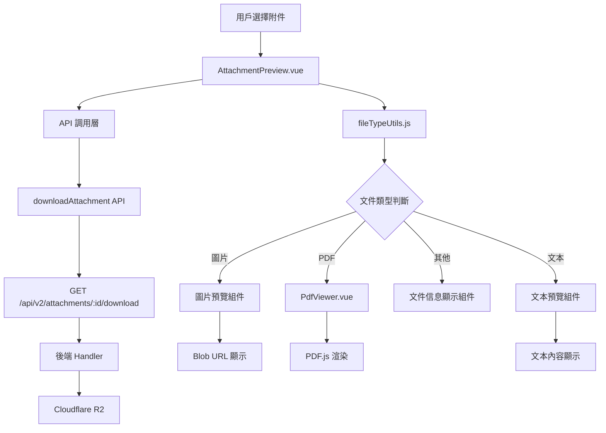

# Design Document: BR12.3: 附件預覽

## Overview

附件在線預覽功能，支持圖片、PDF、文本文件等在線預覽

本功能是附件管理系統的核心模組之一，提供統一的附件在線預覽能力。

## Steering Document Alignment

### Technical Standards (tech.md)

遵循以下技術標準：
- 使用 Vue 3 Composition API 開發前端組件
- 使用 Ant Design Vue 作為 UI 組件庫
- 使用 PDF.js 或類似庫進行 PDF 預覽
- 使用 RESTful API 進行前後端通信

### Project Structure (structure.md)

遵循以下項目結構：
- 前端組件位於 `src/components/attachments/`
- API 調用層位於 `src/api/attachments.js`
- 工具函數位於 `src/utils/fileTypeUtils.js`

## Code Reuse Analysis

### Existing Components to Leverage

- **AttachmentPreview.vue**: 附件預覽組件（已有，需增強）
- **PdfViewer.vue**: PDF 查看器組件（已有）

### Integration Points

- **handleDownloadAttachment**: 處理附件下載 API 請求，位於 `backend/src/handlers/attachments/index.js`
  - API 路由: `GET /api/v2/attachments/:id/download`
  - 請求參數: `attachment_id` (URL 參數)
  - 響應格式: Blob 數據流
  - 錯誤處理: 返回適當的 HTTP 狀態碼（404 文件不存在、403 無權限、500 服務器錯誤）

### File Size and Performance Considerations

- **文件大小限制**:
  - 圖片文件: 建議不超過 10MB（超過可能影響載入速度）
  - PDF 文件: 建議不超過 50MB（超過可能影響渲染性能）
  - 文本文件: 超過 5MB 時顯示警告提示
- **預覽緩存策略**:
  - 使用瀏覽器 Blob URL 緩存已載入的文件
  - 組件卸載時清理 Blob URL 以釋放內存
- **權限檢查**:
  - 預覽前檢查用戶是否有權限訪問該附件
  - 後端 API 應驗證用戶權限

## Architecture

### Modular Design Principles
- **Single File Responsibility**: 每個文件應該處理一個特定的關注點或領域
- **Component Isolation**: 創建小而專注的組件，而不是大型單體文件
- **Service Layer Separation**: 分離數據訪問、業務邏輯和表示層
- **Utility Modularity**: 將工具函數拆分為專注的、單一用途的模組

### Component Architecture



## Components and Interfaces

### AttachmentPreview

- **Purpose**: 附件預覽組件，根據文件類型顯示不同的預覽方式
- **Location**: `src/components/attachments/AttachmentPreview.vue`
- **Interfaces**: Props (attachment) 和 Events (@download)
- **Props**: 
  - `attachment` (Object, required): 附件信息
    - `attachment_id` (Number): 附件 ID
    - `filename` (String): 文件名
    - `content_type` (String): MIME 類型
    - `size_bytes` (Number): 文件大小（字節）
    - `uploaded_at` (String, optional): 上傳時間（ISO 8601 格式）
- **Events**:
  - `@download`: 下載附件（當文件類型不支持預覽時）
    - 事件參數: `attachment` (Object) - 附件信息對象
- **Dependencies**: 
  - Ant Design Vue 組件庫（Spin, Alert, Button, Icon）
  - PdfViewer 組件（PDF 預覽，位於 `src/components/shared/PdfViewer.vue`）
  - Vue 3 Composition API（ref, computed, watch, onMounted, onUnmounted）
- **Reuses**: 
  - PdfViewer 組件（PDF 預覽）
  - API 調用工具函數 (`@/api/attachments.js`)
  - 文件類型判斷工具函數 (`@/utils/fileTypeUtils.js`)
  - 文件大小格式化工具函數 (`@/utils/formatters`)
- **Features**:
  - 文件類型判斷（圖片、PDF、文本、其他）
  - 圖片預覽（在瀏覽器中直接顯示，支持縮放（放大、縮小、重置），保持原始比例，支持拖動查看）
  - PDF 預覽（使用 PdfViewer 組件，支持翻頁和縮放）
  - 文本文件預覽（使用等寬字體顯示，支持滾動，大文件警告）
  - 其他類型文件處理（顯示文件信息和下載按鈕，顯示文件圖標）
  - 預覽載入狀態和錯誤處理（網絡錯誤、文件不存在、無權限等）
  - 響應式布局支持（移動端可切換為全屏預覽）
  - Blob URL 內存管理（組件卸載時清理）

## Data Models

### AttachmentPreviewData
```
- attachment_id: Number (required) - 附件 ID
- filename: String (required) - 文件名
- content_type: String (required) - MIME 類型
- size_bytes: Number (required) - 文件大小（字節）
- uploaded_at: String (optional) - 上傳時間（ISO 8601 格式）
- file_url: String (optional) - 文件下載 URL（由 API 返回）
```

### FileType
```
- type: String - 文件類型（'image' | 'pdf' | 'text' | 'other'）
- mimeType: String - MIME 類型
- extension: String - 文件擴展名
```

## Error Handling

### Error Scenarios

1. **預覽載入失敗**:
   - **Handling**: 顯示錯誤提示，允許重試
   - **User Impact**: 顯示錯誤提示「預覽載入失敗，請重試」

2. **附件不存在或已刪除**:
   - **Handling**: 顯示錯誤提示「附件不存在或已刪除」
   - **User Impact**: 顯示錯誤提示，不提供重試選項

3. **無權限訪問附件**:
   - **Handling**: 顯示錯誤提示「您沒有權限訪問此附件」
   - **User Impact**: 顯示錯誤提示，不提供重試選項

4. **文件大小過大**:
   - **Handling**: 對於文本文件超過 5MB，顯示警告並建議下載
   - **User Impact**: 顯示警告提示，仍可嘗試預覽或選擇下載

5. **網絡錯誤**:
   - **Handling**: 顯示網絡錯誤提示，允許重試
   - **User Impact**: 顯示錯誤提示「網絡連接失敗，請檢查網絡後重試」

6. **不支持的文件格式**:
   - **Handling**: 顯示文件信息和下載按鈕
   - **User Impact**: 顯示文件基本信息，提供下載選項

## Testing Strategy

### Unit Testing
- 測試文件類型判斷邏輯
  - 測試各種文件擴展名的類型判斷
  - 測試 MIME 類型的類型判斷
  - 測試邊界情況（空值、無效格式等）
- 測試預覽組件渲染
  - 測試不同文件類型的組件渲染
  - 測試載入狀態顯示
  - 測試錯誤狀態顯示
- 測試文件大小格式化工具函數
- 測試文件類型圖標選擇邏輯

### Integration Testing
- 測試不同類型文件的預覽
  - 測試圖片文件預覽（各種格式）
  - 測試 PDF 文件預覽
  - 測試文本文件預覽（各種格式）
  - 測試不支持預覽的文件處理
- 測試 API 調用
  - 測試附件下載 API 調用
  - 測試錯誤響應處理
  - 測試權限檢查
- 測試預覽組件與 PdfViewer 組件的集成

### End-to-End Testing
- 測試完整預覽流程
  - 用戶選擇附件 → 載入預覽 → 顯示預覽內容
- 測試錯誤處理流程
  - 附件不存在 → 顯示錯誤提示
  - 網絡錯誤 → 顯示錯誤提示並允許重試
- 測試響應式布局
  - 桌面端布局測試
  - 移動端布局測試

