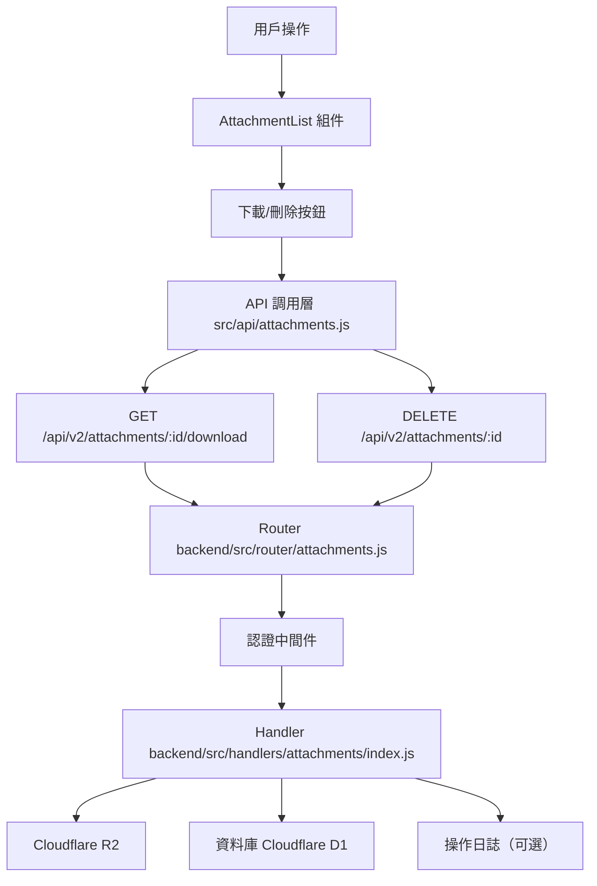

# Design Document: BR12.4: 附件下載與刪除

## Overview

附件下載與刪除功能，支持將附件下載到本地，或刪除不需要的附件

本功能是附件管理系統的核心模組之一，提供統一的附件下載和刪除能力。

## Steering Document Alignment

### Technical Standards (tech.md)

遵循以下技術標準：
- 使用 Vue 3 Composition API 開發前端組件
- 使用 Ant Design Vue 作為 UI 組件庫
- 使用 RESTful API 進行前後端通信
- 使用 Cloudflare Workers 作為後端運行環境
- 使用 Cloudflare R2 作為文件存儲

### Project Structure (structure.md)

遵循以下項目結構：
- 前端組件位於 `src/components/attachments/` 或 `src/views/attachments/`
- API 調用層位於 `src/api/attachments.js`
- 後端 Handler 位於 `backend/src/handlers/attachments/`

## Code Reuse Analysis

### Existing Components to Leverage

- **AttachmentList.vue 或相關組件**: 附件列表組件（如果存在，需要添加下載和刪除功能；如果不存在，需要創建）
- **usePageAlert composable**: 用於顯示成功/錯誤提示（`@/composables/usePageAlert`）
- **現有 API 函數**: `src/api/knowledge.js` 中已有 `downloadAttachment` 和 `deleteAttachment`，但需要創建新的 `src/api/attachments.js` 以分離附件相關 API（或改進現有實現）

### Integration Points

- **handleDownloadAttachment**: 處理附件下載 API 請求，位於 `backend/src/handlers/attachments/index.js`
  - API 路由: `GET /api/v2/attachments/:id/download`
  - 依賴: `backend/src/utils/response.js`（響應處理）
- **handleDeleteAttachment**: 處理附件刪除 API 請求，位於 `backend/src/handlers/attachments/index.js`
  - API 路由: `DELETE /api/v2/attachments/:id`
  - 依賴: `backend/src/utils/response.js`（響應處理）
- **Attachments 表**: 存儲附件基本資訊（Cloudflare D1）
- **Cloudflare R2**: 存儲實際文件
- **操作日誌**: 使用 `console.log` 記錄下載和刪除操作（可選，用於調試和監控）

## Architecture

### Component Architecture



### Modular Design Principles

- **Single File Responsibility**: 每個組件文件只處理一個功能模組
- **Component Isolation**: 組件之間通過 props 和 events 通信，保持獨立
- **Service Layer Separation**: API 調用與業務邏輯分離，使用統一的 API 工具函數
- **Utility Modularity**: 工具函數按功能分組，可在多處重用

## Data Models

### Attachment (資料庫模型)
```
- attachment_id: INTEGER (主鍵)
- entity_type: TEXT (關聯實體類型，如 'client', 'task', 'sop', 'receipt')
- entity_id: INTEGER (關聯實體 ID)
- object_key: TEXT (R2 文件路徑/鍵值)
- filename: TEXT (文件名)
- content_type: TEXT (MIME 類型)
- size_bytes: INTEGER (文件大小，字節)
- uploader_user_id: INTEGER (上傳者 ID)
- uploaded_at: TEXT (上傳時間，ISO 8601)
- is_deleted: INTEGER (是否已刪除，0=未刪除，1=已刪除)
```

### Download Request (API 請求)
```
- attachmentId: number (路徑參數，從 URL /api/v2/attachments/:id/download 中提取)
- 認證: 通過認證中間件（Cookie-based Session）
```

### Delete Request (API 請求)
```
- attachmentId: number (路徑參數，從 URL /api/v2/attachments/:id 中提取)
- 認證: 通過認證中間件（Cookie-based Session）
```

## Components and Interfaces

### AttachmentList (下載和刪除功能)

- **Purpose**: 附件列表組件，包含下載和刪除按鈕
- **Location**: `src/components/attachments/AttachmentList.vue`
- **Interfaces**: Props (attachments) 和 Events (@download, @delete, @refresh)
- **Props**: 
  - `attachments` (Array, required): 附件列表
- **Events**:
  - `@download`: 下載附件
  - `@delete`: 刪除附件
  - `@refresh`: 刷新附件列表（刪除成功後）
- **Dependencies**: 
  - Ant Design Vue 組件庫（Button, Modal, Table）
  - Vue 3 Composition API
- **Reuses**: 
  - API 調用工具函數 (`@/api/attachments.js`)
  - 提示工具函數 (`@/composables/usePageAlert`)
- **Features**:
  - 下載按鈕（調用下載 API，處理文件下載）
  - 刪除按鈕（顯示確認對話框，調用刪除 API）
  - 刪除確認對話框（使用 Ant Design Vue Modal.confirm）
  - 刪除成功後刷新列表
  - 錯誤處理和提示

### downloadAttachment API 函數

- **Purpose**: 封裝附件下載 API 調用
- **Location**: `src/api/attachments.js`
- **Interfaces**: 
  - `downloadAttachment(attachmentId: number | string): Promise<void>`
- **Dependencies**: 
  - fetch API
  - Blob API
  - URL.createObjectURL
- **Features**:
  - 調用 GET /api/v2/attachments/:id/download
  - 處理文件下載（從 Response 獲取 Blob，創建 Blob URL 並觸發下載）
  - 從 Response headers 的 Content-Disposition 中提取原始文件名
  - 錯誤處理（404、500、網路錯誤等）

### deleteAttachment API 函數

- **Purpose**: 封裝附件刪除 API 調用
- **Location**: `src/api/attachments.js`
- **Interfaces**: 
  - `deleteAttachment(attachmentId: number | string): Promise<void>`
- **Dependencies**: 
  - fetch API
- **Features**:
  - 調用 DELETE /api/v2/attachments/:id
  - 錯誤處理（404、500、網路錯誤等）

## Error Handling

### Error Scenarios

1. **附件不存在（下載/刪除）**:
   - **Handling**: 返回 404 錯誤，記錄錯誤日誌
   - **User Impact**: 顯示錯誤提示「附件不存在」

2. **附件已刪除（下載/刪除）**:
   - **Handling**: 檢查 `is_deleted = 1`，返回錯誤狀態碼（如 404 或 410），記錄錯誤日誌
   - **User Impact**: 顯示錯誤提示「附件已刪除，無法操作」

3. **R2 文件不存在（下載）**:
   - **Handling**: 返回錯誤狀態碼（404），記錄錯誤日誌
   - **User Impact**: 顯示錯誤提示「文件不存在，無法下載」

4. **未登入（下載/刪除）**:
   - **Handling**: 認證中間件返回 401 錯誤
   - **User Impact**: 顯示錯誤提示「請先登入」

5. **下載失敗（網路或 R2 錯誤）**:
   - **Handling**: 返回錯誤狀態碼（500），記錄錯誤日誌，允許重試
   - **User Impact**: 顯示錯誤提示「下載失敗，請重試」

6. **刪除失敗（數據庫錯誤）**:
   - **Handling**: 返回錯誤狀態碼（500），記錄錯誤日誌，允許重試
   - **User Impact**: 顯示錯誤提示「刪除失敗，請重試」

7. **R2 文件刪除失敗（刪除時）**:
   - **Handling**: 記錄錯誤日誌（使用 `console.warn`），根據業務需求決定是否繼續刪除數據庫記錄（建議：先刪除 R2 文件，再刪除數據庫記錄；如果 R2 刪除失敗，記錄錯誤但仍繼續刪除數據庫記錄，因為 R2 文件可能已經不存在或無法訪問）
   - **User Impact**: 顯示成功提示「附件已刪除」（即使 R2 文件刪除失敗，也視為刪除成功，因為數據庫記錄已刪除）

## Testing Strategy

### Unit Testing
- 測試下載邏輯（包括錯誤處理）
- 測試刪除邏輯（包括錯誤處理）
- 測試文件下載處理函數
- 測試確認對話框邏輯

### Integration Testing
- 測試下載 API（包括成功和失敗場景）
- 測試刪除 API（包括成功和失敗場景）
- 測試 R2 文件獲取和刪除
- 測試數據庫記錄刪除
- 測試操作日誌記錄（如果實現）

### End-to-End Testing
- 測試完整下載流程：點擊下載按鈕 → API 調用 → 文件下載 → 操作日誌記錄（如果實現）
- 測試完整刪除流程：點擊刪除按鈕 → 確認對話框 → API 調用 → 數據庫和 R2 刪除 → 列表刷新 → 操作日誌記錄（如果實現）
- 測試錯誤場景：附件不存在、未登入、網路錯誤、R2 文件不存在等

