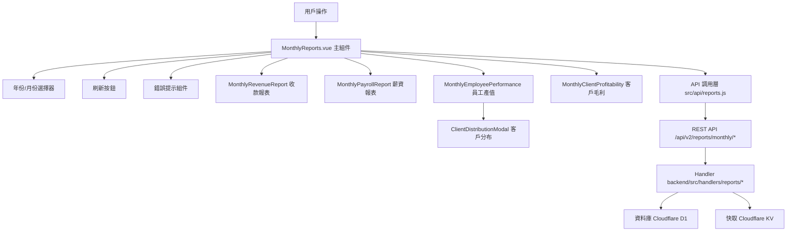

# Design Document: BR13: 月報表（Monthly Reports）

## Overview

提供月份層級的經營數據視圖，包含營收、薪資、客戶獲利、員工績效等，用於月度營運檢視與管理決策。

本功能是報表分析系統的核心模組之一，提供統一的月度報表查看界面，幫助管理員快速了解月度經營狀況、客戶獲利情況和員工績效表現。

## Steering Document Alignment

### Technical Standards (tech.md)

遵循以下技術標準：
- 使用 Vue 3 Composition API 開發前端組件
- 使用 Ant Design Vue 作為 UI 組件庫
- 使用 RESTful API 進行前後端通信
- 使用 Cloudflare Workers 作為後端運行環境
- 使用 Cloudflare D1 (SQLite) 作為資料庫
- 使用 Cloudflare KV 作為快取存儲
- 遵循統一的錯誤處理和回應格式
- 使用參數化查詢防止 SQL 注入
- 實現報表快取機制

### Project Structure (structure.md)

遵循以下項目結構：
- 前端組件位於 `src/views/reports/` 和 `src/components/reports/`
- API 調用層位於 `src/api/reports.js`
- Store 狀態管理位於 `src/stores/reports.js`
- 後端 Handler 位於 `backend/src/handlers/reports/`
- 工具函數位於 `backend/src/handlers/reports/` 和 `backend/src/utils/`
- 遵循命名規範：組件使用 PascalCase，Handler 使用 kebab-case

## Code Reuse Analysis

### Existing Components to Leverage

- **MonthlyReports.vue**：月度報表主頁面（已有，需增強）
- **MonthlyRevenueReport.vue**：月度收款報表組件（已有，需修改金額顯示精度）
- **MonthlyPayrollReport.vue**：月度薪資報表組件（已有，需修改金額顯示精度）
- **MonthlyEmployeePerformance.vue**：月度員工產值分析組件（已有，需修改收入分配邏輯）
- **MonthlyClientProfitability.vue**：月度客戶毛利分析組件（已有，需修改收入計算邏輯）
- **ClientDistributionModal.vue**：客戶分布彈窗組件（已有）

### Integration Points

- **handleMonthlyRevenue**：處理月度收款報表 API 請求，位於 `backend/src/handlers/reports/monthly-revenue.js`
- **handleMonthlyPayroll**：處理月度薪資報表 API 請求，位於 `backend/src/handlers/reports/monthly-payroll.js`
- **handleMonthlyEmployeePerformance**：處理月度員工產值報表 API 請求，位於 `backend/src/handlers/reports/monthly-employee-performance.js`
- **handleMonthlyClientProfitability**：處理月度客戶毛利報表 API 請求，位於 `backend/src/handlers/reports/monthly-client-profitability.js`
- **Receipts 表**：存儲收據資訊
- **PayrollCache 表**：存儲薪資快取數據
- **Timesheets 表**：存儲工時記錄
- **BillingPlans 表**：存儲收費計劃（BR1 應計收入計算）
- **ClientServices 表**：存儲服務執行頻率（BR1 應計收入計算）

## Architecture

### Component Architecture

前端採用 Vue 3 Composition API，組件結構清晰，職責單一：



### Modular Design Principles

- **Single File Responsibility**：每個組件文件只處理一個報表類型
- **Component Isolation**：組件之間通過 props 和 events 通信，保持獨立
- **Service Layer Separation**：API 調用與業務邏輯分離，使用統一的 API 工具函數
- **Utility Modularity**：工具函數按功能分組，可在多處重用

## Components and Interfaces

### MonthlyReports

- **Purpose**：月度報表主頁面，整合所有報表組件
- **Location**：`src/views/reports/MonthlyReports.vue`
- **Interfaces**：
  - **Props**：無（頁面組件，無對外接口）
  - **Events**：無
- **Dependencies**：
  - Ant Design Vue 組件庫
  - Vue Router
  - Pinia Store (reports store)
- **Reuses**：
  - MonthlyRevenueReport, MonthlyPayrollReport, MonthlyEmployeePerformance, MonthlyClientProfitability 子組件
  - ClientDistributionModal 彈窗組件
  - API 調用工具函數 (`@/api/reports`)
- **Features**：
  - 年份和月份選擇器
  - 切換年份或月份時立即自動載入報表
  - 統一刷新按鈕，刷新所有報表
  - 錯誤訊息顯示詳情按鈕
  - 整合所有報表組件

### MonthlyRevenueReport

- **Purpose**：月度收款報表組件
- **Location**：`src/components/reports/MonthlyRevenueReport.vue`
- **Interfaces**：
  - **Props**：無
  - **Events**：無
- **Dependencies**：Ant Design Vue 組件庫、reports store
- **Reuses**：金額格式化工具（改為 0 位小數）
- **Features**：
  - 顯示本月應收、期限內實收/未收、逾期收回/未收、總未收
  - 客戶列表，可展開查看收據明細
  - 金額顯示精度為 0 位小數

### MonthlyPayrollReport

- **Purpose**：月度薪資報表組件
- **Location**：`src/components/reports/MonthlyPayrollReport.vue`
- **Interfaces**：
  - **Props**：無
  - **Events**：無
- **Dependencies**：Ant Design Vue 組件庫、reports store
- **Reuses**：金額格式化工具（改為 0 位小數）
- **Features**：
  - 顯示總應發、總實發、平均應發、平均實發、員工人數
  - 員工薪資明細表格
  - 薪資構成分析表格
  - 金額顯示精度為 0 位小數

### MonthlyEmployeePerformance

- **Purpose**：月度員工產值分析組件
- **Location**：`src/components/reports/MonthlyEmployeePerformance.vue`
- **Interfaces**：
  - **Props**：無
  - **Events**：無
- **Dependencies**：Ant Design Vue 組件庫、reports store
- **Reuses**：金額格式化工具、工時格式化工具
- **Features**：
  - 顯示標準工時、加權工時、工時差異、產生收入、總成本、毛利、毛利率
  - 員工產值表格
  - 查看客戶分布功能（使用標準工時分配收入）

### MonthlyClientProfitability

- **Purpose**：月度客戶毛利分析組件
- **Location**：`src/components/reports/MonthlyClientProfitability.vue`
- **Interfaces**：
  - **Props**：無
  - **Events**：無
- **Dependencies**：Ant Design Vue 組件庫、reports store
- **Reuses**：金額格式化工具、工時格式化工具
- **Features**：
  - 顯示總工時、加權工時、平均時薪、本月收入、總成本、毛利、毛利率
  - 客戶列表，可展開查看服務類型明細
  - 使用 BR1 應計收入邏輯計算收入

### ClientDistributionModal

- **Purpose**：客戶分布彈窗組件，顯示員工在各客戶的標準工時和收入分配
- **Location**：`src/components/reports/ClientDistributionModal.vue`
- **Interfaces**：
  - **Props**：
    - `visible: Boolean` - 控制彈窗顯示/隱藏
    - `employeeId: String` - 員工 ID
    - `employeeName: String` - 員工名稱
    - `year: Number` - 年份
    - `month: Number` - 月份
  - **Events**：
    - `close` - 關閉彈窗事件
- **Dependencies**：Ant Design Vue 組件庫（Modal、Table）、reports store
- **Reuses**：金額格式化工具、工時格式化工具
- **Features**：
  - 顯示員工在各客戶的標準工時
  - 顯示員工在各客戶的收入分配
  - 使用標準工時進行收入分配計算

## Data Models

### MonthlyRevenueReport (月度收款報表)

```
- summary: Object
  - currentReceivable: Number (本月應收)
  - currentReceived: Number (本月期限內實收)
  - currentOutstanding: Number (本月期限內未收)
  - overdueRecovered: Number (逾期收回)
  - overdueOutstanding: Number (逾期未收)
  - totalOutstanding: Number (總未收)
- clients: Array
  - clientId: String
  - clientName: String
  - currentReceivable: Number
  - currentReceived: Number
  - currentOutstanding: Number
  - overdueRecovered: Number
  - overdueOutstanding: Number
  - totalOutstanding: Number
  - receipts: Array (可展開的收據明細)
```

### MonthlyPayrollReport (月度薪資報表)

```
- summary: Object
  - totalGrossSalary: Number (總應發)
  - totalNetSalary: Number (總實發)
  - avgGrossSalary: Number (平均應發)
  - avgNetSalary: Number (平均實發)
  - employeeCount: Number (員工人數)
- payrollDetails: Array
  - userId: String
  - name: String
  - baseSalary: Number
  - regularAllowance: Number
  - irregularAllowance: Number
  - fullAttendanceBonus: Number
  - overtimePay: Number
  - mealAllowance: Number
  - transportSubsidy: Number
  - performanceBonus: Number
  - yearEndBonus: Number
  - leaveDeduction: Number
  - grossSalary: Number
  - fixedDeduction: Number
  - netSalary: Number
- composition: Object (薪資構成分析)
```

### MonthlyEmployeePerformance (月度員工產值分析)

```
- employeePerformance: Array
  - userId: String
  - name: String
  - standardHours: Number (標準工時)
  - weightedHours: Number (加權工時)
  - hoursDifference: Number (工時差異)
  - generatedRevenue: Number (產生收入，使用標準工時分配)
  - laborCost: Number (人工成本)
  - totalCost: Number (總成本)
  - profit: Number (毛利)
  - profitMargin: Number (毛利率)
  - clientDistribution: Array (客戶分布)
```

### MonthlyClientProfitability (月度客戶毛利分析)

```
- clients: Array
  - clientId: String
  - clientName: String
  - totalHours: Number
  - weightedHours: Number
  - avgHourlyRate: Number
  - revenue: Number (使用 BR1 應計收入邏輯)
  - totalCost: Number
  - profit: Number
  - profitMargin: Number
  - serviceDetails: Array (可展開的服務類型明細，使用 BR1 邏輯分攤)
```

## Error Handling

### Error Scenarios

1. **API 請求失敗**：
   - **Handling**：顯示簡要錯誤訊息，提供「查看詳情」按鈕
   - **User Impact**：用戶看到錯誤提示，可以點擊查看詳細錯誤資訊

2. **數據載入超時**：
   - **Handling**：顯示超時錯誤訊息，提供重試選項
   - **User Impact**：用戶可以重試載入數據

3. **快取數據過期**：
   - **Handling**：自動重新計算數據，更新快取
   - **User Impact**：用戶看到最新數據

4. **計算錯誤**：
   - **Handling**：顯示計算錯誤訊息，記錄錯誤日誌
   - **User Impact**：用戶看到錯誤提示，管理員可以查看錯誤日誌

## Testing Strategy

### Unit Testing

- 測試收入計算邏輯（BR1 應計收入）
- 測試標準工時計算邏輯
- 測試收入分配邏輯
- 測試金額格式化（0 位小數）

### Integration Testing

- 測試 API 調用和數據流轉
- 測試快取機制
- 測試自動載入和手動刷新
- 測試錯誤處理

### End-to-End Testing

- 測試完整的報表查看流程
- 測試年份和月份切換
- 測試展開功能
- 測試刷新功能
- 測試錯誤處理
