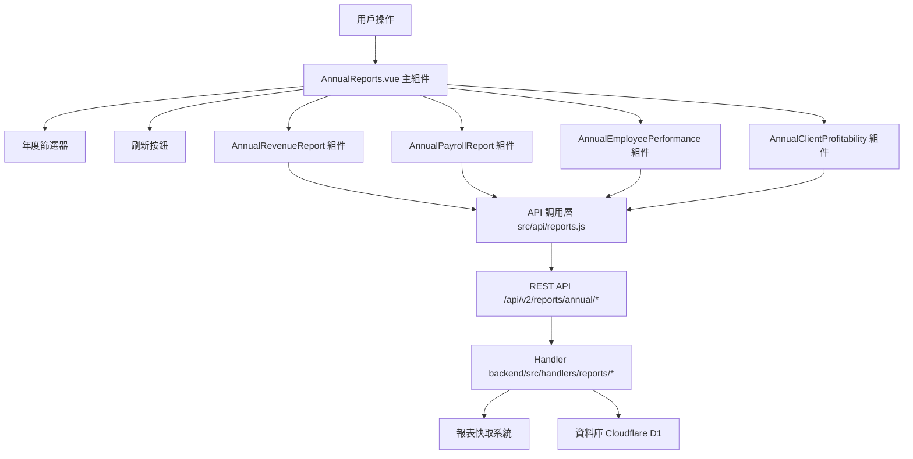

# Design Document: BR14: 年度報表

## Overview

年度報表功能提供年度層級的經營數據全貌，統計各月累計與年對年趨勢，支持年度策略制定與績效考核。

本功能是報表分析系統的核心模組之一，提供統一的年度報表查看界面，幫助管理層了解全年經營狀況、客戶獲利情況和員工績效表現。

## Steering Document Alignment

### Technical Standards (tech.md)

遵循以下技術標準：
- 使用 Vue 3 Composition API 開發前端組件
- 使用 Ant Design Vue 作為 UI 組件庫
- 使用 RESTful API 進行前後端通信
- 使用 Cloudflare Workers 作為後端運行環境
- 使用 Cloudflare D1 (SQLite) 作為資料庫
- 遵循統一的錯誤處理和回應格式
- 使用參數化查詢防止 SQL 注入
- 實現報表快取機制

### Project Structure (structure.md)

遵循以下項目結構：
- 前端組件位於 `src/components/reports/` 或 `src/views/reports/`
- API 調用層位於 `src/api/reports.js`
- 後端 Handler 位於 `backend/src/handlers/reports/`
- 快取工具位於 `backend/src/utils/report-cache.js`
- 遵循命名規範：組件使用 PascalCase，Handler 使用 kebab-case

## Code Reuse Analysis

### Existing Components to Leverage

- **AnnualRevenueReport.vue**：年度收款報表組件（已有，需增強）
- **AnnualPayrollReport.vue**：年度薪資報表組件（已有，需增強）
- **AnnualEmployeePerformance.vue**：年度員工產值分析組件（已有，需增強）
- **AnnualClientProfitability.vue**：年度客戶毛利分析組件（已有，需增強）
- **PayrollDetailsModal.vue**：薪資月度明細彈窗（已有）
- **EmployeePerformanceTrendModal.vue**：員工產值趨勢彈窗（已有）
- **ClientDistributionModal.vue**：客戶分布彈窗（已有）

### Integration Points

- **handleAnnualRevenue**：處理年度收款報表 API 請求，位於 `backend/src/handlers/reports/annual-revenue.js`
  - API 路由: `GET /api/v2/reports/annual/revenue?year=YYYY&refresh=0|1`（refresh=1 強制重新計算）
- **handleAnnualPayroll**：處理年度薪資報表 API 請求，位於 `backend/src/handlers/reports/annual-payroll.js`
  - API 路由: `GET /api/v2/reports/annual/payroll?year=YYYY&refresh=0|1`（refresh=1 強制重新計算）
- **handleAnnualEmployeePerformance**：處理年度員工產值分析 API 請求，位於 `backend/src/handlers/reports/annual-employee-performance.js`
  - API 路由: `GET /api/v2/reports/annual/employee-performance?year=YYYY&refresh=0|1`（refresh=1 強制重新計算）
- **handleAnnualClientProfitability**：處理年度客戶毛利分析 API 請求，位於 `backend/src/handlers/reports/annual-client-profitability.js`
  - API 路由: `GET /api/v2/reports/annual/client-profitability?year=YYYY&refresh=0|1`（refresh=1 強制重新計算）
- **報表快取系統**：使用 `backend/src/utils/report-cache.js` 進行快取管理
- **數據來源**：
  - Receipts 表：收據數據
  - PayrollCache 表：薪資快取數據
  - Timesheets 表：工時數據
  - CostAllocation 表：成本分攤數據
  - BillingPlans 表：收費計劃數據
  - ClientServices 表：服務執行頻率數據

## Architecture

### Component Architecture

前端採用 Vue 3 Composition API，組件結構清晰，職責單一：



### Modular Design Principles

- **Single File Responsibility**：每個組件文件只處理一個功能模組
- **Component Isolation**：組件之間通過 props 和 events 通信，保持獨立
- **Service Layer Separation**：API 調用與業務邏輯分離，使用統一的 API 工具函數
- **Utility Modularity**：工具函數按功能分組，可在多處重用

## Components and Interfaces

### AnnualReports

- **Purpose**：年度報表頁面的主組件，整合所有子組件
- **Location**：`src/views/reports/AnnualReports.vue`
- **Interfaces**：無（頁面組件，無對外接口）
- **Props**：無
- **Events**：無
- **Dependencies**：
  - Ant Design Vue 組件庫
  - Pinia Store（報表狀態管理）
- **Reuses**：
  - AnnualRevenueReport, AnnualPayrollReport, AnnualEmployeePerformance, AnnualClientProfitability 子組件
  - API 調用工具函數 (`@/api/reports`)
  - 日期格式化工具 (`@/utils/formatters`)
- **Features**：
  - 處理年度篩選變更
  - 處理手動刷新操作
  - 處理錯誤顯示和詳情查看
  - 處理權限不足情況（403 錯誤）
  - 管理所有報表的載入狀態

### AnnualRevenueReport

- **Purpose**：年度收款報表組件
- **Location**：`src/components/reports/AnnualRevenueReport.vue`
- **Interfaces**：Props (data, status)
- **Props**：
  - `data` (Object, optional)：年度收款報表數據
  - `status` (String, optional)：載入狀態（loading, success, error）
- **Events**：無
- **Dependencies**：Ant Design Vue 組件庫
- **Reuses**：
  - 金額格式化工具
  - 日期格式化工具

### AnnualPayrollReport

- **Purpose**：年度薪資報表組件
- **Location**：`src/components/reports/AnnualPayrollReport.vue`
- **Interfaces**：Props (data, status) 和 Events (@view-details)
- **Props**：
  - `data` (Object, optional)：年度薪資報表數據
  - `status` (String, optional)：載入狀態
- **Events**：
  - `@view-details`：查看員工月度明細
- **Dependencies**：Ant Design Vue 組件庫
- **Reuses**：
  - 金額格式化工具
  - PayrollDetailsModal 組件

### AnnualEmployeePerformance

- **Purpose**：年度員工產值分析組件
- **Location**：`src/components/reports/AnnualEmployeePerformance.vue`
- **Interfaces**：Props (data, status) 和 Events (@view-trend, @view-distribution)
- **Props**：
  - `data` (Object, optional)：年度員工產值分析數據
  - `status` (String, optional)：載入狀態
- **Events**：
  - `@view-trend`：查看員工月度趨勢
  - `@view-distribution`：查看員工客戶分布
- **Dependencies**：Ant Design Vue 組件庫
- **Reuses**：
  - 金額格式化工具
  - 百分比格式化工具
  - EmployeePerformanceTrendModal 組件
  - ClientDistributionModal 組件

### AnnualClientProfitability

- **Purpose**：年度客戶毛利分析組件
- **Location**：`src/components/reports/AnnualClientProfitability.vue`
- **Interfaces**：Props (data, status)
- **Props**：
  - `data` (Object, optional)：年度客戶毛利分析數據
  - `status` (String, optional)：載入狀態
- **Events**：無
- **Dependencies**：Ant Design Vue 組件庫
- **Reuses**：
  - 金額格式化工具
  - 百分比格式化工具

## Data Models

### AnnualRevenueReportData

```
- summary: Object
  - currentReceivable: Number (全年應收)
  - currentReceived: Number (全年期限內實收)
  - currentOutstanding: Number (全年期限內未收)
  - overdueRecovered: Number (全年逾期收回)
  - overdueOutstanding: Number (年末逾期未收)
  - totalOutstanding: Number (年末總未收)
- monthlyTrend: Array (月度收款趨勢)
  - month: Number (月份 1-12)
  - currentReceivable: Number
  - currentReceived: Number
  - currentOutstanding: Number
  - overdueRecovered: Number
  - overdueOutstanding: Number
  - totalOutstanding: Number
- clientSummary: Array (客戶年度彙總)
  - clientId: String
  - clientName: String
  - currentReceivable: Number
  - currentReceived: Number
  - currentOutstanding: Number
  - overdueRecovered: Number
  - overdueOutstanding: Number
  - totalOutstanding: Number
  - serviceDetails: Array (服務類型-月份明細)
- serviceTypeSummary: Array (服務類型彙總)
  - serviceName: String
  - currentReceivable: Number
  - currentReceived: Number
  - currentOutstanding: Number
  - overdueRecovered: Number
  - overdueOutstanding: Number
  - totalOutstanding: Number
  - monthlyDetails: Array (客戶-月份明細)
```

### AnnualPayrollReportData

```
- summary: Object
  - annualGrossSalary: Number (全年總應發)
  - annualNetSalary: Number (全年總實發)
  - avgMonthlySalary: Number (月均應發)
  - avgEmployeeCount: Number (平均人數)
- monthlyTrend: Array (月度薪資趨勢)
  - month: Number (月份 1-12)
  - totalGrossSalary: Number
  - totalNetSalary: Number
  - employeeCount: Number
  - avgGrossSalary: Number
- employeeSummary: Array (按員工年度彙總)
  - userId: String
  - name: String
  - annualGrossSalary: Number
  - annualNetSalary: Number
  - avgMonthlySalary: Number
  - totalOvertimePay: Number
  - totalPerformanceBonus: Number
  - totalYearEndBonus: Number
  - monthlyDetails: Array (月度明細)
```

### AnnualEmployeePerformanceData

```
- employeeSummary: Array
  - userId: String
  - name: String
  - annualStandardHours: Number (全年標準工時)
  - annualWeightedHours: Number (全年加權工時)
  - hoursDifference: Number (工時差異)
  - annualRevenue: Number (產生收入)
  - annualCost: Number (年度成本)
  - annualProfit: Number (年度毛利)
  - annualProfitMargin: Number (毛利率)
  - monthlyTrend: Array (月度趨勢)
  - clientDistribution: Array (客戶分布)
```

### AnnualClientProfitabilityData

```
- clientSummary: Array
  - clientId: String
  - clientName: String
  - annualHours: Number (全年工時)
  - annualWeightedHours: Number (全年加權工時)
  - annualCost: Number (總成本)
  - annualRevenue: Number (全年收入)
  - annualProfit: Number (毛利)
  - annualProfitMargin: Number (毛利率)
  - avgMonthlyRevenue: Number (月均收入)
  - serviceDetails: Array (服務類型明細)
- serviceTypeSummary: Array (服務類型彙總)
  - serviceName: String (服務類型名稱)
  - totalHours: Number (總工時)
  - weightedHours: Number (加權工時)
  - totalCost: Number (總成本)
  - totalRevenue: Number (總收入)
  - totalProfit: Number (總毛利)
  - profitMargin: Number (毛利率)
  - clientCount: Number (客戶數量)
```

## Error Handling

### Error Scenarios

1. **API 請求失敗**：
   - **Handling**：顯示錯誤訊息，使用 Ant Design Vue 的 `message.error()`，提供「查看詳情」按鈕
   - **User Impact**：用戶看到錯誤提示，可以查看詳細錯誤資訊，可以重試

2. **報表數據缺失**：
   - **Handling**：顯示「無數據」提示，使用 Ant Design Vue 的 `Table` 組件的 `empty` 插槽
   - **User Impact**：用戶看到「無數據」提示，可以選擇其他年度查看

3. **快取失效**：
   - **Handling**：自動重新計算，顯示載入狀態
   - **User Impact**：用戶看到載入提示，等待計算完成

4. **計算錯誤**：
   - **Handling**：後端計算時捕獲異常，返回錯誤訊息並記錄日誌
   - **User Impact**：顯示「計算錯誤，請聯繫管理員」的提示

5. **權限不足**：
   - **Handling**：後端檢查用戶角色，非管理員返回 403 錯誤
   - **User Impact**：前端顯示「權限不足」提示，無法訪問報表數據

## Testing Strategy

### Unit Testing

- **測試報表組件的顯示邏輯**：測試年度報表組件的數據渲染、格式化顯示、明細展開/收起功能
- **測試數據格式化函數**：測試金額格式化（0 位小數）、百分比格式化、日期格式化等工具函數
- **測試快取機制**：測試快取讀取、寫入、失效等功能的單元測試
- **測試計算函數**：測試年度報表計算邏輯的正確性，包括收入分配、成本計算等

### Integration Testing

- **測試 API 調用和數據流轉**：測試前端 API 調用、後端 Handler 處理、數據庫查詢的完整流程
- **測試快取讀寫**：測試快取系統與數據庫、API 的整合，驗證快取命中與失效機制
- **測試報表計算邏輯**：測試年度報表計算與月度報表數據的一致性，驗證彙總邏輯正確性
- **測試權限控制**：測試管理員與非管理員用戶的 API 訪問權限，驗證 403 錯誤返回

### End-to-End Testing

- **測試完整的年度報表查看流程**：從登入到查看報表的完整用戶旅程測試
- **測試年度切換和報表載入**：測試切換不同年度時報表載入和顯示的正確性
- **測試手動刷新功能**：測試點擊刷新按鈕後所有報表重新計算和顯示
- **測試錯誤處理和詳情查看**：測試報表載入失敗時的錯誤提示和詳情查看功能
- **測試明細展開和彈窗顯示**：測試客戶明細、服務類型明細、員工月度趨勢等彈窗功能
- **測試權限控制**：測試非管理員用戶訪問年度報表時被拒絕並顯示權限不足提示

