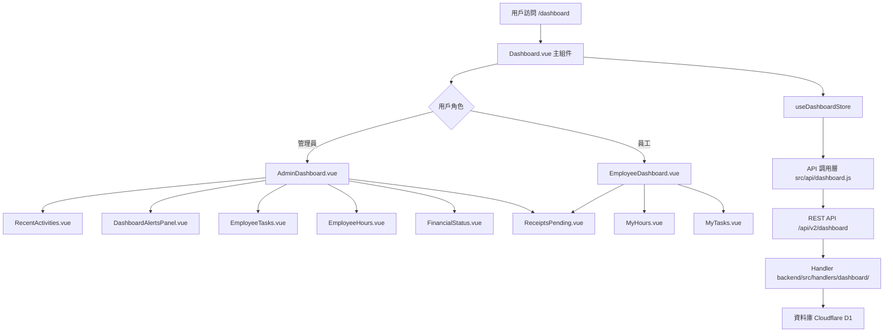

# Design Document: BR15: 儀表板（Dashboard）

## Overview

儀表板功能提供使用者在登入後的首頁總覽，快速掌握待辦、近期活動與關鍵指標，支持管理員與一般員工差異化視圖。

本功能是會計師事務所內部管理系統的核心模組之一，提供統一的儀表板界面，幫助管理員和員工快速了解工作狀況、追蹤任務進度、掌握財務狀況，並及時接收重要提醒。

## Steering Document Alignment

### Technical Standards (tech.md)

遵循以下技術標準：
- 使用 Vue 3 Composition API 開發前端組件
- 使用 Ant Design Vue 作為 UI 組件庫
- 使用 RESTful API 進行前後端通信
- 使用 Cloudflare Workers 作為後端運行環境
- 使用 Cloudflare D1 (SQLite) 作為資料庫
- 遵循統一的錯誤處理和回應格式
- 使用參數化查詢防止 SQL 注入
- 實現數據快取機制提升性能

### Project Structure (structure.md)

遵循以下項目結構：
- 前端組件位於 `src/components/dashboard/` 或 `src/views/Dashboard.vue`
- API 調用層位於 `src/api/dashboard.js`
- 後端 Handler 位於 `backend/src/handlers/dashboard/`
- 資料庫 Migration 位於 `backend/migrations/`
- 遵循命名規範：組件使用 PascalCase，Handler 使用 kebab-case

## Code Reuse Analysis

### Existing Components to Leverage

- **Dashboard.vue**: 現有的儀表板主頁面（需增強）
- **AdminDashboard.vue**: 現有的管理員儀表板組件（需增強）
- **EmployeeDashboard.vue**: 現有的員工儀表板組件（需增強）
- **DashboardAlertsPanel.vue**: 現有的提醒面板組件（需增強以支持 BR2.6 通知類型）
- **useDashboardStore**: 現有的儀表板狀態管理（需增強）
- **handleDashboardAlerts**: 現有的提醒和摘要 API（需增強以支持 BR2.6 通知類型）

### Integration Points

- **handleDashboard**: 處理儀表板數據 API 請求，位於 `backend/src/handlers/dashboard/index.js`
  - API 路由: `GET /api/v2/dashboard`（支援查詢參數篩選）
- **handleDashboardAlerts**: 處理提醒和摘要 API 請求，位於 `backend/src/handlers/dashboard/alerts.js`
  - API 路由: `GET /api/v2/dashboard/alerts`
- **DashboardAlerts 表**: 存儲儀表板提醒（整合 BR2.6 任務通知系統）
- **DashboardSummary 表**: 存儲每日摘要
- **ActiveTasks 表**: 存儲任務資訊
- **Timesheets 表**: 存儲工時記錄
- **Receipts 表**: 存儲收據資訊

## Architecture

### Component Architecture

前端採用 Vue 3 Composition API，組件結構清晰，職責單一：



### Modular Design Principles

- **Single File Responsibility**: 每個組件文件只處理一個功能模組
- **Component Isolation**: 組件之間通過 props 和 events 通信，保持獨立
- **Service Layer Separation**: API 調用與業務邏輯分離，使用統一的 API 工具函數
- **Utility Modularity**: 工具函數按功能分組，可在多處重用

## Components and Interfaces

### Dashboard.vue

- **Purpose**: 儀表板主頁面，整合所有子組件，負責數據載入和狀態管理
- **Location**: `src/views/Dashboard.vue`
- **Interfaces**: 無（頁面組件，無對外接口）
- **Dependencies**: 
  - useDashboardStore（狀態管理）
  - useAuthStore（認證狀態）
  - AdminDashboard / EmployeeDashboard（子組件）
- **Reuses**: 
  - DashboardNotices 組件
  - 自動刷新邏輯

### AdminDashboard.vue

- **Purpose**: 管理員儀表板組件，顯示全公司統計數據
- **Location**: `src/components/dashboard/AdminDashboard.vue`
- **Props**: 
  - `adminData` (Object): 管理員數據
  - `currentYm` (String): 當前年月
  - `financeMode` (String): 財務模式（month/ytd）
  - `financeYm` (String): 財務年月
  - `activityFilters` (Object): 活動篩選條件
- **Events**:
  - `activity-filter-change`: 活動篩選變化
  - `task-month-change`: 任務月份變化
  - `hour-month-change`: 工時月份變化
  - `finance-mode-change`: 財務模式變化
  - `finance-month-change`: 財務月份變化
- **Dependencies**: 多個子組件（RecentActivities, EmployeeTasks 等）
- **Reuses**: 無

### EmployeeDashboard.vue

- **Purpose**: 員工儀表板組件，顯示個人統計數據
- **Location**: `src/components/dashboard/EmployeeDashboard.vue`
- **Props**: 
  - `employeeData` (Object): 員工數據
- **Events**: 無
- **Dependencies**: MyHours, MyTasks, ReceiptsPending 組件
- **Reuses**: 無

### DashboardAlertsPanel.vue

- **Purpose**: 提醒面板組件，顯示即時提醒和今日摘要
- **Location**: `src/components/dashboard/DashboardAlertsPanel.vue`
- **Props**: 
  - `alerts` (Array): 提醒列表
  - `dailySummary` (Object): 每日摘要
  - `loading` (Boolean): 載入狀態
- **Events**:
  - `viewTask`: 查看任務
- **Dependencies**: Ant Design Vue 組件
- **Reuses**: 
  - API 調用工具函數
  - 需要增強以支持 BR2.6 通知類型的顯示格式

### handleDashboard

- **Purpose**: 處理儀表板數據 API 請求
- **Location**: `backend/src/handlers/dashboard/index.js`
- **Parameters**: 
  - `request`: HTTP 請求對象
  - `env`: Cloudflare Workers 環境變數
  - `ctx`: 請求上下文（包含用戶信息）
  - `requestId`: 請求 ID
  - `match`: 路由匹配結果
  - `url`: URL 對象
- **Returns**: 
  - `successResponse`: 成功響應，包含儀表板數據
- **Dependencies**: 
  - getAdminMetrics（管理員數據處理）
  - getEmployeeMetrics（員工數據處理）
  - KV 快取機制
- **Reuses**: 
  - 統一回應格式工具
  - 快取工具函數

### handleDashboardAlerts

- **Purpose**: 處理提醒和摘要 API 請求
- **Location**: `backend/src/handlers/dashboard/alerts.js`
- **Parameters**: 同上
- **Returns**: 
  - `successResponse`: 成功響應，包含提醒列表和每日摘要
- **Dependencies**: 
  - DashboardAlerts 表（整合 BR2.6 任務通知系統）
  - DashboardSummary 表
- **Reuses**: 
  - 統一回應格式工具
  - 需要增強以支持 BR2.6 通知類型的映射

## Data Models

### Dashboard Data Response

```javascript
{
  role: 'admin' | 'employee',
  admin?: {
    employeeTasks: Array<EmployeeTask>,
    employeeHours: Array<EmployeeHour>,
    financialStatus: {
      month: FinancialData,
      ytd: FinancialData
    },
    recentActivities: Array<Activity>,
    teamMembers: Array<User>,
    receiptsPendingTasks: Array<Receipt>,
    alerts: Array<Alert>,
    dailySummary: DailySummary
  },
  employee?: {
    myHours: HoursData,
    myTasks: TasksData,
    receiptsPendingTasks: Array<Receipt>
  }
}
```

### Alert (整合 BR2.6 任務通知系統)

```javascript
{
  id: String,
  type: 'overdue' | 'upcoming' | 'delay' | 'conflict',
  title: String,
  taskId: Number | null,
  configId: Number | null,
  clientName: String | null,
  serviceName: String | null,
  assignee: {
    id: Number,
    name: String
  } | null,
  dueDate: String | null,
  delayDays: Number | null, // 逾期天數（僅逾期通知）
  remainingDays: Number | null, // 剩餘天數（僅即將到期通知）
  createdAt: String,
  description: String | null,
  link: String | null,
  payload: Object
}
```

### DailySummary

```javascript
{
  stats: {
    overdue: Number,
    dueToday: Number,
    waitingForUpdate: Number
  },
  items: Array<SummaryItem>,
  generatedAt: String
}
```

### EmployeeTask

```javascript
{
  userId: Number,
  userName: String,
  overdue: Number,
  inProgress: Number,
  completed: Number
}
```

### EmployeeHour

```javascript
{
  userId: Number,
  userName: String,
  normalHours: Number,
  leaveHours: Number,
  targetHours: Number,
  remainingHours: Number,
  overtimeHours: Number
}
```

### FinancialData

```javascript
{
  revenue: Number,
  cost: Number,
  profit: Number,
  receivable: Number,
  received: Number
}
```

### HoursData

```javascript
{
  month: String,
  total: Number,
  normal: Number,
  overtime: Number,
  targetHours: Number,
  completionRate: Number
}
```

### TasksData

```javascript
{
  items: Array<TaskItem>,
  counts: {
    pending: Number,
    inProgress: Number,
    overdue: Number,
    dueSoon: Number
  }
}
```

### TaskItem

```javascript
{
  taskId: Number,
  title: String,
  status: String,
  dueDate: String,
  clientName: String,
  serviceName: String
}
```

### SummaryItem

```javascript
{
  type: String,
  count: Number,
  description: String
}
```

### Activity

```javascript
{
  id: Number,
  type: String,
  title: String,
  description: String,
  userId: Number,
  userName: String,
  createdAt: String
}
```

### User

```javascript
{
  userId: Number,
  name: String,
  email: String,
  role: String
}
```

### Receipt

```javascript
{
  receiptId: Number,
  receiptNumber: String,
  clientName: String,
  amount: Number,
  status: String,
  taskId: Number,
  taskTitle: String
}
```

## Error Handling

### Error Scenarios

1. **數據載入失敗**
   - **Handling**: 捕獲異常，顯示錯誤提示，記錄錯誤日誌
   - **User Impact**: 顯示錯誤訊息，允許用戶重試

2. **API 請求失敗**
   - **Handling**: 捕獲 API 錯誤，顯示錯誤提示，記錄錯誤日誌
   - **User Impact**: 顯示錯誤訊息，允許用戶重試

3. **自動刷新失敗**
   - **Handling**: 靜默失敗，不影響用戶操作，記錄錯誤日誌
   - **User Impact**: 無明顯影響，下次刷新時重試

4. **權限驗證失敗**
   - **Handling**: 重定向到登入頁面
   - **User Impact**: 需要重新登入

5. **數據格式錯誤**
   - **Handling**: 驗證數據格式，顯示錯誤提示，記錄錯誤日誌
   - **User Impact**: 顯示錯誤訊息，部分數據可能無法顯示

## Testing Strategy

### Unit Testing

- **組件測試**: 測試組件的渲染和交互邏輯
- **Store 測試**: 測試狀態管理的邏輯
- **工具函數測試**: 測試工具函數的正確性
- **測試框架**: 建議使用 Vitest

### Integration Testing

- **API 整合測試**: 測試 API 調用和數據處理
- **組件整合測試**: 測試組件之間的交互
- **測試框架**: 建議使用 Vitest + MSW (Mock Service Worker)

### End-to-End Testing

- **E2E 測試**: 使用 Playwright 測試完整用戶流程
- **測試場景**: 
  - 管理員查看儀表板
  - 員工查看儀表板
  - 自動刷新功能
  - 提醒顯示和跳轉
  - 數據篩選和切換
- **測試數據**: 使用測試工具函數設置測試數據
- **測試帳號**: 使用 `admin`/`111111` 管理員帳號和 `liu`/`111111` 員工帳號


