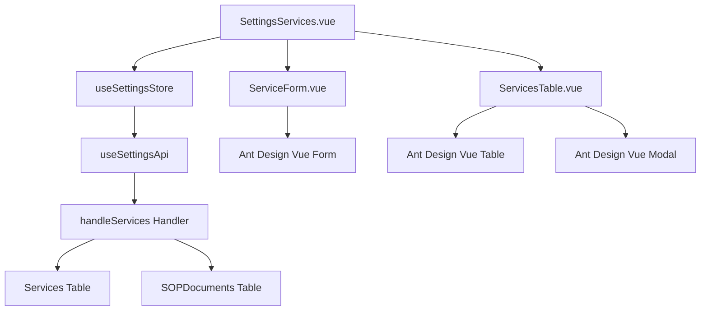

# Design Document: BR16.1: 服務設定

## Overview

服務項目管理功能

本功能是系統設定核心模組之一，提供統一的服務項目管理界面，幫助所有用戶統一管理系統中的服務類型，為客戶服務管理提供基礎資料。

## Steering Document Alignment

### Technical Standards (tech.md)

遵循以下技術標準：
- 使用 Vue 3 Composition API 開發前端組件
- 使用 Ant Design Vue 作為 UI 組件庫
- 使用 RESTful API 進行前後端通信
- 使用 Cloudflare Workers 作為後端運行環境
- 使用 Cloudflare D1 (SQLite) 作為資料庫
- 遵循統一的錯誤處理和回應格式
- 使用參數化查詢防止 SQL 注入

### Project Structure (structure.md)

遵循以下項目結構：
- 前端組件位於 `src/components/settings/` 或 `src/views/settings/`
- API 調用層位於 `src/api/settings.js`
- 後端 Handler 位於 `backend/src/handlers/services.js`
- 資料庫 Migration 位於 `backend/migrations/`
- 遵循命名規範：組件使用 PascalCase，Handler 使用 kebab-case

## Code Reuse Analysis

### Existing Components to Leverage

- **ServiceForm.vue**: 服務項目表單組件（已有，需驗證表單欄位符合需求）
- **ServicesTable.vue**: 服務列表表格組件（已有，需調整顯示欄位）
- **SettingsServices.vue**: 服務設定頁面（已有，需驗證功能完整性）

### Integration Points

- **handleServices**: 處理服務項目 API 請求，位於 `backend/src/handlers/services.js`
  - API 路由: `GET /api/v2/settings/services`（獲取服務列表，所有已登入用戶）
  - API 路由: `POST /api/v2/settings/services`（新增服務，所有已登入用戶）
  - API 路由: `PUT /api/v2/settings/services/:id`（更新服務，所有已登入用戶）
  - API 路由: `DELETE /api/v2/settings/services/:id`（刪除服務，需改為硬刪除，所有已登入用戶）
  - API 路由: `GET /api/v2/settings/services/sops`（獲取服務層級 SOP 列表，所有已登入用戶）
- **Services 表**: 存儲服務項目資訊
- **SOPDocuments 表**: 存儲服務層級 SOP 資訊（scope = 'service'）

## Architecture

### Modular Design Principles
- **Single File Responsibility**: 每個文件應該處理一個特定的關注點或領域
- **Component Isolation**: 創建小而專注的組件，而不是大型單體文件
- **Service Layer Separation**: 分離數據訪問、業務邏輯和表示層
- **Utility Modularity**: 將工具分解為專注的、單一用途的模組



## Components and Interfaces

### SettingsServices.vue
- **Purpose:** 服務設定主頁面，整合表單和列表組件
- **Interfaces:** 
  - Props: 無
  - Events: 無
  - Methods: handleAddService, handleEditService, handleDeleteService, handleFormSubmit, handleFormCancel, loadServices, loadServiceSops
- **Dependencies:** ServiceForm, ServicesTable, useSettingsStore, usePageAlert
- **Reuses:** 現有 SettingsServices.vue 組件

### ServiceForm.vue
- **Purpose:** 服務項目表單組件，用於新增和編輯服務
- **Interfaces:**
  - Props: editingService (Object | null), serviceSops (Array), loading (Boolean)
  - Events: submit (payload: { service_type, service_name, service_sop_id }), cancel
  - Methods: resetForm (exposed), validateForm (internal)
- **Dependencies:** Ant Design Vue Form, useSettingsStore
- **Reuses:** 現有 ServiceForm.vue 組件

### ServicesTable.vue
- **Purpose:** 服務列表表格組件，顯示服務列表和操作按鈕
- **Interfaces:**
  - Props: services (Array), serviceSops (Array), loading (Boolean)
  - Events: edit (service: Object), delete (service: Object)
- **Dependencies:** Ant Design Vue Table, Ant Design Vue Modal (確認對話框)
- **Reuses:** 現有 ServicesTable.vue 組件（需調整顯示欄位）

## Data Models

### Service
```
- service_id: INTEGER (Primary Key)
- service_name: TEXT (Required, Max 100 chars)
- service_code: TEXT (Auto-generated, Unique)
- service_type: TEXT (Required, 'recurring' | 'one_off')
- service_sop_id: INTEGER (Nullable, Foreign Key to SOPDocuments.sop_id)
- is_active: BOOLEAN (Default: 1)
- sort_order: INTEGER (Default: 0)
- created_at: TEXT (ISO 8601)
- updated_at: TEXT (ISO 8601)
```

### SOPDocument (服務層級)
```
- sop_id: INTEGER (Primary Key)
- title: TEXT (Required)
- scope: TEXT (Required, 'service' for service-level SOPs)
- content: TEXT
- created_at: TEXT (ISO 8601)
- updated_at: TEXT (ISO 8601)
```

## Error Handling

### Error Scenarios
1. **新增服務失敗**
   - **Handling:** 顯示錯誤提示，保持表單狀態
   - **User Impact:** 顯示錯誤訊息，用戶可重新提交

2. **編輯服務失敗**
   - **Handling:** 顯示錯誤提示，保持表單狀態
   - **User Impact:** 顯示錯誤訊息，用戶可重新提交

3. **刪除服務失敗**
   - **Handling:** 顯示錯誤提示，不刷新列表
   - **User Impact:** 顯示錯誤訊息，服務項目仍存在

4. **服務代碼生成失敗**
   - **Handling:** 後端自動重試或使用備用方案
   - **User Impact:** 用戶無感知，系統自動處理

5. **服務層級 SOP 載入失敗**
   - **Handling:** 顯示錯誤提示，表單中 SOP 選擇框顯示為空或禁用
   - **User Impact:** 顯示錯誤訊息，用戶無法選擇 SOP，但可以繼續提交表單（SOP 為可選）

6. **服務列表載入失敗**
   - **Handling:** 顯示錯誤提示，表格顯示為空
   - **User Impact:** 顯示錯誤訊息，用戶可重試載入

## Testing Strategy

### Unit Testing
- 測試 ServiceForm 組件的表單驗證邏輯
- 測試 ServicesTable 組件的顯示邏輯
- 測試 useSettingsStore 的狀態管理邏輯

### Integration Testing
- 測試服務列表載入流程（包括載入失敗情況）
- 測試新增/編輯/刪除服務的完整流程
- 測試服務層級 SOP 選擇功能（包括 SOP 載入失敗情況）
- 測試表單驗證邏輯（必填欄位、長度限制）
- 測試刪除確認對話框的取消和確認操作

### End-to-End Testing
- 測試用戶新增服務項目的完整流程（包括成功和失敗情況）
- 測試用戶編輯服務項目的完整流程（包括成功和失敗情況）
- 測試用戶刪除服務項目的完整流程（包括確認和取消操作）
- 測試服務列表顯示（驗證只顯示必要欄位）
- 測試服務層級 SOP 選擇和綁定功能
- 測試未登入用戶訪問服務設定頁面的權限控制


