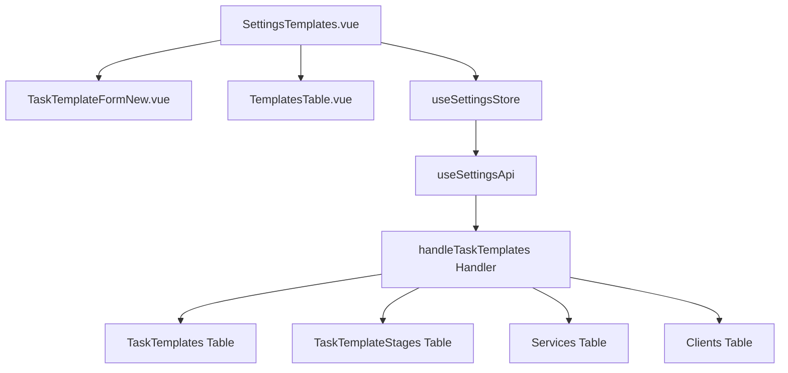

# Design Document: BR16.2: 任務模板設定

## Overview

任務模板管理功能是系統設定核心模組之一，提供統一的任務模板管理界面，幫助所有用戶統一管理任務模板，為任務自動生成提供基礎配置。

本功能包含以下核心能力：
- **模板列表管理**：展示所有任務模板，包含模板基本信息（名稱、服務、客戶）
- **模板詳情查看**：以只讀模式查看模板完整配置和任務階段
- **模板 CRUD 操作**：支援新增、編輯、刪除任務模板
- **模板套用策略**：支援客戶專屬模板和通用模板的優先級套用

## Steering Document Alignment

### Technical Standards (tech.md)

遵循以下技術標準：
- 使用 Vue 3 Composition API 開發前端組件
- 使用 Ant Design Vue 作為 UI 組件庫
- 使用 RESTful API 進行前後端通信
- 使用 Cloudflare Workers 作為後端運行環境
- 使用 Cloudflare D1 (SQLite) 作為資料庫
- 遵循統一的錯誤處理和回應格式
- 使用參數化查詢防止 SQL 注入

### Project Structure (structure.md)

遵循以下項目結構：
- 前端組件位於 `src/components/settings/` 或 `src/views/settings/`
- API 調用層位於 `src/api/settings.js`
- 後端 Handler 位於 `backend/src/handlers/task-templates/`
- 資料庫 Migration 位於 `backend/migrations/`
- 遵循命名規範：組件使用 PascalCase，Handler 使用 kebab-case

## Code Reuse Analysis

### Existing Components to Leverage

- **TaskTemplateFormNew.vue**: 任務模板表單組件（已有，需調整）
- **TemplatesTable.vue**: 任務模板列表表格組件（已有，需調整顯示欄位）
- **SettingsTemplates.vue**: 任務模板設定頁面（已有，需調整）

### Integration Points

- **handleTaskTemplates**: 處理任務模板 API 請求，位於 `backend/src/handlers/task-templates/`
  - API 路由: `GET /api/v2/settings/task-templates`（獲取模板列表，返回包含 service_name 和 client_name）
  - API 路由: `GET /api/v2/settings/task-templates/:id`（獲取模板詳情）
  - API 路由: `POST /api/v2/settings/task-templates`（新增模板）
  - API 路由: `PUT /api/v2/settings/task-templates/:id`（更新模板）
  - API 路由: `DELETE /api/v2/settings/task-templates/:id`（刪除模板，硬刪除）
- **TaskTemplates 表**: 存儲任務模板資訊（template_id, template_name, service_id, client_id 等）
- **TaskTemplateStages 表**: 存儲任務模板階段資訊（stage_id, template_id, stage_name, stage_order 等）
- **Services 表**: 通過 JOIN 查詢獲取服務名稱（service_name）
- **Clients 表**: 通過 JOIN 查詢獲取客戶名稱（company_name as client_name）

## Architecture

### Modular Design Principles
- **Single File Responsibility**: 每個文件應該處理一個特定的關注點或領域
- **Component Isolation**: 創建小而專注的組件，而不是大型單體文件
- **Service Layer Separation**: 分離數據訪問、業務邏輯和表示層
- **Utility Modularity**: 將工具函數拆分為專注的、單一用途的模組



## Components and Interfaces

### SettingsTemplates.vue
- **Purpose:** 任務模板設定主頁面，整合表單和列表組件
- **Interfaces:** 
  - Methods: handleAddTemplate, handleEditTemplate, handleViewTemplate, handleDeleteTemplate
- **Dependencies:** TaskTemplateFormNew, TemplatesTable, useSettingsStore
- **Reuses:** 現有 SettingsTemplates.vue 組件

### TemplatesTable.vue
- **Purpose:** 任務模板列表表格組件，顯示模板列表和操作按鈕
- **Interfaces:**
  - Props: templates, loading
  - Events: view, edit, delete
- **Dependencies:** Ant Design Vue Table
- **Reuses:** 現有 TemplatesTable.vue 組件（需調整顯示欄位：新增服務名稱、客戶名稱）

### TaskTemplateFormNew.vue
- **Purpose:** 任務模板表單組件，用於新增和編輯任務模板
- **Interfaces:**
  - Props: template (可選，編輯時傳入), mode ('create' | 'edit' | 'view')
  - Events: submit, cancel
  - Methods: validate, reset
- **Dependencies:** Ant Design Vue Form, useSettingsStore
- **Reuses:** 現有 TaskTemplateFormNew.vue 組件（需支援查看模式）

## Data Models

### TaskTemplate
```
- template_id: INTEGER (Primary Key)
- template_name: TEXT (Required)
- service_id: INTEGER (Nullable, Foreign Key to Services)
- client_id: INTEGER (Nullable, Foreign Key to Clients)
- created_at: TEXT (ISO 8601)
- updated_at: TEXT (ISO 8601)
```

### TaskTemplateStage
```
- stage_id: INTEGER (Primary Key)
- template_id: INTEGER (Foreign Key to TaskTemplates)
- stage_name: TEXT (Required)
- stage_order: INTEGER (Required)
- estimated_hours: REAL (Nullable)
- execution_frequency: TEXT (Default: 'monthly')
- execution_months: TEXT (JSON array, Default: [1-12])
- description: TEXT (Nullable)
- created_at: TEXT (ISO 8601)
- updated_at: TEXT (ISO 8601)
```

## Error Handling

### Error Scenarios
1. **新增模板失敗**
   - **Handling:** 顯示錯誤提示，保持表單狀態
   - **User Impact:** 顯示錯誤訊息，用戶可重新提交

2. **編輯模板失敗**
   - **Handling:** 顯示錯誤提示，保持表單狀態
   - **User Impact:** 顯示錯誤訊息，用戶可重新提交

3. **刪除模板失敗**
   - **Handling:** 顯示錯誤提示，不刷新列表
   - **User Impact:** 顯示錯誤訊息，模板仍存在

4. **列表載入失敗**
   - **Handling:** 顯示錯誤提示，顯示空狀態
   - **User Impact:** 顯示錯誤訊息，用戶可重新載入

5. **查看模板失敗**
   - **Handling:** 顯示錯誤提示，返回列表頁面
   - **User Impact:** 顯示錯誤訊息，無法查看模板詳情

## Testing Strategy

### Unit Testing
- 測試 TaskTemplateFormNew 組件的表單驗證邏輯
- 測試 TemplatesTable 組件的顯示邏輯

### Integration Testing
- 測試模板列表載入流程
- 測試新增/編輯/查看/刪除模板的完整流程

### End-to-End Testing
- 測試用戶新增任務模板的完整流程
- 測試用戶查看任務模板的完整流程
- 測試用戶編輯任務模板的完整流程
- 測試用戶刪除任務模板的完整流程


