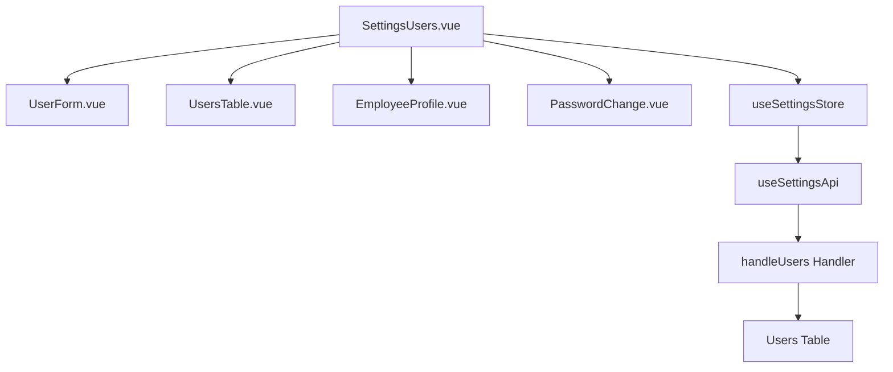

# Design Document: BR16.3: 使用者管理

## Overview

使用者管理功能是系統設定核心模組之一，提供統一的使用者管理界面。本功能包含以下核心能力：

- **管理員功能**：提供完整的使用者 CRUD 操作（新增、編輯、刪除），支援查看和重置使用者密碼，統一管理所有系統使用者
- **員工功能**：提供個人資料編輯界面，允許員工編輯自己的到職日和性別資訊
- **權限控制**：根據使用者角色（管理員/員工）顯示不同的界面和功能，為系統權限控制提供基礎

本功能採用前後端分離架構，前端使用 Vue 3 + Ant Design Vue，後端使用 Cloudflare Workers + D1 資料庫，透過 RESTful API 進行通信。

## Steering Document Alignment

### Technical Standards (tech.md)

遵循以下技術標準：
- 使用 Vue 3 Composition API 開發前端組件
- 使用 Ant Design Vue 作為 UI 組件庫
- 使用 RESTful API 進行前後端通信
- 使用 Cloudflare Workers 作為後端運行環境
- 使用 Cloudflare D1 (SQLite) 作為資料庫
- 遵循統一的錯誤處理和回應格式
- 使用參數化查詢防止 SQL 注入

### Project Structure (structure.md)

遵循以下項目結構：
- 前端組件位於 `src/components/settings/` 或 `src/views/settings/`
- API 調用層位於 `src/api/settings.js`
- 後端 Handler 位於 `backend/src/handlers/settings/user-management.js`
- 資料庫 Migration 位於 `backend/migrations/`
- 遵循命名規範：組件使用 PascalCase，Handler 使用 kebab-case

## Code Reuse Analysis

### Existing Components to Leverage

- **UserForm.vue**: 使用者表單組件（已有）
- **UsersTable.vue**: 使用者列表表格組件（已有）
- **EmployeeProfile.vue**: 員工個人資料組件（已有，需移除電子郵件欄位）
- **PasswordChange.vue**: 密碼修改組件（已有）
- **SettingsUsers.vue**: 使用者管理頁面（已有，需調整）

### Integration Points

- **handleUsers**: 處理使用者 API 請求，位於 `backend/src/handlers/settings/user-management.js`
  - API 路由: `GET /api/v2/settings/users`（獲取使用者列表，僅管理員可訪問）
  - API 路由: `POST /api/v2/settings/users`（新增使用者，僅管理員可訪問）
  - API 路由: `PUT /api/v2/settings/users/:id`（更新使用者資訊，僅管理員可訪問）
  - API 路由: `PUT /api/v2/users/:id/profile`（更新使用者個人資料，管理員可更新任何使用者，員工只能更新自己的資料）
  - API 路由: `DELETE /api/v2/settings/users/:id`（刪除使用者，僅管理員可訪問，硬刪除）
  - API 路由: `GET /api/v2/settings/users/:id/password`（查看使用者密碼，僅管理員可訪問）
  - API 路由: `POST /api/v2/settings/users/:id/reset-password`（重置使用者密碼，僅管理員可訪問）
- **Users 表**: 存儲使用者資訊，位於 Cloudflare D1 資料庫
- **認證系統**: 透過 JWT Token 進行身份驗證和權限檢查

## Architecture

### Modular Design Principles
- **Single File Responsibility**: 每個文件應該處理一個特定的關注點或領域
- **Component Isolation**: 創建小而專注的組件，而不是大型單體文件
- **Service Layer Separation**: 分離數據訪問、業務邏輯和表示層
- **Utility Modularity**: 將工具函數拆分為專注的、單一用途的模組



## Components and Interfaces

### SettingsUsers.vue
- **Purpose:** 使用者管理主頁面，根據用戶角色顯示不同界面
  - 管理員：顯示使用者列表和完整的管理功能
  - 員工：顯示個人資料編輯界面
- **Interfaces:** 
  - Props: 無（從路由和 Store 獲取數據）
  - Methods: 
    - handleAddUser: 處理新增使用者
    - handleEditUser: 處理編輯使用者
    - handleDeleteUser: 處理刪除使用者
    - handleViewPassword: 處理查看密碼
    - handleResetPassword: 處理重置密碼
    - handleProfileSubmit: 處理員工個人資料提交
    - loadUsers: 載入使用者列表（僅管理員）
    - loadMyProfile: 載入個人資料（員工）
- **Dependencies:** UserForm, UsersTable, EmployeeProfile, PasswordChange, useSettingsStore, useAuthStore
- **Reuses:** 現有 SettingsUsers.vue 組件

### EmployeeProfile.vue
- **Purpose:** 員工個人資料編輯組件
- **Interfaces:**
  - Props: user
  - Events: update:formData
  - Methods: validate (exposed)
- **Dependencies:** Ant Design Vue Form
- **Reuses:** 現有 EmployeeProfile.vue 組件（需移除電子郵件欄位）

### UserForm.vue
- **Purpose:** 使用者表單組件，用於新增和編輯使用者
- **Interfaces:**
  - Props: user (可選，編輯時傳入)
  - Events: submit, cancel
  - Methods: validate (exposed), reset
- **Dependencies:** Ant Design Vue Form, Form components
- **Reuses:** 現有 UserForm.vue 組件

### UsersTable.vue
- **Purpose:** 使用者列表表格組件，顯示使用者列表和操作按鈕
- **Interfaces:**
  - Props: users (使用者列表)
  - Events: edit, delete, viewPassword, resetPassword
- **Dependencies:** Ant Design Vue Table, Button, Modal
- **Reuses:** 現有 UsersTable.vue 組件

### PasswordChange.vue
- **Purpose:** 密碼修改組件，用於重置使用者密碼
- **Interfaces:**
  - Props: userId (可選)
  - Events: submit, cancel
  - Methods: validate (exposed), reset
- **Dependencies:** Ant Design Vue Form
- **Reuses:** 現有 PasswordChange.vue 組件

## Data Models

### User
```
- user_id: INTEGER (Primary Key, Auto Increment)
- name: TEXT (Required, Max 100 chars)
- username: TEXT (Required, Max 50 chars, Unique)
- password: TEXT (Hashed, 可選，用於存儲加密後的密碼)
- plain_password: TEXT (明文密碼，用於查看密碼功能)
- gender: TEXT ('male' | 'female', 可選)
- hire_date: TEXT (ISO 8601 date, 可選)
- is_admin: BOOLEAN (Default: false)
- created_at: TEXT (ISO 8601, Auto)
- updated_at: TEXT (ISO 8601, Auto)
```

### User Form Data (前端)
```
- name: string (Required, Max 100 chars)
- username: string (Required, Max 50 chars)
- password: string (Required for create, Min 6 chars)
- gender: 'male' | 'female' (Required)
- hire_date: string (Required, ISO 8601 date)
- is_admin: boolean (Required)
```

### Employee Profile Form Data (前端)
```
- hire_date: string (Required, ISO 8601 date)
- gender: 'male' | 'female' (Optional)
```

## Error Handling

### Error Scenarios
1. **新增使用者失敗**
   - **Handling:** 顯示錯誤提示，保持表單狀態
   - **User Impact:** 顯示錯誤訊息，用戶可重新提交

2. **刪除使用者失敗**
   - **Handling:** 顯示錯誤提示，不刷新列表
   - **User Impact:** 顯示錯誤訊息，使用者仍存在

3. **重置密碼失敗**
   - **Handling:** 顯示錯誤提示，保持彈窗狀態
   - **User Impact:** 顯示錯誤訊息，用戶可重新輸入

4. **權限不足**
   - **Handling:** 返回 403 Forbidden，前端顯示權限不足提示
   - **User Impact:** 顯示權限不足訊息，無法執行操作

5. **使用者不存在**
   - **Handling:** 返回 404 Not Found，前端顯示使用者不存在提示
   - **User Impact:** 顯示錯誤訊息，操作失敗

6. **帳號重複**
   - **Handling:** 返回 400 Bad Request，前端顯示帳號已存在提示
   - **User Impact:** 顯示錯誤訊息，表單保持狀態，用戶可修改帳號

7. **表單驗證失敗**
   - **Handling:** 前端驗證失敗，顯示驗證錯誤訊息，阻止提交
   - **User Impact:** 表單顯示驗證錯誤，用戶可修正後重新提交

## Testing Strategy

### Unit Testing
- 測試 UserForm 組件的表單驗證邏輯
  - 測試必填欄位驗證
  - 測試欄位長度限制
  - 測試密碼長度驗證
- 測試 UsersTable 組件的顯示邏輯
  - 測試使用者列表渲染
  - 測試操作按鈕顯示邏輯
- 測試 EmployeeProfile 組件（確認無電子郵件欄位）
  - 測試表單欄位顯示
  - 測試表單驗證
- 測試後端 Handler 的業務邏輯
  - 測試使用者 CRUD 操作
  - 測試權限檢查
  - 測試參數驗證

### Integration Testing
- 測試使用者列表載入流程
  - 測試 API 調用
  - 測試數據渲染
  - 測試錯誤處理
- 測試新增/編輯/刪除使用者的完整流程
  - 測試表單提交
  - 測試 API 請求
  - 測試成功/失敗處理
  - 測試列表刷新
- 測試員工個人資料編輯流程（確認無電子郵件欄位）
  - 測試表單載入
  - 測試表單提交
  - 測試數據更新
- 測試密碼查看和重置流程
  - 測試密碼查看彈窗
  - 測試密碼重置表單
  - 測試密碼更新

### End-to-End Testing
- 測試管理員新增使用者的完整流程
  - 登入管理員帳號
  - 打開使用者管理頁面
  - 點擊新增按鈕
  - 填寫表單並提交
  - 驗證使用者出現在列表中
- 測試管理員刪除使用者的完整流程（硬刪除）
  - 登入管理員帳號
  - 打開使用者管理頁面
  - 點擊刪除按鈕
  - 確認刪除
  - 驗證使用者從列表中消失
  - 驗證資料庫中使用者被真正刪除
- 測試員工編輯個人資料的完整流程（確認無電子郵件欄位）
  - 登入員工帳號
  - 打開使用者管理頁面（應顯示個人資料編輯界面）
  - 編輯到職日和性別
  - 提交表單
  - 驗證資料更新成功
- 測試權限控制
  - 測試員工無法訪問使用者列表
  - 測試員工只能編輯自己的資料
  - 測試管理員可以訪問所有功能


