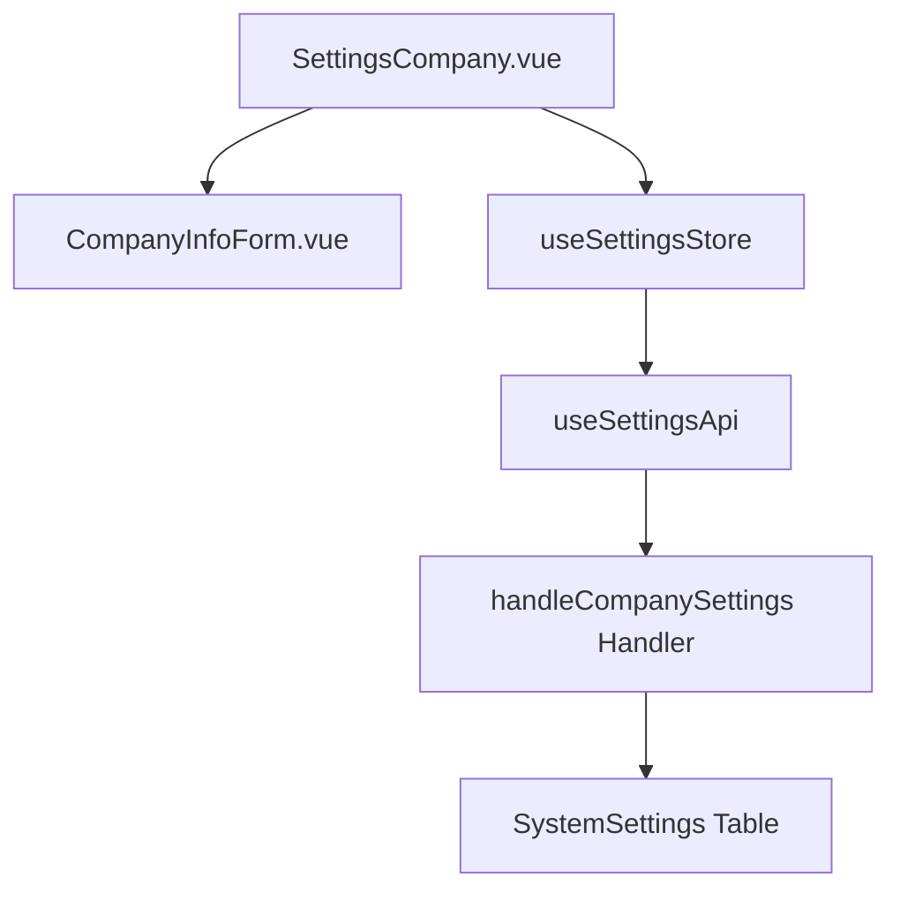

# Design Document: BR16.4: 公司設定

## Overview

公司資料管理功能是系統設定核心模組之一，提供統一的公司資料管理界面，幫助用戶統一管理公司資料，為收據開立等業務提供基礎資料。本功能支援兩個公司資料的切換、編輯和保存，確保公司資料的一致性和準確性。

## Steering Document Alignment

### Technical Standards (tech.md)

遵循以下技術標準：
- 使用 Vue 3 Composition API 開發前端組件
- 使用 Ant Design Vue 作為 UI 組件庫
- 使用 RESTful API 進行前後端通信
- 使用 Cloudflare Workers 作為後端運行環境
- 使用 Cloudflare D1 (SQLite) 作為資料庫
- 遵循統一的錯誤處理和回應格式
- 使用參數化查詢防止 SQL 注入

### Project Structure (structure.md)

遵循以下項目結構：
- 前端組件位於 `src/components/settings/` 或 `src/views/settings/`
- API 調用層位於 `src/api/settings.js`
- 後端 Handler 位於 `backend/src/handlers/settings/`
- 資料庫 Migration 位於 `backend/migrations/`
- 遵循命名規範：組件使用 PascalCase，Handler 使用 kebab-case

## Code Reuse Analysis

### Existing Components to Leverage

- **CompanyInfoForm.vue**: 公司資料表單組件（已有）
- **SettingsCompany.vue**: 公司設定頁面（已有）

### Integration Points

- **handleCompanySettings**: 處理公司設定 API 請求，位於 `backend/src/handlers/settings/`
  - API 路由: `GET /api/v2/settings/company/:setNumber`（獲取公司設定）
  - API 路由: `PUT /api/v2/settings/company/:setNumber`（保存公司設定）
- **SystemSettings 表**: 存儲系統設定（使用設定項前綴區分兩個公司資料）

## Architecture

本功能採用前後端分離架構，前端使用 Vue 3 Composition API 構建響應式界面，後端使用 Cloudflare Workers 提供 RESTful API 服務。資料存儲在 Cloudflare D1 資料庫中，通過設定項前綴區分兩個公司資料。

### Modular Design Principles
- **Single File Responsibility**: 每個文件應該處理一個特定的關注點或領域
- **Component Isolation**: 創建小而專注的組件，而不是大型單體文件
- **Service Layer Separation**: 分離數據訪問、業務邏輯和展示層
- **Utility Modularity**: 將工具函數拆分為專注的、單一用途的模組



## Components and Interfaces

### SettingsCompany.vue
- **Purpose:** 公司設定主頁面，支援兩個公司資料切換和編輯
- **Interfaces:** 
  - Methods: 
    - handleSetNumberChange(setNumber) - 處理公司資料切換
    - handleSave() - 處理公司資料保存
- **Dependencies:** CompanyInfoForm 組件, useSettingsStore (Pinia Store)
- **Reuses:** 現有 SettingsCompany.vue 組件

### CompanyInfoForm.vue
- **Purpose:** 公司資料表單組件，提供公司資料的編輯界面
- **Interfaces:**
  - Props: formData (Object) - 表單資料對象
  - Events: update:formData - 表單資料更新事件
  - Methods: validate() - 表單驗證方法（暴露給父組件）
- **Dependencies:** Ant Design Vue Form 組件庫
- **Reuses:** 現有 CompanyInfoForm.vue 組件

## Data Models

### CompanySettings (SystemSettings 表中的設定項)
```
設定項前綴: company1_ 或 company2_
- company{setNumber}_name: TEXT (公司中文名稱)
- company{setNumber}_name_en: TEXT (公司英文名稱)
- company{setNumber}_tax_id: TEXT (統一編號)
- company{setNumber}_address: TEXT (地址第一行)
- company{setNumber}_address_line2: TEXT (地址第二行)
- company{setNumber}_phone: TEXT (聯絡電話)
- company{setNumber}_bank: TEXT (銀行名稱)
- company{setNumber}_bank_code: TEXT (銀行代號)
- company{setNumber}_account_number: TEXT (銀行帳號)
```

## Error Handling

### Error Scenarios
1. **保存公司資料失敗**
   - **Handling:** 顯示錯誤提示，保持表單狀態，記錄錯誤日誌
   - **User Impact:** 顯示錯誤訊息，用戶可重新提交

2. **載入公司資料失敗**
   - **Handling:** 顯示錯誤提示，初始化為空表單，提供重試選項
   - **User Impact:** 顯示錯誤訊息，用戶可重新載入

3. **切換公司資料時有未保存變更**
   - **Handling:** 顯示確認對話框，詢問是否保存變更
   - **User Impact:** 用戶可選擇保存、放棄或取消切換

4. **網路連線中斷**
   - **Handling:** 顯示連線錯誤提示，提供重試機制
   - **User Impact:** 用戶可重試操作或稍後再試

5. **權限不足**
   - **Handling:** 顯示權限錯誤，重定向到適當頁面
   - **User Impact:** 顯示權限不足訊息，無法訪問功能

## Testing Strategy

### Unit Testing
- 測試 CompanyInfoForm 組件的表單驗證邏輯
  - 測試必填欄位驗證
  - 測試欄位長度限制
  - 測試表單提交驗證
- 測試 SettingsCompany 組件的切換邏輯
  - 測試公司資料切換
  - 測試未保存變更提示
  - 測試資料載入狀態

### Integration Testing
- 測試公司資料載入流程
  - 測試 API 調用
  - 測試資料轉換
  - 測試錯誤處理
- 測試公司資料保存流程
  - 測試資料驗證
  - 測試 API 請求
  - 測試成功/失敗處理
- 測試公司資料切換流程
  - 測試切換時資料載入
  - 測試切換時狀態管理

### End-to-End Testing
- 測試用戶編輯公司資料 1 的完整流程
  - 打開頁面 → 選擇公司資料 1 → 編輯欄位 → 保存 → 驗證保存結果
- 測試用戶編輯公司資料 2 的完整流程
  - 打開頁面 → 選擇公司資料 2 → 編輯欄位 → 保存 → 驗證保存結果
- 測試用戶切換公司資料的完整流程
  - 編輯公司資料 1 → 切換到公司資料 2 → 驗證資料正確載入 → 編輯並保存 → 切換回公司資料 1 → 驗證資料未丟失


