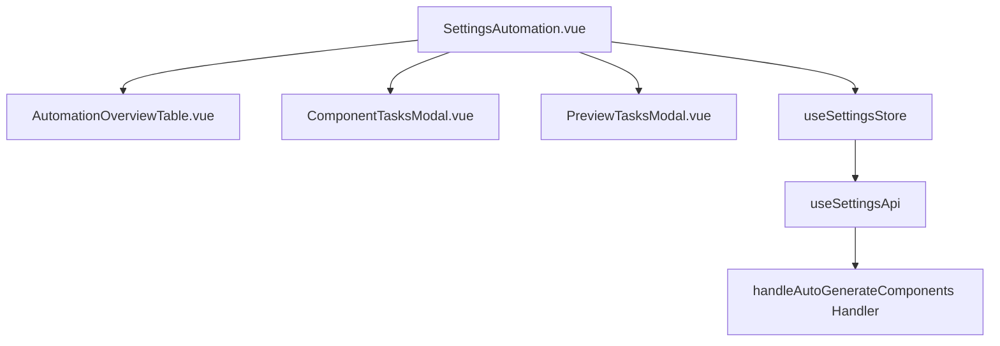

# Design Document: BR16.5: 自動化規則

## Overview

自動化任務管理視圖功能提供系統層級的自動化任務管理視圖，包括顯示已設定自動生成任務的組件列表，查看組件的任務配置，以及預覽下月任務。本功能是系統設定核心模組之一，幫助所有用戶監控和管理自動化任務生成。

## Steering Document Alignment

### Technical Standards (tech.md)

遵循以下技術標準：
- 使用 Vue 3 Composition API 開發前端組件
- 使用 Ant Design Vue 作為 UI 組件庫
- 使用 RESTful API 進行前後端通信
- 使用 Cloudflare Workers 作為後端運行環境
- 使用 Cloudflare D1 (SQLite) 作為資料庫
- 遵循統一的錯誤處理和回應格式

### Project Structure (structure.md)

遵循以下項目結構：
- 前端組件位於 `src/components/settings/` 或 `src/views/settings/`
- API 調用層位於 `src/api/settings.js`
- 後端 Handler 位於 `backend/src/handlers/settings/`
- 遵循命名規範：組件使用 PascalCase，Handler 使用 kebab-case

## Code Reuse Analysis

### Existing Components to Leverage

- **AutomationOverviewTable.vue**: 自動化組件列表表格組件（已有）
- **ComponentTasksModal.vue**: 組件任務配置彈窗組件（已有）
- **PreviewTasksModal.vue**: 預覽任務彈窗組件（已有）
- **SettingsAutomation.vue**: 自動化規則頁面（已有）

### Integration Points

- **handleAutoGenerateComponents Handler**: 處理自動化組件 API 請求
  - API 路由: `GET /api/v2/settings/automation/components`（獲取組件列表）
  - API 路由: `GET /api/v2/settings/automation/components/:id/tasks`（獲取組件任務配置）
  - API 路由: `GET /api/v2/settings/automation/preview`（預覽下月任務）
- **Database/Storage**: 
  - 從 ClientServices 表查詢已設定自動生成的組件
  - 從 TaskConfigs 表查詢組件的任務配置
  - 使用參數化查詢確保安全性

## Architecture

本功能採用前後端分離架構，前端使用 Vue 3 Composition API 構建響應式界面，後端使用 Cloudflare Workers 提供 RESTful API 服務。組件採用模組化設計，通過 Pinia Store 管理狀態，通過 API 層與後端通信。

### Modular Design Principles
- **Single File Responsibility**: 每個文件應該處理一個特定的關注點或領域
- **Component Isolation**: 創建小而專注的組件，而不是大型單體文件
- **Service Layer Separation**: 分離數據訪問、業務邏輯和展示層
- **Utility Modularity**: 將工具函數拆分為專注的、單一用途的模組



## Components and Interfaces

### SettingsAutomation.vue
- **Purpose:** 自動化規則主頁面，顯示組件列表和提供預覽功能
- **Interfaces:** 
  - Methods: handleViewTasks, handlePreviewNextMonth, handleSearch, handleRefresh
- **Dependencies:** AutomationOverviewTable, ComponentTasksModal, PreviewTasksModal, useSettingsStore
- **Reuses:** 現有 SettingsAutomation.vue 組件

### AutomationOverviewTable.vue
- **Purpose:** 顯示自動化組件列表的表格組件
- **Interfaces:** 
  - Props: components (Array), loading (Boolean)
  - Events: view-tasks (componentId), preview-next-month
- **Dependencies:** Ant Design Vue Table 組件
- **Reuses:** 現有 AutomationOverviewTable.vue 組件

### ComponentTasksModal.vue
- **Purpose:** 顯示組件任務配置詳情的彈窗組件
- **Interfaces:** 
  - Props: visible (Boolean), componentId (Number)
  - Events: close
- **Dependencies:** Ant Design Vue Modal 組件, useSettingsApi
- **Reuses:** 現有 ComponentTasksModal.vue 組件

### PreviewTasksModal.vue
- **Purpose:** 顯示下月任務預覽的彈窗組件
- **Interfaces:** 
  - Props: visible (Boolean)
  - Events: close
- **Dependencies:** Ant Design Vue Modal 組件, useSettingsApi
- **Reuses:** 現有 PreviewTasksModal.vue 組件

## Data Models

### AutomationComponent
```
- componentId: INTEGER (主鍵)
- componentName: TEXT (組件名稱)
- clientId: INTEGER (客戶 ID)
- clientName: TEXT (客戶名稱)
- companyName: TEXT (公司名稱)
- serviceId: INTEGER (服務 ID)
- serviceName: TEXT (服務名稱)
```

### TaskConfig
```
- taskConfigId: INTEGER (主鍵)
- componentId: INTEGER (組件 ID，外鍵)
- taskName: TEXT (任務名稱)
- executionFrequency: TEXT (執行頻率)
- [其他任務配置欄位]
```

### PreviewTask
```
- taskId: INTEGER (預覽任務 ID)
- componentId: INTEGER (組件 ID)
- taskName: TEXT (任務名稱)
- scheduledDate: DATE (預定執行日期)
- [其他任務詳情欄位]
```

## Error Handling

### Error Scenarios
1. **載入組件列表失敗**
   - **Handling:** 顯示錯誤提示
   - **User Impact:** 顯示錯誤訊息，用戶可重新載入

2. **預覽任務失敗**
   - **Handling:** 顯示錯誤提示
   - **User Impact:** 顯示錯誤訊息，用戶可重新預覽

3. **查看任務配置失敗**
   - **Handling:** 顯示錯誤提示
   - **User Impact:** 顯示錯誤訊息，用戶可重新嘗試

4. **搜尋無結果**
   - **Handling:** 顯示「無結果」提示
   - **User Impact:** 顯示友好提示訊息，建議調整搜尋條件

## Testing Strategy

### Unit Testing
- **測試 AutomationOverviewTable 組件的顯示邏輯**: 驗證組件正確渲染組件列表，處理空列表情況
- **測試搜尋和篩選功能**: 驗證搜尋功能正確過濾組件，處理搜尋無結果的情況
- **測試組件方法**: 驗證 handleViewTasks, handlePreviewNextMonth, handleSearch 等方法正確執行

### Integration Testing
- **測試組件列表載入流程**: 驗證前端組件正確調用 API，API 正確查詢資料庫，數據正確傳遞到前端
- **測試查看任務配置流程**: 驗證點擊查看按鈕後，API 正確獲取任務配置，彈窗正確顯示數據
- **測試預覽下月任務流程**: 驗證預覽功能正確計算下月日期，API 正確生成預覽任務列表

### End-to-End Testing
- **測試用戶查看自動化組件列表的完整流程**: 從登入到查看組件列表的完整用戶旅程
- **測試用戶查看任務配置的完整流程**: 從組件列表到查看任務配置詳情的完整流程
- **測試用戶預覽下月任務的完整流程**: 從點擊預覽按鈕到查看預覽結果的完整流程
- **測試錯誤處理流程**: 驗證各種錯誤情況下的用戶體驗


