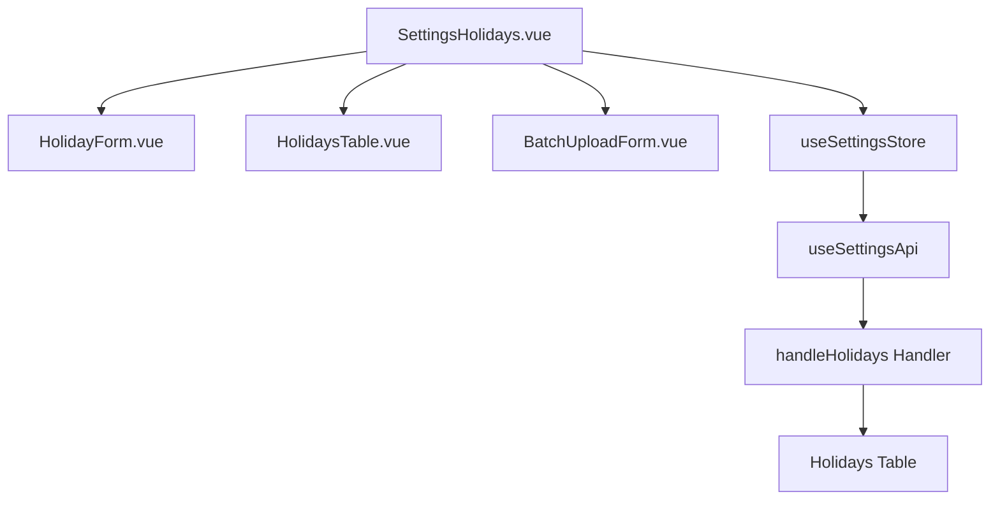

# Design Document: BR16.6: 假日設定

## Overview

國定假日管理功能是系統設定核心模組之一，提供統一的國定假日管理界面。本功能允許所有已登入用戶新增、編輯、刪除國定假日，並支援 CSV 批量上傳功能，幫助用戶統一管理國定假日，為工時、請假、加班等業務提供基礎資料。

本功能採用前後端分離架構，前端使用 Vue 3 Composition API 和 Ant Design Vue 組件庫構建用戶界面，後端使用 Cloudflare Workers 提供 RESTful API，數據存儲在 Cloudflare D1 資料庫中。

## Steering Document Alignment

### Technical Standards (tech.md)

遵循以下技術標準：
- 使用 Vue 3 Composition API 開發前端組件
- 使用 Ant Design Vue 作為 UI 組件庫
- 使用 RESTful API 進行前後端通信
- 使用 Cloudflare Workers 作為後端運行環境
- 使用 Cloudflare D1 (SQLite) 作為資料庫
- 遵循統一的錯誤處理和回應格式
- 使用參數化查詢防止 SQL 注入

### Project Structure (structure.md)

遵循以下項目結構：
- 前端組件位於 `src/components/settings/` 或 `src/views/settings/`
- API 調用層位於 `src/api/settings.js`
- 後端 Handler 位於 `backend/src/handlers/holidays/`
- 資料庫 Migration 位於 `backend/migrations/`
- 遵循命名規範：組件使用 PascalCase，Handler 使用 kebab-case

## Code Reuse Analysis

### Existing Components to Leverage

- **HolidayForm.vue**: 國定假日表單組件（已有）
- **HolidaysTable.vue**: 國定假日列表表格組件（已有）
- **BatchUploadForm.vue**: 批量上傳表單組件（已有）
- **SettingsHolidays.vue**: 假日設定頁面（已有）

### Integration Points

- **handleHolidays**: 處理國定假日 API 請求，位於 `backend/src/handlers/holidays/`
  - API 路由: `GET /api/v2/settings/holidays`（獲取假日列表）
    - 請求參數: `start` (可選), `end` (可選) - 日期範圍過濾
    - 響應格式: `{ success: true, data: { holidays: Holiday[] }, message: string }`
  - API 路由: `POST /api/v2/settings/holidays`（新增假日）
    - 請求體: `{ holiday_date: string, name: string }`
    - 響應格式: `{ success: true, data: { holiday: Holiday }, message: string }`
  - API 路由: `PUT /api/v2/settings/holidays/:date`（更新假日）
    - 請求體: `{ name: string }`
    - 響應格式: `{ success: true, data: { holiday: Holiday }, message: string }`
  - API 路由: `DELETE /api/v2/settings/holidays/:date`（刪除假日，硬刪除）
    - 響應格式: `{ success: true, data: null, message: string }`
  - API 路由: `POST /api/v2/settings/holidays/batch`（批量上傳）
    - 請求體: `{ holidays: Array<{ holiday_date: string, name: string }> }`
    - 響應格式: `{ success: true, data: { successCount: number, skipCount: number, failCount: number, failures: Array<{ row: number, reason: string }> }, message: string }`
- **Holidays 表**: 存儲國定假日資訊

## Architecture

### Modular Design Principles
- **Single File Responsibility**: 每個文件應該處理一個特定的關注點或領域
- **Component Isolation**: 創建小而專注的組件，而不是大型單體文件
- **Service Layer Separation**: 分離數據訪問、業務邏輯和展示層
- **Utility Modularity**: 將工具函數拆分為專注的、單一用途的模組



## Components and Interfaces

### SettingsHolidays.vue
- **Purpose:** 假日設定主頁面，整合表單、列表和批量上傳組件
- **Interfaces:** 
  - Methods: handleAddHoliday, handleEditHoliday, handleDeleteHoliday, handleBatchUpload, handleDownloadSample
- **Dependencies:** HolidayForm, HolidaysTable, BatchUploadForm, useSettingsStore
- **Reuses:** 現有 SettingsHolidays.vue 組件

### HolidaysTable.vue
- **Purpose:** 國定假日列表表格組件，顯示假日列表和操作按鈕
- **Interfaces:**
  - Props: holidays, loading
  - Events: edit, delete
- **Dependencies:** Ant Design Vue Table
- **Reuses:** 現有 HolidaysTable.vue 組件

### HolidayForm.vue
- **Purpose:** 國定假日表單組件，用於新增和編輯國定假日
- **Interfaces:**
  - Props: editingHoliday (Object, 可選，編輯時傳入現有假日資料), loading (Boolean, 表單提交狀態)
  - Events: submit (提交表單，傳遞表單數據和是否為編輯模式), cancel (取消操作)
  - Methods: resetForm (重置表單，供父組件調用)
- **Dependencies:** Ant Design Vue Form, DatePicker, dayjs
- **Reuses:** 現有 HolidayForm.vue 組件
- **Note:** 組件的顯示/隱藏由父組件通過 `v-if` 控制，編輯模式通過 `editingHoliday` prop 是否為 null 判斷

### BatchUploadForm.vue
- **Purpose:** 批量上傳表單組件，處理 CSV 文件上傳和範本下載
- **Interfaces:**
  - Props: loading (Boolean, 上傳狀態)
  - Events: submit (提交批量上傳，傳遞解析後的假日數據), cancel (取消操作)
  - Methods: downloadSample (下載 CSV 範本，供父組件調用)
- **Dependencies:** Ant Design Vue Upload, message
- **Reuses:** 現有 BatchUploadForm.vue 組件
- **Note:** 組件的顯示/隱藏由父組件通過 `v-if` 控制，支援 CSV 檔案上傳和文字貼上兩種方式

## Data Models

### Holiday
```
- holiday_date: TEXT (Primary Key, ISO 8601 date format: YYYY-MM-DD)
- name: TEXT (Required, Max 100 chars)
- is_national_holiday: BOOLEAN (Default: true)
- created_at: TEXT (ISO 8601)
- updated_at: TEXT (ISO 8601)
```

## Error Handling

### Error Scenarios
1. **新增假日失敗**
   - **場景**: 日期已存在、日期格式錯誤、名稱長度超限、必填欄位缺失
   - **Handling:** 顯示錯誤提示，保持表單狀態，標記錯誤欄位
   - **User Impact:** 顯示具體錯誤訊息（如「日期已存在」），用戶可修正後重新提交

2. **編輯假日失敗**
   - **場景**: 假日不存在、名稱長度超限、必填欄位缺失
   - **Handling:** 顯示錯誤提示，保持表單狀態
   - **User Impact:** 顯示錯誤訊息，用戶可修正後重新提交

3. **刪除假日失敗**
   - **場景**: 假日不存在、資料庫錯誤
   - **Handling:** 顯示錯誤提示，不刷新列表
   - **User Impact:** 顯示錯誤訊息，假日仍存在於列表中

4. **批量上傳失敗**
   - **場景**: CSV 格式錯誤、日期格式錯誤、名稱長度超限、部分數據無效
   - **Handling:** 顯示錯誤統計和失敗詳情，成功項目仍會新增
   - **User Impact:** 顯示成功/失敗統計，失敗詳情以 Modal 或列表顯示（包含行號和錯誤原因）

5. **未登入錯誤**
   - **場景**: 未登入用戶嘗試訪問
   - **Handling:** 返回 401 錯誤，前端重定向到登入頁面
   - **User Impact:** 重定向到登入頁面，登入後可正常訪問

## Testing Strategy

### Unit Testing
- 測試 HolidayForm 組件的表單驗證邏輯
- 測試 HolidaysTable 組件的顯示邏輯
- 測試 BatchUploadForm 組件的 CSV 解析邏輯

### Integration Testing
- 測試假日列表載入流程
- 測試新增/編輯/刪除假日的完整流程
- 測試 CSV 批量上傳流程

### End-to-End Testing
- 測試用戶新增國定假日的完整流程
- 測試用戶批量上傳國定假日的完整流程
- 測試用戶刪除國定假日的完整流程（硬刪除）


