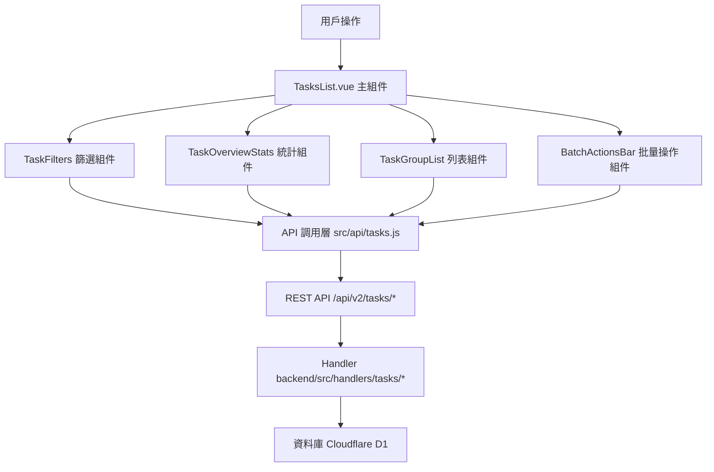

# Design Document: BR2.1: 任務列表

## Overview

任務列表展示、篩選、統計摘要和批量操作功能

本功能是任務管理系統的核心模組之一，提供統一的任務查看、篩選、統計和批量操作界面。本頁面為合併後的任務列表頁面（原「任務列表」和「任務總覽」已合併為單一頁面），幫助員工快速找到需要處理的任務、追蹤任務進度，並進行批量操作。

## Steering Document Alignment

### Technical Standards (tech.md)

遵循以下技術標準：
- 使用 Vue 3 Composition API 開發前端組件
- 使用 Ant Design Vue 作為 UI 組件庫
- 使用 RESTful API 進行前後端通信
- 使用 Cloudflare Workers 作為後端運行環境
- 使用 Cloudflare D1 (SQLite) 作為資料庫
- 遵循統一的錯誤處理和回應格式
- 使用參數化查詢防止 SQL 注入
- 實現任務分組和篩選機制

### Project Structure (structure.md)

遵循以下項目結構：
- 前端組件位於 `src/components/tasks/` 或 `src/views/tasks/`
- API 調用層位於 `src/api/tasks.js`
- 後端 Handler 位於 `backend/src/handlers/tasks/`
- 資料庫 Migration 位於 `backend/migrations/`
- 遵循命名規範：組件使用 PascalCase，Handler 使用 kebab-case

## Code Reuse Analysis

### Existing Components to Leverage

- **TaskFilters.vue**: 用於任務篩選（已有，需增強）
- **TaskGroupList.vue**: 用於任務分組列表展示（已有，需增強）
- **TaskOverviewStats.vue**: 用於統計摘要展示（已有，需整合）
- **BatchActionsBar.vue**: 用於批量操作工具欄（已有，需增強）
- **BatchAssignTaskModal.vue**: 用於批量分配負責人（已有）
- **BatchStatusModal.vue**: 用於批量更新狀態（已有）
- **BatchDueDateModal.vue**: 用於批量調整到期日（已有）
- **PageHeader.vue**: 用於頁面標題和操作按鈕區域

### Integration Points

- **handleGetTasks**: 處理任務列表 API 請求，位於 `backend/src/handlers/tasks/task-crud.js`
  - API 路由: `GET /api/v2/tasks`（支援查詢參數篩選）
- **handleBatchUpdateTasks**: 處理批量操作 API 請求，位於 `backend/src/handlers/tasks/task-batch.js`
  - API 路由: `POST /api/v2/tasks/batch` 或 `PUT /api/v2/tasks/batch`（需新增路由）
- **handleGetTasksStats**: 處理統計摘要 API 請求，位於 `backend/src/handlers/tasks/task-stats.js`
  - API 路由: `GET /api/v2/tasks/stats`（需新增路由，支援查詢參數篩選）
- **ActiveTasks 表**: 存儲任務基本資訊
- **ActiveTaskStages 表**: 存儲任務階段資訊
- **Clients 表**: 存儲客戶資訊
- **ClientServices 表**: 存儲客戶服務資訊

## Architecture

### Component Architecture

前端採用 Vue 3 Composition API，組件結構清晰，職責單一：



### Modular Design Principles

- **Single File Responsibility**: 每個組件文件只處理一個功能模組
- **Component Isolation**: 組件之間通過 props 和 events 通信，保持獨立
- **Service Layer Separation**: API 調用與業務邏輯分離，使用統一的 API 工具函數
- **Utility Modularity**: 工具函數按功能分組，可在多處重用

## Components and Interfaces

### TasksList

- **Purpose**: 任務列表頁面的主組件，整合所有子組件
- **Location**: `src/views/tasks/TasksList.vue` 或 `src/views/tasks/TasksManagement.vue`
- **Props**: 無
- **Events**: 無
- **Dependencies**: 
  - Ant Design Vue 組件庫
  - Vue Router (用於導航，包括快速新增任務跳轉)
  - Pinia Store (任務狀態管理)
- **Reuses**: 
  - TaskFilters, TaskGroupList, TaskOverviewStats, BatchActionsBar 子組件
  - API 調用工具函數 (`@/utils/apiHelpers`)
  - 日期格式化工具 (`@/utils/formatters`)
- **Features**:
  - 處理 TaskFilters 的 `@add-task` 事件，跳轉到服務設定頁面
  - 處理 TaskGroupList 的 `@client-click` 事件，跳轉到客戶詳情頁面
  - 在組件掛載時獲取用戶列表、標籤列表、服務類型列表等前置數據
  - 將前置數據傳遞給 TaskFilters 組件

### TaskFilters

- **Purpose**: 任務篩選組件
- **Location**: `src/components/tasks/TaskFilters.vue`
- **Props**: 
  - `filters` (Object, required): 當前篩選條件
  - `users` (Array, required): 用戶列表（用於負責人篩選，由父組件從 API 獲取）
  - `tags` (Array, required): 標籤列表（用於標籤篩選，由父組件從 API 獲取）
  - `serviceTypes` (Array, optional): 服務類型列表（用於服務類型篩選，由父組件從 API 獲取）
  - `selectedTaskIds` (Array, required): 已選中的任務 IDs
- **Events**:
  - `@filters-change`: 篩選條件變更
  - `@batch-assign`: 觸發批量分配
  - `@add-task`: 觸發新增任務
- **Dependencies**: Ant Design Vue 組件庫
- **Reuses**: API 調用工具函數
- **Data Sources**: 
  - 用戶列表：從 `src/api/users.js` 或相關 API 獲取
  - 標籤列表：從 `src/api/tags.js` 或相關 API 獲取
  - 服務類型：從 `src/api/services.js` 或相關 API 獲取

### TaskGroupList

- **Purpose**: 任務分組列表展示組件
- **Location**: `src/components/tasks/TaskGroupList.vue`
- **Props**: 
  - `tasks` (Array, required): 任務列表
  - `clients` (Array, required): 客戶列表
  - `loading` (Boolean, optional): 加載狀態
  - `selectedTaskIds` (Array, required): 已選中的任務 IDs
  - `hideCompleted` (Boolean, optional): 是否隱藏已完成任務
  - `myTasksOnly` (Boolean, optional): 是否只顯示「我的任務」模式（高亮自己的任務）
- **Events**:
  - `@selection-change`: 選擇變更
  - `@view-task`: 查看任務詳情
  - `@quick-add-task`: 快速新增任務
  - `@client-click`: 點擊客戶名稱跳轉
- **Dependencies**: Ant Design Vue 組件庫
- **Reuses**: 日期格式化工具

### TaskOverviewStats

- **Purpose**: 統計摘要展示組件
- **Location**: `src/components/tasks/TaskOverviewStats.vue`
- **Props**: 
  - `stats` (Object, required): 統計數據
  - `loading` (Boolean, optional): 加載狀態
- **Events**: 無
- **Dependencies**: Ant Design Vue 組件庫
- **Reuses**: 無

### BatchActionsBar

- **Purpose**: 批量操作工具欄組件
- **Location**: `src/components/tasks/BatchActionsBar.vue`
- **Props**: 
  - `selectedTaskIds` (Array, required): 已選中的任務 IDs
  - `disabled` (Boolean, optional): 是否禁用
- **Events**:
  - `@batch-assign`: 觸發批量分配
  - `@batch-status`: 觸發批量更新狀態
  - `@batch-due-date`: 觸發批量調整到期日
- **Dependencies**: Ant Design Vue 組件庫
- **Reuses**: 無

## Data Models

### Task

```javascript
{
  task_id: Integer (PK),
  task_name: String (required),
  client_id: String (FK -> Clients.client_id),
  client_name: String, // 客戶名稱（JOIN 查詢）
  service_id: Integer (FK -> ClientServices.service_id),
  service_name: String, // 服務名稱（JOIN 查詢）
  service_year: Integer,
  service_month: Integer,
  assignee_user_id: Integer (FK -> Users.user_id),
  assignee_name: String, // 負責人名稱（JOIN 查詢）
  status: String (pending|in_progress|completed|cancelled),
  due_date: Date,
  stage_order: Integer,
  total_stages: Integer, // 總階段數（用於顯示「階段X/Y」）
  is_overdue: Boolean,
  can_start: Boolean, // 是否可開始（所有前置階段任務都已完成）
  created_at: DateTime,
  updated_at: DateTime,
  is_deleted: Boolean
}
```

### TaskStats

```javascript
{
  total: Integer, // 總任務數
  in_progress: Integer, // 進行中任務數
  completed: Integer, // 已完成任務數
  overdue: Integer, // 逾期任務數
  can_start: Integer // 可開始任務數
}
```

## Error Handling

### Error Scenarios

1. **API 請求失敗**
   - **Handling**: 使用 `extractApiError` 提取錯誤訊息，使用 `message.error` 顯示錯誤提示
   - **User Impact**: 顯示友好的錯誤訊息（例如：「載入任務列表失敗，請稍後再試」）

2. **篩選條件無效**
   - **Handling**: 驗證篩選條件，顯示錯誤提示
   - **User Impact**: 顯示「篩選條件無效，請檢查後重試」

3. **批量操作失敗**
   - **Handling**: 捕獲批量操作錯誤，顯示錯誤提示，部分成功的任務顯示警告
   - **User Impact**: 顯示「批量操作部分失敗」並列出失敗的任務

4. **權限不足**
   - **Handling**: API 返回 403 錯誤，前端檢查並顯示權限提示
   - **User Impact**: 顯示「您沒有權限執行此操作」並隱藏相關功能按鈕

5. **數據不存在**
   - **Handling**: API 返回空列表，前端顯示空狀態
   - **User Impact**: 顯示「沒有找到符合條件的任務」空狀態提示

6. **網路錯誤**
   - **Handling**: 捕獲網路異常，顯示網路錯誤提示，提供重試選項
   - **User Impact**: 顯示「網路連線失敗，請檢查網路後重試」

## Testing Strategy

### Unit Testing

- **組件測試**: 測試組件的 props、events、computed 屬性
- **工具函數測試**: 測試格式化、驗證等工具函數
- **測試框架**: 建議使用 Vitest

### Integration Testing

- **API 整合測試**: 測試 API 調用和回應處理
- **組件整合測試**: 測試組件之間的交互
- **測試框架**: 建議使用 Vitest + MSW (Mock Service Worker)

### End-to-End Testing

- **E2E 測試**: 使用 Playwright 測試完整用戶流程
- **測試場景**: 
  - 任務列表頁面載入和展示
  - 任務篩選功能（服務月份、客戶搜尋、狀態切換、高級篩選）
  - 任務分組展示（客戶 → 月份 → 服務 → 階段 → 任務）
  - 統計摘要顯示和更新
  - 批量操作（批量分配、批量更新狀態、批量調整到期日）
  - 「我的任務」篩選功能
  - 快速新增任務功能
- **測試數據**: 使用測試工具函數設置測試數據
- **測試帳號**: 使用 `admin`/`111111` 管理員帳號和 `liu`/`111111` 員工帳號


