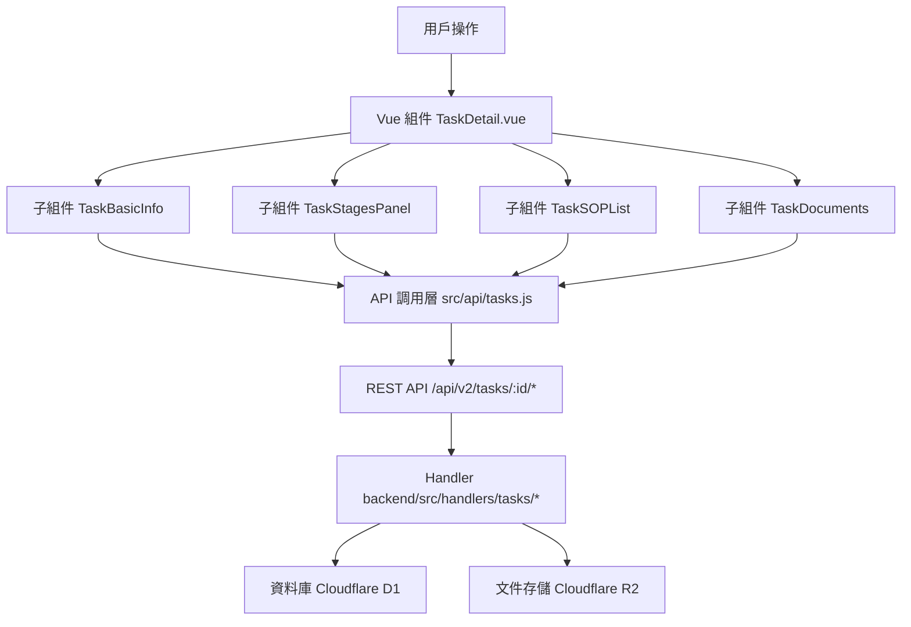

# Design Document: BR2.2: 任務詳情

## Overview

任務詳情展示、狀態更新、階段管理、SOP 關聯、文檔管理和變更歷史功能

本功能是任務管理系統的核心模組之一，提供任務的完整資訊展示和管理功能，幫助員工了解任務全貌、更新任務狀態、管理任務階段，並查看任務相關的 SOP 和文檔。

## Steering Document Alignment

### Technical Standards (tech.md)

遵循以下技術標準：
- 使用 Vue 3 Composition API 開發前端組件
- 使用 Ant Design Vue 作為 UI 組件庫
- 使用 RESTful API 進行前後端通信
- 使用 Cloudflare Workers 作為後端運行環境
- 使用 Cloudflare D1 (SQLite) 作為資料庫
- 使用 Cloudflare R2 作為文件存儲（知識庫-附件）
- 遵循統一的錯誤處理和回應格式
- 使用參數化查詢防止 SQL 注入
- 實現完整的變更歷史記錄機制

### Project Structure (structure.md)

遵循以下項目結構：
- 前端組件位於 `src/components/tasks/` 或 `src/views/tasks/`
- API 調用層位於 `src/api/tasks.js`
- 後端 Handler 位於 `backend/src/handlers/tasks/`
- 資料庫 Migration 位於 `backend/migrations/`
- 遵循命名規範：組件使用 PascalCase，Handler 使用 kebab-case

## Code Reuse Analysis

### Existing Components to Leverage

- **TaskBasicInfo.vue**: 用於任務基本信息展示和編輯
- **TaskStagesPanel.vue**: 用於任務階段展示和管理
- **TaskSOPList.vue**: 用於 SOP 列表展示和管理
- **TaskDocuments.vue**: 用於文檔列表展示和管理
- **UpdateStatusModal.vue**: 用於任務狀態更新彈窗
- **AdjustmentHistoryModal.vue**: 用於變更歷史展示彈窗
- **PageHeader.vue**: 用於頁面標題和操作按鈕區域

### Integration Points

- **handleGetTaskDetail**: 處理任務詳情 API 請求，位於 `backend/src/handlers/tasks/task-crud.js`
- **handleUpdateTaskStatus**: 處理任務狀態更新 API 請求，位於 `backend/src/handlers/tasks/task-updates.js`
- **handleUpdateTaskAssignee**: 處理負責人更新 API 請求，位於 `backend/src/handlers/tasks/task-updates.js`
- **handleGetTaskSOPs**: 處理 SOP 列表查詢 API 請求，位於 `backend/src/handlers/tasks/task-sops.js`
- **handleUpdateTaskSOPs**: 處理 SOP 關聯更新 API 請求，位於 `backend/src/handlers/tasks/task-sops.js`
- **handleGetTaskDocuments**: 處理文檔列表查詢 API 請求，位於 `backend/src/handlers/tasks/task-documents.js`
- **handleUploadTaskDocument**: 處理文檔上傳 API 請求，位於 `backend/src/handlers/tasks/task-documents.js`
- **handleDownloadTaskDocument**: 處理文檔下載 API 請求，位於 `backend/src/handlers/tasks/task-documents.js`
- **handleDeleteTaskDocument**: 處理文檔刪除 API 請求，位於 `backend/src/handlers/tasks/task-documents.js`
- **handleGetTaskHistory**: 處理變更歷史查詢 API 請求，位於 `backend/src/handlers/tasks/task-history.js`
- **ActiveTasks 表**: 存儲任務基本資訊
- **ActiveTaskStages 表**: 存儲任務階段資訊
- **TaskStatusUpdates 表**: 存儲任務狀態變更歷史
- **TaskDueDateAdjustments 表**: 存儲到期日調整歷史
- **TaskEventLogs 表**: 存儲任務事件日誌（包括負責人變更等事件）
- **ActiveTaskSOPs 表**: 存儲任務 SOP 關聯
- **InternalDocuments 表**: 存儲任務文檔（知識庫-附件）
- **SOPDocuments 表**: 存儲 SOP 文檔資訊
- **R2 存儲**: 用於存儲上傳的文檔文件

## Architecture

### Component Architecture

前端採用 Vue 3 Composition API，組件結構清晰，職責單一：



### Modular Design Principles

- **Single File Responsibility**: 每個組件文件只處理一個功能模組
- **Component Isolation**: 組件之間通過 props 和 events 通信，保持獨立
- **Service Layer Separation**: API 調用與業務邏輯分離，使用統一的 API 工具函數
- **Utility Modularity**: 工具函數按功能分組，可在多處重用

## Components and Interfaces

### TaskDetail

- **Purpose**: 任務詳情頁面的主組件，整合所有子組件
- **Location**: `src/views/tasks/TaskDetail.vue`
- **Props**: 無（從路由參數獲取 taskId）
- **Events**: 無
- **Dependencies**: 
  - Ant Design Vue 組件庫
  - Vue Router (用於導航)
  - Pinia Store (任務狀態管理)
- **Reuses**: 
  - TaskBasicInfo, TaskStagesPanel, TaskSOPList, TaskDocuments 子組件
  - API 調用工具函數 (`@/utils/apiHelpers`)
  - 日期格式化工具 (`@/utils/formatters`)

### TaskBasicInfo

- **Purpose**: 任務基本信息展示和編輯
- **Location**: `src/components/tasks/TaskBasicInfo.vue`
- **Props**: 
  - `task` (Object, required): 任務對象
  - `users` (Array, required): 用戶列表（用於負責人選擇）
- **Events**:
  - `@update-status`: 觸發狀態更新
  - `@view-history`: 觸發查看變更歷史
  - `@update-assignee`: 觸發更新負責人
- **Dependencies**: Ant Design Vue 組件庫
- **Reuses**: API 調用工具函數

### TaskStagesPanel

- **Purpose**: 任務階段展示和管理
- **Location**: `src/components/tasks/TaskStagesPanel.vue`
- **Props**: 
  - `stages` (Array, required): 階段列表
  - `loading` (Boolean, optional): 加載狀態
- **Events**:
  - `@edit-stage`: 觸發編輯階段
- **Dependencies**: Ant Design Vue 組件庫
- **Reuses**: 日期格式化工具

### TaskSOPList

- **Purpose**: SOP 列表展示和管理（內嵌形式，非彈窗）
- **Location**: `src/components/tasks/TaskSOPList.vue`
- **Props**: 
  - `taskId` (Number, required): 任務 ID
  - `sops` (Array, required): 已關聯的 SOP 列表
  - `allSOPs` (Array, required): 所有可選的 SOP 列表
  - `loading` (Boolean, optional): 加載狀態
- **Events**:
  - `@update`: 觸發 SOP 更新
- **Dependencies**: Ant Design Vue 組件庫
- **Reuses**: API 調用工具函數

### TaskDocuments

- **Purpose**: 文檔列表展示和管理（上傳、下載、刪除）
- **Location**: `src/components/tasks/TaskDocuments.vue`
- **Props**: 
  - `taskId` (Number, required): 任務 ID
  - `documents` (Array, required): 文檔列表
  - `loading` (Boolean, optional): 加載狀態
- **Events**:
  - `@upload-success`: 文檔上傳成功
  - `@delete-success`: 文檔刪除成功
- **Dependencies**: Ant Design Vue 組件庫
- **Reuses**: API 調用工具函數、R2 上傳工具

### UpdateStatusModal

- **Purpose**: 任務狀態更新彈窗（包含到期日調整）
- **Location**: `src/components/tasks/UpdateStatusModal.vue`
- **Props**: 
  - `visible` (Boolean, required): 是否顯示
  - `task` (Object, required): 任務對象
- **Events**:
  - `@success`: 更新成功
  - `@cancel`: 取消操作
- **Dependencies**: Ant Design Vue 組件庫
- **Reuses**: API 調用工具函數

### AdjustmentHistoryModal

- **Purpose**: 變更歷史展示彈窗
- **Location**: `src/components/tasks/AdjustmentHistoryModal.vue`
- **Props**: 
  - `visible` (Boolean, required): 是否顯示
  - `taskId` (Number, required): 任務 ID
  - `loading` (Boolean, optional): 加載狀態
- **Events**: 無
- **Dependencies**: Ant Design Vue 組件庫
- **Reuses**: API 調用工具函數

## Data Models

### Task

```javascript
{
  task_id: Integer (PK),
  task_name: String (required),
  client_id: String (FK -> Clients.client_id),
  service_id: Integer (FK -> ClientServices.service_id),
  service_year: Integer,
  service_month: Integer,
  assignee_user_id: Integer (FK -> Users.user_id),
  status: String (pending|in_progress|completed|cancelled),
  due_date: Date,
  estimated_hours: Decimal,
  description: Text,
  notes: Text,
  task_config_id: Integer (FK -> TaskConfigurations.task_config_id),
  created_at: DateTime,
  updated_at: DateTime,
  is_deleted: Boolean
}
```

### TaskStage

```javascript
{
  active_stage_id: Integer (PK), // 資料庫欄位名為 active_stage_id
  task_id: Integer (FK -> ActiveTasks.task_id),
  stage_order: Integer (required),
  stage_name: String,
  status: String (pending|in_progress|completed), // pending 表示可開始狀態
  started_at: DateTime, // 資料庫欄位名為 started_at
  completed_at: DateTime, // 資料庫欄位名為 completed_at
  delay_days: Integer,
  notes: Text,
  triggered_at: DateTime,
  triggered_by: String,
  created_at: DateTime,
  updated_at: DateTime
}
```

### TaskStatusUpdate

```javascript
{
  update_id: Integer (PK),
  task_id: Integer (FK -> ActiveTasks.task_id),
  status: String (required), // 當前狀態（保留向後兼容）
  old_status: String, // 舊狀態
  new_status: String (required), // 新狀態
  progress_note: Text, // 進度說明（進行中時填寫）
  blocker_reason: Text, // 阻塞原因（被阻塞時必填）
  overdue_reason: Text, // 逾期原因（逾期時必填）
  expected_completion_date: Date, // 預計完成日期
  updated_by: Integer (FK -> Users.user_id, required),
  updated_at: DateTime
}
```

**注意**: 
- `status` 欄位保留用於向後兼容，實際使用 `old_status` 和 `new_status`
- `progress_note`、`blocker_reason`、`overdue_reason` 根據狀態類型選擇性填寫
- 狀態更新時必須填寫狀態說明（通過 `progress_note`、`blocker_reason` 或 `overdue_reason` 之一）

### TaskDueDateAdjustment

```javascript
{
  adjustment_id: Integer (PK),
  task_id: Integer (FK -> ActiveTasks.task_id),
  old_due_date: Date (required),
  new_due_date: Date (required),
  days_changed: Integer (required), // 負數=提前，正數=延後
  adjustment_reason: Text, // 調整原因
  adjustment_type: String (required), // initial_create/manual_adjust/system_auto/overdue_adjust
  requested_by: Integer (FK -> Users.user_id, required), // 申請人
  requested_at: DateTime, // 申請時間
  is_overdue_adjustment: Boolean, // 是否在逾期後調整
  is_initial_creation: Boolean, // 是否是初始創建時的調整
  is_system_auto: Boolean // 是否是系統自動調整
}
```

**注意**: 
- 使用 `requested_by` 和 `requested_at` 欄位（而非 `adjusted_by` 和 `adjusted_at`）
- `adjustment_type` 用於區分調整類型
- `days_changed` 記錄調整天數（負數=提前，正數=延後）

### ActiveTaskSOPs

```javascript
{
  relation_id: Integer (PK),
  task_id: Integer (FK -> ActiveTasks.task_id),
  sop_id: Integer (FK -> SOPDocuments.sop_id),
  sort_order: Integer,
  created_at: DateTime
}
```

**注意**: 
- 任務 SOP 關聯存儲在 `ActiveTaskSOPs` 表中
- 服務層級 SOP 從 `TaskConfigSOPs` 或 `ClientServiceSOPs` 自動帶入
- 任務層級 SOP 手動選擇，存儲在 `ActiveTaskSOPs` 表中

### InternalDocuments (任務文檔)

```javascript
{
  document_id: Integer (PK),
  task_id: Integer (FK -> ActiveTasks.task_id), // 通過 task_id 關聯任務
  file_name: String (required),
  file_size: Integer,
  file_path: String (R2 key),
  category: String, // 文檔分類
  uploaded_by: Integer (FK -> Users.user_id),
  uploaded_at: DateTime,
  doc_year: Integer,
  doc_month: Integer,
  related_entity_type: String, // 關聯實體類型
  related_entity_id: String, // 關聯實體 ID
  is_deleted: Boolean
}
```

**注意**: 
- 任務文檔存儲在 `InternalDocuments` 表中，通過 `task_id` 欄位關聯任務
- 文檔上傳到 R2 存儲，文件路徑存儲在 `file_path` 欄位
- 文檔屬於知識庫-附件類別

### TaskAssigneeChange

```javascript
{
  change_id: Integer (PK),
  task_id: Integer (FK -> ActiveTasks.task_id),
  old_assignee_id: Integer (FK -> Users.user_id),
  new_assignee_id: Integer (FK -> Users.user_id, required),
  changed_by: Integer (FK -> Users.user_id, required),
  changed_at: DateTime
}
```

**注意**: 
- 負責人變更歷史記錄在 TaskEventLogs 表中（event_type = 'assignee_changed'），payload_json 包含 old_assignee_id 和 new_assignee_id
- 階段狀態變更歷史記錄在 TaskEventLogs 表中（event_type = 'stage_status_changed'），payload_json 包含 stage_id、old_status 和 new_status
- SOP 關聯變更歷史記錄在 TaskEventLogs 表中（event_type = 'sop_association_changed'），payload_json 包含 added_sop_ids 和 removed_sop_ids
- 文檔變更歷史記錄在 TaskEventLogs 表中（event_type = 'document_changed'），payload_json 包含 document_id 和 action (upload/delete)
- 使用 TaskEventLogs 表統一記錄所有事件類型的變更歷史

## Error Handling

### Error Scenarios

1. **任務不存在（404）**
   - **Handling**: API 返回 404 錯誤，前端檢查並跳轉到任務列表頁面
   - **User Impact**: 顯示「任務不存在」並自動跳轉

2. **狀態更新失敗**
   - **Handling**: 使用 `extractApiError` 提取錯誤訊息，使用 `message.error` 顯示錯誤提示
   - **User Impact**: 顯示友好的錯誤訊息（例如：「狀態更新失敗，請稍後再試」）

3. **文檔上傳失敗**
   - **Handling**: 捕獲上傳錯誤，顯示錯誤提示，保留已選擇的文件
   - **User Impact**: 顯示「文檔上傳失敗」並顯示具體錯誤原因

4. **權限不足**
   - **Handling**: API 返回 403 錯誤，前端檢查並顯示權限提示
   - **User Impact**: 顯示「您沒有權限執行此操作」並隱藏相關功能按鈕

5. **階段同步失敗**
   - **Handling**: 捕獲同步錯誤，顯示錯誤提示，不更新階段狀態
   - **User Impact**: 顯示「階段同步失敗」並保持當前狀態

6. **網路錯誤**
   - **Handling**: 捕獲網路異常，顯示網路錯誤提示，提供重試選項
   - **User Impact**: 顯示「網路連線失敗，請檢查網路後重試」

## Testing Strategy

### Unit Testing

- **組件測試**: 測試組件的 props、events、computed 屬性
- **工具函數測試**: 測試格式化、驗證等工具函數
- **測試框架**: 建議使用 Vitest

### Integration Testing

- **API 整合測試**: 測試 API 調用和回應處理
- **組件整合測試**: 測試組件之間的交互
- **測試框架**: 建議使用 Vitest + MSW (Mock Service Worker)

### End-to-End Testing

- **E2E 測試**: 使用 Playwright 測試完整用戶流程
- **測試場景**: 
  - 任務詳情頁面載入和展示
  - 任務狀態更新流程（包含到期日調整）
  - 任務階段自動更新邏輯
  - SOP 關聯管理（內嵌形式）
  - 文檔上傳、下載、刪除
  - 變更歷史查看
- **測試數據**: 使用測試工具函數設置測試數據
- **測試帳號**: 使用 `admin`/`111111` 管理員帳號和 `liu`/`111111` 員工帳號


