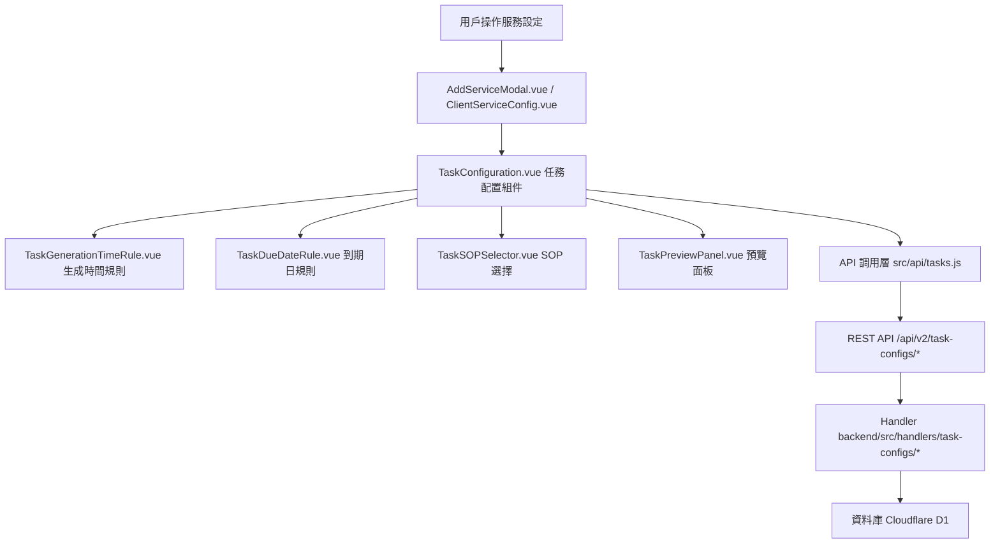

# Design Document: BR2.3: 任務創建

## Overview

在服務設定中創建任務配置，包括任務生成時間規則、到期日規則、SOP 自動綁定、即時預覽和任務生成功能

本功能是任務管理系統的核心模組之一，提供在服務設定中統一管理任務配置的功能，支援一次性服務立即生成任務和定期服務自動生成任務。

## Steering Document Alignment

### Technical Standards (tech.md)

遵循以下技術標準：
- 使用 Vue 3 Composition API 開發前端組件
- 使用 Ant Design Vue 作為 UI 組件庫
- 使用 RESTful API 進行前後端通信
- 使用 Cloudflare Workers 作為後端運行環境
- 使用 Cloudflare D1 (SQLite) 作為資料庫
- 遵循統一的錯誤處理和回應格式
- 使用參數化查詢防止 SQL 注入
- 實現任務配置驗證和即時預覽機制

### Project Structure (structure.md)

遵循以下項目結構：
- 前端組件位於 `src/components/clients/` 或 `src/views/clients/`
- API 調用層位於 `src/api/tasks.js` 或 `src/api/services.js`
- 後端 Handler 位於 `backend/src/handlers/task-configs/`
- 資料庫 Migration 位於 `backend/migrations/`
- 遵循命名規範：組件使用 PascalCase，Handler 使用 kebab-case

## Code Reuse Analysis

### Existing Components to Leverage

- **TaskConfiguration.vue**: 用於任務配置的主要組件（已有，需增強）
- **PreviewTasksModal.vue**: 用於任務生成預覽（已有，需增強）
- **AddServiceModal.vue**: 服務設定模組，整合任務配置
- **ServiceItems 選擇器**: 用於選擇任務名稱（從服務類型下的任務類型列表）

### Integration Points

- **handleGetTaskConfigs**: 處理獲取任務配置列表 API 請求，位於 `backend/src/handlers/task-configs/task-config-crud.js`
- **handleCreateTaskConfig**: 處理任務配置創建 API 請求，位於 `backend/src/handlers/task-configs/task-config-crud.js`
- **handleUpdateTaskConfig**: 處理任務配置更新 API 請求
- **handleDeleteTaskConfig**: 處理任務配置刪除 API 請求
- **handleGenerateTasksForOneTimeService**: 處理一次性服務任務生成 API 請求
- **ClientServiceTaskConfigs 表**: 存儲任務配置資訊
- **ServiceItems 表**: 存儲服務類型下的任務類型列表
- **SOPDocuments 表**: 用於自動讀取和綁定 SOP（知識庫 SOP 文件）
- **ClientServices 表**: 存儲客戶服務資訊

## Architecture

### Component Architecture

前端採用 Vue 3 Composition API，組件結構清晰，職責單一：



### Modular Design Principles

- **Single File Responsibility**: 每個組件文件只處理一個功能模組
- **Component Isolation**: 組件之間通過 props 和 events 通信，保持獨立
- **Service Layer Separation**: API 調用與業務邏輯分離，使用統一的 API 工具函數
- **Utility Modularity**: 工具函數按功能分組，可在多處重用

## Components and Interfaces

### TaskConfiguration

- **Purpose**: 任務配置的主要組件，整合所有任務配置功能
- **Interfaces**: 
  - Props: `clientId` (String, required), `serviceType` (String, required), `serviceId` (Integer, optional), `isOneTimeService` (Boolean, optional)
  - Events: `@tasks-updated`, `@preview-requested`
  - Methods: `addTaskConfig()`, `updateTaskConfig()`, `deleteTaskConfig()`, `batchSetAssignee()`
- **Location**: `src/components/clients/TaskConfiguration.vue`
- **Dependencies**: 
  - Ant Design Vue 組件庫
  - Pinia Store (服務和任務狀態管理)
  - API 調用工具函數 (`@/utils/apiHelpers`)
- **Reuses**: 
  - API 調用工具函數 (`@/utils/apiHelpers`)
  - 日期計算工具 (`@/utils/dateCalculators`)
  - TaskGenerationTimeRule, TaskDueDateRule, TaskSOPSelector, TaskPreviewPanel 子組件

### TaskGenerationTimeRule

- **Purpose**: 任務生成時間規則選擇和配置
- **Interfaces**: 
  - Props: `value` (Object, required), `serviceYear` (Integer, optional), `serviceMonth` (Integer, optional)
  - Events: `@update`, `@preview-update`
  - Methods: `calculatePreview()`
- **Location**: `src/components/clients/TaskGenerationTimeRule.vue`
- **Dependencies**: Ant Design Vue 組件庫
- **Reuses**: 日期計算工具 (`@/utils/dateCalculators`)

### TaskDueDateRule

- **Purpose**: 任務到期日規則選擇和配置
- **Interfaces**: 
  - Props: `value` (Object, required), `serviceYear` (Integer, optional), `serviceMonth` (Integer, optional), `isFixedDeadline` (Boolean, optional)
  - Events: `@update`, `@preview-update`
  - Methods: `calculatePreview()`
- **Location**: `src/components/clients/TaskDueDateRule.vue`
- **Dependencies**: Ant Design Vue 組件庫
- **Reuses**: 日期計算工具 (`@/utils/dateCalculators`)

### TaskSOPSelector

- **Purpose**: SOP 選擇組件（內嵌形式，非彈窗）
- **Interfaces**: 
  - Props: `serviceType` (String, required), `clientId` (String, required), `level` (String, required), `selectedSOPs` (Array, required), `autoSelectedSOPs` (Array, optional)
  - Events: `@update`
  - Methods: `loadServiceLevelSOPs()`, `loadTaskLevelSOPs()`, `toggleSOPSelection()`
- **Location**: `src/components/clients/TaskSOPSelector.vue`
- **Dependencies**: Ant Design Vue 組件庫
- **Reuses**: API 調用工具函數 (`@/api/sop.js`)

### TaskPreviewPanel

- **Purpose**: 任務生成預覽面板（顯示整個當月服務的完整情況）
- **Interfaces**: 
  - Props: `tasks` (Array, required), `serviceYear` (Integer, required), `serviceMonth` (Integer, required)
  - Events: 無
  - Methods: `calculateAllTaskDates()`, `formatPreviewData()`
- **Location**: `src/components/clients/TaskPreviewPanel.vue`
- **Dependencies**: Ant Design Vue 組件庫
- **Reuses**: 日期計算工具 (`@/utils/dateCalculators`)

## Data Models

**注意**: 以下數據模型描述的是本功能需要實現的目標結構。現有的 `ClientServiceTaskConfigs` 表使用不同的欄位名稱（如 `advance_days`, `due_rule`, `due_value`），需要通過 migration 添加新欄位或遷移現有數據。

### TaskConfiguration

```javascript
{
  config_id: Integer (PK),
  client_service_id: Integer (FK -> ClientServices.client_service_id),
  task_name: String (required), // 從 ServiceItems 選擇
  stage_order: Integer (required), // 階段編號，從 1 開始
  assignee_user_id: Integer (FK -> Users.user_id), // 負責人（可選）
  estimated_hours: Decimal, // 預估工時（小時）
  generation_time_rule: String, // 生成時間規則（例如：'service_month_start', 'prev_month_last_x_days', 'prev_month_x_day', 'next_month_start'）
  generation_time_params: JSON, // 生成時間參數（例如：{ days: 3, day: 25 }）
  due_date_rule: String, // 到期日規則（例如：'service_month_end', 'next_month_end', 'n_months_end', 'fixed_date', 'fixed_deadline'）
  due_date_params: JSON, // 到期日參數（例如：{ months: 2, day: 15 }）
  is_fixed_deadline: Boolean, // 是否為固定期限任務
  task_description: Text, // 任務描述（可選）
  notes: Text, // 備註（可選）
  use_for_auto_generate: Boolean, // 是否用於自動生成（一次性服務隱藏此選項）
  created_at: DateTime,
  updated_at: DateTime
}
```

### TaskConfigSOP

```javascript
{
  relation_id: Integer (PK),
  config_id: Integer (FK -> ClientServiceTaskConfigs.config_id),
  sop_id: Integer (FK -> SOPDocuments.sop_id),
  sort_order: Integer,
  created_at: DateTime
}
```

**注意**: 服務層級和任務層級的 SOP 通過不同的關聯方式區分：
- 服務層級 SOP：通過 ClientServiceSOPs 表關聯到 ClientServices
- 任務層級 SOP：通過 TaskConfigSOPs 表關聯到 ClientServiceTaskConfigs

### ServiceItem

```javascript
{
  item_id: Integer (PK),
  service_id: Integer (FK -> Services.service_id), // 服務 ID
  item_name: String (required), // 任務類型名稱
  item_code: String, // 任務類型代碼
  description: Text,
  is_active: Boolean, // 是否啟用
  sort_order: Integer, // 排序順序
  created_at: DateTime,
  updated_at: DateTime
}
```

## Error Handling

### Error Scenarios

1. **任務配置驗證失敗**
   - **Handling**: 使用 Ant Design Vue Form 的驗證規則，在欄位下方顯示錯誤訊息
   - **User Impact**: 紅色錯誤提示出現在對應欄位下方，阻止表單提交

2. **任務生成時間規則計算錯誤**
   - **Handling**: 捕獲日期計算錯誤，顯示錯誤提示，使用默認值或提示用戶修正
   - **User Impact**: 顯示「生成時間計算錯誤，請檢查規則設定」並高亮對應欄位

3. **SOP 讀取失敗**
   - **Handling**: 使用 `extractApiError` 提取錯誤訊息，顯示警告但不阻止任務配置
   - **User Impact**: 顯示「SOP 讀取失敗，將使用空 SOP 列表」警告訊息

4. **一次性服務任務生成失敗**
   - **Handling**: 捕獲生成錯誤，顯示錯誤提示，保留任務配置
   - **User Impact**: 顯示「任務生成失敗，請檢查配置後重試」並顯示具體錯誤原因

5. **任務名稱不存在**
   - **Handling**: 驗證任務名稱是否在 ServiceItems 中存在，不存在則顯示錯誤
   - **User Impact**: 顯示「任務名稱不存在，請從列表中選擇」並阻止提交

6. **預覽計算失敗**
   - **Handling**: 捕獲預覽計算錯誤，顯示錯誤提示，不顯示預覽
   - **User Impact**: 顯示「預覽計算失敗，請檢查規則設定」並隱藏預覽面板

## Testing Strategy

### Unit Testing

- **組件測試**: 測試組件的 props、events、computed 屬性
  - 測試 TaskConfiguration 組件的 CRUD 操作
  - 測試 TaskGenerationTimeRule 和 TaskDueDateRule 的規則選擇和參數輸入
  - 測試 TaskSOPSelector 的 SOP 讀取和選擇邏輯
  - 測試 TaskPreviewPanel 的預覽計算和顯示
- **規則計算測試**: 測試任務生成時間和到期日規則計算邏輯
  - 測試所有規則類型的計算正確性
  - 測試邊緣情況（閏年、月份天數不同、跨年等）
  - 測試固定期限任務的計算邏輯
- **預覽功能測試**: 測試預覽計算和顯示邏輯
  - 測試即時預覽更新
  - 測試預覽錯誤處理
- **測試框架**: 建議使用 Vitest

### Integration Testing

- **API 整合測試**: 測試 API 調用和回應處理
  - 測試任務配置創建和更新 API
  - 測試一次性服務任務生成 API
  - 測試 SOP 關聯 API
  - 測試錯誤處理和驗證邏輯
- **組件整合測試**: 測試組件之間的交互
  - 測試 TaskConfiguration 與子組件的交互
  - 測試預覽功能的即時更新
  - 測試 SOP 自動綁定流程
- **SOP 自動綁定測試**: 測試 SOP 讀取和綁定邏輯
  - 測試服務層級 SOP 自動讀取
  - 測試客戶專屬 SOP 優先使用
  - 測試任務層級 SOP 選擇
- **測試框架**: 建議使用 Vitest + MSW (Mock Service Worker)

### End-to-End Testing

- **E2E 測試**: 使用 Playwright 測試完整用戶流程
- **測試場景**: 
  - 一次性服務任務配置和立即生成
  - 定期服務任務配置和保存
  - 任務生成時間和到期日規則設定
  - SOP 自動綁定和選擇
  - 任務預覽功能
  - 固定期限任務設定
- **測試數據**: 使用測試工具函數設置測試數據
- **測試帳號**: 使用 `admin`/`111111` 管理員帳號和 `liu`/`111111` 員工帳號


