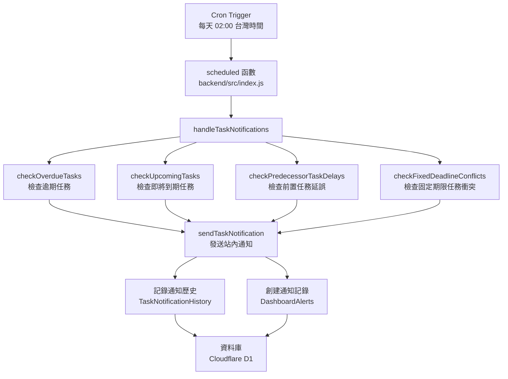
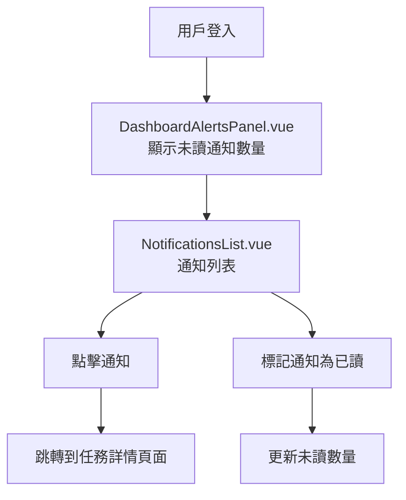

# Design Document: BR2.6: 任務到期提醒

## Overview

每日檢查並發送任務到期提醒，包括任務逾期提醒、即將到期提醒、前置任務延誤通知、固定期限任務衝突通知，使用站內通知機制

本功能是任務管理系統的核心模組之一，提供自動化任務提醒功能，及時通知相關人員任務即將到期或已逾期，確保任務按時完成。

## Steering Document Alignment

### Technical Standards (tech.md)

遵循以下技術標準：
- 使用 Cloudflare Workers Scheduled Events (Cron Triggers) 執行定時任務
- 使用 Cloudflare D1 (SQLite) 作為資料庫
- 遵循統一的錯誤處理和回應格式
- 使用參數化查詢防止 SQL 注入
- 實現站內通知機制
- 實現通知頻率控制機制

### Project Structure (structure.md)

遵循以下項目結構：
- 後端 Handler 位於 `backend/src/handlers/task-notifications/`
- Cron 任務配置在 `backend/src/index.js` 的 `scheduled` 函數中
- 前端通知組件位於 `src/components/notifications/`
- 資料庫 Migration 位於 `backend/migrations/`
- 遵循命名規範：Handler 使用 kebab-case

## Code Reuse Analysis

### Existing Components to Leverage

- **DashboardAlertsPanel.vue**: 現有的儀表板提醒組件（需增強）
- **useDashboardStore**: 現有的儀表板狀態管理（需增強）
- **handleDashboardDailySummary**: 現有的每日摘要重建邏輯（可整合）

### Integration Points

- **handleTaskNotifications**: Cron 任務觸發的任務提醒處理函數，位於 `backend/src/index.js`
- **checkOverdueTasks**: 檢查逾期任務的邏輯
- **checkUpcomingTasks**: 檢查即將到期任務的邏輯
- **checkPredecessorTaskDelays**: 檢查前置任務延誤的邏輯
- **checkFixedDeadlineConflicts**: 檢查固定期限任務衝突的邏輯
- **sendTaskNotification**: 發送任務通知的邏輯
- **handleGetNotifications**: 通知查詢 API
- **handleMarkNotificationAsRead**: 通知標記已讀 API
- **ActiveTasks 表**: 存儲任務資訊（到期日、狀態等）
- **ClientServices 表**: 客戶服務關聯表（用於 JOIN 獲取客戶資訊）
- **Clients 表**: 客戶資訊表（用於獲取客戶負責人）
- **DashboardAlerts 表**: 存儲站內通知（已存在於 migration 0030，需使用此表而非創建新的 Notifications 表）
- **TaskNotificationHistory 表**: 存儲通知發送歷史（需創建，用於頻率控制）

## Architecture

### Component Architecture

後端採用 Cloudflare Workers Scheduled Events，定時執行任務提醒檢查：



前端採用 Vue 3 組件，顯示和管理通知：



### Modular Design Principles

- **Single File Responsibility**: 每個文件只處理一個功能模組
- **Service Layer Separation**: 業務邏輯與資料庫操作分離
- **Notification Abstraction**: 通知發送邏輯抽象化，易於擴展
- **Error Handling**: 完整的錯誤處理和日誌記錄機制

## Components and Interfaces

### handleTaskNotifications

- **Purpose**: Cron 任務觸發的任務提醒處理函數
- **Location**: `backend/src/index.js`
- **Parameters**: 
  - `env`: Cloudflare Workers 環境變數
  - `now`: 當前時間（UTC）
  - `requestId`: 請求 ID
- **Dependencies**: 
  - 任務檢查邏輯
  - 通知發送邏輯
  - CronJobExecutions 表（記錄執行歷史）
- **Reuses**: 
  - 任務查詢邏輯
  - 通知發送邏輯

### checkOverdueTasks

- **Purpose**: 檢查逾期任務
- **Location**: `backend/src/handlers/task-notifications/task-checkers.js`
- **Parameters**: 
  - `env`: Cloudflare Workers 環境變數
  - `now`: 當前時間
- **Returns**: 
  - `Array<{ task, recipients, notificationData }>`
- **Dependencies**: 
  - 資料庫查詢（需 JOIN ClientServices 和 Clients 表以獲取客戶負責人資訊）
  - 通知對象計算邏輯
- **Reuses**: 
  - 通知對象計算邏輯
- **備註**: 
  - 需通過 ActiveTasks -> ClientServices (client_service_id) -> Clients (client_id) JOIN 獲取客戶負責人

### checkUpcomingTasks

- **Purpose**: 檢查即將到期任務（到期日前1天）
- **Location**: `backend/src/handlers/task-notifications/task-checkers.js`
- **Parameters**: 
  - `env`: Cloudflare Workers 環境變數
  - `now`: 當前時間
- **Returns**: 
  - `Array<{ task, recipients, notificationData }>`
- **Dependencies**: 
  - 資料庫查詢（需 JOIN ClientServices 和 Clients 表以獲取客戶負責人資訊）
  - 通知對象計算邏輯
- **Reuses**: 
  - 通知對象計算邏輯
- **備註**: 
  - 需通過 ActiveTasks -> ClientServices (client_service_id) -> Clients (client_id) JOIN 獲取客戶負責人

### checkPredecessorTaskDelays

- **Purpose**: 檢查前置任務延誤
- **Location**: `backend/src/handlers/task-notifications/task-checkers.js`
- **Parameters**: 
  - `env`: Cloudflare Workers 環境變數
  - `now`: 當前時間
- **Returns**: 
  - `Array<{ task, recipients, notificationData }>`
- **Dependencies**: 
  - 資料庫查詢（查詢逾期前置任務，然後查詢所有 prerequisite_task_id = 前置任務ID 的後續任務）
  - 資料庫查詢（需 JOIN ClientServices 和 Clients 表以獲取客戶負責人資訊）
  - 通知對象計算邏輯
- **Reuses**: 
  - 通知對象計算邏輯
- **備註**: 
  - 需查詢 ActiveTasks WHERE prerequisite_task_id IN (逾期前置任務ID列表) AND is_deleted = 0
  - 需通過 ActiveTasks -> ClientServices (client_service_id) -> Clients (client_id) JOIN 獲取客戶負責人
  - 後續任務的負責人即為通知對象

### checkFixedDeadlineConflicts

- **Purpose**: 檢查固定期限任務衝突
- **Location**: `backend/src/handlers/task-notifications/task-checkers.js`
- **Parameters**: 
  - `env`: Cloudflare Workers 環境變數
  - `now`: 當前時間
- **Returns**: 
  - `Array<{ task, recipients, notificationData }>`
- **Dependencies**: 
  - 資料庫查詢（需識別固定期限任務，檢查前置任務延誤對中間任務的影響）
  - 資料庫查詢（需 JOIN ClientServices 和 Clients 表以獲取客戶負責人資訊）
  - 通知對象計算邏輯
- **Reuses**: 
  - 通知對象計算邏輯
- **備註**: 
  - 固定期限任務的識別方式：從 ActiveTasks.is_fixed_deadline 欄位判斷（該欄位將在 BR2.5 的 migration 0045 中添加），或從 ClientServiceTaskConfigs.is_fixed_deadline 欄位判斷（通過 task_config_id 關聯）
  - 需檢查前置任務延誤是否導致中間任務無法在固定期限前完成（考慮 estimated_work_days 或 estimated_hours）
  - 需檢查中間任務的 due_date_adjusted（INTEGER，0=false，1=true）和 adjustment_reason 欄位（已存在於 migration 0028）
  - 需通過 ActiveTasks -> ClientServices (client_service_id) -> Clients (client_id) JOIN 獲取客戶負責人

### sendTaskNotification

- **Purpose**: 發送任務通知
- **Location**: `backend/src/handlers/task-notifications/notification-sender.js`
- **Parameters**: 
  - `env`: Cloudflare Workers 環境變數
  - `notificationType`: 通知類型（'overdue' | 'upcoming' | 'delay' | 'conflict'）
  - `recipients`: 接收者列表
  - `notificationData`: 通知數據
- **Returns**: 
  - `{ success: Boolean, sentCount: Integer }`
- **Dependencies**: 
  - DashboardAlerts 表（存儲通知）
  - TaskNotificationHistory 表（頻率控制）
  - 通知頻率控制邏輯
- **Reuses**: 
  - 通知頻率控制邏輯

### DashboardAlertsPanel

- **Purpose**: 儀表板提醒面板，顯示未讀通知數量
- **Location**: `src/components/dashboard/DashboardAlertsPanel.vue`
- **Props**: 
  - `notifications` (Array, optional): 通知列表（可選，組件內部可自行獲取）
- **Events**: 
  - `@view-all`: 查看所有通知
- **Dependencies**: Ant Design Vue 組件庫
- **Reuses**: 
  - API 調用工具函數（`src/api/notifications.js`）
  - 通知狀態管理（如需要）
- **備註**: 
  - 需顯示未讀通知數量（Badge）
  - 需提供跳轉到通知列表的連結

### NotificationsList

- **Purpose**: 通知列表組件
- **Location**: `src/components/notifications/NotificationsList.vue`
- **Props**: 
  - `notifications` (Array, required): 通知列表
  - `loading` (Boolean, optional): 加載狀態
- **Events**:
  - `@notification-click`: 通知點擊事件
  - `@mark-read`: 標記為已讀
- **Dependencies**: Ant Design Vue 組件庫
- **Reuses**: 
  - API 調用工具函數

## Data Models

### DashboardAlert (使用現有的 DashboardAlerts 表)

```javascript
{
  alert_id: Integer (PK),
  user_id: Integer (FK -> Users.user_id),
  alert_type: String (overdue|upcoming|delay|conflict), // 對應 notification_type
  title: String (required),
  description: Text, // 對應 content
  link: String, // 對應 related_url，任務詳情連結
  payload_json: Text, // JSON 格式，存儲任務相關資訊（見下方詳細說明）
  is_admin_alert: Integer (default: 0), // SQLite 使用 INTEGER，0=false，1=true。任務通知應設為 0（非管理員通知）
  is_read: Integer (default: 0), // SQLite 使用 INTEGER，0=未讀，1=已讀
  read_at: Text, // SQLite 使用 TEXT 存儲日期時間
  created_at: Text, // SQLite 使用 TEXT 存儲日期時間
  expiry_at: Text // 可選，通知過期時間
}
```

**備註**: 使用現有的 `DashboardAlerts` 表（migration 0030），而非創建新的 `Notifications` 表。欄位映射關係：
- `alert_id` → `notification_id`（API 回應時）
- `alert_type` → `notification_type`（API 回應時）
- `description` → `content`（API 回應時）
- `link` → `related_url`（API 回應時）
- `payload_json` → 存儲任務相關資訊（JSON 格式，見下方詳細說明）
- `is_admin_alert` → 任務通知應設為 0（非管理員通知）

**payload_json 結構**（JSON 字符串）：
```javascript
{
  taskId: Integer, // 任務 ID（對應 related_task_id）
  task_id: Integer, // 任務 ID（兼容字段）
  configId: Integer, // 任務配置 ID（可選）
  clientName: String, // 客戶名稱
  serviceName: String, // 服務名稱
  assignee: { // 任務負責人（可選）
    id: Integer,
    name: String
  },
  dueDate: String, // 到期日（YYYY-MM-DD 格式）
  delayDays: Integer, // 逾期天數（僅逾期通知）
  description: String // 通知描述（可選，通常使用 description 欄位）
}
```

### TaskNotificationHistory

```javascript
{
  history_id: Integer (PK),
  task_id: Integer (FK -> ActiveTasks.task_id),
  notification_type: String (overdue|upcoming|delay|conflict),
  sent_at: Text, // SQLite 使用 TEXT 存儲日期時間
  recipients: Text, // JSON 字符串，接收者列表 [{ user_id, user_name }]
  notification_data: Text, // JSON 字符串，通知數據
  created_at: Text // SQLite 使用 TEXT 存儲日期時間
}
```

## Error Handling

### Error Scenarios

1. **Cron 任務執行失敗**
   - **Handling**: 捕獲異常，記錄到 CronJobExecutions 表，不拋出異常（避免影響其他 cron 任務）
   - **User Impact**: 記錄錯誤日誌，管理員可查看執行歷史

2. **任務查詢失敗**
   - **Handling**: 捕獲資料庫錯誤，記錄錯誤，跳過該任務
   - **User Impact**: 記錄到執行歷史，標記為失敗

3. **通知發送失敗**
   - **Handling**: 捕獲通知發送錯誤，記錄錯誤，繼續處理其他通知
   - **User Impact**: 記錄到通知歷史，標記為失敗

4. **通知頻率控制失敗**
   - **Handling**: 捕獲頻率控制錯誤，記錄錯誤，允許發送（避免遺漏通知）
   - **User Impact**: 可能重複發送通知，但不會遺漏

5. **通知對象計算失敗**
   - **Handling**: 捕獲計算錯誤，記錄錯誤，使用默認對象（任務負責人）
   - **User Impact**: 通知可能發送給不完整的人員列表

## Testing Strategy

### Unit Testing

- **任務檢查邏輯測試**: 測試逾期任務和即將到期任務的檢查邏輯
- **通知對象計算測試**: 測試通知對象的計算邏輯
- **通知頻率控制測試**: 測試通知頻率控制邏輯
- **測試框架**: 建議使用 Vitest

### Integration Testing

- **API 整合測試**: 測試通知查詢和標記已讀 API
- **資料庫整合測試**: 測試通知發送和歷史記錄的資料庫操作
- **測試框架**: 建議使用 Vitest + MSW (Mock Service Worker)

### End-to-End Testing

- **E2E 測試**: 使用 Playwright 測試完整用戶流程
- **測試場景**: 
  - 通知列表顯示
  - 通知點擊跳轉
  - 通知標記已讀
  - 未讀通知數量顯示
- **Cron 任務測試**: 需要模擬 Cron 觸發或手動觸發測試
- **測試數據**: 使用測試工具函數設置測試數據
- **測試帳號**: 使用 `admin`/`111111` 管理員帳號和 `liu`/`111111` 員工帳號


