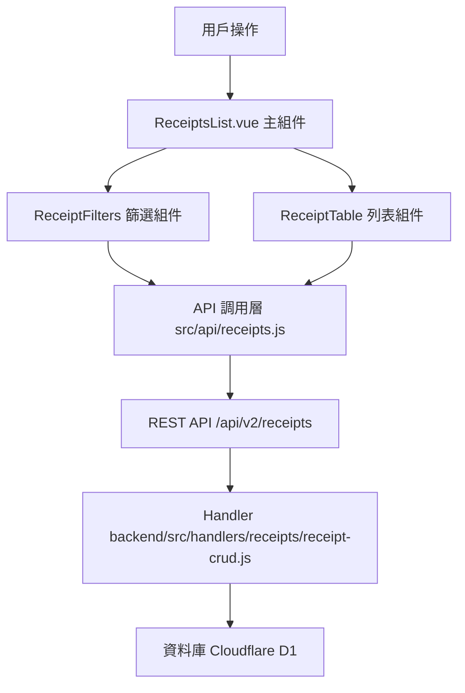

# Design Document: BR3.1: 收據列表

## Overview

收據列表展示、查詢、篩選和逾期標記功能

本功能是收據管理系統的核心模組之一，提供統一的收據查看、查詢、篩選界面，幫助員工快速找到目標收據、追蹤收據狀態，並識別逾期收據。

## Steering Document Alignment

### Technical Standards (tech.md)

遵循以下技術標準：
- 使用 Vue 3 Composition API 開發前端組件
- 使用 Ant Design Vue 作為 UI 組件庫
- 使用 RESTful API 進行前後端通信
- 使用 Cloudflare Workers 作為後端運行環境
- 使用 Cloudflare D1 (SQLite) 作為資料庫
- 遵循統一的錯誤處理和回應格式
- 使用參數化查詢防止 SQL 注入
- 實現收據篩選和搜尋機制

### Project Structure (structure.md)

遵循以下項目結構：
- 前端組件位於 `src/components/receipts/` 或 `src/views/receipts/`
- API 調用層位於 `src/api/receipts.js`
- 後端 Handler 位於 `backend/src/handlers/receipts/`
- 資料庫 Migration 位於 `backend/migrations/`
- 遵循命名規範：組件使用 PascalCase，Handler 使用 kebab-case

## Code Reuse Analysis

### Existing Components to Leverage

- **ReceiptFilters.vue**: 用於收據篩選（已有，需增強）
- **ReceiptTable.vue**: 用於收據列表展示（已有，需增強）
- **ReceiptStatusTag.vue**: 用於收據狀態標籤顯示（已有，需增強）
- **PageHeader.vue**: 用於頁面標題和操作按鈕區域

### Integration Points

- **handleGetReceipts**: 處理收據列表 API 請求，位於 `backend/src/handlers/receipts/receipt-crud.js`
  - API 路由: `GET /api/v2/receipts`（支援查詢參數篩選）
- **Receipts 表**: 存儲收據基本資訊
- **Clients 表**: 存儲客戶資訊
- **ReceiptServiceTypes 表**: 存儲收據服務類型關聯

## Architecture

### Component Architecture

前端採用 Vue 3 Composition API，組件結構清晰，職責單一：



### Modular Design Principles

- **Single File Responsibility**: 每個組件文件只處理一個功能模組
- **Component Isolation**: 組件之間通過 props 和 events 通信，保持獨立
- **Service Layer Separation**: API 調用與業務邏輯分離，使用統一的 API 工具函數
- **Utility Modularity**: 工具函數按功能分組，可在多處重用

## Components and Interfaces

### ReceiptsList

- **Purpose**: 收據列表頁面的主組件，整合所有子組件
- **Location**: `src/views/receipts/ReceiptsList.vue`
- **Interfaces**: 無（頁面組件，無對外接口）
- **Props**: 無
- **Events**: 無
- **Dependencies**: 
  - Ant Design Vue 組件庫
  - Vue Router (用於導航到收據詳情)
  - Pinia Store (收據狀態管理)
- **Reuses**: 
  - ReceiptFilters, ReceiptTable 子組件
  - API 調用工具函數 (`@/utils/apiHelpers`)
  - 日期格式化工具 (`@/utils/formatters`)
- **Features**:
  - 處理 ReceiptFilters 的篩選條件變更
  - 處理 ReceiptTable 的收據點擊事件，跳轉到收據詳情頁面
  - 在組件掛載時獲取客戶列表等前置數據
  - 將前置數據傳遞給 ReceiptFilters 組件

### ReceiptFilters

- **Purpose**: 收據篩選組件
- **Location**: `src/components/receipts/ReceiptFilters.vue`
- **Interfaces**: Props (filters, clients) 和 Events (@filters-change)
- **Props**: 
  - `filters` (Object, required): 當前篩選條件
  - `clients` (Array, required): 客戶列表（用於客戶篩選，由父組件 ReceiptsList 從 API 獲取並傳遞）
- **Events**:
  - `@filters-change`: 篩選條件變更
- **Dependencies**: Ant Design Vue 組件庫
- **Reuses**: 無（客戶列表由父組件提供）
- **Data Sources**: 
  - 客戶列表：由父組件 ReceiptsList 通過 props 傳遞（父組件從 `src/api/clients.js` 獲取）

### ReceiptTable

- **Purpose**: 收據列表展示組件
- **Location**: `src/components/receipts/ReceiptTable.vue`
- **Interfaces**: Props (receipts, loading, pagination) 和 Events (@receipt-click, @page-change, @page-size-change)
- **Props**: 
  - `receipts` (Array, required): 收據列表
  - `loading` (Boolean, optional): 加載狀態
  - `pagination` (Object, required): 分頁資訊
    - `current` (Number): 當前頁碼
    - `pageSize` (Number): 每頁顯示筆數
    - `total` (Number): 總筆數
- **Events**:
  - `@receipt-click`: 點擊收據跳轉到詳情
  - `@page-change`: 頁碼變更
  - `@page-size-change`: 每頁顯示筆數變更
- **Dependencies**: Ant Design Vue 組件庫
- **Reuses**: 
  - ReceiptStatusTag 組件（狀態標籤顯示）
  - 日期格式化工具
  - 金額格式化工具

### ReceiptStatusTag

- **Purpose**: 收據狀態標籤組件
- **Location**: `src/components/receipts/ReceiptStatusTag.vue`
- **Interfaces**: Props (status, overdueDays)，無 Events
- **Props**: 
  - `status` (String, required): 收據狀態（`unpaid`、`partial`、`paid`、`cancelled`、`overdue`）
  - `overdueDays` (Number, optional): 逾期天數（僅當狀態為 `overdue` 時顯示）
- **Events**: 無
- **Dependencies**: Ant Design Vue 組件庫
- **Reuses**: 無

## Data Models

### Receipt (收據)

```
- receipt_id: String (收據號碼，格式：YYYYMM-XXX)
- client_id: String (客戶 ID)
- company_name: String (客戶名稱，從 Clients 表 JOIN)
- tax_registration_number: String (統一編號，從 Clients 表 JOIN)
- receipt_date: String (開立日期，格式：YYYY-MM-DD)
- due_date: String (到期日期，格式：YYYY-MM-DD，可為 NULL)
- total_amount: Number (總金額)
- paid_amount: Number (已付金額)
- outstanding_amount: Number (未付金額，計算值：total_amount - paid_amount)
- status: String (狀態：unpaid、partial、paid、cancelled、overdue)
- receipt_type: String (收據類型：normal、prepayment、deposit)
- service_start_month: String (服務開始月份，格式：YYYY-MM，可為 NULL)
- service_end_month: String (服務結束月份，格式：YYYY-MM，可為 NULL)
- billing_month: Number (收費月份，1-12，可為 NULL)
- is_overdue: Boolean (是否逾期，計算值)
- overdue_days: Number (逾期天數，計算值，僅當 is_overdue 為 true 時有值)
- created_at: String (建立時間)
- updated_at: String (更新時間)
```

### ReceiptFilters (篩選條件)

```
- q: String (關鍵詞搜尋)
- status: String (狀態篩選：all、unpaid、partial、paid、cancelled、overdue)
- receipt_type: String (收據類型篩選：all、normal、prepayment、deposit)
- date_type: String (日期類型：receipt_date、due_date、service_month)
- date_range: Array (日期範圍：[開始日期, 結束日期])
- client_id: String (客戶 ID，可為 null)
- billing_month: Number (收費月份，1-12，可為 null)
- billing_year: Number (收費年度，可為 null)
- page: Number (當前頁碼，預設 1)
- page_size: Number (每頁顯示筆數，預設 20，最多 100)
```

## Error Handling

### Error Scenarios

1. **API 請求失敗**:
   - **Handling**: 顯示錯誤訊息，使用 Ant Design Vue 的 `message.error()`
   - **User Impact**: 用戶看到錯誤提示，可以重試

2. **篩選條件無結果**:
   - **Handling**: 顯示「無數據」提示，使用 Ant Design Vue 的 `Table` 組件的 `empty` 插槽
   - **User Impact**: 用戶看到「無數據」提示，可以調整篩選條件

3. **逾期計算錯誤**:
   - **Handling**: 後端計算逾期狀態，前端只負責顯示
   - **User Impact**: 逾期標記準確顯示

4. **分頁參數錯誤**:
   - **Handling**: 前端驗證分頁參數，後端也驗證
   - **User Impact**: 分頁功能正常運作

## Testing Strategy

### Unit Testing

- 測試 ReceiptFilters 組件的篩選邏輯
- 測試 ReceiptTable 組件的顯示邏輯
- 測試 ReceiptStatusTag 組件的狀態顯示
- 測試逾期天數計算邏輯

### Integration Testing

- 測試 API 調用和數據流轉
- 測試篩選條件變更和列表更新
- 測試分頁功能

### End-to-End Testing

- 測試完整的收據列表查看流程
- 測試篩選和搜尋功能
- 測試逾期標記顯示
- 測試分頁功能

