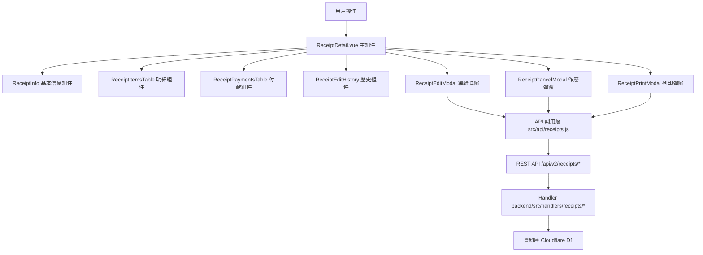

# Design Document: BR3.2: 收據詳情

## Overview

收據詳情展示、編輯、作廢和列印功能

本功能是收據管理系統的核心模組之一，提供收據的完整資訊展示和管理功能，幫助員工查看收據詳情、編輯收據、作廢收據，並列印收據或請款單。

## Steering Document Alignment

### Technical Standards (tech.md)

遵循以下技術標準：
- 使用 Vue 3 Composition API 開發前端組件
- 使用 Ant Design Vue 作為 UI 組件庫
- 使用 RESTful API 進行前後端通信
- 使用 Cloudflare Workers 作為後端運行環境
- 使用 Cloudflare D1 (SQLite) 作為資料庫
- 遵循統一的錯誤處理和回應格式
- 使用參數化查詢防止 SQL 注入
- 實現編輯歷史記錄機制

### Project Structure (structure.md)

遵循以下項目結構：
- 前端組件位於 `src/components/receipts/` 或 `src/views/receipts/`
- API 調用層位於 `src/api/receipts.js`
- 後端 Handler 位於 `backend/src/handlers/receipts/`
- 資料庫 Migration 位於 `backend/migrations/`
- 遵循命名規範：組件使用 PascalCase，Handler 使用 kebab-case

## Code Reuse Analysis

### Existing Components to Leverage

- **ReceiptInfo.vue**: 用於收據基本信息展示（已有，需增強）
- **ReceiptItemsTable.vue**: 用於收據明細表格展示（已有，需增強）
- **ReceiptPaymentsTable.vue**: 用於付款記錄表格展示（已有，需增強）
- **ReceiptEditModal.vue**: 用於編輯收據彈窗（需新增）
- **ReceiptCancelModal.vue**: 用於作廢收據彈窗（需新增）
- **ReceiptPrintModal.vue**: 用於列印選擇彈窗（需新增）

### Integration Points

- **handleGetReceiptDetail**: 處理收據詳情 API 請求，位於 `backend/src/handlers/receipts/receipt-crud.js`
  - API 路由: `GET /api/v2/receipts/:id`
- **handleUpdateReceipt**: 處理收據更新 API 請求，位於 `backend/src/handlers/receipts/receipt-crud.js`
  - API 路由: `PUT /api/v2/receipts/:id`
- **handleCancelReceipt**: 處理收據作廢 API 請求，位於 `backend/src/handlers/receipts/receipt-cancel.js`
  - API 路由: `POST /api/v2/receipts/:id/cancel`
- **Receipts 表**: 存儲收據基本資訊
- **ReceiptEditHistory 表**: 存儲編輯歷史記錄（需新增）

## Architecture

### Component Architecture

前端採用 Vue 3 Composition API，組件結構清晰，職責單一：



### Modular Design Principles

- **Single File Responsibility**: 每個組件文件只處理一個功能模組
- **Component Isolation**: 組件之間通過 props 和 events 通信，保持獨立
- **Service Layer Separation**: API 調用與業務邏輯分離，使用統一的 API 工具函數
- **Utility Modularity**: 工具函數按功能分組，可在多處重用

## Components and Interfaces

### ReceiptDetail

- **Purpose**: 收據詳情頁面的主組件，整合所有子組件
- **Location**: `src/views/receipts/ReceiptDetail.vue`
- **Props**: 無（使用路由參數獲取收據 ID）
- **Events**: 無
- **Dependencies**: 
  - Ant Design Vue 組件庫
  - Vue Router (用於獲取路由參數和導航)
  - Pinia Store (收據狀態管理，可選)
- **Reuses**: 
  - ReceiptInfo, ReceiptItemsTable, ReceiptPaymentsTable, ReceiptEditHistory 子組件
  - ReceiptEditModal, ReceiptCancelModal, ReceiptPrintModal 彈窗組件
  - API 調用工具函數 (`@/utils/apiHelpers`)
  - 日期格式化工具 (`@/utils/formatters`)
- **Features**:
  - 從路由參數獲取收據 ID
  - 載入收據詳情數據
  - 處理編輯、作廢、列印操作
  - 顯示編輯歷史

### ReceiptEditModal

- **Purpose**: 編輯收據彈窗組件
- **Location**: `src/components/receipts/ReceiptEditModal.vue`
- **Props**: 
  - `receipt` (Object, required): 收據數據
  - `visible` (Boolean, required): 是否顯示彈窗
- **Events**:
  - `@update:visible`: 更新顯示狀態
  - `@saved`: 保存成功
- **Dependencies**: Ant Design Vue 組件庫
- **Reuses**: API 調用工具函數

### ReceiptCancelModal

- **Purpose**: 作廢收據彈窗組件
- **Location**: `src/components/receipts/ReceiptCancelModal.vue`
- **Props**: 
  - `receipt` (Object, required): 收據數據
  - `visible` (Boolean, required): 是否顯示彈窗
- **Events**:
  - `@update:visible`: 更新顯示狀態
  - `@cancelled`: 作廢成功
- **Dependencies**: Ant Design Vue 組件庫
- **Reuses**: API 調用工具函數

### ReceiptPrintModal

- **Purpose**: 列印選擇彈窗組件
- **Location**: `src/components/receipts/ReceiptPrintModal.vue`
- **Props**: 
  - `receipt` (Object, required): 收據數據
  - `visible` (Boolean, required): 是否顯示彈窗
  - `printType` (String, required): 列印類型（invoice 或 receipt）
- **Events**:
  - `@update:visible`: 更新顯示狀態
- **Dependencies**: Ant Design Vue 組件庫
- **Reuses**: 列印工具函數 (`@/utils/receiptPrint`)

## Data Models

### ReceiptEditHistory (編輯歷史)

```
- id: String (主鍵，UUID 或自增 ID)
- receipt_id: String (收據 ID，外鍵關聯 Receipts 表)
- field_name: String (欄位名稱，例如：'total_amount', 'receipt_date')
- old_value: String (修改前的值，JSON 格式，存儲原始數據類型)
- new_value: String (修改後的值，JSON 格式，存儲原始數據類型)
- modified_by: String (修改人 ID，關聯 Users 表)
- modified_at: String (修改時間，ISO 8601 格式或 Unix timestamp)
```

**索引**:
- `receipt_id` 索引：用於快速查詢特定收據的編輯歷史
- `modified_at` 索引：用於按時間排序編輯歷史

## Error Handling

### Error Scenarios

1. **收據不存在**:
   - **Handling**: 顯示錯誤訊息，跳轉到收據列表頁面
   - **User Impact**: 用戶看到錯誤提示，可以返回列表頁面

2. **編輯驗證失敗**:
   - **Handling**: 顯示驗證錯誤訊息，阻止保存
   - **User Impact**: 用戶看到驗證錯誤，可以修正後重試

3. **作廢驗證失敗**:
   - **Handling**: 顯示驗證錯誤訊息，阻止作廢
   - **User Impact**: 用戶看到驗證錯誤，可以修正後重試

4. **列印失敗**:
   - **Handling**: 顯示錯誤訊息，使用 Ant Design Vue 的 `message.error()`
   - **User Impact**: 用戶看到錯誤提示，可以重試

## Testing Strategy

### Unit Testing

- 測試 ReceiptEditModal 組件的編輯邏輯
- 測試 ReceiptCancelModal 組件的作廢邏輯
- 測試 ReceiptPrintModal 組件的列印邏輯
- 測試編輯歷史記錄邏輯

### Integration Testing

- 測試 API 調用和數據流轉
- 測試編輯、作廢、列印功能
- 測試編輯歷史記錄功能

### End-to-End Testing

- 測試完整的收據詳情查看流程
- 測試編輯收據流程
- 測試作廢收據流程
- 測試列印收據流程

