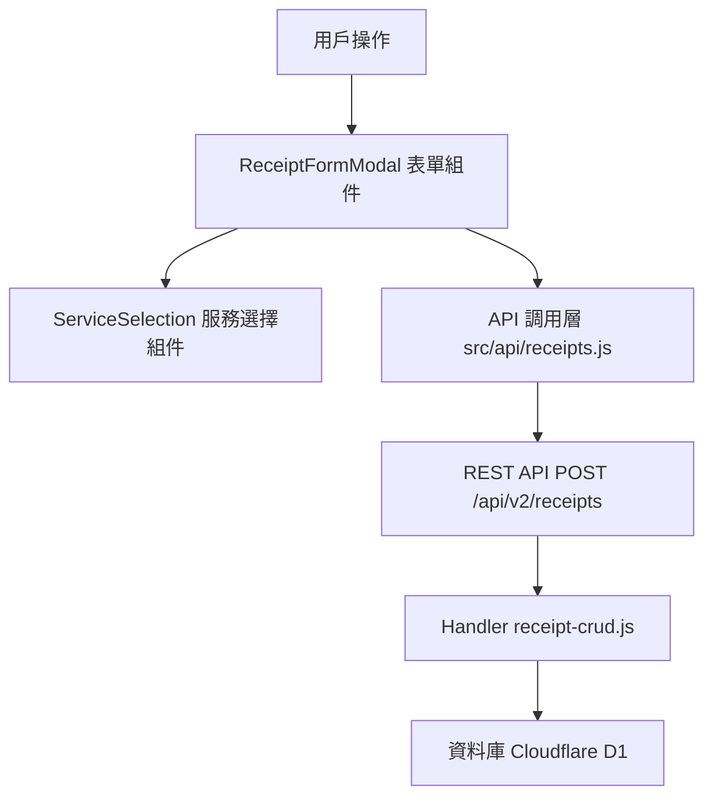

# Design Document: BR3.3: 收據建立

## Overview

收據建立功能，支援從對帳提醒開立收據和手動建立收據

本功能是會計師事務所內部管理系統的收據管理核心模組之一，提供收據建立功能，幫助員工從對帳提醒中開立收據或手動建立收據，自動生成收據編號，並支援多服務選擇和金額調整。

## Steering Document Alignment

### Technical Standards (tech.md)

遵循以下技術標準：
- 使用 Vue 3 Composition API 開發前端組件
- 使用 Ant Design Vue 作為 UI 組件庫
- 使用 RESTful API 進行前後端通信
- 使用 Cloudflare Workers 作為後端運行環境
- 使用 Cloudflare D1 (SQLite) 作為資料庫
- 遵循統一的錯誤處理和回應格式
- 使用參數化查詢防止 SQL 注入
- 實現收據編號自動生成機制

### Project Structure (structure.md)

遵循以下項目結構：
- 前端組件位於 `src/components/receipts/` 或 `src/views/receipts/`
- API 調用層位於 `src/api/receipts.js`
- 後端 Handler 位於 `backend/src/handlers/receipts/`
- 資料庫 Migration 位於 `backend/migrations/`
- 遵循命名規範：組件使用 PascalCase，Handler 使用 kebab-case

## Code Reuse Analysis

### Existing Components to Leverage

- **ReceiptFormModal.vue**: 用於收據建立表單（已有，需增強）
- **ServiceSelection.vue**: 用於服務選擇（需新增）

### Integration Points

- **handleCreateReceipt**: 處理收據建立 API 請求
  - API 路由: `POST /api/v2/receipts`
- **Receipts 表**: 存儲收據基本資訊
- **ServiceBillingSchedule 表**: 查詢收費計劃
- **BillingReminders 表**: 更新對帳提醒狀態為 completed，關聯收據 ID

## Architecture

### Component Architecture



## Components and Interfaces

### ReceiptFormModal

- **Purpose**: 收據建立表單彈窗組件
- **Location**: `src/components/receipts/ReceiptFormModal.vue`
- **Props**: 
  - `visible` (Boolean, required): 是否顯示彈窗
  - `initialData` (Object, optional): 初始數據（從對帳提醒傳入）
- **Events**:
  - `@update:visible`: 更新顯示狀態
  - `@created`: 建立成功

### ServiceSelection

- **Purpose**: 服務選擇組件
- **Location**: `src/components/receipts/ServiceSelection.vue`
- **Props**: 
  - `clientId` (String, required): 客戶 ID
  - `selectedServices` (Array, required): 已選中的服務
- **Events**:
  - `@change`: 服務選擇變更

## Data Models

### Receipt Creation Request

```
- client_id: String
- billing_month: Number (1-12)
- receipt_date: String (YYYY-MM-DD)
- due_date: String (YYYY-MM-DD, optional)
- receipt_type: String (normal, prepayment, deposit)
- service_start_month: String (YYYY-MM, optional)
- service_end_month: String (YYYY-MM, optional)
- service_type_ids: Array (服務類型 ID 列表)
- items: Array (明細項目)
- total_amount: Number
- amount_adjustment_reason: String (optional)
- notes: String (optional)
- reminder_ids: Array (optional) - 關聯的對帳提醒 ID 列表（從提醒開立時傳入）
```

### Billing Reminder Update Logic

當收據建立成功後，系統會自動更新相關的對帳提醒狀態：

1. **從提醒開立**：如果請求中包含 `reminder_ids`，直接更新這些提醒的狀態為 `completed`，並關聯收據 ID
2. **手動建立**：根據 `client_id`、`service_type_ids` 和服務期間（`service_start_month`、`service_end_month`）匹配相關的 `pending` 狀態提醒，更新狀態為 `completed`，並關聯收據 ID
3. **更新字段**：
   - `status`: 更新為 `completed`
   - `completed_receipt_id`: 關聯新建立的收據 ID
   - `completed_at`: 記錄完成時間

## Error Handling

### Error Scenarios

1. **收據編號衝突**:
   - **Handling**: 顯示錯誤訊息，重新生成編號
   - **User Impact**: 用戶看到錯誤提示，系統自動重新生成編號

2. **驗證失敗**:
   - **Handling**: 顯示驗證錯誤訊息，阻止提交
   - **User Impact**: 用戶看到驗證錯誤，可以修正後重試

3. **服務選擇錯誤**:
   - **Handling**: 顯示錯誤訊息，允許重新選擇
   - **User Impact**: 用戶看到錯誤提示，可以重新選擇服務

4. **提醒更新失敗**:
   - **Handling**: 收據建立成功但提醒狀態更新失敗時，記錄錯誤日誌，不影響收據建立流程
   - **User Impact**: 收據建立成功，但提醒可能未更新狀態，後台會記錄日誌供後續處理

## Testing Strategy

### Unit Testing
- 測試收據編號生成邏輯、表單驗證邏輯
- 測試關鍵組件的業務邏輯和邊界條件

### Integration Testing
- 測試 API 調用和數據流轉
- 測試前後端數據傳遞和狀態同步
- 測試對帳提醒狀態更新流程

### End-to-End Testing
- 測試完整的收據建立流程
- 測試從對帳提醒開立收據的完整流程
- 測試手動建立收據的完整流程
- 測試收據編號唯一性驗證

