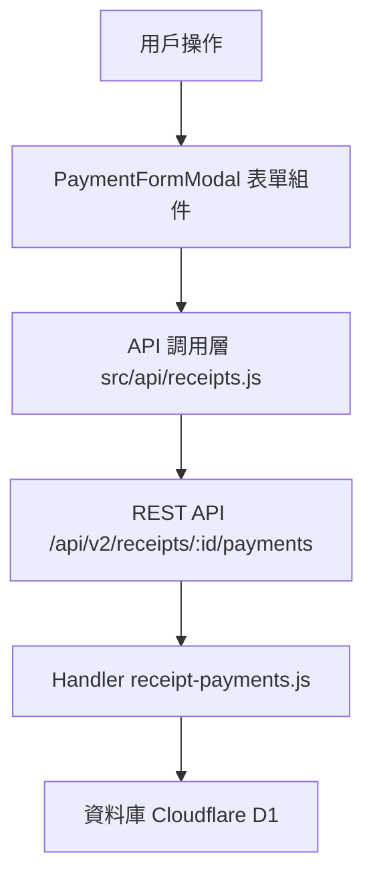

# Design Document: BR3.4: 付款記錄管理

## Overview

付款記錄管理功能，支援新增、編輯、刪除付款記錄。本功能是收據管理系統的核心模組之一，提供完整的付款記錄 CRUD 操作和自動狀態更新機制。

## Steering Document Alignment

### Technical Standards (tech.md)

- 遵循 Cloudflare Workers + D1 架構模式
- 使用 RESTful API 設計
- 前端使用 Vue 3 Composition API 和 Ant Design Vue
- 遵循現有的錯誤處理和驗證模式

### Project Structure (structure.md)

- 前端組件放在 `src/components/receipts/` 目錄
- API 調用函數放在 `src/api/receipts.js`
- 後端 Handler 放在 `backend/src/handlers/receipts/` 目錄
- 路由配置放在 `backend/src/router/receipts.js`

## Code Reuse Analysis

### Existing Components to Leverage

- **Modal 組件**: 重用 Ant Design Vue 的 Modal 組件作為付款記錄表單彈窗
- **Table 組件**: 重用 Ant Design Vue 的 Table 組件顯示付款記錄列表
- **Form 組件**: 重用 Ant Design Vue 的 Form 組件進行表單驗證
- **API 工具**: 重用 `src/api/receipts.js` 中現有的 API 調用模式
- **錯誤處理**: 重用現有的錯誤處理工具和 Toast 通知機制

### Integration Points

- **Receipts API**: 與現有的收據 API 整合，更新收據狀態
- **Database Schema**: 擴展現有的 Payments 表，新增 PaymentEditHistory 表
- **Authentication**: 使用現有的認證機制（所有員工可訪問）

## Architecture

### Modular Design Principles

- **Single File Responsibility**: 每個組件和 Handler 都有單一職責
- **Component Isolation**: PaymentFormModal 和 ReceiptPaymentsTable 為獨立組件
- **Service Layer Separation**: API 調用層與業務邏輯層分離
- **Utility Modularity**: 狀態更新邏輯封裝為可重用函數

### Component Architecture



## Components and Interfaces

### PaymentFormModal

- **Purpose**: 付款記錄表單彈窗組件，用於新增和編輯付款記錄
- **Location**: `src/components/receipts/PaymentFormModal.vue`
- **Props**: 
  - `receipt` (Object, required): 收據數據
  - `visible` (Boolean, required): 是否顯示彈窗
  - `payment` (Object, optional): 付款記錄數據（編輯時傳入）
- **Events**:
  - `@update:visible`: 更新顯示狀態
  - `@saved`: 保存成功
- **Dependencies**: 
  - Ant Design Vue (Modal, Form, Input, DatePicker, Select)
  - `src/api/receipts.js` (API 調用)
- **Reuses**: 
  - 現有的表單驗證模式
  - 現有的錯誤處理和 Toast 通知

### ReceiptPaymentsTable

- **Purpose**: 付款記錄表格組件，顯示付款記錄列表和累計金額
- **Location**: `src/components/receipts/ReceiptPaymentsTable.vue`
- **Props**:
  - `receipt` (Object, required): 收據數據
  - `payments` (Array, required): 付款記錄列表
- **Events**:
  - `@edit`: 編輯付款記錄
  - `@delete`: 刪除付款記錄
  - `@refresh`: 刷新付款記錄列表
- **Dependencies**:
  - Ant Design Vue (Table, Button, Space)
  - `src/api/receipts.js` (API 調用)
- **Reuses**:
  - 現有的表格顯示模式
  - 現有的操作按鈕樣式

## Data Models

### Payment

```
- payment_id: String
- receipt_id: String
- payment_date: String (YYYY-MM-DD)
- payment_amount: Number
- payment_method: String (cash, transfer, check, other)
- reference_number: String (optional)
- notes: String (optional)
- is_deleted: Boolean
- created_at: String
- updated_at: String
```

## Error Handling

### Error Scenarios

1. **付款總額超過收據金額**
   - **Handling**: 允許提交，但顯示警告提示「付款總額超過收據金額，超出部分可用於抵扣其他收據」
   - **User Impact**: 用戶看到警告訊息，但仍可繼續提交

2. **驗證失敗**
   - **Handling**: 顯示表單驗證錯誤訊息，阻止提交
   - **User Impact**: 用戶看到具體的驗證錯誤，需要修正後才能提交

3. **API 請求失敗**
   - **Handling**: 顯示錯誤 Toast 訊息，記錄錯誤日誌
   - **User Impact**: 用戶看到錯誤提示，操作失敗

4. **收據不存在或已刪除**
   - **Handling**: 返回 404 錯誤，顯示「收據不存在」訊息
   - **User Impact**: 用戶看到錯誤提示，無法繼續操作

5. **資料庫操作失敗**
   - **Handling**: 返回 500 錯誤，顯示「系統錯誤，請稍後再試」訊息
   - **User Impact**: 用戶看到錯誤提示，需要重試操作

## Testing Strategy

### Unit Testing

- **組件測試**: 測試 PaymentFormModal 和 ReceiptPaymentsTable 組件的渲染和交互
- **API 函數測試**: 測試 API 調用函數的參數處理和錯誤處理
- **驗證邏輯測試**: 測試表單驗證規則和狀態更新邏輯

### Integration Testing

- **API 整合測試**: 測試 Handler 與資料庫的整合，驗證 CRUD 操作
- **狀態更新測試**: 測試付款記錄操作後收據狀態的自動更新
- **歷史記錄測試**: 測試編輯和刪除操作的歷史記錄功能

### End-to-End Testing

- **新增付款記錄流程**: 測試從表單填寫到保存成功的完整流程
- **編輯付款記錄流程**: 測試編輯付款記錄並驗證歷史記錄
- **刪除付款記錄流程**: 測試軟刪除並驗證狀態更新
- **付款總額計算**: 測試多筆付款記錄的累計金額計算
- **收據狀態更新**: 測試付款後收據狀態的自動更新（未付款/部分付款/已付款）

