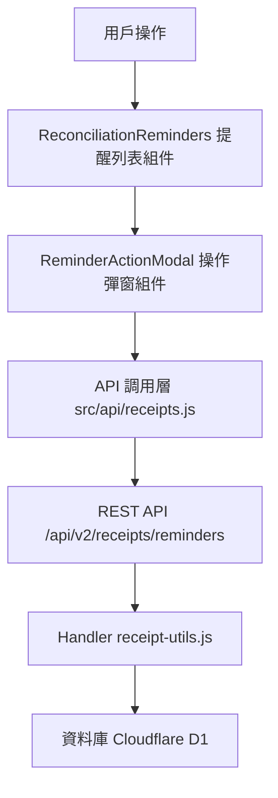

# Design Document: BR3.5: 對帳提示

## Overview

對帳提示功能在儀表板顯示對帳提醒並支援從提醒中開立收據。本功能幫助員工及時發現需要開立收據的服務，並從提醒中快速開立收據，提升工作效率。

## Steering Document Alignment

### Technical Standards (tech.md)

- 遵循 Vue 3 Composition API 開發模式
- 使用 Ant Design Vue 組件庫保持界面一致性
- 後端使用 Cloudflare Workers Handler 模式
- 資料庫操作使用參數化查詢防止 SQL 注入

### Project Structure (structure.md)

- 前端組件放在 `src/components/receipts/` 目錄
- API 調用函數放在 `src/api/receipts.js`
- 後端 Handler 放在 `backend/src/handlers/receipts/` 目錄
- 路由配置放在 `backend/src/router/receipts.js`

## Code Reuse Analysis

### Existing Components to Leverage

- **Dashboard 組件**: 在現有儀表板中整合對帳提醒列表
- **Modal 組件**: 使用 Ant Design Vue 的 Modal 組件實現操作彈窗
- **Table 組件**: 使用 Ant Design Vue 的 Table 組件顯示提醒列表
- **Form 組件**: 使用 Ant Design Vue 的 Form 組件實現服務選擇和暫緩原因輸入

### Integration Points

- **Receipts API**: 整合現有收據開立 API，從提醒中開立收據
- **BillingReminders 表**: 使用現有對帳提醒資料表
- **ServiceBillingSchedule 表**: 查詢服務收費計劃資訊
- **ActiveTasks 表**: 查詢任務完成狀態，判斷服務是否完成

## Architecture

### Modular Design Principles

- **Single File Responsibility**: 每個組件和 Handler 文件處理單一職責
- **Component Isolation**: 提醒列表組件和操作彈窗組件獨立，可重用
- **Service Layer Separation**: API 調用層、Handler 層、資料庫層分離
- **Utility Modularity**: 共用邏輯抽取為工具函數

### Component Architecture



## Components and Interfaces

### ReconciliationReminders

- **Purpose**: 對帳提醒列表組件，顯示待處理的對帳提醒
- **Location**: `src/components/receipts/ReconciliationReminders.vue`
- **Interfaces**: 
  - `loadReminders()`: 載入提醒列表
  - `handleCreateReceipt(reminder)`: 處理開立收據操作
  - `handlePostpone(reminder)`: 處理暫緩操作
- **Dependencies**: 
  - `src/api/receipts.js`: API 調用
  - `ReminderActionModal`: 操作彈窗組件
- **Reuses**: 
  - Ant Design Vue Table 組件
  - Ant Design Vue Button 組件
  - 現有 Toast 通知組件

### ReminderActionModal

- **Purpose**: 提醒操作彈窗組件（開立收據或暫緩），提供服務選擇和暫緩原因輸入
- **Location**: `src/components/receipts/ReminderActionModal.vue`
- **Interfaces**: 
  - `open(reminder, actionType)`: 打開彈窗
  - `close()`: 關閉彈窗
  - `handleSubmit()`: 提交操作
- **Dependencies**: 
  - `src/api/receipts.js`: API 調用
- **Reuses**: 
  - Ant Design Vue Modal 組件
  - Ant Design Vue Form 組件
  - Ant Design Vue Checkbox 組件
  - Ant Design Vue Input 組件

### ReceiptRemindersHandler

- **Purpose**: 後端 Handler，處理對帳提醒相關的 API 請求
- **Location**: `backend/src/handlers/receipts/receipt-utils.js`
- **Interfaces**: 
  - `handleGetReceiptReminders(request, env)`: 獲取提醒列表
  - `handlePostponeReminder(request, env)`: 暫緩提醒
  - `markRemindersCompleted(clientId, serviceIds, env)`: 標記提醒為已完成
- **Dependencies**: 
  - Cloudflare D1 資料庫
- **Reuses**: 
  - 現有資料庫查詢工具函數
  - 現有錯誤處理工具函數

## Data Models

### BillingReminder

```
- reminder_id: String
- client_id: String
- client_service_id: String
- service_month: String (YYYY-MM)
- status: String (pending, postponed, completed)
- postpone_reason: String (optional)
- created_at: String
- updated_at: String
```

## Error Handling

### Error Scenarios

1. **提醒數據載入失敗**
   - **Handling**: 顯示錯誤 Toast 訊息，提供重試按鈕
   - **User Impact**: 用戶看到錯誤提示，可點擊重試重新載入

2. **開立收據失敗**
   - **Handling**: 顯示錯誤 Toast 訊息，保留用戶輸入的數據，允許重試
   - **User Impact**: 用戶看到錯誤提示，可修正後重新提交

3. **暫緩提醒失敗**
   - **Handling**: 顯示錯誤 Toast 訊息，保留用戶輸入的數據，允許重試
   - **User Impact**: 用戶看到錯誤提示，可修正後重新提交

4. **服務選擇驗證失敗**
   - **Handling**: 在表單中顯示驗證錯誤訊息，阻止提交
   - **User Impact**: 用戶看到驗證錯誤，需修正後才能提交

5. **資料庫連接失敗**
   - **Handling**: 後端返回 500 錯誤，前端顯示系統錯誤訊息
   - **User Impact**: 用戶看到系統錯誤提示，稍後重試

## Testing Strategy

### Unit Testing

- **組件測試**: 測試 ReconciliationReminders 和 ReminderActionModal 組件的渲染和交互
- **Handler 測試**: 測試 receipt-utils.js 中的各個 Handler 函數
- **API 函數測試**: 測試 src/api/receipts.js 中的 API 調用函數

### Integration Testing

- **API 整合測試**: 測試前端 API 調用與後端 Handler 的整合
- **資料庫整合測試**: 測試 Handler 與資料庫的交互
- **組件整合測試**: 測試提醒列表組件與操作彈窗組件的協作

### End-to-End Testing

- **完整流程測試**: 測試從查看提醒到開立收據的完整流程
- **暫緩流程測試**: 測試暫緩提醒的完整流程
- **錯誤處理測試**: 測試各種錯誤情況下的用戶體驗

