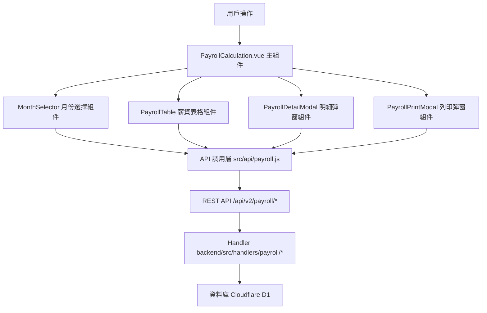

# Design Document: BR4.1: 每月薪資結算

## Overview

每月薪資結算功能，提供薪資計算、預覽、明細查看和列印功能

本功能是薪資管理系統的核心模組之一，提供每月薪資結算功能，幫助管理員查看所有員工的薪資預覽、展開查看詳細計算明細，並支援列印個別員工的薪資單。

## Steering Document Alignment

### Technical Standards (tech.md)

遵循以下技術標準：
- 使用 Vue 3 Composition API 開發前端組件
- 使用 Ant Design Vue 作為 UI 組件庫
- 使用 RESTful API 進行前後端通信
- 使用 Cloudflare Workers 作為後端運行環境
- 使用 Cloudflare D1 (SQLite) 作為資料庫
- 遵循統一的錯誤處理和回應格式
- 使用參數化查詢防止 SQL 注入
- 實現薪資計算邏輯

### Project Structure (structure.md)

遵循以下項目結構：
- 前端組件位於 `src/components/payroll/` 或 `src/views/payroll/`
- API 調用層位於 `src/api/payroll.js`
- 後端 Handler 位於 `backend/src/handlers/payroll/`
- 資料庫 Migration 位於 `backend/migrations/`
- 遵循命名規範：組件使用 PascalCase，Handler 使用 kebab-case

## Code Reuse Analysis

### Existing Components to Leverage

- **PayrollTable.vue**: 用於薪資列表表格展示（需新增）
- **PayrollDetailModal.vue**: 用於詳細計算明細展示（需新增）
- **PayrollPrintModal.vue**: 用於薪資單列印（需新增）
- **PageHeader.vue**: 用於頁面標題和操作按鈕區域

### Integration Points

- **handleCalculatePayroll**: 處理薪資計算 API 請求，位於 `backend/src/handlers/payroll/payroll-calculation.js`
  - API 路由: `GET /api/v2/payroll/calculate?month=YYYY-MM`
- **handleGetPayrollDetail**: 處理薪資明細 API 請求，位於 `backend/src/handlers/payroll/payroll-calculation.js`
  - API 路由: `GET /api/v2/payroll/calculate/:employeeId/detail?month=YYYY-MM`
- **handlePrintPayroll**: 處理薪資單列印 API 請求，位於 `backend/src/handlers/payroll/payroll-print.js`
  - API 路由: `GET /api/v2/payroll/print/:employeeId?month=YYYY-MM`
- **PayrollCache 表**: 存儲薪資計算結果
- **Users 表**: 存儲員工資訊
- **Timesheets 表**: 存儲工時記錄
- **Leaves 表**: 存儲請假記錄
- **Outings 表**: 存儲外出記錄

## Architecture

### Component Architecture

前端採用 Vue 3 Composition API，組件結構清晰，職責單一：



### Modular Design Principles

- **Single File Responsibility**: 每個組件文件只處理一個功能模組
- **Component Isolation**: 組件之間通過 props 和 events 通信，保持獨立
- **Service Layer Separation**: API 調用與業務邏輯分離，使用統一的 API 工具函數
- **Utility Modularity**: 工具函數按功能分組，可在多處重用

## Components and Interfaces

### PayrollCalculation

- **Purpose**: 薪資結算頁面的主組件，整合所有子組件
- **Location**: `src/views/payroll/PayrollCalculation.vue`
- **Interfaces**: 無（頁面組件，無對外接口）
- **Props**: 無
- **Events**: 無
- **Dependencies**: 
  - Ant Design Vue 組件庫
  - Vue Router
  - Pinia Store (薪資狀態管理，可選)
- **Reuses**: 
  - MonthSelector, PayrollTable, PayrollDetailModal, PayrollPrintModal 子組件
  - API 調用工具函數 (`@/utils/apiHelpers`)
  - 金額格式化工具 (`@/utils/formatters`)

### MonthSelector

- **Purpose**: 月份選擇組件
- **Location**: `src/components/payroll/MonthSelector.vue`
- **Interfaces**: Props (value) 和 Events (@change)
- **Props**: 
  - `value` (String, required): 當前選中的月份（YYYY-MM 格式）
- **Events**:
  - `@change`: 月份變更事件（參數：month，格式：YYYY-MM）
- **Dependencies**: Ant Design Vue 組件庫
- **Reuses**: 無

### PayrollTable

- **Purpose**: 薪資列表表格組件
- **Location**: `src/components/payroll/PayrollTable.vue`
- **Interfaces**: Props (payrolls, loading) 和 Events (@detail-click, @print-click)
- **Props**: 
  - `payrolls` (Array, required): 薪資列表
  - `loading` (Boolean, optional): 加載狀態
- **Events**:
  - `@detail-click`: 點擊查看明細（參數：employeeId, month）
  - `@print-click`: 點擊列印薪資單（參數：employeeId, month）
- **Dependencies**: Ant Design Vue 組件庫
- **Reuses**: 
  - 金額格式化工具
  - 日期格式化工具

### PayrollDetailModal

- **Purpose**: 詳細計算明細彈窗組件
- **Location**: `src/components/payroll/PayrollDetailModal.vue`
- **Interfaces**: Props (visible, employeeId, month) 和 Events (@close)
- **Props**: 
  - `visible` (Boolean, required): 是否顯示彈窗
  - `employeeId` (String, required): 員工 ID
  - `month` (String, required): 結算月份（YYYY-MM 格式）
- **Events**:
  - `@close`: 關閉彈窗事件
- **Dependencies**: Ant Design Vue 組件庫
- **Reuses**: 
  - API 調用工具函數
  - 金額格式化工具

### PayrollPrintModal

- **Purpose**: 薪資單列印彈窗組件
- **Location**: `src/components/payroll/PayrollPrintModal.vue`
- **Interfaces**: Props (visible, employeeId, month) 和 Events (@close)
- **Props**: 
  - `visible` (Boolean, required): 是否顯示彈窗
  - `employeeId` (String, required): 員工 ID
  - `month` (String, required): 結算月份（YYYY-MM 格式）
- **Events**:
  - `@close`: 關閉彈窗事件
- **Dependencies**: Ant Design Vue 組件庫
- **Reuses**: 
  - API 調用工具函數
  - 金額格式化工具

## Data Models

### Payroll (薪資)

```
- employee_id: String (員工 ID)
- employee_name: String (員工姓名)
- month: String (結算月份，格式：YYYY-MM)
- base_salary: Number (底薪)
- regular_allowance: Number (加給)
- irregular_allowance: Number (津貼)
- is_full_attendance: Boolean (全勤狀態)
- full_attendance_bonus: Number (全勤獎金)
- overtime_pay: Number (加班費)
- meal_allowance: Number (誤餐費)
- transport_allowance: Number (交通補貼)
- performance_bonus: Number (績效獎金)
- year_end_bonus: Number (年終獎金)
- leave_deduction: Number (請假扣款)
- total_earnings: Number (應發金額)
- fixed_deduction: Number (固定扣款)
- total_deductions: Number (總扣款)
- net_pay: Number (實發金額)
```

### PayrollDetail (薪資明細)

```
- employee_id: String (員工 ID)
- month: String (結算月份)
- overtime_details: Array (加班費明細)
  - work_type: String (加班類型)
  - hours: Number (時數)
  - rate: Number (倍率)
  - amount: Number (金額)
- hourly_rate_info: Object (時薪資訊)
  - base_salary: Number (底薪)
  - hourly_rate: Number (時薪)
  - is_full_attendance: Boolean (全勤狀態)
- transport_details: Array (交通補貼明細)
  - date: String (日期)
  - distance: Number (距離)
  - intervals: Number (區間數)
  - amount: Number (金額)
- leave_details: Array (請假扣款明細)
  - leave_type: String (請假類型)
  - days: Number (天數)
  - deduction_rate: Number (扣款比例)
  - amount: Number (金額)
- year_end_bonus_info: Object (年終獎金資訊)
  - amount: Number (金額)
  - payment_month: String (發放月份)
```

## Error Handling

### Error Scenarios

1. **薪資計算失敗**:
   - **Handling**: 顯示錯誤訊息，使用 Ant Design Vue 的 `message.error()`
   - **User Impact**: 用戶看到錯誤提示，可以重試

2. **月份選擇無數據**:
   - **Handling**: 顯示「無數據」提示，使用 Ant Design Vue 的 `Table` 組件的 `empty` 插槽
   - **User Impact**: 用戶看到「無數據」提示，可以選擇其他月份

3. **明細載入失敗**:
   - **Handling**: 顯示錯誤訊息，關閉彈窗
   - **User Impact**: 用戶看到錯誤提示，可以重試

4. **列印失敗**:
   - **Handling**: 顯示錯誤訊息
   - **User Impact**: 用戶看到錯誤提示，可以重試

## Testing Strategy

### Unit Testing

- 測試 PayrollTable 組件的顯示邏輯
- 測試 PayrollDetailModal 組件的明細展示邏輯
- 測試金額計算邏輯

### Integration Testing

- 測試 API 調用和數據流轉
- 測試月份選擇和薪資計算
- 測試明細展開和列印功能

### End-to-End Testing

- 測試完整的薪資結算流程
- 測試月份選擇和薪資計算
- 測試明細查看和列印功能

