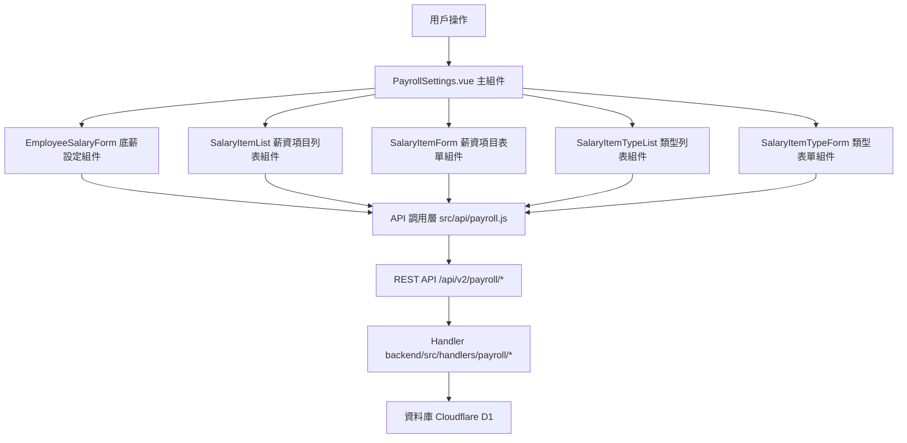

# Design Document: BR4.2: 員工底薪與加給設定

## Overview

員工底薪與加給設定功能，提供員工底薪設定、薪資項目管理和薪資項目類型管理

本功能是薪資管理系統的核心模組之一，提供員工底薪設定、薪資項目管理和薪資項目類型管理功能，幫助管理員設定和管理員工的薪資項目。

## Steering Document Alignment

### Technical Standards (tech.md)

遵循以下技術標準：
- 使用 Vue 3 Composition API 開發前端組件
- 使用 Ant Design Vue 作為 UI 組件庫
- 使用 RESTful API 進行前後端通信
- 使用 Cloudflare Workers 作為後端運行環境
- 使用 Cloudflare D1 (SQLite) 作為資料庫
- 遵循統一的錯誤處理和回應格式
- 使用參數化查詢防止 SQL 注入

### Project Structure (structure.md)

遵循以下項目結構：
- 前端組件位於 `src/components/payroll/` 或 `src/views/payroll/`
- API 調用層位於 `src/api/payroll.js`
- 後端 Handler 位於 `backend/src/handlers/payroll/`
- 資料庫 Migration 位於 `backend/migrations/`
- 遵循命名規範：組件使用 PascalCase，Handler 使用 kebab-case

## Code Reuse Analysis

### Existing Components to Leverage

- **PageHeader.vue**: 用於頁面標題和操作按鈕區域，位於 `src/components/shared/PageHeader.vue`
- **PageAlerts.vue**: 用於頁面提示訊息顯示，位於 `src/components/shared/PageAlerts.vue`
- **EmployeeSalaryForm.vue**: 用於員工底薪設定表單（需新增）
- **SalaryItemForm.vue**: 用於薪資項目表單（需新增）
- **SalaryItemTypeForm.vue**: 用於薪資項目類型表單（需新增）

### Integration Points

- **handleSetEmployeeBaseSalary**: 處理員工底薪設定 API 請求，位於 `backend/src/handlers/payroll/payroll-settings.js`
  - API 路由: `PUT /api/v2/payroll/employees/:employeeId/base-salary`
- **handleManageSalaryItems**: 處理薪資項目 CRUD API 請求，位於 `backend/src/handlers/payroll/payroll-settings.js`
  - API 路由: `GET/POST/PUT/DELETE /api/v2/payroll/employees/:employeeId/salary-items`
- **handleManageSalaryItemTypes**: 處理薪資項目類型 CRUD API 請求，位於 `backend/src/handlers/payroll/payroll-settings.js`
  - API 路由: `GET/POST/PUT/DELETE /api/v2/payroll/salary-item-types`
- **Employees 表**: 存儲員工資訊和底薪
- **EmployeeSalaryItems 表**: 存儲員工薪資項目
- **SalaryItemCategories 表**: 存儲薪資項目類型

## Architecture

本功能採用前後端分離架構，前端使用 Vue 3 Composition API，後端使用 Cloudflare Workers 提供 RESTful API。

### Modular Design Principles

- **Single File Responsibility**: 每個文件只負責一個功能模組
  - `payroll-settings.js`: 只處理薪資設定相關的 API 請求
  - 每個 Vue 組件只負責一個 UI 功能
- **Component Isolation**: 組件之間通過 props 和 events 通信，保持獨立性
- **Service Layer Separation**: API 調用層、業務邏輯層和數據訪問層分離
- **Utility Modularity**: 工具函數按功能分類，易於重用

### Component Architecture

前端採用 Vue 3 Composition API，組件結構清晰，職責單一：



## Components and Interfaces

### PayrollSettings

- **Purpose**: 薪資設定頁面的主組件，整合所有子組件
- **Interfaces**: 
  - Props: `employeeId` (String, required) - 從路由參數獲取
  - Methods: `loadEmployeeData()`, `handleError(error)`
  - Events: 無（內部狀態管理）
- **Location**: `src/views/payroll/PayrollSettings.vue`
- **Dependencies**: Ant Design Vue 組件庫、Vue Router、Pinia Store
- **Reuses**: EmployeeSalaryForm, SalaryItemList, SalaryItemForm, SalaryItemTypeList, SalaryItemTypeForm 子組件

### EmployeeSalaryForm

- **Purpose**: 員工底薪設定表單組件
- **Interfaces**: 
  - Props: `employeeId` (String, required)
  - Methods: `handleSubmit()`, `validateForm()`
  - Events: `@submit` (底薪設定成功，傳遞 `{ employeeId, baseSalary }`)
- **Location**: `src/components/payroll/EmployeeSalaryForm.vue`
- **Dependencies**: Ant Design Vue Form 組件、API 調用函數
- **Reuses**: `@/api/payroll.js` 中的 `setEmployeeBaseSalary` 函數

### SalaryItemList

- **Purpose**: 薪資項目列表組件
- **Interfaces**: 
  - Props: `employeeId` (String, required)
  - Methods: `loadSalaryItems()`, `handleEdit(item)`, `handleDelete(item)`
  - Events: `@edit` (編輯薪資項目，傳遞 `salaryItem`), `@delete` (刪除薪資項目，傳遞 `salaryItemId`)
- **Location**: `src/components/payroll/SalaryItemList.vue`
- **Dependencies**: Ant Design Vue Table 組件、API 調用函數
- **Reuses**: `@/api/payroll.js` 中的 `getSalaryItems`, `deleteSalaryItem` 函數

### SalaryItemForm

- **Purpose**: 薪資項目表單組件
- **Interfaces**: 
  - Props: `visible` (Boolean, required), `employeeId` (String, required), `salaryItem` (Object, optional)
  - Methods: `handleSubmit()`, `handleCancel()`, `validateForm()`
  - Events: `@close` (關閉表單), `@submit` (提交表單，傳遞 `salaryItem` 數據)
- **Location**: `src/components/payroll/SalaryItemForm.vue`
- **Dependencies**: Ant Design Vue Form 組件、API 調用函數
- **Reuses**: `@/api/payroll.js` 中的 `createSalaryItem`, `updateSalaryItem` 函數

### SalaryItemTypeList

- **Purpose**: 薪資項目類型列表組件
- **Interfaces**: 
  - Props: 無
  - Methods: `loadTypes()`, `handleSearch(keyword)`, `handleEdit(type)`, `handleDelete(type)`
  - Events: `@edit` (編輯類型，傳遞 `salaryItemType`), `@delete` (刪除類型，傳遞 `typeId`)
- **Location**: `src/components/payroll/SalaryItemTypeList.vue`
- **Dependencies**: Ant Design Vue Table 組件、API 調用函數
- **Reuses**: `@/api/payroll.js` 中的 `getSalaryItemTypes`, `deleteSalaryItemType` 函數

### SalaryItemTypeForm

- **Purpose**: 薪資項目類型表單組件
- **Interfaces**: 
  - Props: `visible` (Boolean, required), `salaryItemType` (Object, optional)
  - Methods: `handleSubmit()`, `handleCancel()`, `validateForm()`
  - Events: `@close` (關閉表單), `@submit` (提交表單，傳遞 `salaryItemType` 數據)
- **Location**: `src/components/payroll/SalaryItemTypeForm.vue`
- **Dependencies**: Ant Design Vue Form 組件、API 調用函數
- **Reuses**: `@/api/payroll.js` 中的 `createSalaryItemType`, `updateSalaryItemType` 函數

## Data Models

### EmployeeSalary (員工底薪)

```
- employee_id: String (員工 ID)
- base_salary: Number (底薪)
- updated_at: String (更新時間)
```

### EmployeeSalaryItem (員工薪資項目)

```
- id: String (薪資項目 ID)
- employee_id: String (員工 ID)
- category_id: String (薪資項目類型 ID)
- amount: Number (金額)
- recurring_type: String (發放週期：monthly, once, yearly)
- recurring_months: Array (指定月份，僅當 recurring_type = 'yearly' 時使用)
- effective_date: String (生效日期，格式：YYYY-MM-DD)
- expiry_date: String (過期日期，格式：YYYY-MM-DD，可為 NULL)
- is_deleted: Boolean (是否刪除)
- created_at: String (建立時間)
- updated_at: String (更新時間)
```

### SalaryItemCategory (薪資項目類型)

```
- id: String (類型 ID)
- name: String (類型名稱)
- category: String (分類：regular_allowance, irregular_allowance, bonus, deduction, year_end_bonus)
- created_at: String (建立時間)
- updated_at: String (更新時間)
```

## Error Handling

### Error Scenarios

1. **底薪設定失敗**: 
   - **Handling**: 顯示錯誤訊息，使用 Ant Design Vue 的 `message.error()`
   - **User Impact**: 用戶看到錯誤提示，可以重試操作

2. **薪資項目操作失敗**: 
   - **Handling**: 顯示錯誤訊息，允許重試
   - **User Impact**: 用戶看到錯誤提示，可以重新提交表單

3. **表單驗證失敗**: 
   - **Handling**: 顯示驗證錯誤提示，阻止表單提交
   - **User Impact**: 用戶看到欄位驗證錯誤，需要修正後才能提交

4. **薪資項目類型刪除失敗（有引用）**: 
   - **Handling**: 檢查是否有員工使用該類型，如有則阻止刪除並提示
   - **User Impact**: 用戶看到提示訊息，需要先移除所有引用才能刪除

5. **API 請求超時或網路錯誤**: 
   - **Handling**: 顯示網路錯誤訊息，提供重試選項
   - **User Impact**: 用戶看到網路錯誤提示，可以重試操作

## Testing Strategy

### Unit Testing
- 測試表單驗證邏輯
- 測試發放週期和生效日期邏輯
- 測試組件 props 和 events
- 測試 API 函數的錯誤處理

### Integration Testing
- 測試 API 調用和數據流轉
- 測試 CRUD 操作
- 測試前後端數據格式一致性
- 測試薪資重新計算觸發機制

### End-to-End Testing
- 測試完整的薪資項目管理流程
- 測試底薪設定流程
- 測試薪資項目類型管理流程
- 測試發放週期和生效日期的計算邏輯

