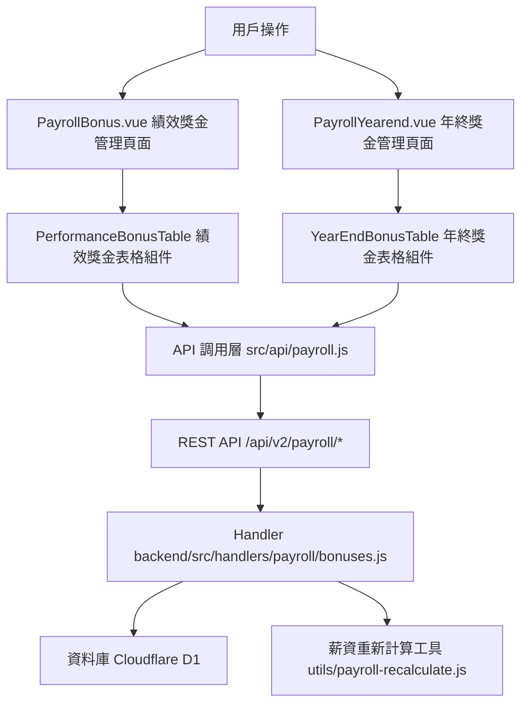

# Design Document: BR4.3: 績效獎金與年終獎金

## Overview

績效獎金與年終獎金管理功能，提供績效獎金調整和年終獎金設定功能

本功能是薪資管理系統的核心模組之一，提供績效獎金調整和年終獎金設定功能，幫助管理員管理員工的績效獎金和年終獎金。

## Steering Document Alignment

### Technical Standards (tech.md)

遵循以下技術標準：
- 使用 Vue 3 Composition API 開發前端組件
- 使用 Ant Design Vue 作為 UI 組件庫
- 使用 RESTful API 進行前後端通信
- 使用 Cloudflare Workers 作為後端運行環境
- 使用 Cloudflare D1 (SQLite) 作為資料庫
- 遵循統一的錯誤處理和回應格式
- 使用參數化查詢防止 SQL 注入

### Project Structure (structure.md)

遵循以下項目結構：
- 前端組件位於 `src/components/payroll/` 或 `src/views/payroll/`
- API 調用層位於 `src/api/payroll.js`
- 後端 Handler 位於 `backend/src/handlers/payroll/`
- 資料庫 Migration 位於 `backend/migrations/`
- 遵循命名規範：組件使用 PascalCase，Handler 使用 kebab-case

## Code Reuse Analysis

### Existing Components to Leverage

- **PerformanceBonusTable.vue**: 用於績效獎金表格（已存在）
- **YearEndBonusTable.vue**: 用於年終獎金設定表格（已存在）

### Integration Points

- **handleGetYearlyBonus**: 查詢績效獎金，位於 `backend/src/handlers/payroll/bonuses.js`
  - API 路由: `GET /api/v2/payroll/yearly-bonus/:year`
  - 功能：查詢指定年度的所有員工月度績效獎金，包含預設值和調整值
- **handleUpdateYearlyBonus**: 處理績效獎金調整 API 請求，位於 `backend/src/handlers/payroll/bonuses.js`
  - API 路由: `PUT /api/v2/payroll/yearly-bonus/:year`
  - 功能：批量更新績效獎金調整值
  - 自動觸發薪資重新計算：使用 `enqueuePayrollRecalc` 和 `recalculateEmployeePayroll`
- **handleGetYearEndBonus**: 查詢年終獎金，位於 `backend/src/handlers/payroll/bonuses.js`
  - API 路由: `GET /api/v2/payroll/year-end-bonus/:year`
  - 功能：查詢指定年度的所有員工年終獎金設定
- **handleUpdateYearEndBonus**: 處理年終獎金更新 API 請求，位於 `backend/src/handlers/payroll/bonuses.js`
  - API 路由: `PUT /api/v2/payroll/year-end-bonus/:year`
  - 功能：更新年終獎金設定（採用先刪除再插入的策略）
  - 自動觸發薪資重新計算：使用 `triggerPayrollRecalculation`
- **MonthlyBonusAdjustments 表**: 存儲績效獎金調整數據（已存在於 0004_payroll.sql migration）
- **YearEndBonus 表**: 存儲年終獎金數據（已存在於 0004_payroll.sql migration）
- **PayrollCache 表**: 存儲薪資緩存數據，獎金調整後會自動更新此表

## Architecture

### Modular Design Principles

- **Single File Responsibility**: 每個文件應該處理一個特定的關注點或領域
- **Component Isolation**: 創建小而專注的組件，而非大型單體文件
- **Service Layer Separation**: 分離數據訪問、業務邏輯和表示層
- **Utility Modularity**: 將工具函數拆分為專注的單一目的模組

### Component Architecture

前端採用 Vue 3 Composition API，組件結構清晰，職責單一：



## Components and Interfaces

### PayrollBonus

- **Purpose**: 績效獎金管理頁面主組件
- **Location**: `src/views/payroll/PayrollBonus.vue`
- **Dependencies**: Ant Design Vue 組件庫、Vue Router、Pinia Store
- **Reuses**: PerformanceBonusTable 子組件
- **Route**: `/payroll/bonus` (路由名稱: `PayrollBonus`)

### PayrollYearend

- **Purpose**: 年終獎金管理頁面主組件
- **Location**: `src/views/payroll/PayrollYearend.vue`
- **Dependencies**: Ant Design Vue 組件庫、Vue Router、Pinia Store
- **Reuses**: YearEndBonusTable 子組件
- **Route**: `/payroll/yearend` (路由名稱: `PayrollYearend`)

### PerformanceBonusTable

- **Purpose**: 績效獎金表格組件
- **Location**: `src/components/payroll/PerformanceBonusTable.vue`
- **Props**: 
  - `employees` (Array, required): 員工績效獎金數據列表
  - `loading` (Boolean, optional): 載入狀態
- **Events**: 
  - `@adjustment-change`: 績效獎金調整變更事件，參數 (empIndex, month, amount)

### YearEndBonusTable

- **Purpose**: 年終獎金設定表格組件
- **Location**: `src/components/payroll/YearEndBonusTable.vue`
- **Props**: 
  - `employees` (Array, required): 員工年終獎金數據列表
  - `loading` (Boolean, optional): 載入狀態
- **Events**: 
  - `@change`: 年終獎金變更事件，參數 (index, field, value)

## Data Models

### MonthlyBonusAdjustments (績效獎金調整)

```
- user_id: Number (員工 ID)
- month: String (月份，格式：YYYY-MM)
- bonus_amount_cents: Number (調整金額，以分為單位)
- notes: String (備註，可選)
```

注意：績效獎金數據來自兩個來源：
1. **EmployeeSalaryItems 表**：存儲員工的預設績效獎金項目（item_code = 'PERFORMANCE'）
2. **MonthlyBonusAdjustments 表**：存儲對預設值的調整記錄

### YearEndBonus (年終獎金)

```
- bonus_id: Number (獎金 ID，主鍵)
- user_id: Number (員工 ID)
- year: Number (年度)
- amount_cents: Number (金額，以分為單位)
- payment_month: String (發放月份，格式：YYYY-MM，可跨年)
- notes: String (備註，可選)
- created_by: String (建立者 ID)
- created_at: String (建立時間)
- updated_at: String (更新時間)
```

## Error Handling

### Error Scenarios

1. **績效獎金調整失敗**: 
   - **Handling**: 顯示錯誤訊息，使用 Ant Design Vue 的 `message.error()`，保留已輸入的數據
   - **User Impact**: 用戶看到錯誤提示，可以修改後重試

2. **年終獎金設定失敗**: 
   - **Handling**: 顯示錯誤訊息，允許重試，驗證失敗時標記錯誤欄位
   - **User Impact**: 用戶看到具體的錯誤提示和錯誤欄位，可以修正後重新提交

3. **表單驗證失敗**: 
   - **Handling**: 顯示驗證錯誤提示，標記錯誤欄位，阻止提交
   - **User Impact**: 用戶看到驗證錯誤信息，知道需要修正哪些欄位

4. **薪資重新計算失敗**: 
   - **Handling**: 記錄錯誤日誌，不阻塞獎金保存操作，提示用戶稍後檢查薪資
   - **User Impact**: 獎金保存成功，但可能需要等待或手動觸發薪資重新計算

## Testing Strategy

### Unit Testing
- 測試表格編輯邏輯
- 測試跨年發放邏輯

### Integration Testing
- 測試 API 調用和數據流轉
- 測試自動觸發薪資重新計算

### End-to-End Testing
- 測試完整的獎金管理流程

