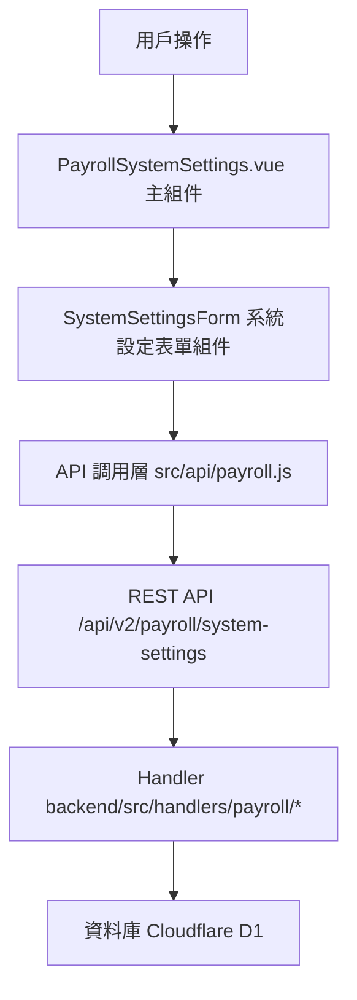

# Design Document: BR4.4: 系統設定調整

## Overview

系統設定調整功能，提供誤餐費、交通補貼、請假扣款、時薪計算等系統參數設定

本功能是薪資管理系統的核心模組之一，提供系統參數設定功能，幫助管理員調整誤餐費、交通補貼、請假扣款、時薪計算等系統參數。

## Steering Document Alignment

### Technical Standards (tech.md)

遵循以下技術標準：
- 使用 Vue 3 Composition API 開發前端組件
- 使用 Ant Design Vue 作為 UI 組件庫
- 使用 RESTful API 進行前後端通信
- 使用 Cloudflare Workers 作為後端運行環境
- 使用 Cloudflare D1 (SQLite) 作為資料庫
- 遵循統一的錯誤處理和回應格式
- 使用參數化查詢防止 SQL 注入

### Project Structure (structure.md)

遵循以下項目結構：
- 前端組件位於 `src/components/payroll/` 或 `src/views/payroll/`
- API 調用層位於 `src/api/payroll.js`
- 後端 Handler 位於 `backend/src/handlers/payroll/`
- 資料庫 Migration 位於 `backend/migrations/`
- 遵循命名規範：組件使用 PascalCase，Handler 使用 kebab-case

## Code Reuse Analysis

本功能將重用現有的組件和工具，並與現有的薪資管理系統整合。主要重用現有的 API 調用模式、表單組件模式和錯誤處理機制，同時新增系統設定專用的組件和 Handler。

### Existing Components to Leverage

- **PageHeader.vue**: 用於頁面標題和操作按鈕區域
- **Ant Design Vue Form 組件**: 用於表單驗證和展示
- **Ant Design Vue message 組件**: 用於顯示成功/錯誤訊息

### Integration Points

- **handleGetSystemSettings**: 處理系統設定查詢 API 請求，位於 `backend/src/handlers/payroll/payroll-system-settings.js`
  - API 路由: `GET /api/v2/payroll/system-settings`
- **handleUpdateSystemSettings**: 處理系統設定更新 API 請求，位於 `backend/src/handlers/payroll/payroll-system-settings.js`
  - API 路由: `PUT /api/v2/payroll/system-settings`
- **PayrollSystemSettings 表**: 存儲系統設定數據

## Architecture

本功能採用前後端分離架構，前端使用 Vue 3 Composition API 構建單頁應用，後端使用 Cloudflare Workers 提供 RESTful API 服務。整體架構遵循分層設計原則，將展示層、業務邏輯層和數據訪問層清晰分離，確保代碼的可維護性和可擴展性。

### Modular Design Principles
- **Single File Responsibility**: 每個文件應該處理一個特定的關注點或領域
- **Component Isolation**: 創建小而專注的組件，而不是大型單體文件
- **Service Layer Separation**: 分離數據訪問、業務邏輯和展示層
- **Utility Modularity**: 將工具函數拆分為專注的、單一用途的模組

### Component Architecture

前端採用 Vue 3 Composition API，組件結構清晰，職責單一：



## Components and Interfaces

### PayrollSystemSettings

- **Purpose**: 系統設定頁面的主組件，負責頁面佈局、數據載入和錯誤處理
- **Interfaces**: 
  - `loadSettings()`: 載入系統設定數據
  - `handleSubmit(settings)`: 處理表單提交
- **Location**: `src/views/payroll/PayrollSystemSettings.vue`
- **Dependencies**: Ant Design Vue 組件庫、Vue Router、Pinia Store、`src/api/payroll.js`
- **Reuses**: SystemSettingsForm 子組件

### SystemSettingsForm

- **Purpose**: 系統設定表單組件，負責表單展示、驗證和提交
- **Interfaces**: 
  - Props: `settings` (Object, required) - 系統設定數據
  - Events: `@submit` (settings) - 表單提交事件，傳遞驗證通過的設定數據
  - Methods: `validate()` - 表單驗證方法
- **Location**: `src/components/payroll/SystemSettingsForm.vue`
- **Dependencies**: Ant Design Vue Form 組件
- **Reuses**: Ant Design Vue 表單組件和驗證規則

## Data Models

### PayrollSystemSettings (系統設定)

```
- id: Integer (主鍵，唯一標識符)
- meal_allowance_price: Number (誤餐費單價，元/次)
- meal_allowance_min_hours: Number (誤餐費最低加班時數)
- transport_km_per_interval: Number (每個區間公里數)
- transport_amount_per_interval: Number (每個區間金額，元)
- sick_leave_deduction_rate: Number (病假扣款比例，0-1)
- personal_leave_deduction_rate: Number (事假扣款比例，0-1)
- daily_salary_divisor: Number (日薪計算除數)
- hourly_salary_divisor: Number (時薪計算除數，預設 240)
- updated_at: String (更新時間)
```

## Error Handling

### Error Scenarios

1. **系統設定更新失敗**
   - **Handling**: 捕獲 API 錯誤，使用 Ant Design Vue 的 `message.error()` 顯示錯誤訊息
   - **User Impact**: 用戶看到錯誤提示，設定未保存，可以重新嘗試

2. **表單驗證失敗**
   - **Handling**: 使用 Ant Design Vue Form 的驗證規則，在欄位下方顯示驗證錯誤提示
   - **User Impact**: 用戶看到具體的驗證錯誤訊息，無法提交表單直到修正錯誤

3. **網路連線失敗**
   - **Handling**: 捕獲網路錯誤，顯示連線失敗提示，允許用戶重試
   - **User Impact**: 用戶看到連線錯誤提示，可以檢查網路後重試

4. **權限不足**
   - **Handling**: 後端返回 403 錯誤，前端顯示權限不足提示
   - **User Impact**: 非管理員用戶看到權限不足提示，無法修改設定

5. **資料庫操作失敗**
   - **Handling**: 後端捕獲資料庫錯誤，返回適當的錯誤訊息
   - **User Impact**: 用戶看到系統錯誤提示，可以聯繫管理員或稍後重試

## Testing Strategy

### Unit Testing
- **表單驗證邏輯**: 測試 SystemSettingsForm 組件的表單驗證規則
- **參數範圍驗證**: 測試各項參數的邊界值驗證（負數、零、超出範圍等）
- **API 函數**: 測試 `getSystemSettings` 和 `updateSystemSettings` 函數的錯誤處理

### Integration Testing
- **API 調用和數據流轉**: 測試前端 API 調用、後端 Handler 處理、資料庫操作的完整流程
- **自動觸發薪資重新計算**: 測試設定更新後是否正確觸發所有員工的薪資重新計算
- **權限驗證**: 測試管理員和非管理員用戶的權限控制

### End-to-End Testing
- **完整的系統設定調整流程**: 測試從登入、進入設定頁面、修改設定、提交、驗證保存成功的完整流程
- **錯誤處理流程**: 測試各種錯誤情況下的用戶體驗（驗證失敗、網路錯誤、權限不足等）

