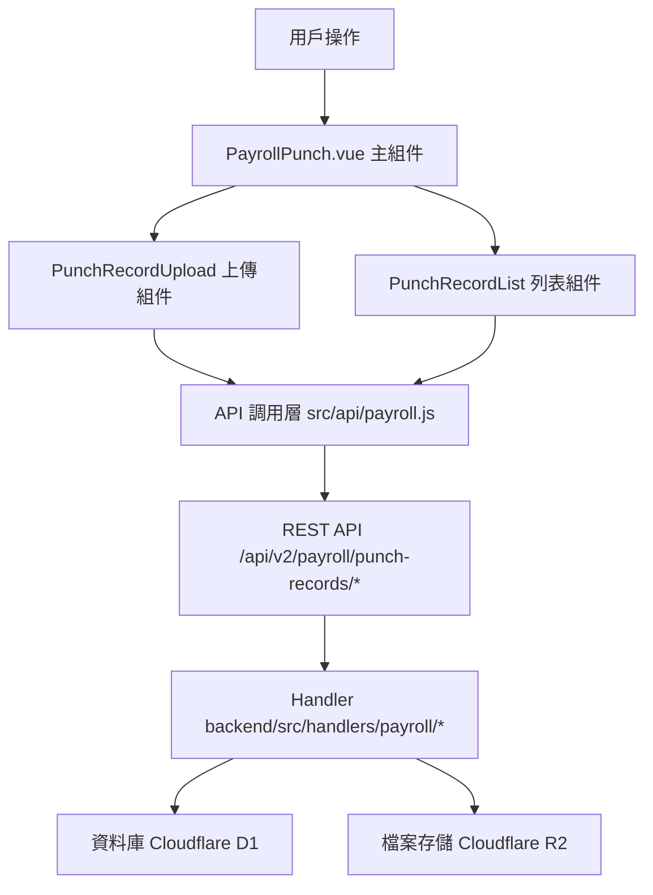

# Design Document: BR4.5: 打卡記錄上傳

## Overview

打卡記錄上傳功能，提供打卡記錄檔案上傳和查看功能

本功能是薪資管理系統的核心模組之一，提供打卡記錄檔案上傳和查看功能，幫助員工和管理員上傳和查看打卡記錄檔案。

## Steering Document Alignment

### Technical Standards (tech.md)

遵循以下技術標準：
- 使用 Vue 3 Composition API 開發前端組件
- 使用 Ant Design Vue 作為 UI 組件庫
- 使用 RESTful API 進行前後端通信
- 使用 Cloudflare Workers 作為後端運行環境
- 使用 Cloudflare D1 (SQLite) 作為資料庫
- 使用 Cloudflare R2 作為檔案存儲
- 遵循統一的錯誤處理和回應格式
- 使用參數化查詢防止 SQL 注入

### Project Structure (structure.md)

遵循以下項目結構：
- 前端組件位於 `src/components/payroll/` 或 `src/views/payroll/`
- API 調用層位於 `src/api/payroll.js`
- 後端 Handler 位於 `backend/src/handlers/payroll/`
- 資料庫 Migration 位於 `backend/migrations/`
- 遵循命名規範：組件使用 PascalCase，Handler 使用 kebab-case

## Code Reuse Analysis

### Existing Components to Leverage

- **PageHeader.vue**: 用於頁面標題和操作按鈕區域（現有組件）

### New Components to Create

- **PunchRecordUpload.vue**: 打卡記錄上傳組件（新建）
- **PunchRecordList.vue**: 打卡記錄列表組件（新建）

### Integration Points

- **handleUploadPunchRecord**: 處理打卡記錄上傳 API 請求，位於 `backend/src/handlers/payroll/payroll-punch.js`
  - API 路由: `POST /api/v2/payroll/punch-records/upload`
- **handleGetPunchRecords**: 處理打卡記錄列表查詢 API 請求，位於 `backend/src/handlers/payroll/payroll-punch.js`
  - API 路由: `GET /api/v2/payroll/punch-records`
- **handleDownloadPunchRecord**: 處理打卡記錄下載 API 請求，位於 `backend/src/handlers/payroll/payroll-punch.js`
  - API 路由: `GET /api/v2/payroll/punch-records/:id/download`
- **PunchRecords 表**: 存儲打卡記錄檔案資訊
- **Cloudflare R2**: 存儲打卡記錄檔案

## Architecture

### Modular Design Principles
- **Single File Responsibility**: 每個文件應該處理一個特定的關注點或領域
- **Component Isolation**: 創建小而專注的組件，而不是大型單體文件
- **Service Layer Separation**: 分離數據訪問、業務邏輯和表示層
- **Utility Modularity**: 將工具分解為專注的、單一用途的模組

### Component Architecture

前端採用 Vue 3 Composition API，組件結構清晰，職責單一：



## Components and Interfaces

### PayrollPunch

- **Purpose**: 打卡記錄上傳頁面的主組件，整合所有子組件
- **Location**: `src/views/payroll/PayrollPunch.vue`
- **Dependencies**: Ant Design Vue 組件庫、Vue Router、Pinia Store
- **Reuses**: PunchRecordUpload, PunchRecordList 子組件

### PunchRecordUpload

- **Purpose**: 打卡記錄上傳組件
- **Location**: `src/components/payroll/PunchRecordUpload.vue`
- **Props**: 無
- **Events**: `@upload-success` (上傳成功)

### PunchRecordList

- **Purpose**: 打卡記錄列表組件
- **Location**: `src/components/payroll/PunchRecordList.vue`
- **Props**: `records` (Array, required), `loading` (Boolean, optional)
- **Events**: `@download` (下載檔案)

## Data Models

### PunchRecord (打卡記錄)

```
- id: String (打卡記錄 ID)
- employee_id: String (員工 ID)
- month: String (月份，格式：YYYY-MM)
- file_name: String (檔案名稱)
- file_size: Number (檔案大小，字節)
- file_type: String (檔案類型)
- file_url: String (檔案 URL，R2 存儲路徑)
- uploaded_by: String (上傳人 ID)
- uploaded_at: String (上傳時間)
- created_at: String (建立時間)
- updated_at: String (更新時間)
```

## Error Handling

### Error Scenarios

1. **檔案上傳失敗（前端）**: 
   - **Handling**: 使用 Ant Design Vue 的 `message.error()` 顯示錯誤訊息
   - **User Impact**: 用戶看到錯誤提示，上傳被阻止

2. **檔案格式不支援（前端）**: 
   - **Handling**: 在上傳前驗證檔案格式，不符合時顯示錯誤訊息
   - **User Impact**: 用戶看到支援的檔案格式提示

3. **檔案大小超限（前端）**: 
   - **Handling**: 在上傳前驗證檔案大小，超過限制時顯示錯誤訊息
   - **User Impact**: 用戶看到檔案大小限制提示

4. **權限不足（後端）**: 
   - **Handling**: 後端驗證用戶權限，返回 403 Forbidden 錯誤
   - **User Impact**: 前端顯示權限不足錯誤訊息

5. **R2 存儲失敗（後端）**: 
   - **Handling**: 記錄錯誤日誌，返回 500 Internal Server Error
   - **User Impact**: 前端顯示上傳失敗錯誤訊息

6. **資料庫操作失敗（後端）**: 
   - **Handling**: 如果 R2 上傳成功但資料庫保存失敗，嘗試清理 R2 檔案，返回錯誤
   - **User Impact**: 前端顯示操作失敗錯誤訊息

## Testing Strategy

### Unit Testing
- **Handler 層測試**: 測試檔案上傳、列表查詢、下載的業務邏輯
- **權限控制測試**: 測試員工和管理員的權限驗證邏輯
- **檔案驗證測試**: 測試檔案格式和大小驗證邏輯
- **組件測試**: 測試前端組件的渲染和交互邏輯

### Integration Testing
- **API 整合測試**: 測試 API 端點與 Handler 的整合
- **資料庫整合測試**: 測試資料庫操作的正確性
- **R2 存儲整合測試**: 測試檔案上傳和下載的完整流程
- **前後端整合測試**: 測試前端 API 調用與後端響應的整合

### End-to-End Testing
- **完整上傳流程**: 測試從前端上傳到後端存儲的完整流程
- **完整查看流程**: 測試從列表查詢到檔案下載的完整流程
- **權限控制流程**: 測試不同角色用戶的權限控制
- **錯誤處理流程**: 測試各種錯誤場景的處理

