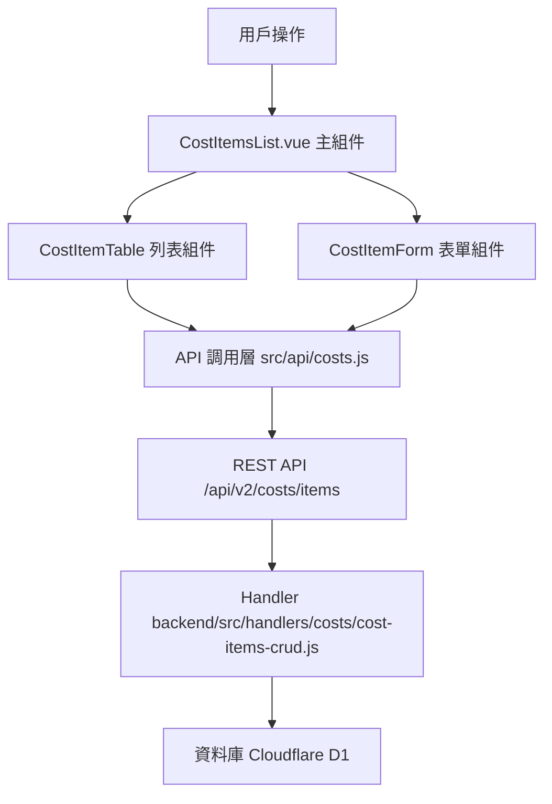

# Design Document: BR5.1: 成本項目類型管理

## Overview

成本項目類型管理功能，支援新增、編輯、刪除成本項目類型

本功能是成本管理系統的核心模組之一，提供成本項目類型的管理功能，幫助管理員設定和管理成本項目類型，為月度管理費用記錄和成本分攤計算提供基礎分類。

## Steering Document Alignment

### Technical Standards (tech.md)

遵循以下技術標準：
- 使用 Vue 3 Composition API 開發前端組件
- 使用 Ant Design Vue 作為 UI 組件庫
- 使用 RESTful API 進行前後端通信
- 使用 Cloudflare Workers 作為後端運行環境
- 使用 Cloudflare D1 (SQLite) 作為資料庫
- 遵循統一的錯誤處理和回應格式
- 使用參數化查詢防止 SQL 注入
- 僅管理員可以訪問成本管理功能

### Project Structure (structure.md)

遵循以下項目結構：
- 前端組件位於 `src/components/costs/` 或 `src/views/costs/`
- API 調用層位於 `src/api/costs.js`
- 後端 Handler 位於 `backend/src/handlers/costs/`
- 資料庫 Migration 位於 `backend/migrations/`
- 遵循命名規範：組件使用 PascalCase，Handler 使用 kebab-case

## Code Reuse Analysis

### Existing Components to Leverage

- **CostItemForm.vue**: 用於成本項目類型表單（需新增）
- **CostItemTable.vue**: 用於成本項目類型列表展示（需新增）
- **PageHeader.vue**: 用於頁面標題和操作按鈕區域（已存在於 `src/components/shared/PageHeader.vue`）

### Integration Points

- **handleGetCostItems**: 處理成本項目類型列表 API 請求，位於 `backend/src/handlers/costs/cost-items-crud.js`
  - API 路由: `GET /api/v2/costs/items`
- **handleCreateCostItem**: 處理成本項目類型新增 API 請求
  - API 路由: `POST /api/v2/costs/items`
- **handleUpdateCostItem**: 處理成本項目類型更新 API 請求
  - API 路由: `PUT /api/v2/costs/items/:id`
- **handleDeleteCostItem**: 處理成本項目類型刪除 API 請求
  - API 路由: `DELETE /api/v2/costs/items/:id`
- **OverheadCostTypes 表**: 存儲成本項目類型資訊（對應 `cost_type_id` 主鍵）

## Architecture

### Component Architecture

前端採用 Vue 3 Composition API，組件結構清晰，職責單一：



### Modular Design Principles

- **Single File Responsibility**: 每個組件文件只處理一個功能模組
- **Component Isolation**: 組件之間通過 props 和 events 通信，保持獨立
- **Service Layer Separation**: API 調用與業務邏輯分離，使用統一的 API 工具函數
- **Utility Modularity**: 工具函數按功能分組，可在多處重用

## Components and Interfaces

### CostItemsList

- **Purpose**: 成本項目類型列表頁面的主組件，整合所有子組件
- **Location**: `src/views/costs/CostItemsList.vue`
- **Interfaces**: 無（頁面組件，無對外接口）
- **Props**: 無
- **Events**: 無
- **Dependencies**: 
  - Ant Design Vue 組件庫
  - Vue Router
- **Reuses**: 
  - CostItemTable, CostItemForm 子組件
  - API 調用工具函數 (`@/utils/apiHelpers`)
- **Features**:
  - 載入成本項目類型列表
  - 處理新增、編輯、刪除操作
  - 管理表單顯示狀態

### CostItemTable

- **Purpose**: 成本項目類型列表展示組件
- **Location**: `src/components/costs/CostItemTable.vue`
- **Interfaces**: Props (costItems, loading) 和 Events (@edit, @delete)
- **Props**: 
  - `costItems` (Array, required): 成本項目類型列表
  - `loading` (Boolean, optional): 加載狀態
- **Events**:
  - `@edit`: 編輯成本項目類型
  - `@delete`: 刪除成本項目類型
- **Dependencies**: Ant Design Vue 組件庫
- **Reuses**: 無

### CostItemForm

- **Purpose**: 成本項目類型表單組件
- **Location**: `src/components/costs/CostItemForm.vue`
- **Interfaces**: Props (visible, costItem) 和 Events (@update:visible, @saved)
- **Props**: 
  - `visible` (Boolean, required): 是否顯示表單
  - `costItem` (Object, optional): 編輯時的成本項目類型數據
- **Events**:
  - `@update:visible`: 更新顯示狀態
  - `@saved`: 保存成功
- **Dependencies**: Ant Design Vue 組件庫
- **Reuses**: API 調用工具函數

## Data Models

### CostItemType (成本項目類型)

對應資料庫表：`OverheadCostTypes`

```
- cost_type_id: Integer (主鍵，自增 ID)
- cost_code: String (成本代碼，唯一，必填)
- cost_name: String (成本名稱，必填)
- category: String (類別：fixed 固定成本、variable 變動成本，必填)
- allocation_method: String (分攤方式：per_employee 按員工數、per_hour 按工時、per_revenue 按收入，必填)
- description: String (描述，可選)
- display_order: Integer (顯示順序，預設 0)
- is_active: Boolean (內部欄位，預設 true，僅用於查詢過濾，不作為功能需求)
- created_at: String (建立時間)
- updated_at: String (更新時間)
```

**索引**:
- `cost_code` 唯一索引：確保成本代碼唯一
- `is_active` 索引：用於快速查詢過濾（內部使用）
- `category` 索引：用於按類別查詢

**注意**：
- 現有資料庫表結構中沒有 `created_by` 和 `updated_by` 欄位，如需審計追蹤，需要通過 migration 添加或使用其他方式記錄
- `is_active` 欄位存在於資料庫表中，但本功能不提供啟用/停用操作，刪除採用硬刪除

## Error Handling

### Error Scenarios

1. **成本代碼重複**:
   - **Handling**: 顯示錯誤訊息，使用 Ant Design Vue 的 `message.error()`
   - **User Impact**: 用戶看到錯誤提示，可以修改代碼後重試

2. **刪除已被使用的成本項目類型**:
   - **Handling**: 檢查 `MonthlyOverheadCosts` 和 `OverheadRecurringTemplates` 表，如果已被使用則顯示錯誤訊息，阻止刪除
   - **User Impact**: 用戶看到錯誤提示，了解該項目已被使用（在月度管理費用記錄或自動生成模板中）

3. **必填欄位未填寫**:
   - **Handling**: 表單驗證，顯示驗證錯誤
   - **User Impact**: 用戶看到驗證錯誤，可以填寫必填欄位

## Testing Strategy

### Unit Testing

- 測試 CostItemForm 組件的表單驗證邏輯
- 測試 CostItemTable 組件的顯示邏輯
- 測試成本代碼唯一性檢查邏輯

### Integration Testing

- 測試 API 調用和數據流轉
- 測試新增、編輯、刪除功能

### End-to-End Testing

- 測試完整的成本項目類型管理流程
- 測試新增、編輯、刪除操作

