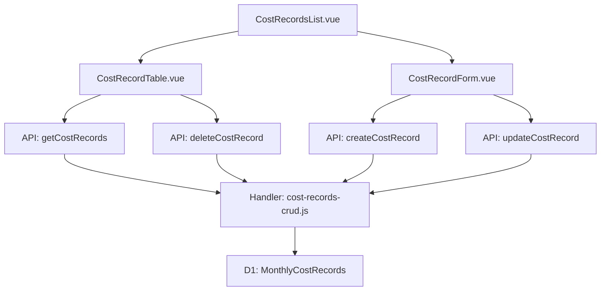

# Design Document: BR5.2: 月度管理費用記錄

## Overview

月度管理費用記錄功能，支援新增、編輯、刪除月度管理費用

## Steering Document Alignment

### Technical Standards (tech.md)
遵循技術標準，使用 Vue 3 Composition API、Ant Design Vue、Cloudflare Workers 和 D1 資料庫。所有 API 使用 RESTful 設計，前端使用 Composition API 模式，後端使用 Cloudflare Workers 環境。

### Project Structure (structure.md)
遵循項目結構規範，前端組件按功能模組組織在 `src/views/` 和 `src/components/` 目錄，後端 handler 按功能分類在 `backend/src/handlers/` 目錄，API 路由統一在 `backend/src/router/` 配置。

## Code Reuse Analysis

### Existing Components to Leverage

- **通用表單組件**: 使用 Ant Design Vue 的 Form 組件進行表單驗證
- **通用表格組件**: 使用 Ant Design Vue 的 Table 組件進行列表展示
- **通用 API 工具**: 使用 `src/api/` 目錄下的 API 調用模式
- **通用響應處理**: 使用 `backend/src/utils/response.js` 進行統一回應格式處理

### Integration Points

- **API 路由**: 
  - `GET /api/v2/costs/records` - 獲取月度管理費用記錄列表（handler: `handleGetCostRecords`）
  - `POST /api/v2/costs/records` - 新增月度管理費用記錄（handler: `handleCreateCostRecord`）
  - `PUT /api/v2/costs/records/:id` - 更新月度管理費用記錄（handler: `handleUpdateCostRecord`）
  - `DELETE /api/v2/costs/records/:id` - 刪除月度管理費用記錄（handler: `handleDeleteCostRecord`）
- **Handler 函數**: 
  - 所有 handler 函數定義在 `backend/src/handlers/costs/cost-records-crud.js`
  - 在 `backend/src/handlers/costs/index.js` 中導入並分發到對應路由
- **資料庫表**: 
  - `MonthlyCostRecords` 表：存儲月度管理費用記錄資訊（或使用現有的 `MonthlyOverheadCosts` 表）
  - `OverheadCostTypes` 表：成本項目類型資訊（用於關聯查詢，對應 `cost_item_type_id`）
- **權限系統**: 使用現有的管理員權限檢查中間件（`withAdmin`）

## Architecture

前端採用 Vue 3 Composition API，後端使用 Cloudflare Workers 和 D1 資料庫。

### Modular Design Principles
- **Single File Responsibility**: 每個文件處理單一職責（列表、表單、API handler）
- **Component Isolation**: 表單和表格組件獨立，可重用
- **Service Layer Separation**: API handler 處理業務邏輯，與資料庫操作分離
- **Utility Modularity**: 驗證邏輯和錯誤處理使用獨立工具函數



## Components and Interfaces

### CostRecordsList

- **Purpose**: 月度管理費用記錄列表頁面的主組件
- **Location**: `src/views/costs/CostRecordsList.vue`
- **Interfaces**: 
  - Props: 無（頁面級組件）
  - Emits: 無
  - Methods: `loadRecords()`, `handleCreate()`, `handleEdit()`, `handleDelete()`
- **Dependencies**: `CostRecordTable`, `CostRecordForm`, `src/api/costs.js`
- **Reuses**: Ant Design Vue 的 Layout、Button 組件

### CostRecordTable

- **Purpose**: 月度管理費用記錄表格組件，顯示列表並提供操作按鈕
- **Location**: `src/components/costs/CostRecordTable.vue`
- **Interfaces**:
  - Props: `records` (Array), `loading` (Boolean)
  - Emits: `edit` (record), `delete` (id)
- **Dependencies**: Ant Design Vue Table 組件
- **Reuses**: Ant Design Vue 的 Table、Button、Popconfirm 組件

### CostRecordForm

- **Purpose**: 月度管理費用記錄表單組件，用於新增和編輯
- **Location**: `src/components/costs/CostRecordForm.vue`
- **Interfaces**:
  - Props: `visible` (Boolean), `record` (Object, 可選，編輯模式時傳入)
  - Emits: `submit` (formData), `cancel` ()
- **Dependencies**: Ant Design Vue Form 組件, `src/api/costs.js`
- **Reuses**: Ant Design Vue 的 Form、Input、Select、InputNumber 組件

## Data Models

### MonthlyCostRecord

```
- id: String (主鍵，對應資料庫 overhead_id)
- cost_item_type_id: String (成本項目類型 ID，外鍵，對應 OverheadCostTypes.cost_type_id)
- year: Number (年份)
- month: Number (月份，1-12)
- amount: Number (金額，必填，必須為正數)
- notes: String (備註，可選)
- created_at: String (建立時間，對應 recorded_at)
- created_by: String (建立人 ID，對應 recorded_by)
- updated_at: String (更新時間)
- updated_by: String (更新人 ID，可選)
```

**唯一約束**: `(cost_item_type_id, year, month)` 唯一索引

**注意**: 如果使用現有的 `MonthlyOverheadCosts` 表，欄位映射關係如下：
- `overhead_id` → `id`
- `cost_type_id` → `cost_item_type_id`
- `recorded_by` → `created_by`
- `recorded_at` → `created_at`
- `updated_at` → `updated_at`
- `updated_by` → 現有表無此欄位，實現時可選添加或使用 `recorded_by` 作為更新人
- `is_deleted` → 現有表有此欄位，但本規範要求使用硬刪除，實現時應直接 DELETE 而非更新 `is_deleted`

## Error Handling

### Error Scenarios
1. **月度唯一性衝突**: 
   - **Handling**: 後端檢查唯一性約束，返回 409 Conflict 錯誤
   - **User Impact**: 前端顯示「該成本項目類型在此月份已有記錄」錯誤訊息，阻止提交

2. **必填欄位未填寫**: 
   - **Handling**: 前端表單驗證和後端驗證雙重檢查
   - **User Impact**: 表單顯示紅色錯誤提示，標註必填欄位

3. **金額非正數**: 
   - **Handling**: 前端表單驗證和後端驗證
   - **User Impact**: 顯示「金額必須為正數」錯誤訊息

4. **成本項目類型不存在**: 
   - **Handling**: 後端驗證外鍵約束
   - **User Impact**: 顯示「成本項目類型不存在」錯誤訊息

5. **權限不足**: 
   - **Handling**: 中間件檢查管理員權限
   - **User Impact**: 返回 403 Forbidden，顯示無權限提示

## Testing Strategy

### Unit Testing
- **API Handlers**: 測試 CRUD 操作的業務邏輯和驗證邏輯
- **表單組件**: 測試表單驗證規則和提交邏輯
- **表格組件**: 測試列表展示和操作按鈕功能

### Integration Testing
- **API 整合**: 測試 API 端點與資料庫的整合
- **前端整合**: 測試組件與 API 的整合流程

### End-to-End Testing
- **完整流程**: 測試新增、編輯、刪除、列表查詢的完整用戶流程
- **驗證場景**: 測試月度唯一性檢查、必填欄位驗證、金額驗證等驗證場景

