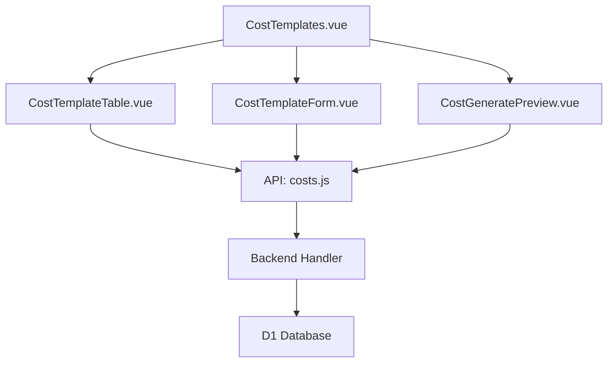

# Design Document: BR5.3: 自動生成模板

## Overview

自動生成模板功能，支援設定自動生成模板和自動生成月度記錄

## Steering Document Alignment

### Technical Standards (tech.md)

本設計遵循技術標準文檔中定義的技術棧和架構模式：
- 使用 Vue 3 Composition API 進行前端開發
- 使用 Ant Design Vue 作為 UI 組件庫
- 後端使用 Cloudflare Workers 和 D1 資料庫
- 遵循 RESTful API 設計規範
- 使用參數化查詢確保安全性

### Project Structure (structure.md)

本實現將遵循項目結構規範：
- 前端組件按功能模組組織在 `src/components/costs/` 目錄
- 後端 Handler 按功能分類在 `backend/src/handlers/costs/` 目錄
- 遵循命名規範：Vue 組件使用 PascalCase，Handler 文件使用 kebab-case
- API 調用統一從 `src/api/` 目錄導入

## Code Reuse Analysis

### Existing Components to Leverage

- **OverheadTemplateModal.vue**: 可參考現有模板表單組件的結構和模式
- **CostTypeFormModal.vue**: 可參考表單驗證和 Modal 組件的實現模式
- **OverheadCostsTable.vue**: 可參考表格組件的展示和操作模式
- **GenerateOverheadCostsModal.vue**: 可參考生成預覽組件的實現模式
- **usePageAlert composable**: 重用頁面提示工具（successMessage, errorMessage）
- **useCostStore**: 可重用成本相關的狀態管理（如果適用）

### Integration Points

- **API 層**: 
  - `src/api/costs.js`: 可擴展現有成本相關 API 函數，添加模板相關的 API 調用
  - 使用現有的 API 工具函數進行錯誤處理和請求封裝
- **後端 Handler**: 
  - `handleGetCostTemplates`: 處理模板列表 API 請求
    - API 路由: `GET /api/v2/costs/templates`
  - `handleCreateCostTemplate`: 處理模板新增 API 請求
    - API 路由: `POST /api/v2/costs/templates`
  - `handleUpdateCostTemplate`: 處理模板更新 API 請求
    - API 路由: `PUT /api/v2/costs/templates/:id`
  - `handleDeleteCostTemplate`: 處理模板刪除 API 請求
    - API 路由: `DELETE /api/v2/costs/templates/:id`
  - `handlePreviewGenerate`: 處理預覽生成 API 請求
    - API 路由: `POST /api/v2/costs/generate/preview`
  - `handleGenerateCostRecords`: 處理自動生成 API 請求
    - API 路由: `POST /api/v2/costs/generate`
- **資料庫**: 
  - **CostTemplates 表**: 存儲模板資訊
  - **MonthlyCostRecords 表**: 存儲月度管理費用記錄（已存在）
  - **CostItemTypes 表**: 成本項目類型表（已存在，用於關聯）
- **工具函數**: 
  - `backend/src/utils/response.js`: 統一回應格式
  - `backend/src/utils/db.js`: 資料庫操作工具
  - `backend/src/utils/validation.js`: 數據驗證工具

## Architecture

前端採用 Vue 3 Composition API，後端使用 Cloudflare Workers 和 D1 資料庫。

### Modular Design Principles

- **Single File Responsibility**: 每個文件處理單一功能模組
- **Component Isolation**: 創建小型、聚焦的組件而非大型單體文件
- **Service Layer Separation**: 分離數據訪問、業務邏輯和展示層
- **Utility Modularity**: 將工具函數拆分為聚焦、單一職責的模組



## Components and Interfaces

### CostTemplates

- **Purpose**: 自動生成模板主頁面，整合模板管理和自動生成功能
- **Interfaces**: 
  - `loadTemplates()`: 載入模板列表
  - `handleGenerate()`: 觸發自動生成流程
- **Dependencies**: CostTemplateTable, CostTemplateForm, CostGeneratePreview, costs API
- **Reuses**: 通用表格組件、表單組件、API 工具函數

### CostTemplateTable

- **Purpose**: 顯示模板列表，支援編輯和刪除操作
- **Interfaces**: 
  - `props: { templates: Array }`
  - `emit: edit, delete`
- **Dependencies**: Ant Design Table 組件
- **Reuses**: 通用表格樣式和操作按鈕組件

### CostTemplateForm

- **Purpose**: 模板設定表單，處理新增和編輯
- **Interfaces**: 
  - `props: { template: Object, visible: Boolean }`
  - `emit: submit, cancel`
- **Dependencies**: Ant Design Form 組件
- **Reuses**: 表單驗證工具、成本項目類型選擇器

### CostGeneratePreview

- **Purpose**: 自動生成預覽組件，顯示將要生成的記錄
- **Interfaces**: 
  - `props: { previewData: Array, visible: Boolean }`
  - `emit: confirm, cancel`
- **Dependencies**: Ant Design Modal, Table 組件
- **Reuses**: 通用預覽組件樣式

## Data Models

### CostTemplate

```
- id: String (主鍵)
- cost_item_type_id: String (成本項目類型 ID，外鍵，唯一)
- fixed_amount: Number (固定金額，必填，必須為正數)
- created_at: String (建立時間)
- created_by: String (建立人 ID)
- updated_at: String (更新時間)
- updated_by: String (更新人 ID)
```

**唯一約束**: `cost_item_type_id` 唯一索引

## Error Handling

1. **模板已存在**: 
   - **Handling**: 後端返回唯一性約束錯誤，前端顯示 Toast 錯誤訊息
   - **User Impact**: 用戶看到「該成本項目類型已存在模板」錯誤提示

2. **必填欄位未填寫**: 
   - **Handling**: 表單驗證攔截，顯示欄位驗證錯誤
   - **User Impact**: 表單欄位下方顯示紅色錯誤提示文字

3. **金額非正數**: 
   - **Handling**: 表單驗證規則檢查，阻止提交
   - **User Impact**: 金額欄位顯示「金額必須大於 0」錯誤提示

4. **生成失敗**: 
   - **Handling**: 後端返回錯誤，前端顯示錯誤訊息，記錄失敗原因到 Console
   - **User Impact**: 顯示 Toast 錯誤訊息，告知用戶生成失敗

5. **網絡錯誤**: 
   - **Handling**: API 調用失敗時顯示網絡錯誤提示
   - **User Impact**: 顯示「網絡連接失敗，請稍後再試」提示

## Testing Strategy

### Unit Testing

- **組件測試**: 測試表單驗證邏輯、組件狀態管理
- **工具函數測試**: 測試 API 調用函數、數據轉換函數
- **關鍵組件**: CostTemplateForm 表單驗證、CostGeneratePreview 數據展示

### Integration Testing

- **API 整合測試**: 測試前後端 API 整合，驗證數據流轉
- **關鍵流程**: 模板 CRUD 流程、自動生成流程
- **數據一致性**: 驗證模板與生成記錄的關聯正確性

### End-to-End Testing

- **用戶流程測試**: 完整測試模板設定到自動生成的完整流程
- **用戶場景**: 
  - 新增模板 → 自動生成記錄
  - 編輯模板 → 重新生成記錄
  - 刪除模板 → 驗證關聯處理

