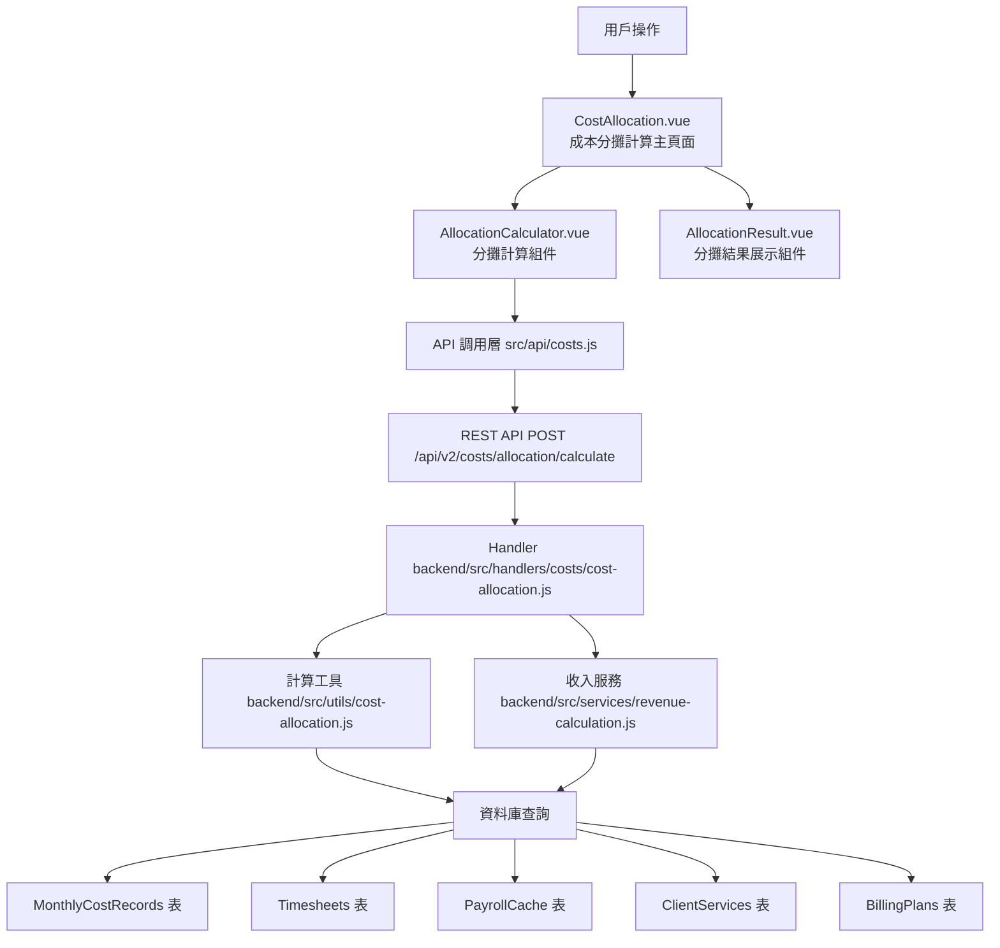

# Design Document: BR5.4: 成本分攤計算

## Overview

成本分攤計算功能是成本管理系統的核心模組，支援按不同方式（按員工數、按工時、按收入）分攤管理費用，並計算員工實際時薪和客戶任務成本。本功能在後端實現所有計算邏輯，確保計算準確性和數據一致性，前端提供直觀的操作界面和結果展示。

## Steering Document Alignment

### Technical Standards (tech.md)

遵循以下技術標準：
- 使用 Vue 3 Composition API 開發前端組件
- 使用 Ant Design Vue 作為 UI 組件庫
- 使用 RESTful API 進行前後端通信
- 使用 Cloudflare Workers 作為後端運行環境
- 使用 Cloudflare D1 (SQLite) 作為資料庫
- 遵循統一的錯誤處理和回應格式
- 使用參數化查詢防止 SQL 注入
- 計算邏輯在後端實現，確保準確性

### Project Structure (structure.md)

遵循以下項目結構：
- 前端組件位於 `src/components/costs/` 或 `src/views/costs/`
- API 調用層位於 `src/api/costs.js`
- 後端 Handler 位於 `backend/src/handlers/costs/`
- 工具函數位於 `backend/src/utils/cost-allocation.js`
- 服務層位於 `backend/src/services/revenue-calculation.js`
- 遵循命名規範：組件使用 PascalCase，Handler 使用 kebab-case

## Code Reuse Analysis

### Existing Components to Leverage

- **DatePicker 組件**: 重用 Ant Design Vue 的 DatePicker 用於年份月份選擇
- **Table 組件**: 重用 Ant Design Vue 的 Table 組件展示分攤結果
- **Form 組件**: 重用 Ant Design Vue 的 Form 組件進行表單驗證
- **API 工具**: 重用 `src/api/` 目錄下的 API 調用模式
- **Response 工具**: 重用 `backend/src/utils/response.js` 統一回應格式
- **驗證工具**: 重用現有的參數驗證工具

### Integration Points

- **handleCalculateAllocation**: 處理成本分攤計算 API 請求
  - API 路由: `POST /api/v2/costs/allocation/calculate`
- **MonthlyCostRecords 表**: 查詢月度管理費用記錄
- **Timesheets 表**: 查詢員工工時（與 BR4 整合）
- **PayrollCache 表**: 查詢員工薪資（與 BR4 整合）
- **ClientServices 表**: 查詢客戶服務（與 BR1 整合）
- **BillingPlans 表**: 查詢收費計劃（與 BR1 整合）

## Architecture

### Component Architecture

前端採用 Vue 3 Composition API，後端使用 Cloudflare Workers 和 D1 資料庫。分攤計算邏輯在後端實現，確保計算準確性。



### Modular Design Principles

- **Single File Responsibility**: 每個文件只負責一個功能模組（如 cost-allocation.js 只負責分攤計算邏輯）
- **Component Isolation**: 組件之間通過 props 和 events 通信，保持獨立
- **Service Layer Separation**: API 調用、業務邏輯、資料庫查詢分層實現
- **Utility Modularity**: 計算邏輯抽取為可重用的工具函數

## Components and Interfaces

### CostAllocation

- **Purpose**: 成本分攤計算主頁面，整合計算和結果展示功能
- **Location**: `src/views/costs/CostAllocation.vue`
- **Interfaces**: 
  - `handleCalculate(params)`: 觸發分攤計算
  - `handleResultUpdate(result)`: 更新計算結果
- **Dependencies**: 
  - AllocationCalculator 組件
  - AllocationResult 組件
  - API 調用函數 (`src/api/costs.js`)
- **Reuses**: 
  - Ant Design Vue 組件庫
  - 現有的 API 調用模式

### AllocationCalculator

- **Purpose**: 分攤計算輸入組件，提供參數選擇和計算觸發
- **Location**: `src/components/costs/AllocationCalculator.vue`
- **Interfaces**: 
  - Props: 無（獨立組件）
  - Events: `calculate` (觸發計算事件，傳遞參數)
- **Dependencies**: 
  - Ant Design Vue DatePicker, Select, Button 組件
- **Reuses**: 
  - Ant Design Vue 表單組件
  - 現有的表單驗證模式

### AllocationResult

- **Purpose**: 分攤結果展示組件，顯示計算結果明細
- **Location**: `src/components/costs/AllocationResult.vue`
- **Interfaces**: 
  - Props: `result` (Object, required) - 計算結果數據
  - Events: 無（展示組件）
- **Dependencies**: 
  - Ant Design Vue Table 組件
- **Reuses**: 
  - Ant Design Vue Table 組件
  - 現有的數據格式化工具

## Data Models

### AllocationResult

```
- year: Number (年份)
- month: Number (月份)
- allocation_method: String (分攤方式)
- total_cost: Number (總成本)
- employee_allocations: Array (員工分攤明細)
  - user_id: String
  - user_name: String
  - allocated_cost: Number (分攤金額)
  - base_salary: Number (底薪)
  - total_salary: Number (總薪資)
  - actual_hours: Number (實際工時)
  - hourly_rate: Number (時薪)
- client_task_costs: Array (客戶任務成本明細)
  - client_id: String
  - client_name: String
  - task_id: String
  - task_name: String
  - hours: Number (工時)
  - cost: Number (成本)
```

## Error Handling

1. **計算失敗**: 顯示錯誤訊息，記錄失敗原因
   - **Handling**: 返回錯誤狀態碼和詳細錯誤訊息
   - **User Impact**: 前端顯示 Toast 錯誤提示
2. **數據缺失**: 提示缺少必要數據（如工時、薪資等）
   - **Handling**: 驗證必要數據是否存在，返回明確的缺失數據清單
   - **User Impact**: 顯示具體缺少哪些數據，引導用戶補充
3. **計算超時**: 顯示超時錯誤，建議重試
   - **Handling**: 設置計算超時限制，返回超時錯誤
   - **User Impact**: 顯示超時提示，提供重試按鈕
4. **除零錯誤**: 處理工時為 0 或總數為 0 的情況
   - **Handling**: 在計算前檢查分母是否為 0，返回適當錯誤
   - **User Impact**: 提示數據異常，無法計算

## Testing Strategy

### Unit Testing
- 測試成本分攤計算工具函數（按員工數、按工時、按收入）
- 測試員工時薪計算邏輯
- 測試客戶任務成本計算邏輯
- 測試應計收入計算服務
- 使用 Jest 或類似框架進行單元測試

### Integration Testing
- 測試 API Handler 與計算邏輯的整合
- 測試資料庫查詢與計算邏輯的整合
- 測試前端 API 調用與後端回應的整合
- 驗證不同分攤方式的正確性

### End-to-End Testing
- 測試完整的分攤計算流程（選擇參數 → 計算 → 顯示結果）
- 測試不同分攤方式的計算結果
- 測試錯誤處理流程（數據缺失、計算失敗等）
- 使用 Playwright 進行 E2E 測試

