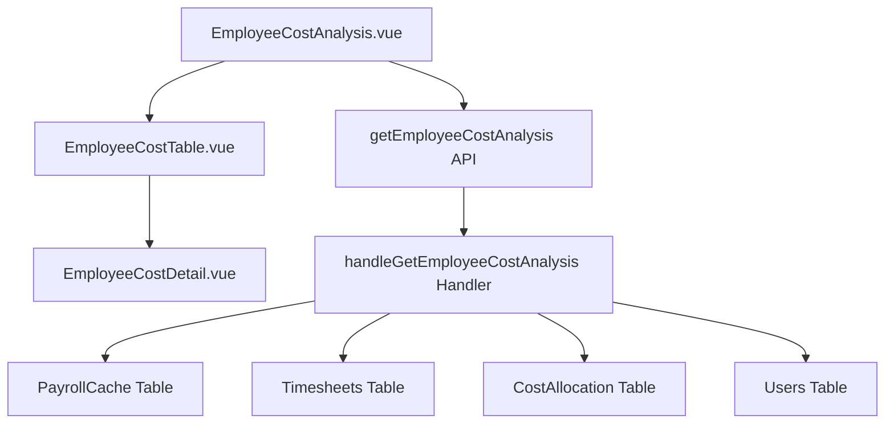

# Design Document: BR5.5: 員工成本分析

## Overview

員工成本分析功能，顯示員工實際時薪和分攤管理費明細

## Steering Document Alignment

### Technical Standards (tech.md)

遵循技術標準：
- 使用 Vue 3 Composition API 進行前端開發
- 使用 Ant Design Vue 作為 UI 組件庫
- 後端使用 Cloudflare Workers 和 D1 資料庫
- 遵循 RESTful API 設計規範
- 使用參數化查詢防止 SQL 注入

### Project Structure (structure.md)

遵循項目結構規範：
- 前端組件按功能模組組織在 `src/components/costs/` 目錄
- 頁面組件放在 `src/views/costs/` 目錄
- API 調用函數統一放在 `src/api/costs.js`
- 後端 Handler 放在 `backend/src/handlers/costs/` 目錄
- 路由配置統一管理在 `backend/src/router/costs.js`

## Code Reuse Analysis

### Existing Components to Leverage

- **Ant Design Vue Table**: 使用 `a-table` 組件的展開功能展示明細
- **DatePicker**: 使用 `a-date-picker` 選擇年份月份
- **API 工具**: 重用 `src/api/` 目錄下的 API 調用模式
- **Response 工具**: 重用 `backend/src/utils/response.js` 統一回應格式
- **認證中間件**: 重用現有的認證和權限檢查中間件

### Integration Points

- **handleGetEmployeeCostAnalysis**: 處理員工成本分析 API 請求
  - API 路由: `GET /api/v2/costs/employee-analysis`
  - 整合 BR5.4 的分攤計算結果（從 CostAllocation 表查詢）
  - 整合 BR4 的薪資數據（從 PayrollCache 表查詢）
  - 整合 BR4 的工時數據（從 Timesheets 表查詢）
- **成本分攤計算結果**: 使用 BR5.4 的分攤計算結果，確保數據一致性
- **PayrollCache 表**: 查詢員工薪資（與 BR4 整合）
- **Timesheets 表**: 查詢員工工時（與 BR4 整合）
- **Users 表**: 查詢員工基本資訊

## Architecture

前端採用 Vue 3 Composition API，後端使用 Cloudflare Workers 和 D1 資料庫。依賴 BR5.4 的分攤計算結果。

### Modular Design Principles

- **Single File Responsibility**: 每個文件只處理一個特定關注點或領域
- **Component Isolation**: 創建小而專注的組件，而非大型單體文件
- **Service Layer Separation**: 分離數據訪問、業務邏輯和展示層
- **Utility Modularity**: 將工具函數拆分為專注的、單一用途的模組



## Components and Interfaces

### EmployeeCostAnalysis

- **Purpose**: 員工成本分析主頁面
- **Location**: `src/views/costs/EmployeeCostAnalysis.vue`
- **Interfaces**: 
  - Props: 無
  - Emits: 無
  - Methods: `loadData(year, month)`, `handleError(error)`
- **Dependencies**: `getEmployeeCostAnalysis` API 函數, `EmployeeCostTable` 組件, Ant Design Vue DatePicker
- **Reuses**: `src/api/costs.js`, `EmployeeCostTable` 組件
- **Features**: 選擇年份月份、載入分析數據、顯示列表和明細

### EmployeeCostTable

- **Purpose**: 員工成本表格組件
- **Location**: `src/components/costs/EmployeeCostTable.vue`
- **Interfaces**:
  - Props: `employees: Array`, `loading: Boolean`
  - Emits: 無
  - Methods: `handleExpand(expanded, record)`
- **Dependencies**: Ant Design Vue Table, `EmployeeCostDetail` 組件
- **Reuses**: Ant Design Vue Table 組件, `EmployeeCostDetail` 組件
- **Features**: 顯示員工成本列表，支援展開查看明細

### EmployeeCostDetail

- **Purpose**: 員工成本明細組件
- **Location**: `src/components/costs/EmployeeCostDetail.vue`
- **Interfaces**:
  - Props: `details: Object` (包含底薪、津貼、加班費、扣款、分攤明細)
  - Emits: 無
  - Methods: 無（純展示組件）
- **Dependencies**: Ant Design Vue Descriptions 或 List 組件
- **Reuses**: Ant Design Vue Descriptions/List 組件
- **Features**: 顯示底薪、津貼/獎金、補休轉加班費、請假扣款、分攤管理費明細

## Data Models

### EmployeeCostAnalysis

```
- year: Number (年份)
- month: Number (月份)
- employees: Array (員工列表)
  - user_id: String
  - user_name: String
  - base_salary: Number (底薪)
  - actual_hours: Number (本月工時)
  - salary_cost: Number (薪資成本，應發)
  - allocated_cost: Number (分攤管理費)
  - total_cost: Number (本月總成本)
  - hourly_rate: Number (實際時薪)
  - details: Object (明細)
    - base_salary: Number
    - allowances: Number (津貼/獎金)
    - overtime_pay: Number (補休轉加班費)
    - leave_deduction: Number (請假扣款)
    - allocation_details: Array (分攤管理費明細)
      - cost_item_type_id: String
      - cost_item_name: String
      - allocated_amount: Number
```

## Error Handling

### Error Scenarios

1. **數據缺失**: 
   - **Handling**: 當缺少必要數據時，顯示友好提示訊息，並記錄錯誤日誌
   - **User Impact**: 用戶看到「數據不完整，請稍後再試」的提示

2. **計算錯誤**: 
   - **Handling**: 顯示錯誤訊息，記錄失敗原因到日誌系統
   - **User Impact**: 用戶看到「計算錯誤，請聯繫管理員」的提示

3. **權限不足**: 
   - **Handling**: 後端返回 403 錯誤，前端顯示權限不足提示
   - **User Impact**: 用戶看到「您沒有權限訪問此功能」的提示

4. **API 請求失敗**: 
   - **Handling**: 捕獲網路錯誤，顯示重試選項
   - **User Impact**: 用戶看到「請求失敗，請重試」的提示和重試按鈕

## Testing Strategy

### Unit Testing

- **組件測試**: 測試 EmployeeCostTable 和 EmployeeCostDetail 組件的渲染和交互
- **API 函數測試**: 測試 API 調用函數的錯誤處理和數據轉換
- **Handler 測試**: 測試後端 Handler 的數據查詢和計算邏輯

### Integration Testing

- **API 整合測試**: 測試前後端 API 整合，驗證數據格式和錯誤處理
- **數據庫整合測試**: 測試多表查詢和數據聚合邏輯

### End-to-End Testing

- **完整流程測試**: 測試從選擇年份月份到查看明細的完整用戶流程
- **權限測試**: 測試非管理員用戶無法訪問功能
- **數據展示測試**: 驗證數據正確顯示和計算結果準確性

