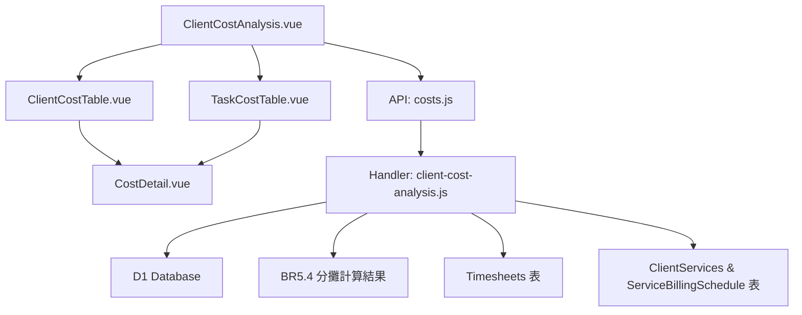

# Design Document: BR5.6: 客戶任務成本分析

## Overview

客戶任務成本分析功能，顯示客戶和任務的成本、收入、利潤分析

## Steering Document Alignment

### Technical Standards (tech.md)
- 遵循 Vue 3 Composition API 開發模式
- 使用 Ant Design Vue 組件庫保持 UI 一致性
- 後端使用 Cloudflare Workers 和 D1 資料庫
- 遵循 RESTful API 設計規範

### Project Structure (structure.md)
- 前端組件按功能模組組織在 `src/components/costs/` 目錄
- 後端 Handler 按功能模組組織在 `backend/src/handlers/costs/` 目錄
- API 路由統一配置在 `backend/src/router/costs.js`
- 遵循單一職責原則，每個文件只負責一個功能

## Code Reuse Analysis

### Existing Components to Leverage

- **Ant Design Vue Table**: 使用 `a-table` 組件展示成本列表，支援展開功能
- **Ant Design Vue DatePicker**: 使用 `a-date-picker` 組件選擇年份月份
- **Ant Design Vue Tabs**: 使用 `a-tabs` 組件切換客戶/任務視圖
- **API 工具函數**: 重用 `src/api/` 目錄下的 API 調用模式
- **Response 工具**: 重用 `backend/src/utils/response.js` 統一回應格式

### Integration Points

- **handleGetClientCostAnalysis**: 處理客戶成本分析 API 請求
  - API 路由: `GET /api/v2/costs/client-analysis?year=YYYY&month=M`
  - Query Parameters: `year` (必填，整數), `month` (必填，整數 1-12)
- **handleGetTaskCostAnalysis**: 處理任務成本分析 API 請求
  - API 路由: `GET /api/v2/costs/task-analysis?year=YYYY&month=M`
  - Query Parameters: `year` (必填，整數), `month` (必填，整數 1-12)
- **成本分攤計算結果**: 使用 BR5.4 的分攤計算結果
  - 使用 client_task_costs 獲取客戶任務成本
  - 計算每個成本項目的分攤金額：從 MonthlyOverheadCosts 表查詢每個成本項目的金額，根據 BR5.4 的分攤比例計算每個成本項目分攤給每個客戶的金額
- **Timesheets 表**: 查詢工時記錄（與 BR4 整合）
- **MonthlyOverheadCosts 表**: 查詢每個成本項目類型的月度金額
- **OverheadCostTypes 表**: 查詢成本項目類型資訊（成本項目名稱）
- **ClientServices 和 ServiceBillingSchedule 表**: 計算應計收入（與 BR1 整合）
  - 定期服務：按執行次數比例分攤
  - 一次性服務：直接使用實際金額

## Architecture

前端採用 Vue 3 Composition API，後端使用 Cloudflare Workers 和 D1 資料庫。依賴 BR5.4 的分攤計算結果。

### Modular Design Principles
- **Single File Responsibility**: 每個文件處理一個特定功能（Handler、Component、API 函數分離）
- **Component Isolation**: 創建小型、聚焦的組件而非大型單體文件
- **Service Layer Separation**: 分離數據訪問、業務邏輯和展示層
- **Utility Modularity**: 將工具函數拆分為聚焦、單一用途的模組



## Components and Interfaces

### ClientCostAnalysis

- **Purpose**: 客戶任務成本分析主頁面
- **Location**: `src/views/costs/ClientCostAnalysis.vue`
- **Interfaces**: 
  - Props: 無（頁面組件）
  - Emits: 無
  - Methods: `loadClientAnalysis(year, month)`, `loadTaskAnalysis(year, month)`, `handleViewChange(activeKey)`
- **Dependencies**: 
  - `src/api/costs.js` (API 調用)
  - `src/components/costs/ClientCostTable.vue`
  - `src/components/costs/TaskCostTable.vue`
  - Ant Design Vue (Tabs, DatePicker)
- **Reuses**: 
  - Ant Design Vue Tabs 組件
  - Ant Design Vue DatePicker 組件
  - 現有 API 調用模式

### ClientCostTable

- **Purpose**: 客戶成本表格組件
- **Location**: `src/components/costs/ClientCostTable.vue`
- **Interfaces**: 
  - Props: `data` (Array, 客戶成本分析數據), `loading` (Boolean)
  - Emits: 無
  - Methods: `formatCurrency(value)`, `formatPercent(value)`
- **Dependencies**: 
  - `src/components/costs/CostDetail.vue`
  - Ant Design Vue Table 組件
- **Reuses**: 
  - Ant Design Vue Table 組件
  - CostDetail 組件

### TaskCostTable

- **Purpose**: 任務成本表格組件
- **Location**: `src/components/costs/TaskCostTable.vue`
- **Interfaces**: 
  - Props: `data` (Array, 任務成本分析數據), `loading` (Boolean)
  - Emits: 無
  - Methods: `formatCurrency(value)`
- **Dependencies**: 
  - Ant Design Vue Table 組件
- **Reuses**: 
  - Ant Design Vue Table 組件

### CostDetail

- **Purpose**: 成本明細組件，顯示員工明細和分攤管理費明細
- **Location**: `src/components/costs/CostDetail.vue`
- **Interfaces**: 
  - Props: `employeeDetails` (Array), `allocationDetails` (Array)
  - Emits: 無
  - Methods: `formatCurrency(value)`
- **Dependencies**: 
  - Ant Design Vue List 或 Descriptions 組件
- **Reuses**: 
  - Ant Design Vue List/Descriptions 組件

## Data Models

### ClientCostAnalysis

```
- year: Number (年份)
- month: Number (月份)
- clients: Array (客戶列表)
  - client_id: String
  - client_name: String
  - total_hours: Number (總工時)
  - total_cost: Number (總成本)
  - revenue: Number (收入)
  - profit: Number (利潤)
  - profit_rate: Number (利潤率)
  - details: Object (明細)
    - employees: Array (員工明細)
      - user_id: String
      - user_name: String
      - hours: Number
      - cost: Number
    - allocation_details: Array (分攤管理費明細)
      - cost_item_type_id: String
      - cost_item_name: String
      - allocated_amount: Number
```

### TaskCostAnalysis

```
- year: Number (年份)
- month: Number (月份)
- tasks: Array (任務列表)
  - task_id: String
  - task_name: String
  - client_id: String
  - client_name: String
  - hours: Number (工時)
  - cost: Number (成本)
  - revenue: Number (收入)
  - profit: Number (利潤)
```

## Error Handling

### Error Scenarios
1. **數據缺失**: 
   - **Handling**: API 返回空數據時，前端顯示「暫無數據」提示
   - **User Impact**: 用戶看到友好的提示訊息而非錯誤頁面

2. **計算錯誤**: 
   - **Handling**: 後端計算時捕獲異常（包括除以零等邊界情況），返回錯誤訊息並記錄日誌。利潤率計算時，當收入為 0 時返回 0 而非錯誤
   - **User Impact**: 顯示「計算失敗，請稍後再試」的錯誤提示

3. **API 請求失敗**: 
   - **Handling**: 前端捕獲 HTTP 錯誤，顯示對應的錯誤訊息
   - **User Impact**: 顯示具體的錯誤訊息（如「網絡錯誤」或「權限不足」）

4. **年份月份參數無效**: 
   - **Handling**: 前端驗證參數格式，後端驗證參數範圍
   - **User Impact**: 顯示「請選擇有效的年份和月份」提示

## Testing Strategy

### Unit Testing
- 測試 Handler 函數的數據查詢和計算邏輯
- 測試前端組件的數據展示和交互邏輯
- 使用 Jest 或 Vitest 進行單元測試

### Integration Testing
- 測試 API 端點與資料庫的整合
- 測試前端組件與 API 的整合
- 驗證數據流從資料庫到前端的完整性

### End-to-End Testing
- 測試完整的用戶流程：選擇年份月份 → 切換視圖 → 查看明細
- 使用 Playwright 進行 E2E 測試
- 驗證客戶和任務成本分析功能的完整流程

