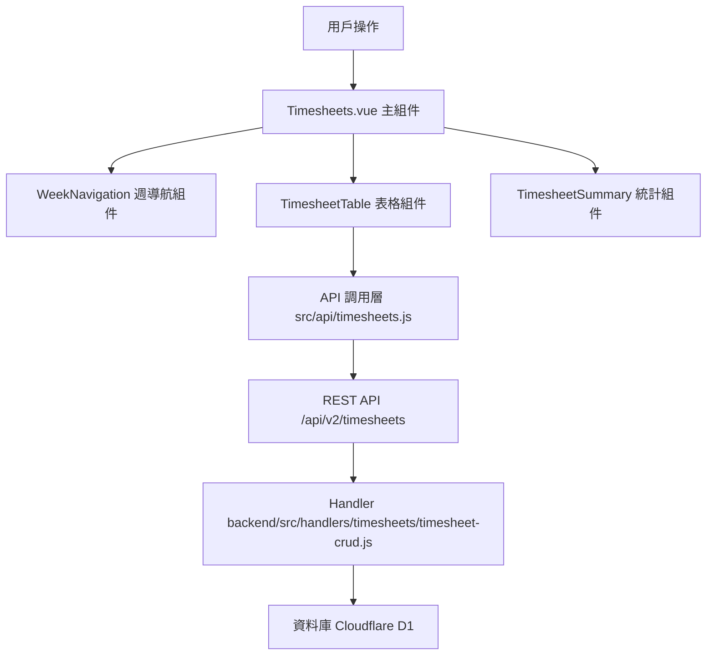

# Design Document: BR6.1: 工時填報

## Overview

工時填報功能提供員工記錄每日工時與任務耗時的核心界面，支援選擇客戶、服務項目、任務類型、工時類型，並記錄時數。

本功能是工時記錄系統的核心模組之一，為薪資與績效提供依據。

## Steering Document Alignment

### Technical Standards (tech.md)

遵循以下技術標準：
- 使用 Vue 3 Composition API 開發前端組件
- 使用 Ant Design Vue 作為 UI 組件庫
- 使用 RESTful API 進行前後端通信
- 使用 Cloudflare Workers 作為後端運行環境
- 使用 Cloudflare D1 (SQLite) 作為資料庫
- 遵循統一的錯誤處理和回應格式
- 使用參數化查詢防止 SQL 注入

### Project Structure (structure.md)

遵循以下項目結構：
- 前端組件位於 `src/components/timesheets/` 或 `src/views/`
- API 調用層位於 `src/api/timesheets.js`
- 後端 Handler 位於 `backend/src/handlers/timesheets/`
- 資料庫 Migration 位於 `backend/migrations/`
- 遵循命名規範：組件使用 PascalCase，Handler 使用 kebab-case

## Code Reuse Analysis

### Existing Components to Leverage

- **TimesheetTable.vue**: 用於工時表格展示（已有，需增強）
- **WeekNavigation.vue**: 用於週導航（已有）
- **TimesheetSummary.vue**: 用於統計顯示（已有）

### Integration Points

- **handleCreateOrUpdateTimesheet**: 處理工時記錄保存 API 請求，位於 `backend/src/handlers/timesheets/timesheet-crud.js`
  - API 路由: `POST /api/v2/timesheets`（支援 UPSERT）
- **handleGetTimesheets**: 處理工時記錄查詢，位於 `backend/src/handlers/timesheets/timesheet-crud.js`
  - API 路由: `GET /api/v2/timesheets`
- **handleServiceItems**: 處理任務類型列表查詢，位於 `backend/src/handlers/clients/client-services.js`
  - API 路由: `GET /api/v2/clients/:clientId/services/:serviceId/items`
- **Timesheets 表**: 存儲工時記錄
- **ServiceItems 表**: 存儲任務類型定義
- **ClientServiceTaskConfigs 表**: 存儲客戶服務項目的任務配置

## Architecture

### Component Architecture

前端採用 Vue 3 Composition API，組件結構清晰，職責單一：



### Modular Design Principles

- **Single File Responsibility**: 每個組件文件只處理一個功能模組
- **Component Isolation**: 組件之間通過 props 和 events 通信，保持獨立
- **Service Layer Separation**: API 調用與業務邏輯分離，使用統一的 API 工具函數
- **Utility Modularity**: 工具函數按功能分組，可在多處重用

## Components and Interfaces

### Timesheets

- **Purpose**: 工時記錄頁面的主組件，整合所有子組件
- **Location**: `src/views/Timesheets.vue`
- **Interfaces**: 無（頁面組件，無對外接口）
- **Props**: 無
- **Events**: 無
- **Dependencies**: 
  - Ant Design Vue 組件庫
  - Vue Router
  - Pinia Store (工時狀態管理)
- **Reuses**: 
  - WeekNavigation, TimesheetTable, TimesheetSummary 子組件
  - API 調用工具函數 (`@/utils/apiHelpers`)
  - 日期格式化工具 (`@/utils/formatters`)

### TimesheetTable

- **Purpose**: 工時表格展示和編輯組件
- **Location**: `src/components/timesheets/TimesheetTable.vue`
- **Interfaces**: Props (weekDays, clients, workTypes, holidays, leaves, loading)
- **Props**: 
  - `weekDays` (Array, required): 週日期數組
  - `clients` (Array, required): 客戶列表
  - `workTypes` (Array, required): 工時類型列表
  - `holidays` (Map, required): 假日列表
  - `leaves` (Map, required): 請假記錄列表
  - `loading` (Boolean, optional): 加載狀態
- **Events**: 無（通過 store 管理狀態）
- **Dependencies**: Ant Design Vue 組件庫
- **Reuses**: 
  - 工時驗證工具 (`@/composables/useTimesheetValidation`)
  - 日期格式化工具

### WeekNavigation

- **Purpose**: 週導航組件，用於切換週次
- **Location**: `src/components/timesheets/WeekNavigation.vue`
- **Interfaces**: Props (currentWeek), Events (weekChange)
- **Props**: 
  - `currentWeek` (Date, required): 當前週的起始日期
- **Events**: 
  - `weekChange` (Date): 週次變更事件
- **Dependencies**: Ant Design Vue 組件庫
- **Reuses**: 日期格式化工具

### TimesheetSummary

- **Purpose**: 工時統計顯示組件
- **Location**: `src/components/timesheets/TimesheetSummary.vue`
- **Interfaces**: Props (timesheets, weekDays)
- **Props**: 
  - `timesheets` (Array, required): 工時記錄列表
  - `weekDays` (Array, required): 週日期數組
- **Events**: 無
- **Dependencies**: Ant Design Vue 組件庫
- **Reuses**: 日期格式化工具、統計計算工具

## Data Models

### Timesheet (工時記錄)

```
- timesheet_id: Integer (工時記錄 ID)
- user_id: Integer (員工 ID)
- work_date: String (工作日期，格式：YYYY-MM-DD)
- client_id: String (客戶 ID)
- service_id: Integer (服務項目 ID)
- task_type: String (任務類型名稱，從 ServiceItems.item_name 轉換)
- work_type: Integer (工時類型 ID，1-11)
- hours: Number (工時時數，0.5 的倍數)
- created_at: String (建立時間)
- updated_at: String (更新時間)
```

### TimesheetRow (表格行)

```
- key: String (行的唯一 key)
- userId: Integer (員工 ID)
- userName: String (員工名稱)
- clientId: String (客戶 ID)
- clientName: String (客戶名稱)
- serviceId: Integer (服務項目 ID)
- serviceName: String (服務項目名稱)
- serviceItemId: Integer (任務類型 ID)
- serviceItemName: String (任務類型名稱)
- workTypeId: Integer (工時類型 ID，1-11)
- workTypeName: String (工時類型名稱)
- hours: Array[7] (7天的工時數組)
- timesheetIds: Array[7] (7天的工時記錄 ID 數組)
```

## Error Handling

### Error Scenarios

1. **任務類型載入失敗**:
   - **Handling**: 顯示錯誤訊息，使用 Ant Design Vue 的 `message.error()`
   - **User Impact**: 用戶看到錯誤提示，可以重試

2. **工時記錄保存失敗**:
   - **Handling**: 顯示錯誤訊息，保留用戶輸入的數據
   - **User Impact**: 用戶看到錯誤提示，可以修正後重試

3. **數據轉換錯誤**:
   - **Handling**: 後端驗證 `service_item_id`，如果查詢不到對應的 `item_name`，返回錯誤
   - **User Impact**: 用戶看到錯誤提示，需要重新選擇任務類型

4. **重複記錄處理**:
   - **Handling**: 後端檢查重複記錄並累加工時，前端顯示成功訊息
   - **User Impact**: 用戶看到累加後的工時記錄

5. **單日工時超限**:
   - **Handling**: 後端驗證累加後的工時不超過 24 小時，超過則返回錯誤
   - **User Impact**: 用戶看到錯誤提示，需要調整工時分配

6. **任務類型配置缺失**:
   - **Handling**: 當客戶和服務項目未配置任務類型時，顯示提示訊息並阻止提交
   - **User Impact**: 用戶看到提示，需要先配置任務類型

## Testing Strategy

### Unit Testing

- 測試任務類型載入邏輯
- 測試工時記錄合併邏輯
- 測試數據轉換邏輯（service_item_id → task_type）
- 測試時數四捨五入邏輯

### Integration Testing

- 測試 API 調用和數據流轉
- 測試動態載入（客戶 → 服務項目 → 任務類型）
- 測試工時記錄保存和更新
- 測試後端去重邏輯和單日工時超限驗證

### End-to-End Testing

- 測試完整的工時填寫流程（選擇客戶 → 選擇服務項目 → 選擇任務類型 → 選擇工時類型 → 輸入時數 → 保存）
- 測試任務類型動態載入和空狀態提示
- 測試工時記錄合併邏輯
- 測試後端去重保護
- 測試單日工時超限驗證
- 測試時數範圍驗證和四捨五入邏輯

