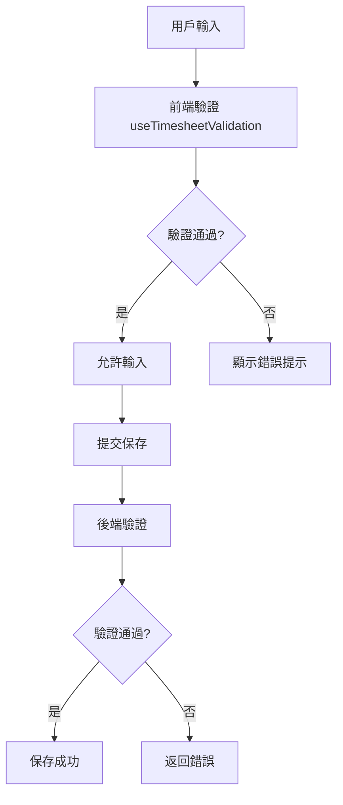

# Design Document: BR6.2: 工時規則校驗

## Overview

工時規則校驗功能提供完整的工時填寫規則驗證，確保工時記錄符合勞基法規定和業務規則。

## Steering Document Alignment

### Technical Standards (tech.md)

遵循以下技術標準：
- 使用 Vue 3 Composition API 開發前端組件
- 使用 Ant Design Vue 作為 UI 組件庫
- 使用 RESTful API 進行前後端通信
- 使用 Cloudflare Workers 作為後端運行環境
- 使用 Cloudflare D1 (SQLite) 作為資料庫

### Project Structure (structure.md)

遵循以下項目結構：
- 驗證邏輯位於 `src/composables/useTimesheetValidation.js`
- 後端驗證位於 `backend/src/handlers/timesheets/timesheet-crud.js`
- 工時類型定義位於 `src/stores/timesheets.js` 和 `backend/src/handlers/timesheets/utils.js`

## Code Reuse Analysis

### Existing Components to Leverage

- **useTimesheetValidation.js**: 工時驗證 Composable（已有，需增強）
  - 擴展現有驗證邏輯，增加日期類型一致性、正常工時規則、加班前置條件等驗證
- **TimesheetTable.vue**: 工時表格組件（已有，需整合驗證）
  - 整合驗證邏輯，在用戶輸入時即時驗證並顯示錯誤提示
- **timesheet-crud.js**: 工時 CRUD 處理器（已有，需增強）
  - 在保存前增加後端驗證邏輯，作為最終防線

### Integration Points

- **前端驗證**: 在 `TimesheetTable.vue` 中調用 `useTimesheetValidation`，在用戶輸入時即時驗證
- **後端驗證**: 在 `handleCreateOrUpdateTimesheet` 中實現驗證邏輯，確保數據準確性
- **工時類型定義**: 使用 `src/stores/timesheets.js` 和 `backend/src/handlers/timesheets/utils.js` 中的工時類型定義

## Architecture

### Validation Architecture



### Modular Design Principles

- **Single File Responsibility**: 每個驗證函數文件只處理一個特定的驗證規則類型
- **Component Isolation**: 驗證邏輯與 UI 組件分離，通過 composable 封裝
- **Service Layer Separation**: 前端驗證和後端驗證邏輯分離，但保持一致性
- **Utility Modularity**: 驗證工具函數按功能分組，可在前後端重用

## Components and Interfaces

### useTimesheetValidation

- **Purpose**: 工時驗證 Composable，提供完整的工時填寫規則驗證
- **Location**: `src/composables/useTimesheetValidation.js`
- **Interfaces**: 
  - `validateHoursInput(row, allRows, dateType)`: 驗證單筆工時輸入
  - `getAllowedWorkTypesForDate(dateType)`: 獲取日期類型允許的工時類型列表
  - `isWorkTypeAllowed(workType, dateType)`: 檢查工時類型是否允許用於指定日期類型
  - `validateNormalHours(normalHours, leaveHours)`: 驗證正常工時規則
  - `validateOvertimePrerequisites(workType, allRows)`: 驗證加班前置條件
  - `validateWorkTypeHoursLimit(workType, hours, allRows)`: 驗證工時類型時數上限
  - `validateDailyTotalHours(allRows, savedRecords)`: 驗證每日總工時上限
- **Dependencies**: `src/stores/timesheets.js`（工時類型定義）
- **Reuses**: 現有的工時類型定義和日期類型判斷邏輯

### TimesheetTable Component

- **Purpose**: 工時表格組件，整合驗證邏輯提供即時反饋
- **Location**: `src/components/TimesheetTable.vue`
- **Interfaces**: 
  - 使用 `useTimesheetValidation` composable
  - 在工時類型選擇時過濾選項
  - 在輸入時即時驗證並顯示錯誤
  - 在提交前進行完整驗證
- **Dependencies**: `src/composables/useTimesheetValidation.js`, Ant Design Vue 組件
- **Reuses**: 現有的表格組件模式和驗證邏輯

### Backend Validation Handler

- **Purpose**: 後端驗證邏輯，作為數據準確性的最終防線
- **Location**: `backend/src/handlers/timesheets/timesheet-crud.js`
- **Interfaces**: 
  - `validateTimesheetRecord(record, existingRecords, dateType)`: 驗證單筆工時記錄
  - `validateAllRules(record, existingRecords, dateType)`: 執行所有驗證規則
  - 在 `handleCreateOrUpdateTimesheet` 中調用驗證邏輯
- **Dependencies**: `backend/src/handlers/timesheets/utils.js`（工時類型定義）
- **Reuses**: 現有的 CRUD 處理模式和資料庫查詢邏輯

## Data Models

### ValidationResult

```
- valid: Boolean (是否通過驗證)
- error: String (錯誤訊息，當 valid 為 false 時)
```

### TimesheetRecord (用於驗證)

```
- date: String (日期，格式：YYYY-MM-DD)
- workType: String (工時類型)
- hours: Number (時數)
- dateType: String (日期類型：工作日/休息日/例假日/國定假日)
- leaveHours: Number (請假時數，可選)
```

### ValidationContext

```
- currentRecord: TimesheetRecord (當前正在驗證的記錄)
- allRecords: Array<TimesheetRecord> (當前表格中的所有記錄)
- savedRecords: Array<TimesheetRecord> (已保存到資料庫的記錄，後端驗證時使用)
- dateType: String (日期類型)
```

## Error Handling

### Error Scenarios

1. **日期類型與工時類型不一致**
   - **Handling**: 過濾不允許的工時類型選項，或在提交時驗證並提示錯誤
   - **User Impact**: 顯示「此日期類型不允許使用此工時類型」的錯誤訊息

2. **正常工時超過 8 小時**
   - **Handling**: 驗證正常工時 + 請假時數 <= 8 小時
   - **User Impact**: 顯示「正常工時 + 請假時數不能超過 8 小時，目前超出 X 小時」的錯誤訊息

3. **加班前置條件不滿足**
   - **Handling**: 驗證已滿 8 小時正常工時或已填寫前置工時類型
   - **User Impact**: 顯示「需要先填寫 X 工時類型」或「正常工時 + 請假時數需 >= 8 小時，目前尚缺 X 小時」的錯誤訊息

4. **工時類型時數超過上限**
   - **Handling**: 驗證各工時類型的時數上限
   - **User Impact**: 顯示「X 工時類型最多只能填寫 Y 小時，目前超出 Z 小時」的錯誤訊息

5. **每日總工時超過 12 小時**
   - **Handling**: 驗證當日所有工時類型累加 <= 12 小時
   - **User Impact**: 顯示「每日總工時不能超過 12 小時，目前超出 X 小時」的錯誤訊息

## Testing Strategy

### Unit Testing

- **驗證函數單元測試**: 測試 `useTimesheetValidation` 中的各個驗證函數
  - 測試日期類型與工時類型一致性驗證
  - 測試正常工時規則驗證
  - 測試加班前置條件驗證
  - 測試工時類型時數上限驗證
  - 測試每日總工時上限驗證
- **錯誤訊息測試**: 驗證各種錯誤場景下的錯誤提示訊息是否清晰準確
- **邊界條件測試**: 測試邊界值（如 8 小時、12 小時等）

### Integration Testing

- **前後端驗證一致性**: 確保前端和後端驗證邏輯一致，驗證結果相同
- **組件整合測試**: 測試 `TimesheetTable.vue` 與驗證邏輯的整合
- **API 整合測試**: 測試後端驗證在 API 請求中的正確執行

### End-to-End Testing

- **完整流程測試**: 測試用戶填寫工時的完整流程，包括各種驗證場景
- **錯誤處理測試**: 測試驗證失敗時的用戶體驗和錯誤提示

